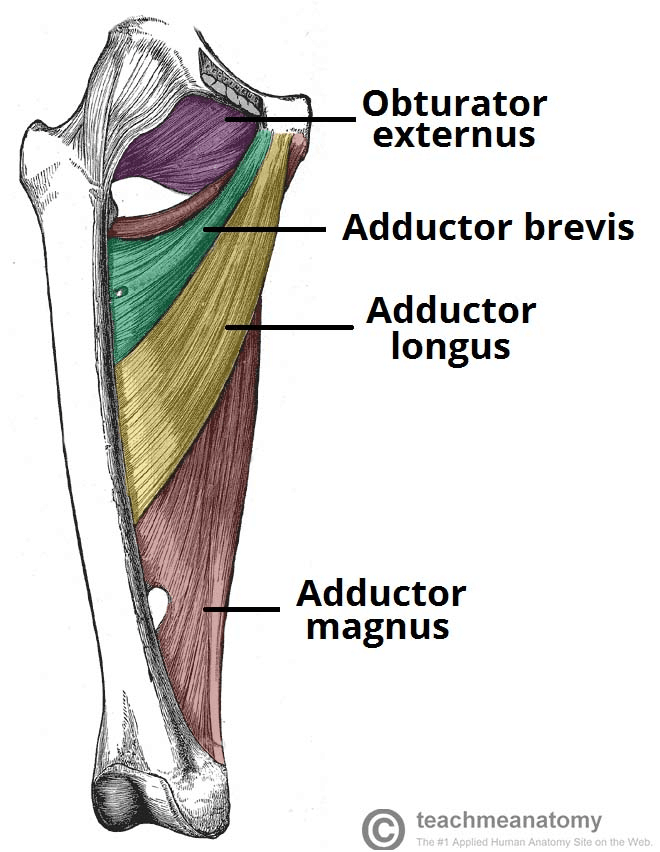
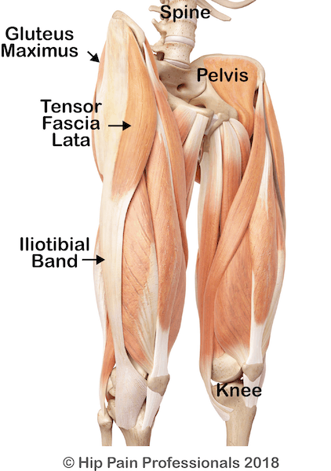
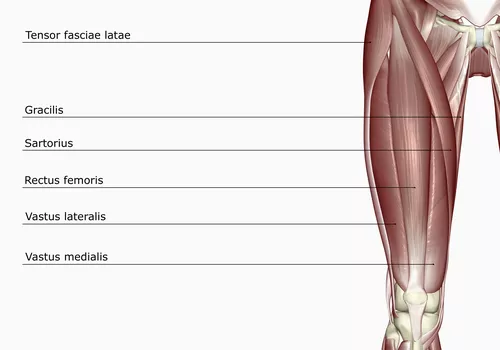
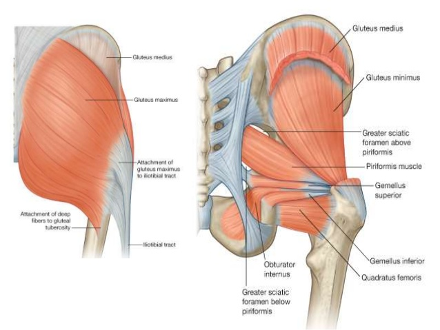

Dynamic stretches are proven to be the most effective form of stretching prior to a workout or athletic performance. This stands in contrast to static stretching which has been proven to decrease muscle output immediately after the stretch. Here are 10 dynamic stretches you can do for your legs that target the many different areas in your legs: including hamstrings, hip-flexors, calfs, adductors, Glutes, abductors, and feet.

## Main Muscle Groups Stretched

Before reading through this section, understand that muscles like the hamstring are actually comprised of several different muscles separated by facia. Facia is a kind of lining that separates different muscle groups. However, these muscles all work in conjunction to perform certain functions, which is why we give them a group name.

Each of these exercises performs a slightly different function. Although the name of the muscles stretched might be the same, the manner that they are stretched will be different. These small distinctions matter and will go a long way in benefiting whatever physical practice you do.

**Take time to try these different stretches and see which ones are most beneficial to you! Experiment and try out different stretches in different order and intensities.** This is the best way to learn what works for your body.

### Hamstrings

The hamstring is a group of muscles that includes...

- Biceps femoris
- Semitendiosus
- and the Semimembranosus

These three muscles help flex the knee joint and extend the thigh. The hamstring muscles originate in the ischial tuberosity (the hip) and end at either flanks behind the knee.

### Hip-flexors

A group of muscles that include the following...

- Psoas Major
- Iliacus
- Rectus Femoris (middle quad muscle not in diagram)
- Pectineus
- Sartorius

This collection of muscles is what allows you to raise up the leg towards your torso. If these muscles are weak, the lower back muscles such as the QL (Quadratus Lomburom) take up the slack, which can cause lower back pain.

### Adductors

This group of muscles includes the...

- Obturator Externus
- Adductor Brevis
- Adductor Longus
- Adductor Magnus

These muscles can be found in the medial aspect of the thigh (inside thigh). This group of muscles originate very close together near the pubis and connect at the other end at several locations along the femur. The adductor muscles are in charge of adducting the muscles. That is, moving the leg inwards toward the other leg.

### Abductors

The Abductors include...

- Gluteus Maximus
- Tensor Facia Lata
- Iliotibial Band

The abductor muscles are in charge of abducting the leg. This means that they bring the leg away from the other leg. One example of a movement that includes abduction is stepping out of a car. In addition to moving the leg away from the body, the abductor muscles help to rotate the leg at the hip.

### Quads

This large group of muscles includes ...

- Rectus Femoris
- Vastus Lateralis
- Vastus Medialis
- Vastus Intermedius

The quad is the extensor of the knee. Without this muscle group, you would not be able to extend your leg straight. This group of muscles is one of the strongest in the body and surrounds the femur bone.

### Glutes

The glute is a group of three muscles...

- Gluteus Maximus
- Gluteus Medius
- Gluteus Minimus

The glute is responsible for many different functions. It is the powerhouse of the lower body and is responsible for moving the hip and knee. The glutes allow for extension, abduction, and external rotation of the hip joint. Sitting has been known to atrophy the glute due to constant pressure and disuse.

### Calfs

The muscle is made up of two muscles..

- Gastrocnemius and
- Soleus

The calf muscle can be found at the back of the lower leg. The two muscles that make up the calf merge together at the base of the calf, called the achilles tendon. The calf is in use almost any time you use your legs. The calf muscle governs the extension of the feet, which is part of what makes walking, jumping, and running possible.

## Carioca (abductors and adductors)

Carioca is a lateral moving dynamic stretch for the abductors and the adductors. The movement can be tricky at first, as you need to correctly coordinate your hands and your feet to move efficiently.

- Start by moving slowly, making sure to do the movement pattern correctly.
- The key to the movement is moving the hips, twisting them left and right
- Stay on the balls of your feet
- Avoid looking down
- Swing your arms at shoulder height and parallel to the floor
- As the movement becomes easier take larger steps and add more force to your step

Carioca is a great beginner movement because it provides a light stretch and works on your agility. The adductors and abductors are the muscles that bring your legs together and bring your legs apart, respectively. If Cariocas are too easy, consider taking bigger steps and moving at a faster pace. Make sure not to overdo it during your warmup.

<iframe width="560" height="315" src="https://www.youtube.com/embed/ViOHs1b6jGc" title="YouTube video player" frameborder="0" allow="accelerometer; autoplay; clipboard-write; encrypted-media; gyroscope; picture-in-picture" allowfullscreen></iframe>

## Straight leg kicks (hip-flexors and hamstrings)

Keep the leg straight and swing it up as high as you can without moving your neck or back. This very simple drill is great at targeting the hip-flexors and the hamstrings. You do not need to kick your leg high. But make sure that your leg is straight throughout the duration of the kick.

- Kick your leg up as high as you can
- Make sure you do not compensate by bending at the back, knees, or neck (keep them straight)
- Keep the kicking leg straight
- Keep the foot flexed as you kick for a greater stretch
- Optional is to touch your kicking toes with your opposite hand

<iframe width="560" height="315" src="https://www.youtube.com/embed/t86pc6Rx4kw" title="YouTube video player" frameborder="0" allow="accelerometer; autoplay; clipboard-write; encrypted-media; gyroscope; picture-in-picture" allowfullscreen></iframe>

## B Skip (hip-flexors and hamstrings)

Similar to the straight leg kick. This kick is very effective for the hip-flexors and hamstrings. It is also an excellent warmup tool and will easily get your heart rate up. This kick starts with the knee up, then kicks out, before returning quickly to the floor.

- First, bring the knee up as high as you can
- Once your knee s as high as it will go, straighten the kicking leg
- Keep the foot flexed
- Bring the foot down to the floor as quickly as you can
- Build up the speed of this movement slowly over time

<iframe width="560" height="315" src="https://www.youtube.com/embed/JeMBzS2ctK8" title="YouTube video player" frameborder="0" allow="accelerometer; autoplay; clipboard-write; encrypted-media; gyroscope; picture-in-picture" allowfullscreen></iframe>

## Jogging backwards (regression walk backwards) (hipflexors and knees)

Jogging backwards is very beneficial for the health of your knees. Outside of the United States, the method is used as a therapeutic exercise for knee pain. For example, it's common to see older Chinese people walking backwards in the park.

- Start by walking backwards slowly
- The benefits of the exercise come from the step back, where your hip-flexor is fully extended
- Increase intensity by taking longer steps or jogging
- Dragging a weight is another way to increase intensity (walking not jogging)
- Younger athletes can jog or run backwards
- Older populations should favor walking or pulling heavy weights

<iframe width="560" height="315" src="https://www.youtube.com/embed/OdrFm-8WXaQ" title="YouTube video player" frameborder="0" allow="accelerometer; autoplay; clipboard-write; encrypted-media; gyroscope; picture-in-picture" allowfullscreen></iframe>

## Squat to hamstring stretch (hamstrings)

This dynamic stretch starts in a squat position with the hands (or at least, finger tips) touching the floor. If you are unable to perform a full squat, then bend your legs until your hands touch the floor. From here, you will straighten out your legs as much as you can to intensify the stretch and then come back to your starting position. This is a great way to dynamically warm up the hamstrings and is a fantastic stretch for the early morning.

- Avoid bending your back as you reach down. Keep your back straight!
- Repeat straightening and bending your legs at least 10 times
- On the last rep, hold for at least 10 seconds
- Engage the quads especially at the top of the movement

<iframe width="560" height="315" src="https://www.youtube.com/embed/S8DoYcfJQ2M" title="YouTube video player" frameborder="0" allow="accelerometer; autoplay; clipboard-write; encrypted-media; gyroscope; picture-in-picture" allowfullscreen></iframe>

## Lateral leg swings (abductors)

These kicks can be done leaning on a wall or holding onto a chair for support. Kick to the side, making sure to start slow and gradually work your way up to higher and more intense kicks. Make sure to warm up before attempting these kicks, because they can be too intense if you are cold.

- Your upper body should lower as your leg raises up higher
- Keep the leg straight throughout the duration of the movement
- Point the heel of your base leg in the direction of your kick (not facing forward as shown in video)
- Your arms can either cross over your body (as you would do with a normal side kick) or you can keep them holding onto the wall or a chair for support.
- Keep your backs straight throughout the movement
- Avoid moving your head towards your kick. This is a common compensation

Although, the hip-flexors and the hamstrings are commonly tight muscles groups in an adult body, you shouldn't forget the abductors. These muscles help raise the leg up laterally. These muscles are important for jumping over hurdles, acrobatics, kicks, and many other movements that require agility.

<iframe width="560" height="315" src="https://www.youtube.com/embed/ajLaXML8YLM" title="YouTube video player" frameborder="0" allow="accelerometer; autoplay; clipboard-write; encrypted-media; gyroscope; picture-in-picture" allowfullscreen></iframe>

## Crescent kicks (in and out) (adductors, abductors, hipflexors, and hamstrings)

This exercises is very similar to straight leg kicks. This movement is a great way to work the entire hip along a large range of motion. Not only do your legs kick up, but they move from the outside to the inside. This will work the abductors and the adductors at the same time. Once you do a set of these, make sure to do them in the opposite direction (in to out). Similar to the lateral kicks and the straight leg kicks - make sure to warm up prior to doing them as they can be very intense.

- Start slow by kicking the leg up as high ...
- Avoid bending the back or throwing the neck forward (common compensations)
- Keep the base leg with only a slight bend
- The opposite arm should cross over the body at slightly below shoulder height
- Optional is to tap the kicking foot with the opposite hand as it reaches its apex
- Keep the kicking foot flexed for added difficulty

<iframe width="560" height="315" src="https://www.youtube.com/embed/t86pc6Rx4kw" title="YouTube video player" frameborder="0" allow="accelerometer; autoplay; clipboard-write; encrypted-media; gyroscope; picture-in-picture" allowfullscreen></iframe>

## lunge walks (hipflexors)

Lunge walks are a low intensity way to dynamically stretch the hip flexors. start slow with small steps and gradually increase them over time. If you still early in your workouts, avoid letting your knees go past your feet. Although there is nothing inherently wrong with this motion, doing so when you are "cold" may be harmful to the knees.

- Keep the chest upright as you take your steps
- As you step sink into the step for a better stretch in the hip-flexors
- Keep the arms at shoulders height and swing them as you would when walking
- Start slow with smaller steps, and increase them over time
- keep your core tight for added stability as you do your lunges

<iframe width="560" height="315" src="https://www.youtube.com/embed/L8fvypPrzzs" title="YouTube video player" frameborder="0" allow="accelerometer; autoplay; clipboard-write; encrypted-media; gyroscope; picture-in-picture" allowfullscreen></iframe>

## Lateral Lunge/Cossack Squat (adductors)

Take a large lateral step and squat down on the stepping leg. This exercise will not only challenge the muscles in the squatting leg, but it will also stretch the adductor muscles in the other leg. As you lower your body down into the squat, the other leg receives a deeper and deeper stretch.

- Take this stretch slow, as it may be difficult for you to maintain balance
- The intensity of the stretch will be determined by the length of your lunge and the depth of your squat
- Optional is to hold your hands in front of you to keep yourself from falling back
- Keep your back straight
- Optional is to keep a chair behind you so if you do lose balance, you will land on the chair and avoid falling backwards

Lateral lunges can be done in two ways. You can either take a lateral step prior to performing your squat, squatting, and then returning to neutral. Or you can stay in the wide legged stance and squat on either leg from there. Lateral lunges require a high amount of hip mobility, ankle mobility, and strong stabilizer muscles.

The more advanced variation requires you to skink your butt down towards the floor as much as possible. If you have more limited range, it is suggested you only take your squat down to the point that your knees are bent approximately 90 degrees.

<iframe width="560" height="315" src="https://www.youtube.com/embed/tpczTeSkHz0" title="YouTube video player" frameborder="0" allow="accelerometer; autoplay; clipboard-write; encrypted-media; gyroscope; picture-in-picture" allowfullscreen></iframe>

## Straight leg bear crawl (calf, hamstrings, hipflexors)

The bear crawl is a great warmup. Simply come down to all fours and keep your arms and your legs straight. Your goal will be to move around the space without bending any of your limbs. At the same time, as you walk, try to swing your feet as close to your hands as possible. This may be a very frustrating exercise for people unfamiliar with moving around on the floor. regardless, it is a terrific dynamic stretch for the hamstrings and overall warmup.

- Keep your legs straight at all times
- Keep the feet flexed for a better stretch at the calf
- Decrease the intensity of the stretch by increasing the distance between your hands and your feet
- Increase the difficulty for the exercise by decreasing the distance between your hands and your feet
- Remember to move contralaterally (for example: As the right leg moves forwards, the left hand will also move forwards

This dynamic stretch does not in fact "stretch" the hip-flexors, but you will notice that they will be thoroughly worked out by the end of a minute.

<iframe width="560" height="315" src="https://www.youtube.com/embed/-qJDkVT-mvs" title="YouTube video player" frameborder="0" allow="accelerometer; autoplay; clipboard-write; encrypted-media; gyroscope; picture-in-picture" allowfullscreen></iframe>

## Butt Kicks (Quads)

This drill is something you can easily do on the track, outside, or inside in your living room. Perform this drill by jogging (or jogging in place) while you kick your heel back high enough so that it touches or almost touches your glute. Repeat this for about 1 minute to get a dynamic stretch in the quads.

- Pump your arms as you would during a normal run
- Keep your upper body upright (avoid hunching over)
- If you do not have space, run in place
- Start slow at a steady pace

<iframe width="560" height="315" src="https://www.youtube.com/embed/TLh4LA5oLDA" title="YouTube video player" frameborder="0" allow="accelerometer; autoplay; clipboard-write; encrypted-media; gyroscope; picture-in-picture" allowfullscreen></iframe>

## Calf raises (calf)

Start with both feet on a stair. Step one foot half way off the step and start the stretch by lowering the heel towards the next step down. As you lower the heel you will get a stretch through your calf. Go as far as you can control and come back up so that your foot is back to about 90 degrees of bend. although it is not terribly important how you position your arms during this exercise, it is recommended to keep one hand grabbing onto something in case you lose your balance.

- Keep the stretching leg straight throughout the movement
- Lessen the intensity of the stretch by placing less weight on the stretching leg
- Intensify the stretch by placing more weight on the stretching leg
- Intensify the stretch further by contracting the shin muscles at the bottom of the stretch

<iframe width="560" height="315" src="https://www.youtube.com/embed/1G4nhQ3VEX8" title="YouTube video player" frameborder="0" allow="accelerometer; autoplay; clipboard-write; encrypted-media; gyroscope; picture-in-picture" allowfullscreen></iframe>

## Kneeling toe stretch (feet muscles)

Starting from a kneeling position, lean back onto your toes and hold that position for a second or two. Then rock forwards to your starting position. There are many small muscles in our feet that also need to be stretched! Your feet are your foundation and as such, the many muscles that reside in your foot should not be ignored. Try to include stretching your feet into any other lower body stretching routine you may currently practice.

- This may feel uncomfortable on your knees. If so, place a small mat or a rolled up sweater below your knees to make the stretch more comfortable
- You may feel cramping in the foot. If so, breathe through the cramp until it lessens
- Make sure that you are stretching all the toes on your foot
- Rock back and forth, making sure to pause for a second or two at the deepest part of the stretch

<iframe width="560" height="315" src="https://www.youtube.com/embed/o7TAZZ-aUds" title="YouTube video player" frameborder="0" allow="accelerometer; autoplay; clipboard-write; encrypted-media; gyroscope; picture-in-picture" allowfullscreen></iframe>

## 90/90 Dynamic stretch (glute)

Sit in a 90/90 position to get started. This 90/90 refers to the fact that both your knees are bent at 90 degrees. With one shin in front of you and the other to the side, you can begin the stretch by bringing your chest to the shin in front of you. Hold for a second or two and then come back up for one repetition. The glute is the largest muscle in our bodies and the main powerhouse for any lower body activities.

- If you can not sit on the floor without falling over, place a block (or stack of books) under your butt until you are able to sit up comfortably.
- Try lowering down towards your knee, shin, and foot for slight variations on the same stretch
- Regress the stretch by placing your knees at less than 90 degrees
- Keep the back straight as you lower down towards your shin

<iframe width="560" height="315" src="https://www.youtube.com/embed/w_TwXnJGdM4" title="YouTube video player" frameborder="0" allow="accelerometer; autoplay; clipboard-write; encrypted-media; gyroscope; picture-in-picture" allowfullscreen></iframe>
