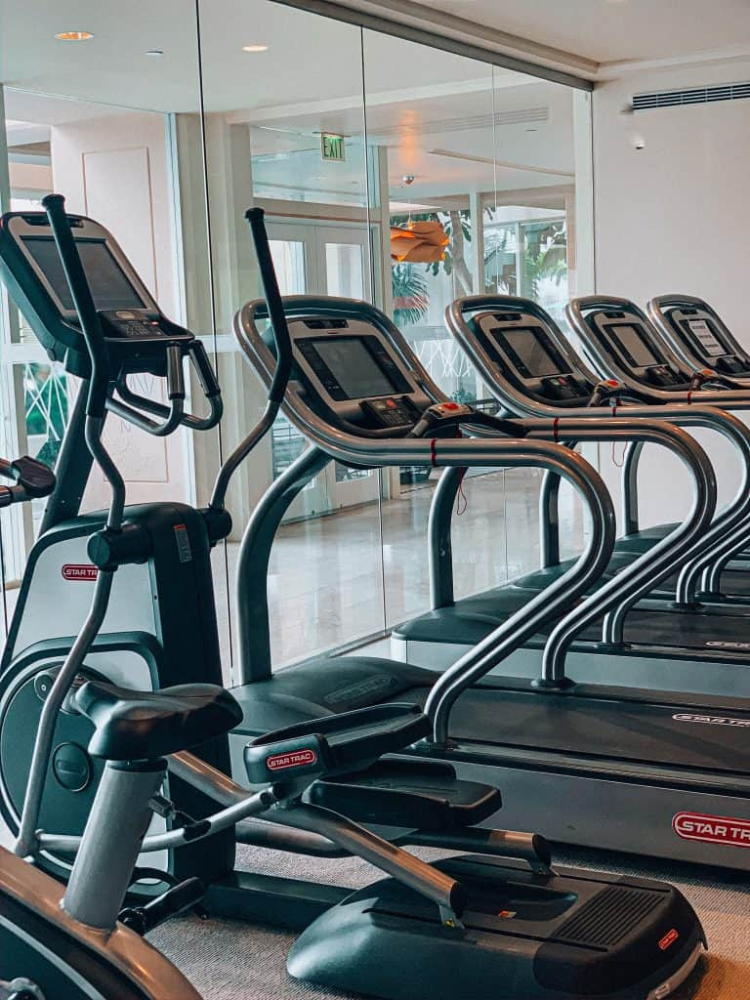
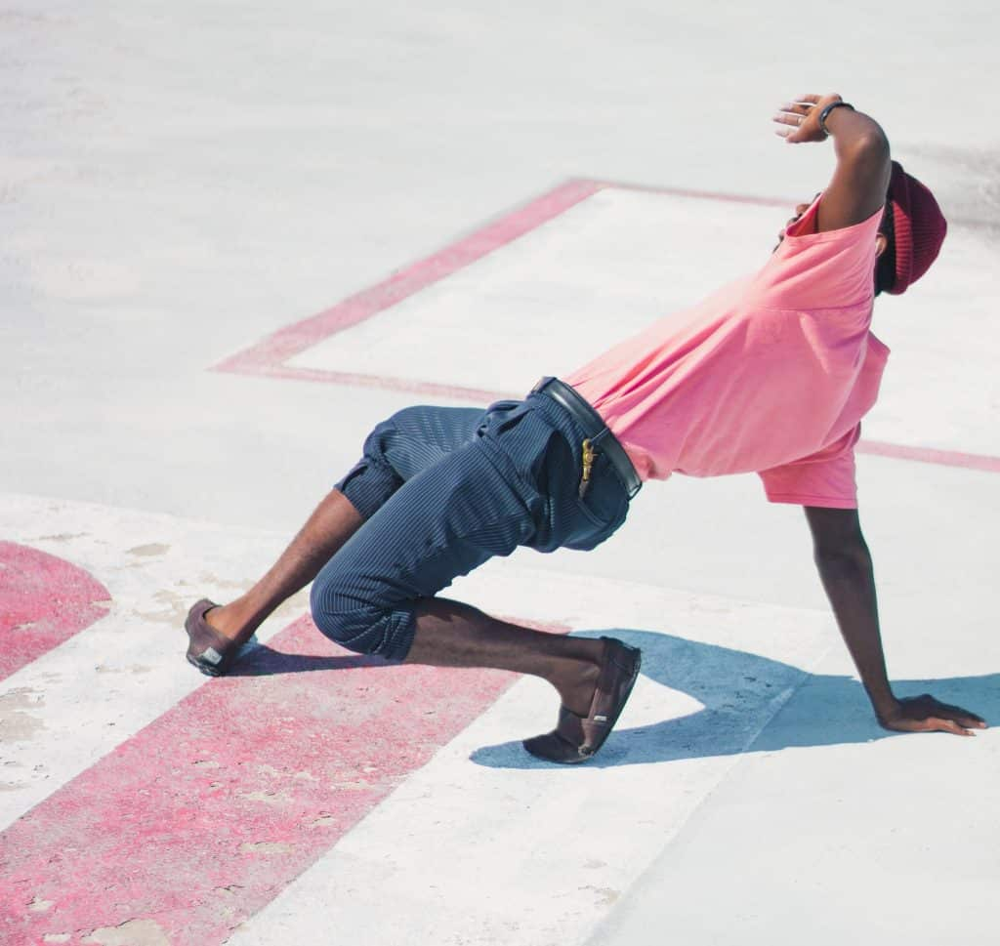
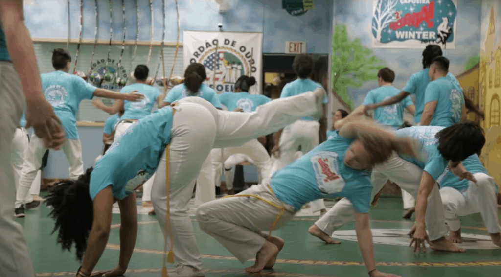
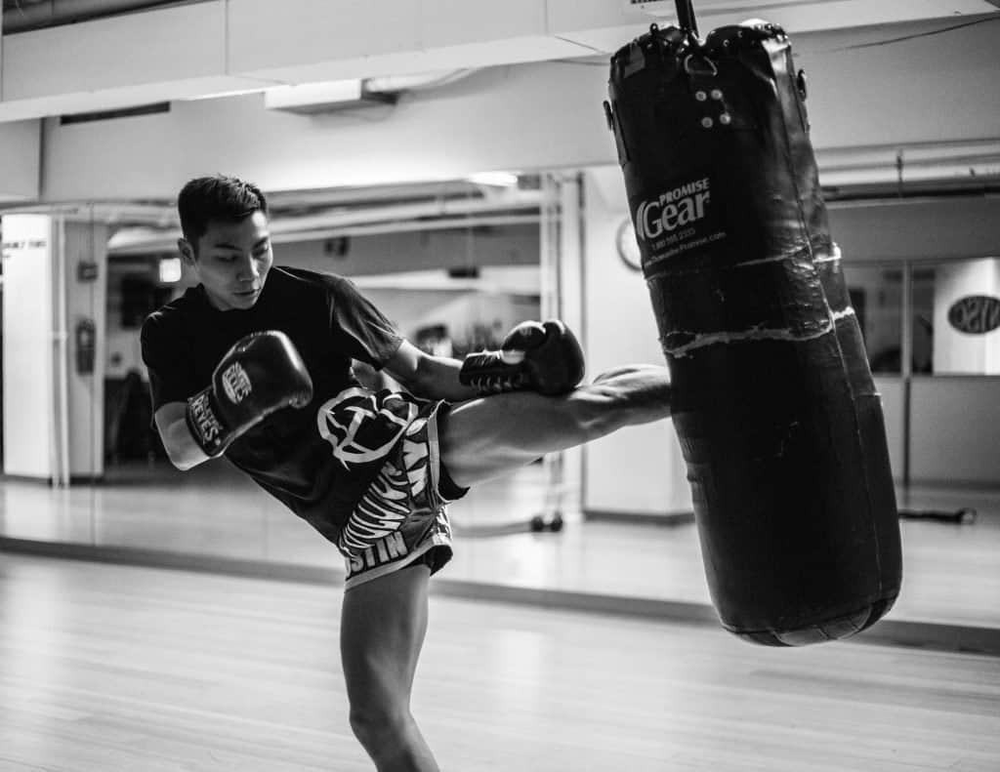
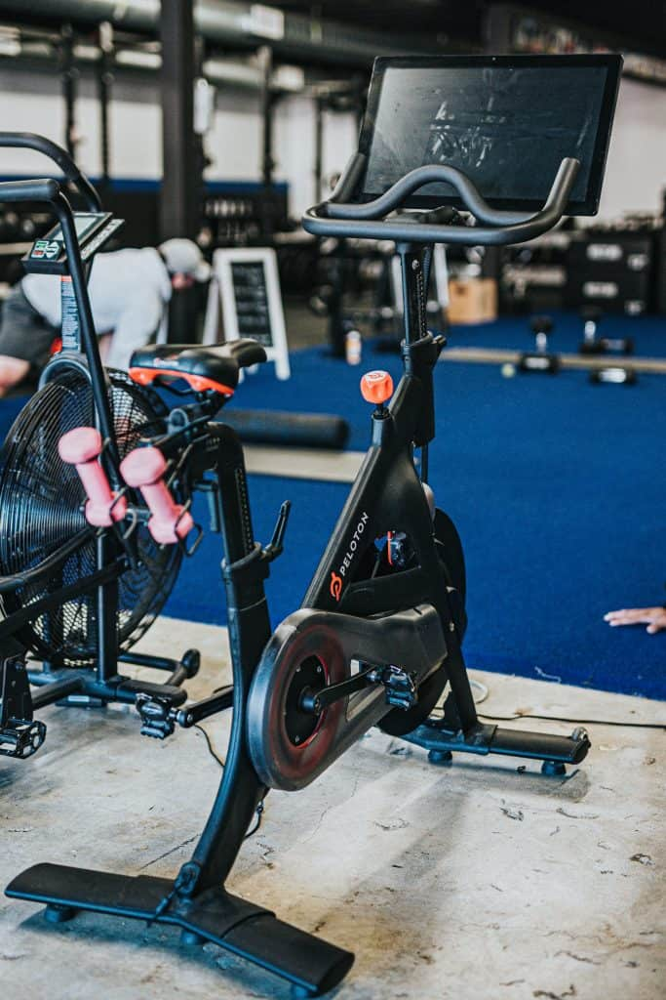
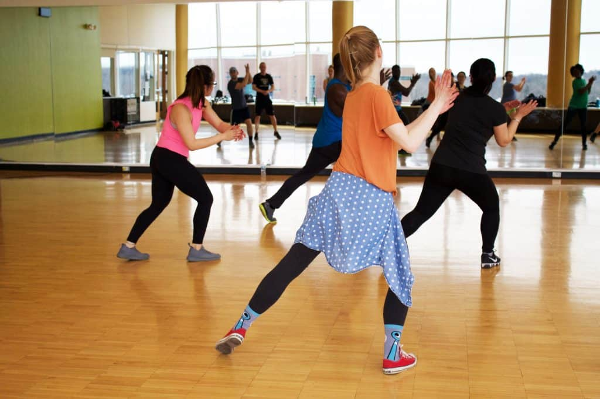

There are many reasons to avoid running. **People looking for an alternative to running may be injured or have difficulty running for long periods of time. Others may simply dislike running, which encourages them to look for other activities**.

Running is a great aerobic activity because it's very easy to increase and decrease intensity while maintaining a target heart rate. Reaching a target heart rate is very important for burning calories, maintaining a healthy heart, and improving your cardio.

**Find the target hear rate for people in your age group** (hint: most workouts are between 60-80% intensity, so look up these values)

**Running is not the only way to reach and maintain a target heart rate**. Below is a list of activities that provide the same benefits as running, but can accommodate someone who has an injury, or does not enjoy running on a regular basis.

## How to Track your Heart Rate

If you're wondering if the activities I mention below work, then try wearing a device that tracks your heart rate. The one I use is the Fitbit Charge 4 (as of October 2020). It's simple design and updates to my phone allow me to effortlessly tracking my fitness goals.

[Buy Fitbit on Amazon](https://amzn.to/3l6QCsa)

## Elliptical

The elliptical is an exercise that is low impact and mimics the movement patterns of running. This makes the elliptical great for runners who are injured but want to continue their running regiment. The elliptical is very light on the joints, which makes it ideal for people with injuries.

## jump rope

Old school and many new school boxers swear by skipping rope. This activity is great because it's a high intensity exercise that does a great job of maintaining a high heart rate. Even if you never picked up a jump rope, picking up the skill is quite easy. Once you get the hang of skipping rope, you can do it for several minutes at a time as a replacement for your running training.

## swimming

Swimming is truly a full body workout. If you've ever seen swimmers compete in the Olympics you can see that swimming is great for the body. Swimming just a few meters will drive up your heart rate without putting pressure on your joints. Swimming is another activity that's perfect for injured runners. Learning proper technique takes some time, but even while you're learning, you'll be working on your aerobic fitness

## Animal movements

One of the main benefits of animal movements is that you will train a wide variety of muscles while working on your cardio. Doing bear crawls, crab walks, and lizard walks are just some of the animal movements that will work your aerobic fitness. The diversity in movement is one of the main attractions for people looking to do animal movements. So if you're someone who gets bored running, this could be an option for you.

## Walking

The elderly are not the only demographic that benefit from walking. Walking is a fantastic way to clear your mind and get fresh air. Although walking is not nearly as intensive as jogging or swimming, you can adjust your pace to increase or decrease your heart rate according to your goals. Consider walking during a rest day to maintain your activity levels.

## Stair Master

Stairmasters are commonly found in the cardio section of a gym, together with the treadmills and ellipticals. If you've ever gone up a couple flights of stairs, you'll know that walking up stairs raises your heart rate and causes you to start breathing heavily. Not only does the Stair Master provide excellent cardio, but it also works out many of the core muscle groups in the lower body.

## Plyometrics

Plyometrics are exercises that require explosive force, agility, and coordination. All of these things are tested in a short circuit of exercises. Examples include box jumps, ski jumpers, high knees, and single leg hops. Plyometrics are an excellent workout that improves strength and power while working on your cardio.

## Capoeira

Capoeira is an Afro-Brazilian martial art that combines dancing, fighting, and movement into one high intensity activity. Capoeira classes start with a general warmup, light stretching, before getting into movement drills. These include kicks, deep squats, and movements on the floor. The classes are in constant motion, which is great for reaching your target heart rate while learning a fun new skill.

## Muay Thai

Muay Thai is a martial art from Thailand that demands a lot of cardio with its powerful kicks. Classes usually start with a thorough warm up, and continue with more advanced striking drills. In some cases, Muay Thai classes involve shadow boxing or sparring, but this is not always the case.

## Boxing

If you've ever seen a boxing match, you can see that the rounds are long and the pace is fast. Doing just a couple of rounds of strikes on a punching bag is enough for a high intensity workout. people enjoy boxing because it's a way to relieves stress, and you can build lean muscle. Similar to the other martial arts on this list, you can train boxing to improve your conditioning while learning a skill.

## Stationary Bike

The main advantage of using a stationary bike is that its convenient and widely available. Even if you don't have one at home, you can easily find one at your local gym. The other major benefit is that biking is very light on your joints, making it great for any injured runners. If you want a group fitness setting, many gyms today have spinning classes, which are often like going to a club with your gym clothes... on a bike.

## Road biking

Road biking has become very popular with many manufactures providing equipment for bikers to be faster and more comfortable as they ride on the road. Biking works out the lower body and overall aerobic conditioning. Riding on the road can be intimidating for new bikers, so make sure you take all necessary precautions and purchase whatever safety equipment you need.

## Off-road biking

Off-road biking does not need to be the dare-devil sport we envision. At the same time, it is definitely more intense than road biking and stationary biking. Make sure you have a helmet while doing this activity. A major benefit of off-road biking is the connection to nature, which you will be in throughout your entire trip. If you're an outdoorsy person, then make sure to give this version of biking a try.

## Hiking

Another one for the outdoors people. If you love being connected to nature, then hiking might be the best activity for you. Hiking isn't like "going for a walk". I used to think this until I hiked up a mountain and couldn't walk the next day. If you're hiking for more than a couple of miles, your endurance will definitely be tested.

## Dance/zumba

Zumba, samba, salsa, etc. are all ways to do your aerobic training while having fun. This is the main draw with group classes like zumba. Classes involve moving your arms and legs in many different directions. Doing this for an hour long class is much more activity than most would do on a typical run. Similar to spinning, the main advantage of dance classes, is that they can be found at almost any gym.

## Mixed Martial Arts

If you're interested in learning self defense, but still want to work on your cardio, then consider taking an MMA class. The classes teach you a skill, similar to the other martial arts classes mentioned, and you will still be working on your cardio throughout the class. MMA classes work on striking, grappling, and everything else you see in the sport of mixed martial arts.

## Tennis

In Tennis, there is a little bit of everything. Cutting left and right, running forwards, and running backwards. One of the benefits of training with sports is that you will be sprinting, jogging, jumping, at different times. In addition to running, you will be having fun playing tennis and if you enjoy the competition, this could be a worthwhile alternative to running.

## Soccer

Working out in a group is often times better than working out on your won. If you have a group of friends you can round up, then invite them to play a pickup game of soccer. The similarity to a simple jog is clear, but the constant movement as well as the sprints to score and outdo the other team will motivate you to work harder than you would on a jog.

## Ultimate frisbee

Although not as popular as soccer, tennis, or other sports, ultimate frisbee is another substitute for running. In ultimate frisbee, you are constantly running until you catch the frisbee. According to the rules, you need to stop moving when you have the frisbee, and if you want to keep moving the frisbee down the field, you will need to pass it to one of your team mates. This means you will be in near constant motion throughout the entire game.

## Circuit or HIIT training

Creating a circuit means taking a group of movements and linking them together into a group. You will do each exercise for a set amount of time, and after you have done all the exercises, you will rest for a short period of time, before starting the round up again. It's important during circuit training to target many different parts of the body for a whole body workout. Doing so targets many different muscle groups as the constant activity works your aerobic system.