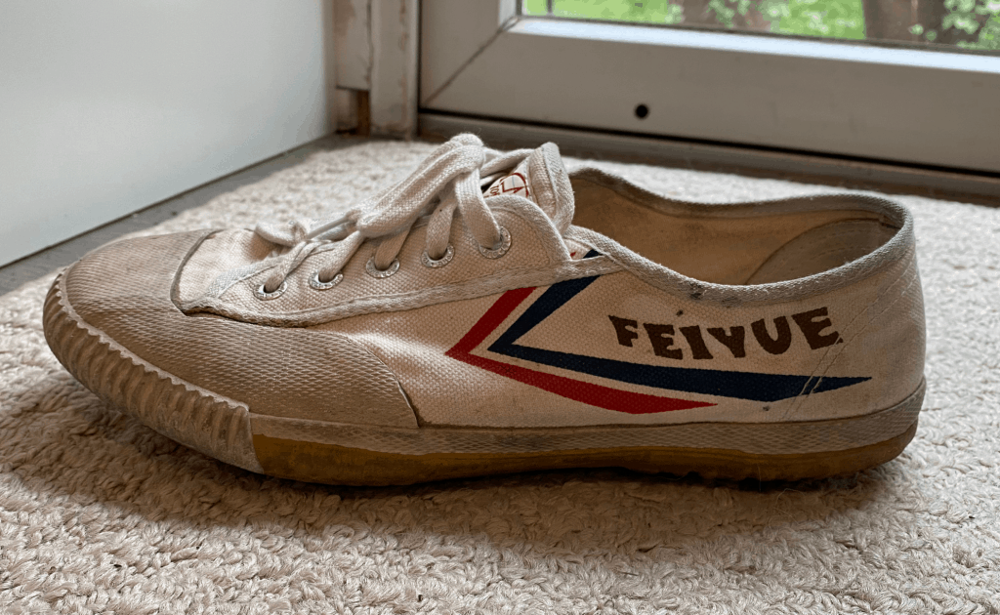
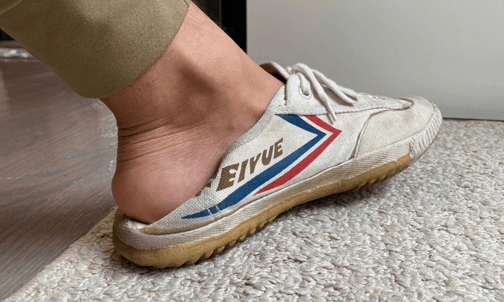
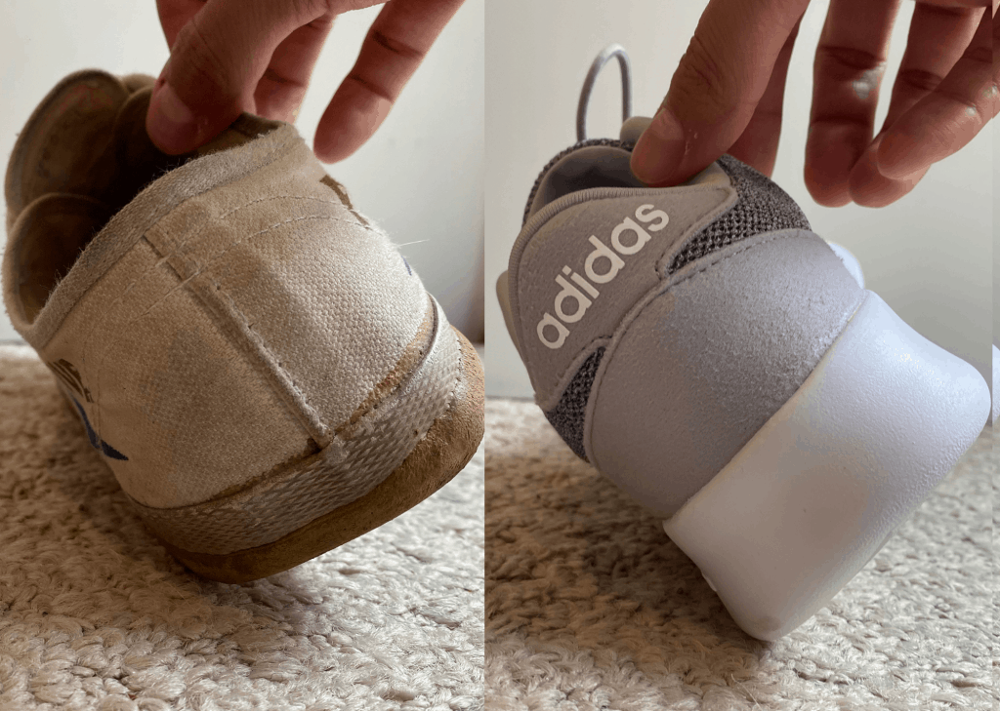
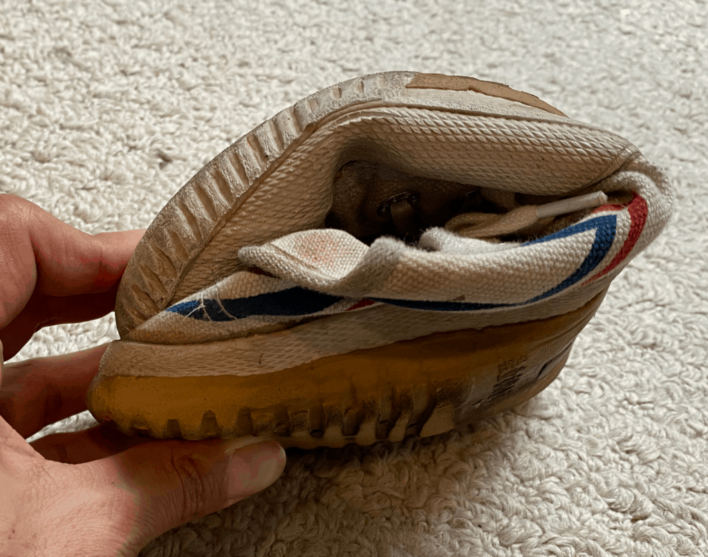
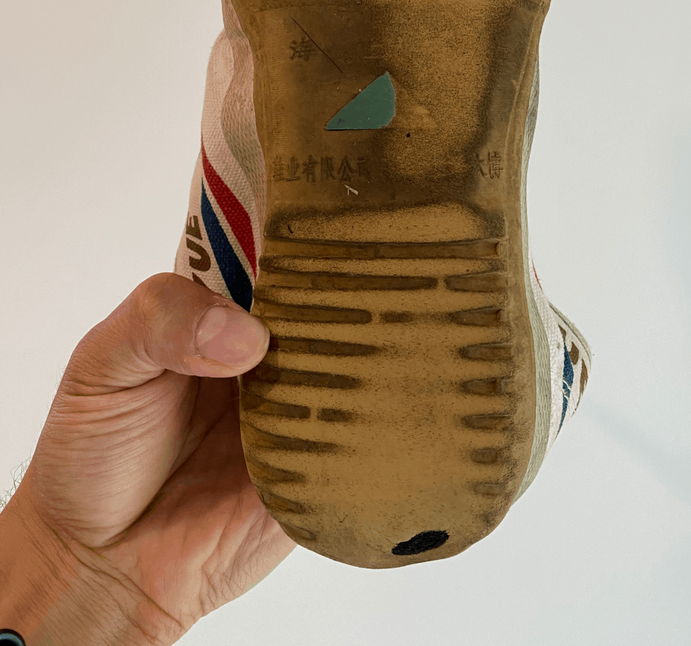
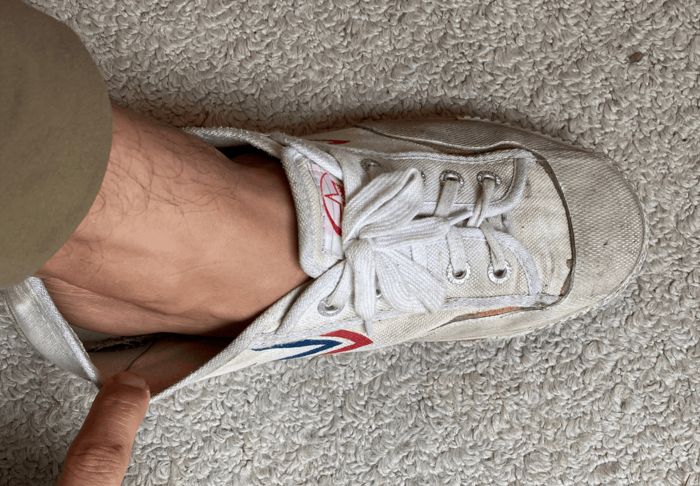

By far the shoe with the best value for its price is the Feiyue. This shouldn't come as a surprise to anyone. Among the benefits to this shoe are it's light weight, grip, comfort, and price. The shoe is very popular in the movement world and popularized by Ido Portal and other movement enthusiasts.

Buy on Amazon

## Summary

- INCREDIBLE comfort
- Easy to put on and take off
- Amazing deal. Very cheap shoe for value
- Flat sole with excellent grip
- Very stable makes moving at odd angles very easy
- normal width toe box leaves us wanting, but acceptable.
- Responsive and lightweight
- Supremely flexible
- Not very breathable, likely to cause odor if without socks

## Comfort

**One of the biggest benefits of Feiyues is their incredible comfort.** I was not a big fan of these shoes when I first bought them. I thought I would buy Feiyues just to try them out, but I had no intention of keeping them for very long.

Before long I started wearing the shoe every damn day! This shoe is incredibly comfortable. It's easy to slip on and go about my day. Even though this is a guide for movement training shoes, the times I've most enjoyed using these shoes is in my day-to-day life. I've gotten plenty of use out of these shoes and the main reason is that they are so comfortable to wear. I have more expensive shoes like the [Vivo barefoot](https://tidd.ly/34hliS9), but I prefer my feiyues because of the ease of putting them on and the look which makes them stand out much less than other minimalist shoes.

## Ease to take off and put on

It's about convenience. **Feiyues are probably the most convenient shoes I own, and that's because they are so easy to take off and put on**. I can be really lazy, and Feiyues are the prefect shoe for me in thsi respect. I can easily slide my shoes in, without much worry that they slide off. And although worrying about my shoe flying off is a bigger issue for Feiyues, the shoe is just so damn convenient that I prefer it over any other shoe I own. My Feiyues see more use than any other shoe in my shoe rack and it's for this very simple and easily overlooked idea.

## Amazing value

**The Feiyue is an amazing value pick. For $20-40. You literally can't beat these cheap as dirt shoes.** I love buying high quality clothing and equipment if I think it will provide a significant benefit, but these shoes are cheap and high quality for movement or callisthenic training. Yes, you can go for the [vivo barefoot](https://tidd.ly/34hliS9) shoes, but the price point is much higher for minimal benefit.

## Flat soles and stability

The rubber sole provides minimal protection against rocks and other small objects. You will feel everything, which can make hiking in rough terrain unadvisable. **The rubber sole covers part of the sides of the shoe, making it stable in many different angles. For movement lovers this is a huge benefit,** as you can walk around in many different angles without fear of twisting your ankle or losing stability.

Most sneakers have very high heels, which inherently make them more stable when walking and running, but not when moving in non-linear patterns. One of the biggest need for callisthenic training is being comfortable off center and doing that with a traditional shoe can easily lead to a twisted ankle. Feiyues thrive off-center, which is why they are so great for movement training.

Note the rubber come up along the side of the shoe for added support at angles.

## Toe box and comfort

I didn't know how important this was until I tried a few minimalist shoes. There are a few benefits to having a wide toe box, with the biggest benefit being a more comfortable fit that makes room for your whole foot. Many sneakers and dressing shoes have very narrow toe boxes, and this has many drawbacks. **Having a narrow toe box can cause bunions, blisters, plantar fasciitis, and general discomfort.** If these are problems that you know you suffer from, then having a wider toe box could be a solution for you.

Feiyues do not have a particularly wide toe box, but in my opinion, they are wide enough for most people. If having a wider toe box is a must for you, then I would consider looking elsewhere.

## Lightweight

**Feiyues are very lightweight**. For callisthenic and bodyweight movements, having lightweight shoes is absolutely necessary. Feiyues are not the lightest shoes available, but they are incredibly light. For movement lovers, having a lightwieght shoe is a must.

Without a lightweight shoe, you'll tire faster and move with less fluidity. If you've ever tried to do Intermediate-advanced movement training like a hanging leg raise or a planche, you'll have a much harder time because of the weight of your shoes works against you.

## Flexibility

**Having a flexible shoes is very beneficial when doing complicated movements on the ground. Feiyues are among the most flexible shoes you can find**. Any position you can put your foot in, you can do with Feiyues on, and this is one of the biggest benefits of the Feiyues. Having stiff shoes means you're going to be every limited in your movement options. Sneakers with high heels for example, are made for walking and running. If you walk or move off center, you are at risk of twisting your ankle because the shoe is not able to support that direction or angle of movement.

## Biggest Cons about Feiyues

**Feiyues are build to las about 6 months to a year with regular use**. After that, you'll start to see the seams come undone and the rubber sole waste away. Maybe these shoes will last longer with light use, but expect about a half year to a year life span.

Another issue that Feiyues suffer from is that they get really hot. **There is no ventilation via mesh top like other high end shoes. The plastic cover is completely insulating, which traps a lot of heat** and moisture. I am a person who sweats very little and it is still an issue for me. You can wear these shoes without socks and it has become somewhat fashionable in the "movement" world to do so, but I'm not about that athlete's foot life. In terms of hygiene, I think it's a much better idea to use socks.

Feiyues do not provide any sort of ankle stability. This is due to a strange design decision which makes the opening for the ankle very wide. Although I personally prefer shoes with minimal ankle support, the con here is that **the ankle part is so loose that the shoe can easily fly off your foot** at any time. If you're barefoot and your sweaty feet are sticking to the shoe, this won't e an issue, but I've had a few situations where a shoe did or nearly did fly off my feet. This is a bit of an annoyance and not something you can solve by tying your shoes tighter.

## Final Thoughts

**The Feiyue is a great shoe for people looking for a cheap shoe that they can use for their movement or callisthenic training.** If you are someone with a little more experience and are looking for a higher quality shoe, then I would skip this shoe and look at the [Vivo barefoot](https://tidd.ly/34hliS9). I personally train with Feiyues as a last resort. My pair is starting to fall apart after about a year of light use and small annoyances like the feeling that my shoe could fly off any moment or how sweaty my feet get while training.

If you're a beginner in the movement or calisthenics world, or if you're just looking for a budget option, the Feiyue is a great option and I highly recommend that anyone check it out.
