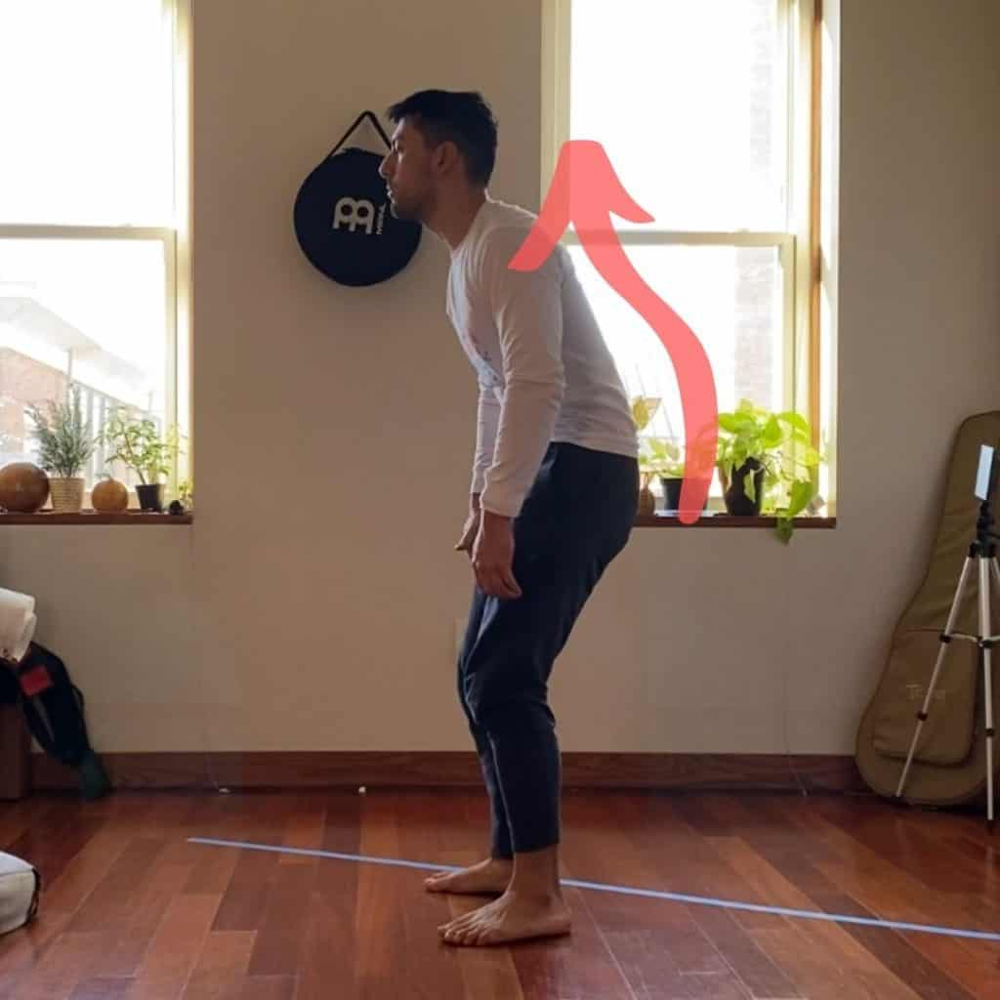
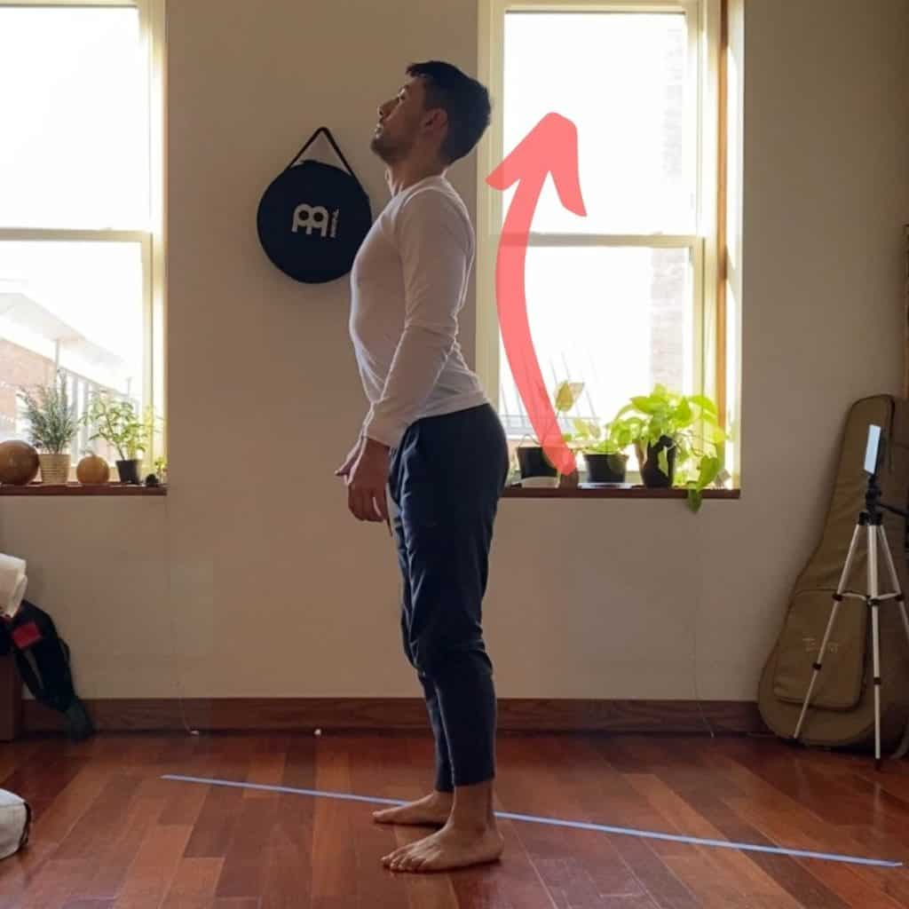
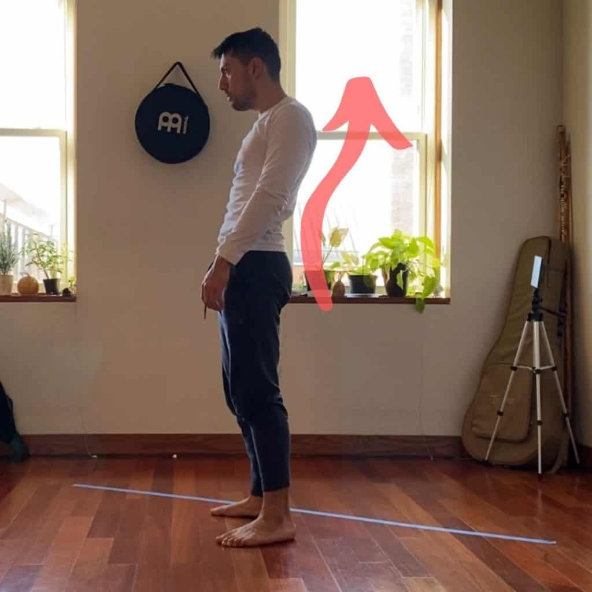
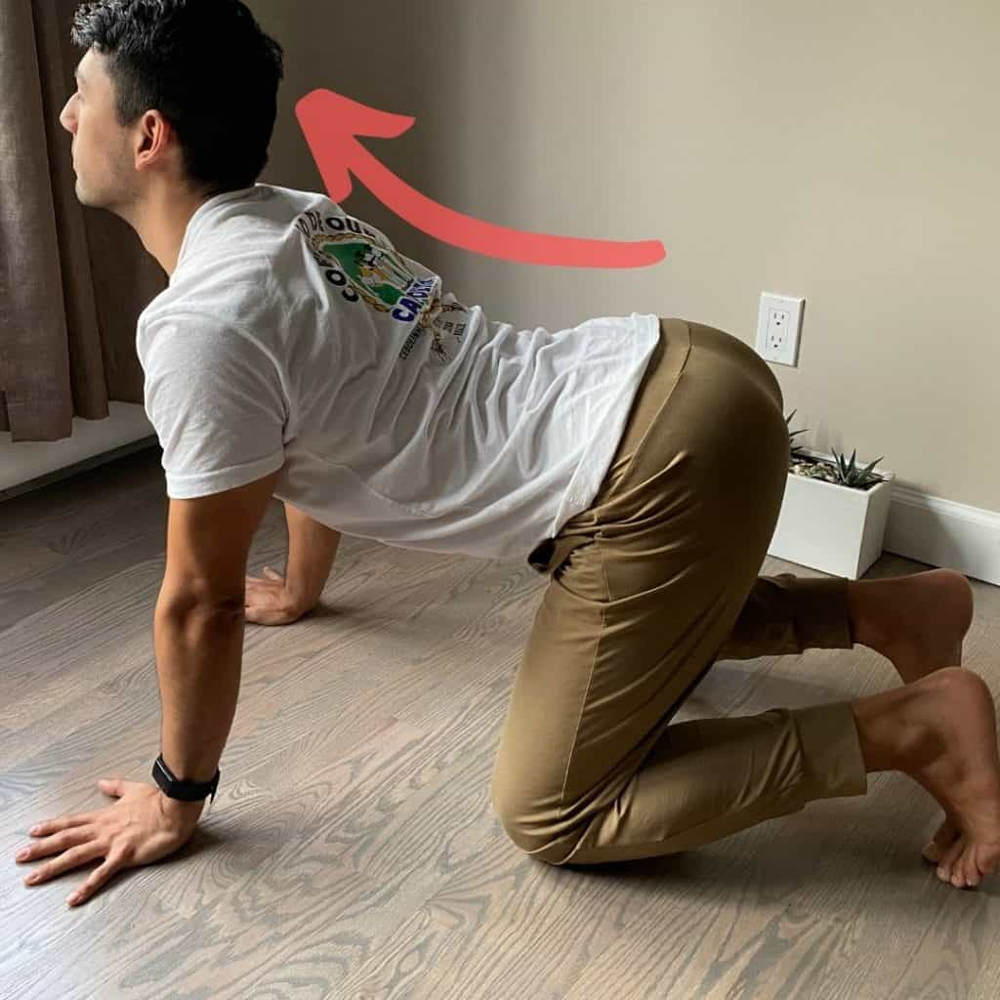
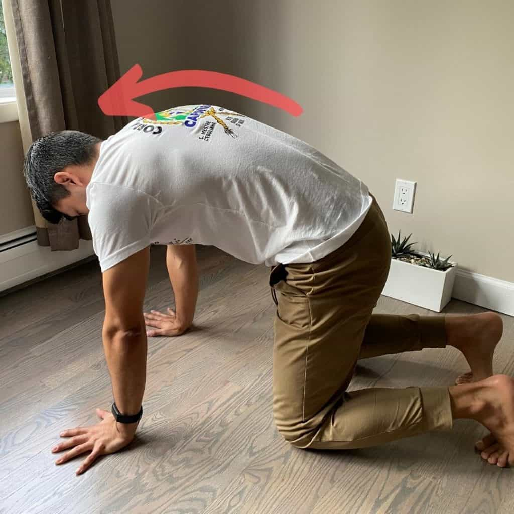
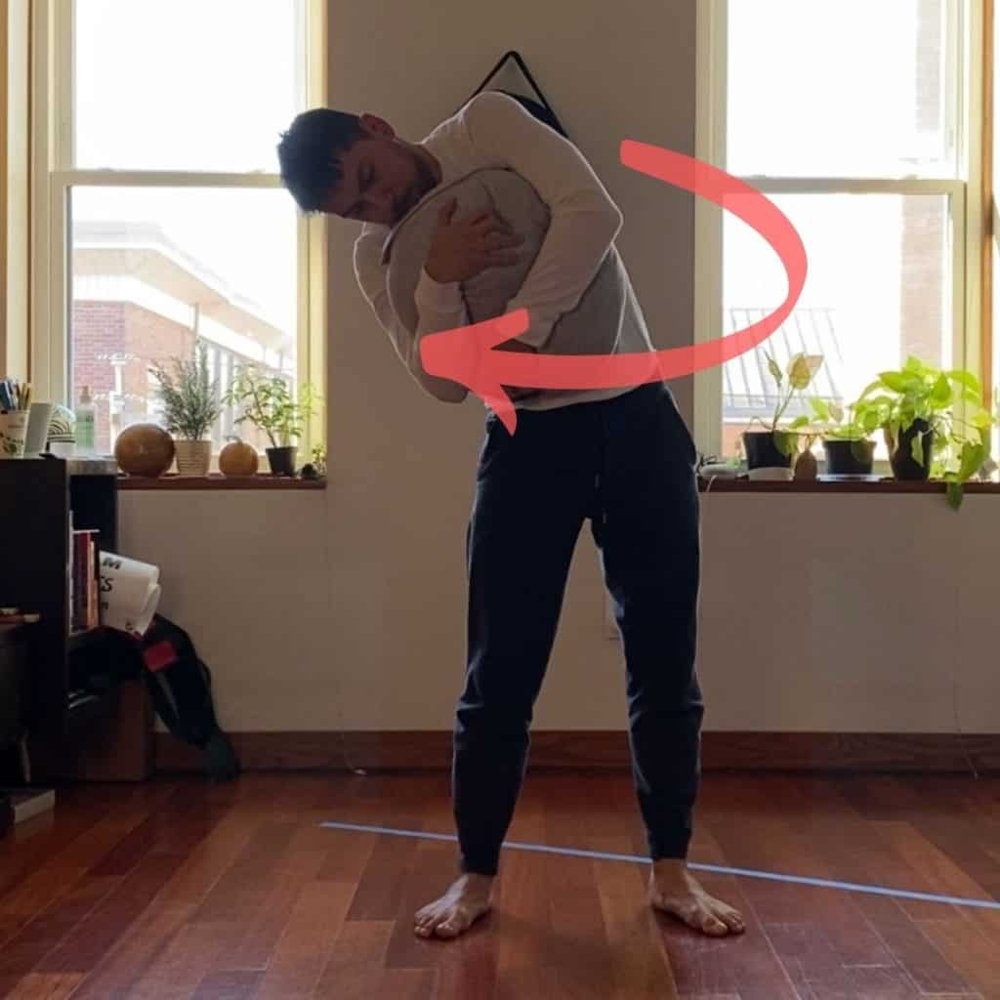
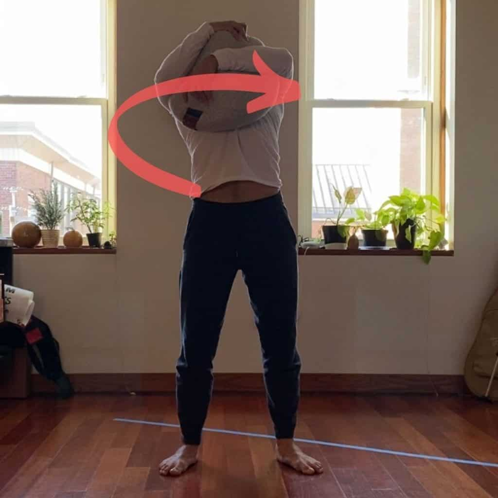
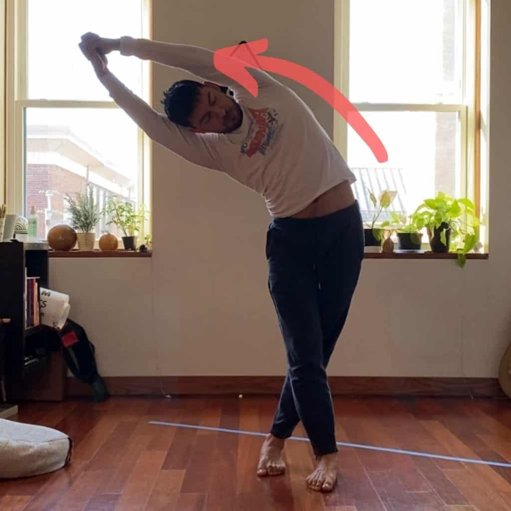
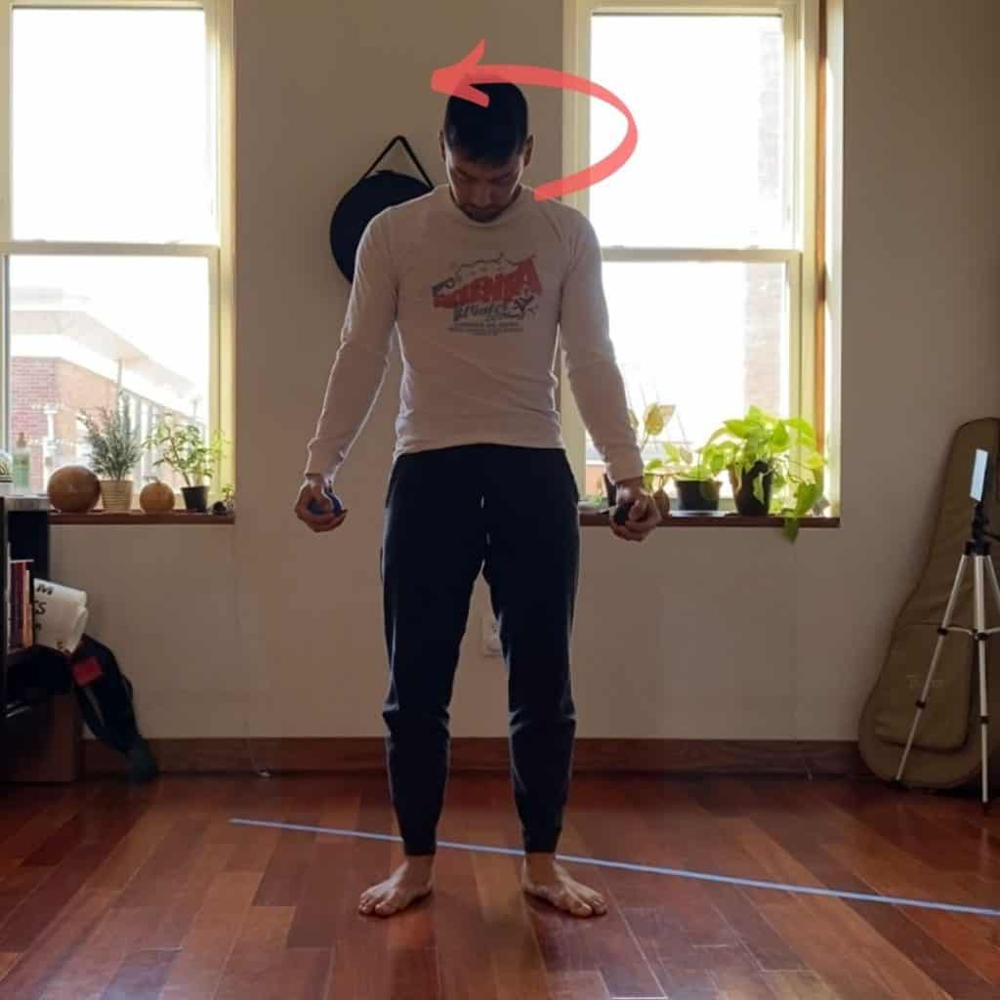
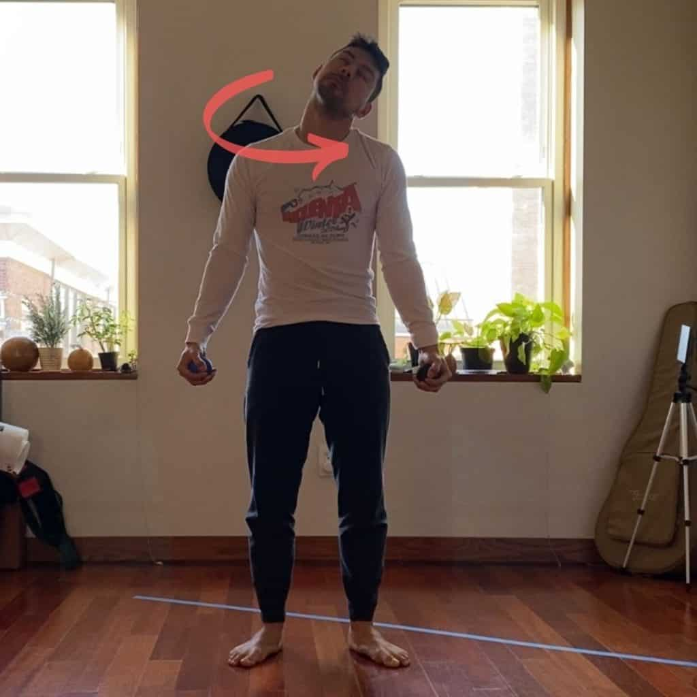

Here are 5 exercises you can do in the morning to get rid of morning stiffness in the back...

- Spinal waves
- Cat/cow
- Thoracic CARs (Controlled Articulated Rotations)
- Seated QL stretch
- Neck CARs

The goal of any exercise meant to relieve stiffness should be to...

- Engage the musculature to promote circulation and reduce inflammation
- Move each joint even every direction to improve range of motion
- Improve motor skills so that movement is fluid and controlled

## Spinal Waves

**HOW TO:** Spinal waves is a gentle way to mobilize all the joints that make up the back and engage the muscles in a very fine tuned movement pattern. Our goal is to move the spine in a wave from the bottom of the pelvis to the top of the neck.

**HOW MUCH:** Repeat your spinal waves for 2-5 minutes first thing in the morning. After you're finished, you will start to feel warm and ready for the following exercises.

If you find it difficult to perform the movement smoothly, consider standing in front of a wall and try to touch one part of your body to the wall at a time. Starting with the nose, chin, chest, stomach, and pelvis. This movement should be fluid. If you record yourself, you'll probably see a lot of jerky motion. This is an indication that there is poor communication between the brain and certain segments of your spine. Doing spinal waves helps to build that connection, allowing for smoother movement and a reduction in any inflammation.

## Cat/Cow

**HOW TO:** Cat/cow starts from all fours, with your knees and hands on the floor. First look down and push your shoulders up as you push with your hands into the floor. Suck your belly button towards your back and raise your back towards the ceiling. Last, tilt the pelvis anteriorly (think scared dog). Look down. This is the Cat part of the motion.

Next, look up and bring the shoulder blades together. Bring your stomach to the floor while engaging your back muscles. This is the Cow part of the movement.

**HOW MUCH:** Repeat for 10 - 20 reps.

Our goal with this movement is to extend the spine and flex the spine as much as we can. Make sure that you have your shoulders, neck, and hips engaged as you do this movement. It should be intense as you bring your entire body into flexion and then into extension.

If there is any pain during the movement, try to stay within a range of motion that does not aggravate the pain and make it worse. This will most likely mean extending or flexing a little less than your normal maximum.

## Thoracic CARs

**HOW TO:** Start by hugging a couple of pillows, a medicine ball, or anything else that you can hug. stand with your legs straight and your feet facing forwards. Engage by squeezing the object, tightening your core, and digging your feet into the floor. Crunch the ball as if you were doing a sit-up. Rotate to your right. Lean to the right. Lean back and rotate to the other side. Lean to the other side as much as you can. Turn towards your new leaning direction. Finally, bend forwards and crunch the object again and come to the middle. That's one rotation

**HOW MUCH:** Make sure each rotation lasts AT LEAST 10 seconds.

Thoracic CARs are a way of mobilizing the thoracic portion of the spine while engaging the surrounding muscles. Once warmed up, this is one of the best ways to relieve any tension in your middle to upper back. CARs stands for Controlled Articulated Rotations. Meaning that you are moving your body in a way that is fully rotated along its full range of motion. **Do not forget to stay engaged throughout the entire movement.** This is a critical point. If you get lazy, the exercise will lose most of its value.

Similar to the cat/cow, stay away from any ranges that cause any pain. If you feel a sharp pain, you should either decrease the intensity of your isometric contraction, or move away from the range of motion that is causing you pain - whichever one works.

## Standing QL Stretch

**HOW TO:** Stand up straight and take a step forwards making sure to cross the forward leg over your back leg. Reach your hands up and clasp them together. Now lean over to the side of your back leg. Hold for a few seconds before coming back up and repeating the movement.

**HOW MUCH:** Hold the stretch for about 10 seconds before moving onto the other side.

The QL (Quadratus Lumborum) is a muscle located in your lower back on either side of the lumbar spine. The lumbar spine is the lower section of your back. **The QL is the most common reason for lower back pain!**

This happens mostly because we sit for a very long amount of time, or the QL is supporting other muscles like the glutes. For example, you might have some lower back pain while jogging because the hamstrings or glutes are fatigued and the QL is picking up the slack.

## Neck CARs

**HOW TO:** Start by standing with your legs straight and your feet facing forwards. Engage by squeezing your hands into a fist, tightening your core, and digging your feet into the floor. Now you're ready to begin rotating your neck while keeping the tension around the rest of your body.

Start by bringing the head down. Lean right. Rotate right. Next, lean your neck back. Lean to the right and then rotate to the left. Bring your head forwards until your head is down. And repeat.

**HOW MUCH:** Do about 3 rotations in each direction. Each rotation should last AT LEAST 10 seconds.

Neck CARs target the cervical part of your spine. This is the highest section that connects your head to your shoulders. Many people have stiffness in and around the neck that can be relieved with this sequence.

Similar to the cat/cow, stay away from any ranges that cause any pain. If you feel a sharp pain, you should either decrease the intensity of your isometric contraction, or move away from the range of motion that is causing you pain - whichever one works.

## What causes Morning Back stiffness

Stiffness in the back is either caused from muscle tension or inflammation in the spinal joints. Inflammation in the joints is primarily caused by a lack of lubricated cartilage between your spinal segments. Factors that can contribute to back stiffness in the morning are going long periods of time without moving and suffering from conditions such as Rheumatoid Arthritis or Osteoarthritis. This stiffness usually lasts about 15 - 20 minutes after waking up.

Tension in the muscles is the other major source of pain in the lower back in the morning. This can arise again from a lack of movement, a poor sleeping position, stress, or a workout during the previous day. Conditions like Fibromyalgia may also play a part.

### These exercises attack the problem at its source!!

The majority of the tension created in these exercises is isometric. Isometric contractions are when you apply tension in a static position. During an isometric contraction, you do not lengthen or shorten a muscle. An example is a wall sit. This is the safest way to apply tension - as opposed to a concentric motion like the lift of a squat.

The Thoracic and Neck CARs are examples of this. As you move into different positions, you want to make sure you are isometrically contracting throughout your entire body. The contractions produce neural feedback to the central nervous system and the brain. The brain learns from the feedback given and improves neurological control in the range of motion you're moving through. The effect is improved efferent feedback to the muscles and joints. This means the central nervous system is better able to communicate with the body in a way that is more efficient than before.

The good news is that regardless of the source of your back pain is joint or muscles related, the exercises mentioned above are very helpful. These exercises attack the pain at the source by moving the spine in ways that produce tension. This encourages lubrication of the joints and allows the muscles to relax and reduce inflammation.

## How to manage morning stiffness?

Regular exercise is the best way to relieve the feeling of a stiff back in the morning. You may also take anti-inflammatory drugs prescribed by your doctor in more severe cases. Taking hot showers will warm the body and can improve circulation throughout the body. Hot packs or compresses can be helpful for the same reason.

For the majority of people, regular exercise, and a quick routine that moves the back (like the ones we show at the beginning of the article) is a great way to manage stiffness. As a reminder, these exercises should include more than just stretching. The goal is to warm up the body, articulate the full range of motion for all joints involved, and be at a light or medium level of intensity.

### Older people have the most to gain from these exercises

Many older people suffer from conditions like Rheumatoid Arthritis or Fibromyalgia experience some level of stiffness in their backs in the morning. These are the populations who have the most to gain from these safe ways of moving the body. Even older people who have severe restrictions in their ranges can move to the degrees that is right for them. That is, challenging, but not painful.

However, most adults who feel stiffness in the morning on a regular basis can be contributed to a lack of movement. Doing these exercises is one way of counteracting their effects and help in living a pain-free life.

## Health and Diet Considerations

Our bodies are majority of water. If we do not have enough liquid in our system, it will be much more difficult for our skin and muscles to feel supple. The US National Academies of Science, Engineering, and Medicine has stated that we should be taking in approximately 15.5 cups or 3.7 liters of fluid a day for men and 11.5 cups or 2.7 liters of fluid a day for women.

This sounds like an insane amount of water to drink! But remember that we receive fluid from many sources, including our solid foods.

## Sitting too much

If you sit a lot during the day, makes sure to take regular breaks from sitting down. Get up for water, to the bathroom, or go for a walk. Another great tip is to vary your sitting position every few minutes. Standing desks are another great solution that can help alleviate muscle and joint stiffness in the mornings. If you do use a standing desk, make sure you have a stool so that you can sit down every now and again.

## Make sure to get enough sleep

Sleep, particularly deep sleep, is one of the most important things you can do to heal your body. Deep sleep is one of the three phases of sleep (others being REM and Light) that focuses on healing your body. This includes rebuilding damaged tissue from a workout, repairing a broken bone, etc.

One of the best ways to get good deep sleep is to keep a consistent sleep schedule, avoid electronics within an hour of bed time, and avoid eating close to bed time. This goes double for alcohol, which has been shown to have very adverse effects on sleep.

## Breath Work

Breath work encompasses a variety of breathing practices where you are in conscious control of your breathing. These activities are said to influence a person's emotion and physical state of being. One well cited effects of breath work is relaxation - which is very beneficial for sleep. There are many breathing practices that promote relaxation in the mind and body. For the mind, this may mean limiting the constant rush of ideas from popping up. For the body, this means noticing contracted muscles and consciously relaxing them.

Some breathing techniques include...

- Wim Hoff
- Circular breathing
- Pranayama from Yoga (of which there are many)

## Watch your sleep posture

Using a pillow is very helpful when trying to find a comfortable position to sleep in. The Mayo Clinic cites the three main positions that people sleep in as on their Backs, Side, and Stomach. It is common for people to feel some sort of discomfort after sleep in either one of these positions. In these cases, it may be useful to use a pillow to alleviate stress in certain parts of the body.

If you sleep on your back for example, you can sleep with a pillow below you knees. This will help to maintain a normal curve in your lumbar (lower back). If you don't have an extra pillow to use, try using a rolled up towel or sweater.

If you sleep on your side, you can raise your knees slightly and put a pillow between your legs to better align your body.

Last, if you sleep on your stomach, a pillow below your stomach may help with any back pain you feel in the morning. Another trick that may help is to sleep without a pillow, which will keep your cervical spine from extending excessively.

