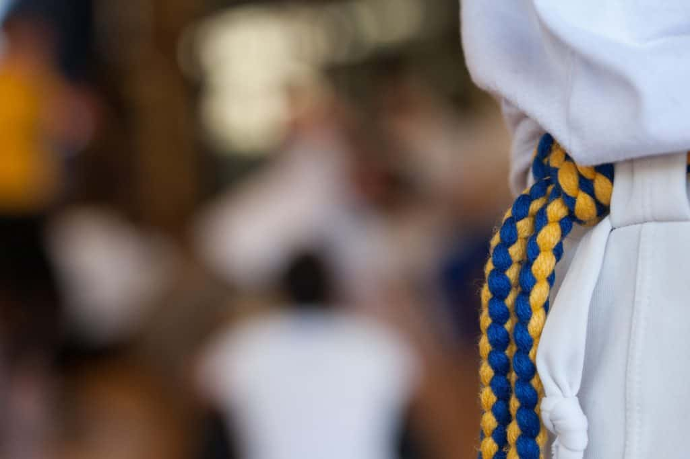

## SOME BACKGROUND

What I have seen at the majority of Batizados is that they are just not that creative and can at times feel like a chore. Most of the time they have rodas, workshops, the batizado, a dinner/food, and the obligatory maculele performance (not necessarily in that order). I can't tell you how many batizados I've been to with this same breakdown and in my earlier years of capoeira it was usually a big source of disappointment and disillusionment. But I know we can do better.

 

## 5 WAYS TO MAKE A BETTER BATIZADO

 

### **1\. RODAS:**

We can all agree from experience and countless complaints that we need more and longer rodas, I would suggest around 1 roda per 20 - 25 people if possible.

Having a no-chord/1st chord roda is a good rule of thumb, allowing those with less experience the opportunity to play. In theory with this set up, there should be no excuses to not play, and if you want to really challenge yourself, then you have to handle yourself in the grownup roda.

 

### **2\. WORKSHOPS/ACCOUNTABILITY:**

This is a big one. How many times have you gone to an event and there is no information about who is giving the workshops or what the workshops are going to be on!? This is unacceptable, and I know organizing capoeiristas can be like herding cats but this is something we need to get right.

Workshops should be announced well in advance with the following info. 1) the teacher giving the workshop 2) the topic of the workshop 3) duration and 4) difficulty

Another point is to add is surveys where people can gripe or express how well the workshops were. If people do not improve their workshops and instead teach the same thing every time, they won't be helping the community improve and therefore won’t be invited to teach a workshop next year. A survey will let the Batizado Organizer (BO) know who is worth having give a workshop next year. Big names are nice, but good workshops are better.

 

### **3\. REGISTRATION:**

Lets face it, people do a terrible job announcing or committing to events. Registration is very important because it gives you info about who's coming, how many people are coming, and what level of people are coming, information about who needs housing, and funds for the event.

The best way I've found to do this is to have staggered prices that increase as the batizado gets closer and asking people to register through a google form and pay with something like PayPal or Venmo. Without good organization at the outset of the event, you could be left with extra event t-shirts or your event could run in the red, which is definitely something you don’t want to happen.

 

### **4\. LIVE VIDEOS:**

Why are we all not live streaming our events (minus the workshops for obvious reasons)!? It's 2017 and we have every opportunity to showcase our events, our rodas, etc. capoeira is a beautiful art and if we can bring that to the larger public and drum up interest, more people will come and participate.

Video is something we should all be doing. Every group should figure out who can do basic video editing and start a YouTube channel. The batizado is a great time to get a ton of new material for YouTube and can even be used as a way for people to promote their personal brands. For example, some people have beautiful games and they can be on a highlight reel for the batizado to promote their personal brands. Everyone wins.

 

### **5\. GAMES:**

It would be great to have competitions between groups, individuals, and schools. Capoeira may not be "competitive" in the way a typical sport is, but there are competitive elements and we can have people showcase their abilities with various capoeira and non-capoeira related games. If there's time for making batizados fun, I think it would be worth it to try something. This is all about making the batizado experience something fresh and fun, particularly for the students who want to meet new people, learn, and frankly get their money's worth.

 

### **Conclusion:**

let me know what you think and share your ideas. This is about growing the community because we all talk about preserving the art, but if we're not passing that art along to anybody then what's the point? New students are the lifeblood of any martial art, and batizados are a big deal for them. Making our batizados better would go a long way in gaining and retaining students.

Dendê Arts
