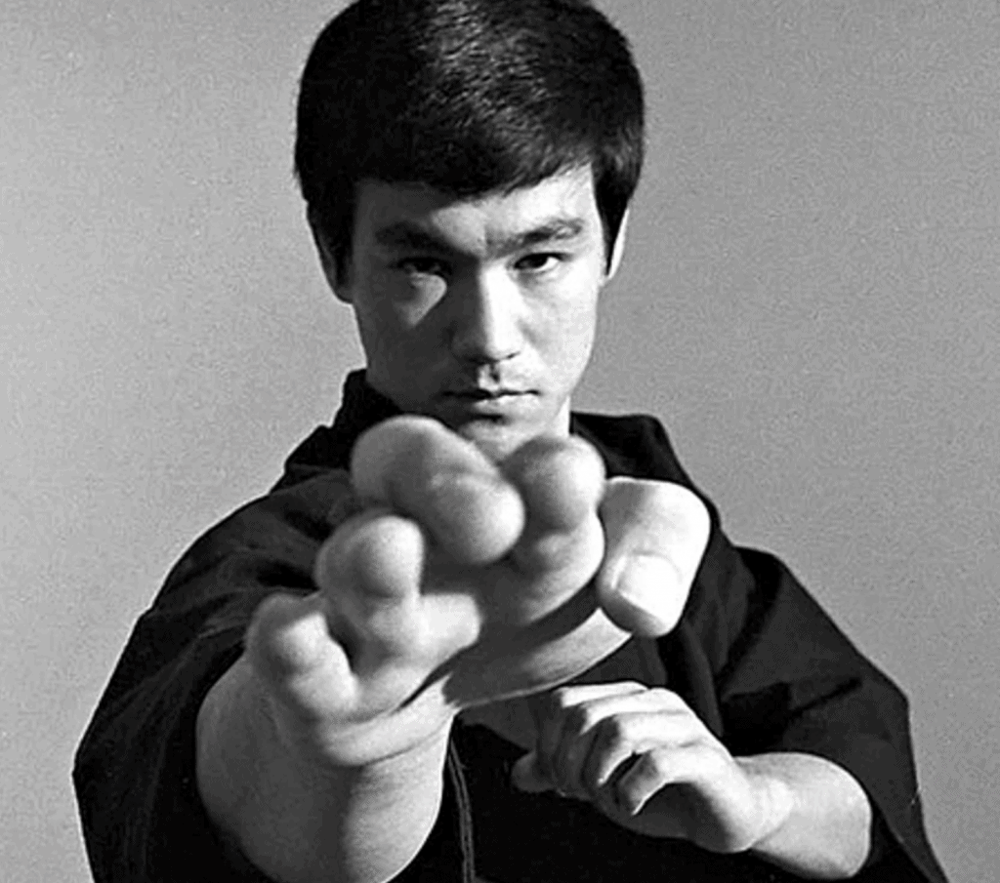

When you watch a Capoeira game, you might notice that almost every interaction involves a kick from one of the people playing. In fact, kicks are so prevalent in Capoeira, that you might be curious about how hand strikes can be used or if they’re used at all. 

So, does Capoeira have hand strikes? Yes, Capoeira has several hand strikes that can be used in the game of capoeira. Although many of these hand strikes see little use in the Roda (circle where capoeira is played), some strikes do see regular use. Hand strikes have many uses. They can be used to damage, disorientate, to feint, or even to teach.

I will list out the strikes, explain how they are performed and their connect with the game of Capoeira, and after I’ll go over their practical application. This will include uses in other martial arts and mixed martial arts competition, which I see as the ultimate proving ground for the usefulness of a technique - at least in terms of self defense. 

## Galopante

Galopante is one of the most widely used hand strikes in Capoeira. This strike is delivered with an open palm to the face and uses the base of the palm. This differs from other striking arts, such as boxing, which places a large emphasis on a closed fist to deliver a blow. It is not clear specifically why an open palm is used as opposed to a closed fist. One reason might have to do with the high probability of wrists breaking when punching someone in the face. There are many cases of examples of punches to the head leading to cracked or broken bones in the hand. This occurs in MMA and boxing, and is prone to happen in street fights as well. The hand is much softer than the head and in Capoeira, head butts are normal a normal thing. Punching someone’s face might not seem scary, but Imagine punching someone on the top of their head! MMA legend Bas Ruten has an entertaining story about this. 

<iframe width="560" height="315" src="https://www.youtube.com/embed/UduTUNi-E8c" title="YouTube video player" frameborder="0" allow="accelerometer; autoplay; clipboard-write; encrypted-media; gyroscope; picture-in-picture" allowfullscreen></iframe>

Galopante is a strike that is used in one of Mestre Bimba’s 8 sequences. These sequences were meant for beginners to learn the fundamentals of Capoeira, and this attack is found in the fourth sequence. 

<iframe width="560" height="315" src="https://www.youtube.com/embed/8nk4esw3cco" title="YouTube video player" frameborder="0" allow="accelerometer; autoplay; clipboard-write; encrypted-media; gyroscope; picture-in-picture" allowfullscreen></iframe>

In the third section of this sequence, person A throws galopante by swinging their open palm towards their opponent. Person B dicks underneath the strike and takes down person A. Mestre Bimba, understood that his students would face these kinds of strikes in the streets and therefore trained them to confront them. In typical Capoeira fashion, the reaction here is to dodge, or esquiva the blow. However, it is also possible to block with attack before counterattacking. 

## Cutuvelo (elbow strike)

Cutuvelo is not technically a hand strike, it’s an elbow strike. Elbow strikes can come from various angles, including up, to the side, and down. The angle of the strike depends on the position of your opponent. Elbow strikes are used to good effect at very close distances. Headbutts are a common attack in Capoeira at short distances.  If the opponent uses a headbutt, it is possible to use the elbow to counter a headbutt to the face or abdomen. In case of a take down attempt, Capoeiristas can rain elbows down on their opponent’s back to dissuade further take down attempts. 

In the UFC, elbows are a very commonly used tool when at an unorthodox angle or close distance. John Jones, UFC light-heavyweight champion, uses elbows to great effect in several of his matches. During several of his matches in the UFC, Jon Jones used his elbows to devastate his opponents. Here is a [compilation video](https://youtu.be/CWeQlSoj09k), showing some of Jone’s techniques and uses. Interestingly, in the UFC, downward elbow strikes (from the 12 o’clock position to the 6 o’clock position) are illegal, but it’s not clear why. 

## Asfixiante (asphyxiate)

Asfixiante is a closed fisted blow to the throat. This is one of the few closed fisted strikes and maybe not so surprisingly is aimed at one of the softer parts of a person’s body. Although the throat is defended in part by the chin and the shoulder, punching this area would do a lot of damage. In the short term, breathing would be difficult and in the long term, the opponent could die from asfixiation. Asfixiante is not really used in the game of Capoeira for the risks associated with the blow. The blow is rarely used and is reserved for use in a real life case of self defense.

The larynx and trachea are just some of the soft tissue that can be easily damaged or destroyed by a blow. It’s for this reason that intentional blows to the throat are not allowed in the UFC under the unified MMA rule set. This makes it very difficult to know how effective a throat strike is in the “real world”. It is by no means an easy strike to land. As already mentioned, the chin and the shoulders do a decent job defending the area. If you accidentally hit the chin, it’s possible to break your hand. Speculation aside, it’s easy to say that if you did successfully use this strike, it’s possible to do critical damage to someone. 

## Godeme (back fist)

Godeme is another hand strike that is more commonly used in the roda. Unlike other hand strikes in Capoeira, Godeme uses the back of the fist to hit. This movement also makes up the first part of the 4th Mestre Bimba sequence that includes Galopante. In this part of the sequence, the first person will step forward and use godeme. The other person will block with their forearms and hands in front of their face. The strike is performed twice with both hands and is designed to be a drill that will teach students how to defend against this attack. 

This Attack might be difficult to spot for two reasons. The first is that it is not widely used as compared to leg strikes. The second reason is that Godeme is not wiped around like some of the leg strikes. The movement is a little more subtle and can serve many different purposes. If a player wishes to attack their opponent, they aim the strike to the face. Sometimes a strike like this is seen as having little grace, subtlety, or class. For this reason, the attack is sometimes used as a feint that will lead to another attack. The emphasis being on tricking your opponent and gracefully leading them into a hidden attack. The last reason this attack is most commonly used is by teachers who want to remind their students to protect their faces. It’s not uncommon to see teachers “gently” backfisting their students to “encourage” them to protect their faces. As mean as this sounds in our modern and squishy society, I’ve always liked this idea because this is almost never done with ill intent and instead serves as a learning moment for the student without injuring them. 

In a fighting context, a back fist is not a common form of attack. The move is rarely used, but has been applied by fighters in very rare occasions. There are some videos about knockouts with back fists, but that’s about it.  In summary, back fists do not have the same breath of applications in as jabs do. They are inherently riskier moves and serve more to surprise your opponent if you pull them off correctly.  

## Telefone (strike to the temples)

Telefone is a really cool looking move, like something out of kung fu movie. The move is essentially doing galopante with both hands at the same time at an opponent's temples. The move is used primarily to disorientate the opponent. You’re not going to knock anyone out with this move (I don’t think), but you can definitely knock them off balance. Striking the temples damages the vestibular system, which controls our balance. If delivered correctly, you’re opponent will have a difficult time standing, striking,  etc. In Capoeira this is a huge deal as our balance is what allows us to move fluidly. 

In the world of MMA, this strike is not seen. The lack of its use leads us to two possibilities. The first is that this movement is not practical or can be substituted by something else. Instead of open palm striking to the temples with both hands, perhaps it would be more useful to do so with a hook to the temples. The movement might also be seen as too open. Attacking with both hands does leave you without much defense. The other possible reason for Telefone’s lack of use in mixed martial arts could be that it is not a well understood movement that has not yet seen anyone willing to apply it to a fight. This is very unlikely, but who knows, the fight game is always developing and perhaps new movements will be added to the meta-game of fighting. 

## Escala (open palm strike)

Escala is another open palm strike that is found in Capoeira. The strike aimed for the nose and pushes up forcing the head up. Anyone who’s ever been hit in the nose, understands that your eyes start to water and it becomes difficult to see. Although this strike could be used to knock somebody out, the most common use is to distract them and continue with a leg strike. In a game of Capoeira, this strike sees less use for the same reasons as godeme or Asfixiant. This move can cause damage in a way that does not add anything to the game of Capoeira other than watery eyes and a bruised nose. If you want to continue playing, it helps to have everyone’s noses and eyes in tact. 

On the self defense side, this strike looks like you find a your local “women’s self defense class”. the reality is that an open palm strike can be very effective. Similarly to Galopante, an open palm strike can actually seriously hurt your opponent and protect your hand from breaking on someone’s skull or chin. In the UFC, open palm strikes are rarely seen because the padding on the fighters’s gloves provides sufficient protection to the fighters hands. Hands are less likely to break if your knuckles are padded. However during earlier forms of MMA competition known and Pancreas, open palm strikes were very common and were often used to take down an opponent. 

<iframe width="560" height="315" src="https://www.youtube.com/embed/uiGQIh-6Kdo" title="YouTube video player" frameborder="0" allow="accelerometer; autoplay; clipboard-write; encrypted-media; gyroscope; picture-in-picture" allowfullscreen></iframe>

## Dederia (eye gouging)

The eye poke! It may be hard to believe, but in Capoeira, this is a move that people use. Deideria is if done “correctly”, can cause all kinds of permanent damage to a person’s vision. This move is usually only done in a case of self defense and you intend to hurt the other person. That being said, within the context of Capoeira, this move is used to distract or re-direct the attention of the person you’re playing with. Capoeiristas play with this movement a lot. They pretend to poke each other’s eyes‍, usually once someone’s been tricked into looking somewhere else, or to remind someone to keep their face protected. Its usually in good fun and helps add to the creative spirit of Capoeira.

This movement’s effectiveness is very difficult to assess because there is no eye poking in MMA, it’s an illegal move. If you poke an opponent in the UFC, you can have points taken from your score card. If we can’t look at mixed martial arts, then another place that comes to mind is Bruce Lee.

Bruce Lee is often considered the father of mixed martial arts and was a big proponent of the eye jab. In the Tao of Jeet Kun Do, Bruce Lee writes, “Like a fencer’s sword that is always in line, the leading finger jab is a constant threat to your opponent… basically it is Western sword fencing without a sword and the primary target is your opponent’s eyes.”. Unlike the system of Jeet Kun Do, Capoeira has not systematized the use of this technique. Instead, it has been used in jest and as a game to enhance the game of Capoeira. Although the concept is there, and could be used in a self defense setting, for a Capoeirista, that may not be the primary concern when applying this technique. 

## When to use hand strikes in the roda

Hand strikes in Capoeira are nowhere as popular as striking with the feet. However, these strikes to exist and they do see some usage in the roda. If you’re looking to apply these strikes to your game, make sure to ask your teacher how they work and when is the best time to use them. Many people consider using certain hand strikes against teachers as rude and disrespectful. It’s best to learn the subtleties of the attacks before you go out and start casually trying to poke people’s eyes. To help you understand how “rude” or “not rude” these attacks are (for lack of a better phrase), I made a list below that you can refer to. The lest goes from least offensive to most offensive. The might vary a bit based on your group, however this can act a set of guidelines until you ask your teacher.   

Galopante —> Godeme —> Escala —> Cutuvelo —> Telefone —> Dederia —> Asfixiante
