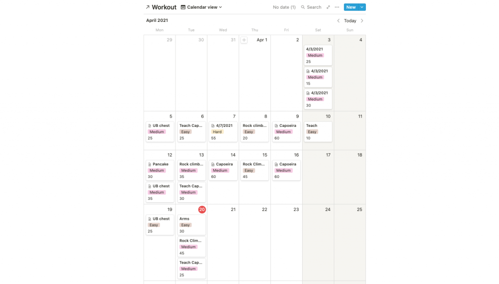

Tracking you fitness will 100% make you more fit. Taking the guess work out and seeing your progress written down is a great booster to your motivation. It also gives an objective account of what you are doing and how much you're doing it - which will help you make gains.

There are four steps to tracking your fitness routine - either new or existing.

- Write out our workouts in advance
- Place our workouts in a calendar of some kind to keep us accountable
- Write down basic metrics about the workout
- Analyze the information you recorded (nerd mode)

## Why track our fitness routine?

Myself and many others have lied to themselves about how much they worked out, what they did, and how intense it was. To a degree, we make up stories in our head about what we think happened, but when we put records of our workouts there is no room for error or interpretation.

### Objectivity

When you track your workouts you don't have to rely on your flawed memory to inform you about your workout. Basic questions like how much weight did you lift, how far did you run, and how intense was the workout can all be written down post-workout. If you ever have a question about what you did, then you can refer back to a previous workout and check to make sure.

This avoids doing too much or too little intensity.

### Motivation

Once you have a routine, the next hurdle is executing. Execution is the hardest step in any project you will have. The reason is because it takes significant effort. You know what I mean. Getting changed, fighting the urge to watch Netflix, getting in your car, driving for 20 minutes, deciding what to do, etc.

The list of small tasks that come before workout out is exhausting. Tracking does two things that stimulates motivation.

1. First, it tells you when you should be doing your workouts.
2. Second, it tells you what you should be doing.

This removes one of the biggest excuses people have when working out. They "don't know what to do". But if you have it all ready to go, it's like having a personal trainer there with you laying out the plan as soon as you get to the gym.

### Measuring fitness is hard

Did your running routine help you lose weight or tone your muscles? How do you know? Do you remember what you looked like 3 months ago as compared to now? OF COURSE NOT!

There are plenty of ways to measure your progress, but if you do nothing, then you'll quickly lose motivation and stop workout out. One of the main reasons we stay consistent is because we see the fruits of our labor, no matter how small.

We need those small wins and measuring our progress is a massive benefit to tracking our workouts.

Now, here is how we go about tracking our workouts

## Writing down our workouts

Before you go to the gym, you should have spent some time going over what you want to do. But don't just plan it the moment before going to the gym. The way to make this easiest on you is to write down 2 or 3 different workout routines that you know you can do given whenever you have free time.

Maybe you don't have much time, so you schedule a 20 minute HIIT workout. Or maybe you don't have equipment, so you plan a workout with only bodyweight exercises, or maybe you want to run, so you plan out your run and your route. Whatever it is, make sure you include the following information

### 1\. Your routine should include the following

- **Name** of the exercise
- **Sets** you will do
- **Repetitions** (this can be for reps or time. Think the number of bicep curls or time in a handstand)
- **Duration** (How long the workout took)

### 1.5 Optional to include in your routine

- **Weight** (if you're doing weighted exercises)
- **Rest** period (after exercise)
- **Time under tension**(time doing each repetition)
- **Intensity** (how intense was the workout. Or even the exercise)

This will differ if you're doing something more cardio related. The best thing to do for running is to set a pace that you think you can reasonably do for however many miles you are running. Setting up a distance

More on how to set this up in a later section!

### 2\. Forget the perfect workout plan

There is no perfect plan so don't sweat it.

Whenever I create a new routine, I first look to see if I already have a similar routine that I can base it around. This cuts down a lot on the time needed to make a new routine from 20 minutes, to 5 minutes. If not, then I make a few guesses (being very conservative) without little expectation of doing everything exactly as written.

If you're familiar with budgeting (my mom was a financial analyst) then you'll understand that the routine is not something you are held to. It is a standard that you try to reach or exceed depending on how you feel. Understanding how "well" your workout went is something you worry about in the analysis phase.

If you put down 4 sets of bench press at 150% bodyweight for 10 reps, you could be forgiven if you were only able to do 2 sets at 100% bodyweight for 8 reps. The initial plan is there to orientate you, it's not your boss.

### 3\. Make iterations on your workout

Once you do your workout routine, it's time to edit it. Was the workout too hard or too easy? You are the boss here. Change the workout as you see fit. Add or subtract exercises. Arrange the sets and reps according to what you think is reasonable for you. Go by your gut and don't worry about doing as much as possible. Getting into shape is about the long game. There is no 30 day shred.

You might think this is a lot of work, but the idea is that you yourself are customizing a workout routine for yourself. The first couple are not going to be perfect, but over time, the routine will turn into your baby. The alternative is to work with a professional who will give you a routine. If this works for you, then do it, but make sure they're also iterating your workout based on your needs and goals.

## Add your workout to a calendar like Google Calendar

This is where the nerdy fun begins.

Calendar apps are meant to give an overview of your plans for the day, week, month, and year. You can use this to your advantage and place on what days you will do your workouts. Similar to your routines, this is NOT SET IN STONE. Nor should it be. If you think that working out your legs 4 times a week is too much, then switch it to 2 or 3.

### Calendars give you structure and eliminate analysis paralysis

I used to get a little anxious thinking about what to workout. This analysis paralysis stopped me from working out all together many times. Google calendar is my way to track which days I'll be working out what and how. At the moment I'm trying to improve overall upper-body strength with gymnastic rings and am learning to do a pancake. I also do Capoeira and teach on Tuesdays, which is in red. Color coding your calendar into categories is extremely helpful to jog your memory when looking at your calendar.

The grey is work. If you'll notice, I have rock climbing on Tuesday and the next day an upper body routine. This might work, but I just started rock climbing, so I'll be removing my Wednesday upper body routine and move it somewhere else. This is an example of iterating a workout. It doesn't need to be perfect, but you should try to follow through as much as possible.

### Pro tip: Include buffer time between actions

A mistake people make when planning their calendars (myself included) is that they don't leave enough buffer space between events. You'll notice that not all my event fall into neat 1 hour blocks. Some go for a little longer and that's usually so I have some transition time between actions.

You're not a machine. Plan out your day, but be generous with yourself. Don't expect the the moon on day one, and don't jam your schedule because that will make you ineffective at the end of the day.

## Writing down what is important

As you might have noticed, this is only going to get nerdier form here on. You have the basics for tracking your workout, but if you want to go the extra mile, here it is.

I already mentioned that you want to have the following...

### Your routine should include the following

- **Name** of the exercise
- **Sets**
- **Repetitions** (this can be for reps or time. Think the number of bicep curls or time in a handstand)
- **Duration** (How long the workout took)

### Optional to include in your routine

- **Weight** (if you're doing weighted exercises)
- **Rest** period (after exercise)
- **Time under tension**(time doing each repetition)
- **Intensity** (how intense was the workout. Or even the exercise)

I'm sure you remember this list. Now, the next question is where do you put all this?

## Stage 1: Get a workout journal

The tried and true method. Many serious gym rats use a workout journal of some kind to log their adventure at the gym. Although there are higher-tech solutions further down, a simple notebook might be everything you need.

One big advantage of a notebook is that by being a physical object, it's harder to ignore. The little book your brought with you to the gym will be staring right at you throughout the workout, so you might as well jot down a few notes in it while you wait for your next set at the bar. If you're running and won't be carrying a notebook, then consider keeping one right where you first walk into your home or apartment.

Another reason to prefer notebooks is the flexibility. You can cross out routines, write something else on the spot and even doodle in them!

A big disadvantage with journals is that you have to re-write your workout routine every time. Your workouts on Monday might different in the amount of weight, sets, or reps you do, so you'll have to write them all down in the notebook. Another disadvantage is that you don't be able to aggregate the information later on.

## Note taking apps work too

An alternative that I used for a few months was a simple note taking app that came with my phone. I wrote my workout down as I did it. The next day I would copy and past the old workout into the next days sessions. This method was brutally simple and effective. If you're getting started, then try this one out.

## Stage 2: Use google calendar

If you're already using google calendar, then feel free to use it to write down your workouts. There is a description section in google calendar that you can use for this. It's not the ideal solution, but if you don't want to use a notebook, and prefer not to use my next (and favorite) solution, then this could work for you.

A major advantage is that if you set your workouts on a repeating schedule - they will appear on the same days every week. A down side is that your calendar app wasn't really made for this kind of work. That being said, I used to use a super simple note taking app when I got started, so this could be a great solution for some people.

## Stage 3: Use a note taking app like Notion

Notion is a database. It's a little complicated to get started, but I personally manage a lot of my projects and activities on Notion. I started putting down my workouts on notion when I realized I could create templates and copy and paste them into the new workout days.

This meant all I have to do is press a few buttons and my workout was in a spreadsheet that contained all the information I needed in it. In case you're not familiar with Notion, here is a great post about getting started.

Here is another [blog](https://www.notion.so/Calendars-c00c23c26e31471496b540583e1b8c47) you can use to create a calendar like this one.

- First I create a page with a calendar
- On the day of my workout I create an entry with a my workout information
- I then copy this information into a template

Despite the higher barrier to entry, I like this option because it's on your phone and you can quickly make templates and edits as needed. The other advantage is that unlike google maps, the tables make your workouts easier to look at and organize.

This is the definitely the more advanced option, so if you're already serious about your fitness, then this might be the option for you. If you're newer, then there's nothing wrong with using a notebook or any other note taking app you might have on your phone.

## Analyze your progress

The end of the month is a great time to review what you've done, and plan out the upcoming month.

After 1 months, 3 months, and 6 months, you'll want to know that your efforts had fruit. I like to do monthly reviews to see how consistent I've been with my workouts. It's very easy to trick yourself into thinking that you've been working out much more than you actually have been. And on the other end of the spectrum, you might be working out way more than you think. Having that objective tool can give you great insight.

For example, you might find out that you haven't worked out your legs in a month! With this information you can change your schedule around or change how you structure your workouts.

If you weight train, you can monitor the amount of weight you've been lifting and see if you're ready for an increase in weight. You can also get a rough estimate based on your gains where you will be in 3 months, 6 months, etc.

### Test yourself every 4-6 weeks

Why 4-6 weeks? Because this is the amount of time it takes our body to start creating new muscles. Many of the improvements we see in the beginning (beginners gains) comes from improved neurological function not added muscle. You run your machinery more efficiently. Once 4 weeks rolls around you should start to see changes.

You can use the end of the month to do a basic assessment of your abilities. If you're running, test your 1 mile time. For bodyweight exercises, how many seconds can you hold a handstand? These are just some examples. You'll have to figure out how to measure your progress, but seeing the difference from one month to the other is a great feeling.

### Tape measure to measure hypertrophy

If you're interested in hypertrophy, then bust out the measuring tape and measure the circumference of your arms, legs, etc. Whatever you're trying to get bigger (or smaller). Measure yourself at the beginning and at the end of the month.

This is something you can log in your note taking apparatus, separate from your workouts.

### Look at body composition (selfie time)

Besides the more objective measure, a major reason we workout is to look good! There's no shame here. Take out your phone and take a few photos to see if you're meeting whatever goals you're setting out for. Another reason to use Notion is that you can add photos, but again, it's not necessary!

Note taking is a powerful tool. Productivity nerds all over the world use it to do their work easier and more efficient. We fitness nerds need to start stepping up our game and doing the same with our fitness. Taking notes is a game changer for keeping motivated and seeing results.
