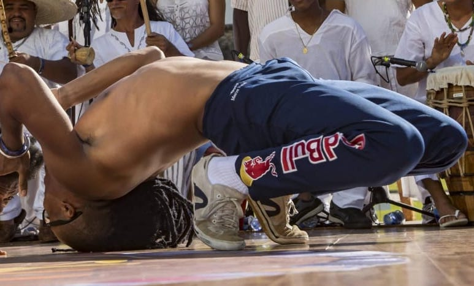
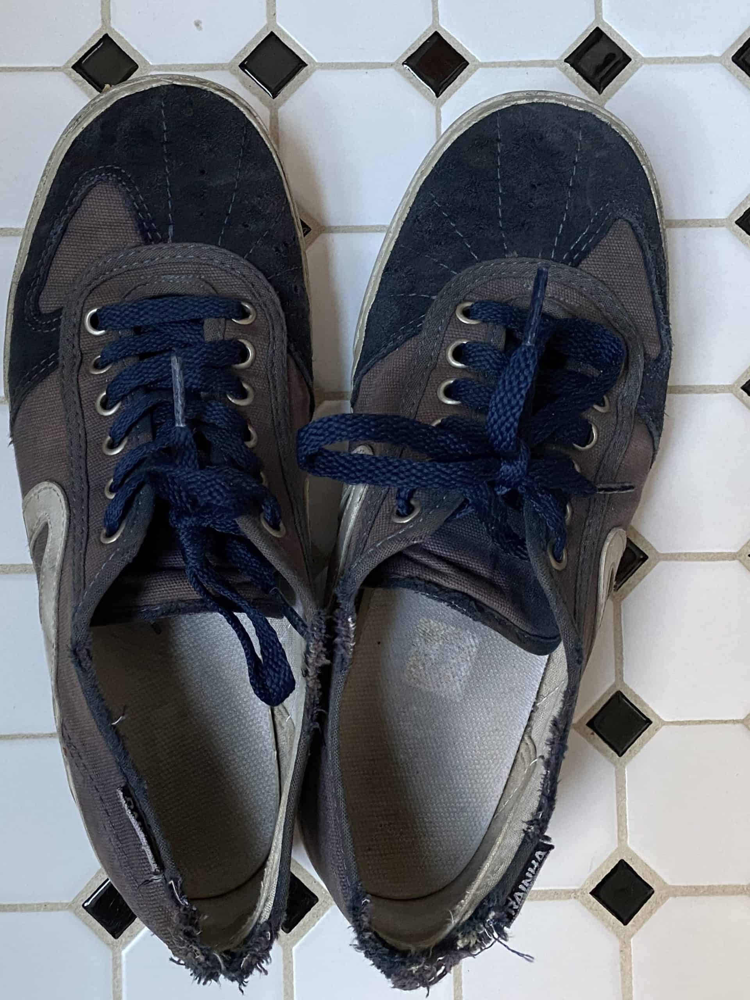
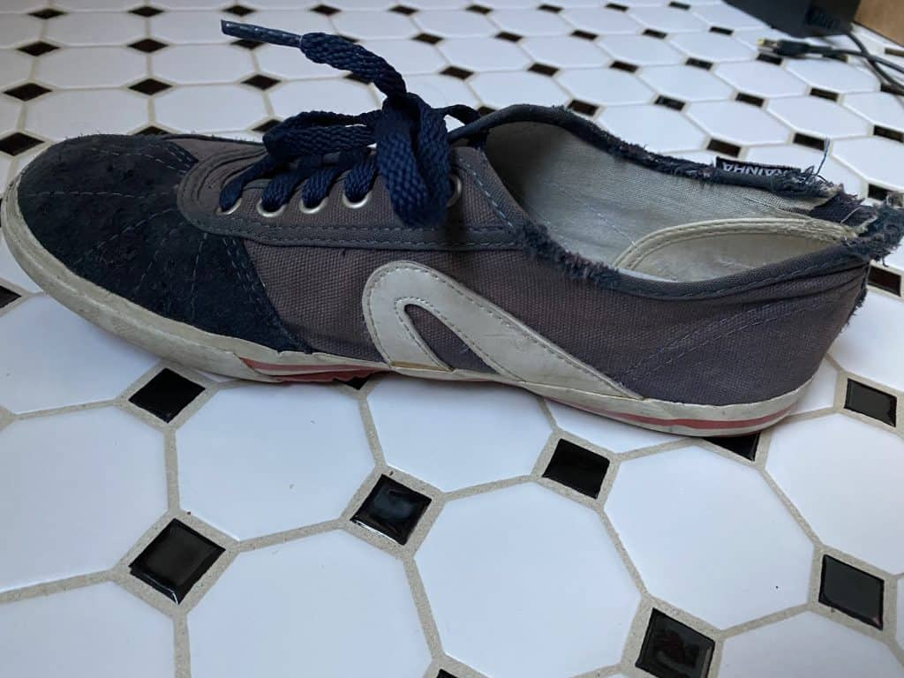

## Are Rainhas made for Capoeira?

Common misconception about Rainhas is that they were made for Capoeira.

The Rainhas VL2500 is a shoe that was originally made for professional volleyball players (The "VL" standing for "Volley"). From the 1950's till the 1980's, The VL2500 grew in popularity when Rainha started mass production and the VL2500 became more affordable to the general public.

In the 1980's, Rainha VL2500 exploded in sports like Futsal (indoor soccer), basketball, volleyball, and others. The connection with Capoeira comes primarily from the accessibility of the Rainha shoe for Brazilians growing up int he 70's, 80's, and 90's. A young Brazilian could purchase a Rainha VL2500 for 30Rs, a good price at the time.

Since the 90's, Rainha VL2500 has become more of a casual shoe that has since been adopted by the Capoeira community. In Capoeira, it's very common to see the Rainha used. This is partly because of the popularity of the shoe, its price, and its increasing adoption by Capoeiristas around the world.

Want to join the thousands of Capoeirsitas that have a pair of Rainhas? Check out a link to see different sizes and styles. Rainhas come in a lot of awesome colors!

[View Capoeira Shoes](https://zumzumcapoeirashop.com/product-category/rainha-capoeira-shoes/)

If you're looking for an in-depth review of the other shoe options for Capoeirsitas, here it is. I created this review after hundreds and thousands of cumulative hours of training in each shoe option. Each shoe option has its pros and cons. Having a shoe for Capoeira is very important for Capoerisitas as you won't always be training or playing on a nice wood surface or mats.

👟 [The Best Shoes for Capoeira](https://dendearts.com/the-best-shoes-for-capoeira/)

## Should you buy Rainhas for Capoeira?

As I mentioned. Rainhas are iconic for Capoeristas. They have become nearly as iconic as the berimbau. **The main reason is that they are good shoes for Capoeira**! The combination of good style, comfort, quality, and performance makes Rainha a great choice for Capoeiristas.

This does not mean Rainhas are the best shoe for you either. There are several shoe options that may work better for you depending on your needs. Below, I will highlight some of the advantages and disadvantages of Rainhas for Capoeira.

## What makes Rainhas a good shoe for Capoeira?

Rainhas are good for Capoeira because they are:

- Lightweight
- Have minimal padding (yes, this is a good thing!)
- Minimal heel drop
- Last for a decent amount of time
- Great design!

Rainhas are not as light as the more expensive competition, but they are light enough where it is not an issue. The shoe has minimal padding, which allows you to feel the ground better. This is critical as you move backwards, forwards, laterally, and diagonally. The heel drop is minimal, which is VERY important for Capoeira. A heel drop is the distance from your heel to the floor. Many basketball shoes have massive heel drops that make your sneakers look like pseudo high heels.

Rainhas also have good durability. The rubber soles take a while to wear out and can last for several months. Lastly, the design is very good!

Rainhas are a semi-minimalist shoe. Minimalist shoes are shoes that interfere as little as possible with your natural foot mechanics. The way you walk with Rainhas will loosly resemble how you walk while barefoot. If you're unfamiliar with minimalist shoes, it might not be clear why these factors are so important.

Minimalist shoes are great because they help connect your feet to the ground, improving your proprioception, spatial awareness, and coordination with the ground. Minimal padding and a minimal heel drop are two very important factors in this area. Rainhas are not "pure" minimalist shoes, however they do have some elements of minimalist shoes that make them very effective for Capoeira.

For the price point, Rainhas get solid marks all around.

## What are the drawbacks of Rainhas for Capoeira?

- Heavier than the competition.
- Narrow toe box
- Not as minimal as newer minimalist shoe designs
- Difficult to buy outside of Brazil? (not anymore!)

The Rainha is an older shoe, invented in the first half of the 20th century. The canvas material gives it an authentic look, but it's also somewhat old fashion. Today, shoes are made of all kinds of high grade materials that Rainha struggles to compete with in weight. You can easily find shoes that feel as light as a feather, which makes the Rainha feel heavy by contrast.

The narrow toe box is perhaps the biggest draw back. One way to avoid this issue is to loosen the laces, however some people may have a bigger issue with this design than others. In general, a wider toe box provides more space for the toes to splay, giving extra balance and stability to your movement.

All other drawbacks with the Rainha VL2500 are the smaller quality of life issues that may or may not be a big issue depending on your preferences. Newer shoes are more minimal, have better air circulation, have stronger soles, are more flexible, etc. These small differences improve your quality of life, however, they will probably not make or break your desire to buy a pair of Rainhas.

### Rainhas available online

For years, the worst part about Rainhas was that it was impossible to buy if you were outside of Brazil. However, today there are places you can buy Rainhas online.

Capoeira shoes has tons of style available. As a side note, they helped sponsor this post, but I did my best to be as neutral and helpful to potential buyers as possible. My hope is that everyone who buys this shoe, knows exactly what they 're getting. And that people who wouldn't like this shoe can find a good alternative.

[View Capoeira Shoes](https://zumzumcapoeirashop.com/product-category/rainha-capoeira-shoes/)

## Rainha construction

<figure>

<figcaption>

Rainha after about 5 years of heavy, then light use

</figcaption>

</figure>

The body of a Rainha VL2500 is made of canvas, with suede at the toes. The sole is made of a hard rubber, which does a pretty good job of providing grip, while making it easy to spin on the ball of the foot. The hard rubber at the tip of the shoe is good kicking, though it adds more to the shoe's style, than to its function.

A typical Rainha can last a long time. I have Rainhas that have lasted for a couple of years before the rubber sole started to wear thin. Once this happens, you might find yourself sliding around a bit more than you would like. If this starts to happen to your Rainha, a good idea is to start using it as a casual shoe and get an extra year or even 2 out of it.

The stitching will last for as long as you have the shoe, though it is common to see fraying after extended use. In general, the construction of Rainhas is very good and worth the price.

## Summary

Rainahs are a solid shoe with no major drawbacks. The price is good. The quality is great for Capoeiristas. I personally love that you can go to a roda, and directly afterward head to the afterparty wearing your Rainhas. Every Capoeirista should try, if not outright own a pair (at least 1!). They are fun shoes that you will no doubt enjoy wearing.
