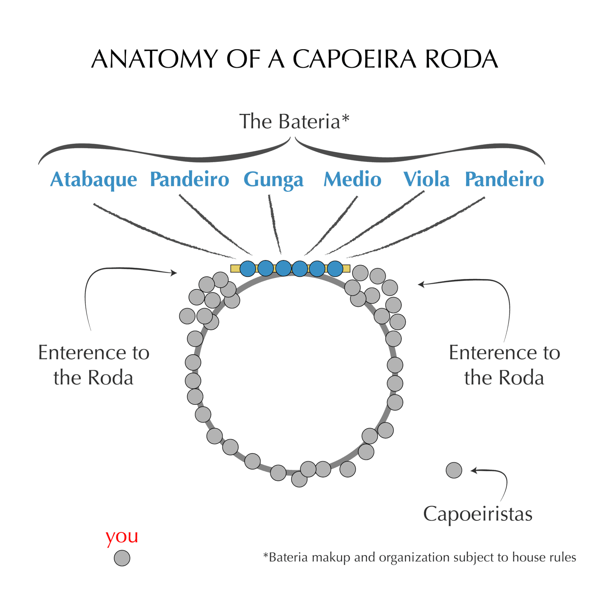

## The Capoeira Roda!

To the naked eye, a roda Just looks like a bunch of people crowding around in a circle the same way kids do when there's a fight. Everyone's trying to get in to watch and everyone’s making a bunch of noise. It can feel like a crazy mess, and that is the topic of today. Breaking down the anatomy of the roda.

I made this fun graphic of a Capoeira roda. You can see that the roda is made up of three parts. The actual circle made by the crowd of people/capoeiristas, the bateria, and the entrances on either side. Below I'll break down the roles of each part.

## THE CROWD

The people in the roda clap, sing, and generally make sure that the roda is a circle. There's nothing uglier than an egg shaped roda. Participation is key to creating good for the roda so try not to be shy and join in on the clapping and singing. This is probably weird for new people, but it's a great way to get out of your shell without really standing out.

## BATERIA

The bateria is the group of capoeiristas that play music for everyone. The bateria is lead by someone, usually the highest ranking person or the host of the roda, and that person usually plays the Gunga(the berimbau with the largest gourd). The bateria sets the tone for all the capoeira games played.

## ENTRANCES

Lastly, there are the entrances, which is pretty self explanatory. You don't enter from the far side of the roda, that would be like entering someone's house through the window with muddy boots. Show good manners by entering through the two entrances!

All these different parts work together. Without one you don't have a roda. There's lots more that goes into a roda, such as how to lead a roda, when to enter, how to play to certain rhythms, and that will be covered in future posts.

#mc\_embed\_signup{background:#fff; clear:left; font:14px Helvetica,Arial,sans-serif; } /\* Add your own MailChimp form style overrides in your site stylesheet or in this style block. We recommend moving this block and the preceding CSS link to the HEAD of your HTML file. \*/

## Join us in the Roda!

\* indicates required Email Address \* First Name \* Last Name \* (function($) {window.fnames = new Array(); window.ftypes = new Array();fnames\[0\]='EMAIL';ftypes\[0\]='email';fnames\[1\]='FNAME';ftypes\[1\]='text';fnames\[2\]='LNAME';ftypes\[2\]='text';}(jQuery));var $mcj = jQuery.noConflict(true);