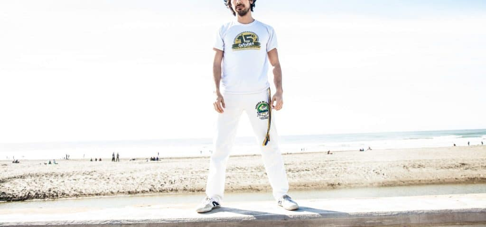
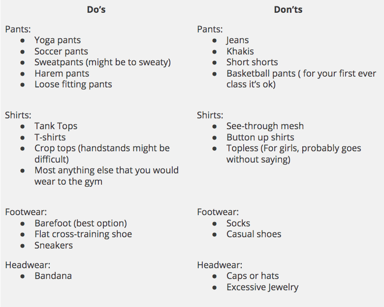
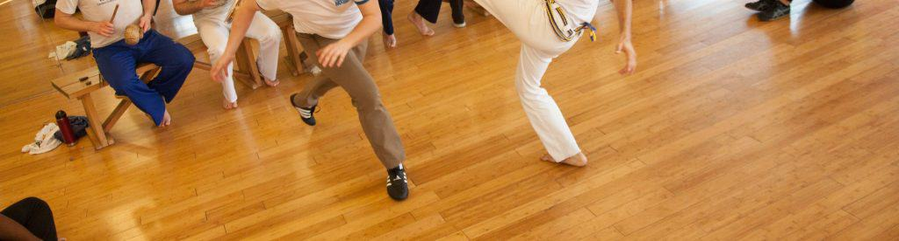

After training Capoeira for over 10 years I think I’ve seen it all. I’ve seen people come to class with boots, socks, jeans, and the baggiest modern dance clothing you’ve ever seen. If you’ve never trained capoeira before, then you might be wondering before your first class what to wear.  

**The best thing to wear to Capoeira is a Capoeira uniform, which consists of a pair of Abadás and a group T-shirt**. Abadás are usually made of polyester and stretch very well. They will have the logo of the group you train with and will hold your belt/chord in place in its belt loops. Capoeira academies will also have matching white t-shirts that include the logo of the group. This combination is called the “_uniforme_” or uniform.

<figure>

<figcaption>

Capoeira Uniforme (Abadas and school shirt)

</figcaption>

</figure>

In most scenarios you will need to wear your school’s uniform to every class. Some schools are less strict about their uniform requirements, and might allow you to wear non-white Abadas. These pants are called calças and come in various colors and styles. If it’s your first time going to Capoeira and you don’t have a full uniform, or any Capoeira clothes, there are several alternatives.  

## What to wear to Capoeira class if you don’t have a uniform

Imagine if it’s your first class and you of course don’t have a pair of Abadas or a group uniform. Here is a list that you can use to Here is a list of things you can wear, and some things you’re advised not to wear.

I'm not sure why, but some people have come to class wearing jeans and a button up shirt, this is highly discouraged. Capoeira requires a lot of movement, and wearing something like jeans and a button up shirt can really hinder your movement. On the other end of the spectrum, dancers have come in wearing loose crop tops and baggy harem pants. This might be silly in a martial arts context, but is perfectly acceptable, as long as you can move freely. Basketball shorts are one of those things that people start to get on the fence about once someone has been training for a couple weeks. Capoeiristas traditionally wore long pants, so wearing shorts is generally frowned upon after the first couple classes.  

Some schools are very strict about their students wearing a uniform. They require their students to wear a uniform to class every single time. This includes the full uniform with Abadas and a group t-shirt. Other groups may be more lenient and allow students to wear some of the options in the list above. However, it is very common for these groups to have certain days when they are required to wear their uniform. Some schools may do this the last class of the month or a certain day in the week. Either way, having a uniform is not something you can duck away from.  

Not having at least one full uniform can hinder your development as a Capoeira practitioner. Any sort of event you go to will require a uniform except in some rare occasions. If you visit another group, it’s considered good manners to wear your uniform. Students who don’t wear a uniform when visiting another group are usually seen as very new and don’t “know any better”. However if you’re a student who’s been training for a few months and doesn’t wear a uniform to someone else’s class, it would be like wearing a tank top to your friend’s wedding.  

## Where to buy Capoeira uniforms

Let’s say you’ve been training for a couple weeks and you think you really want to keep training Capoeira. First off, congrats, you’re a person with amazing taste in hobbies and physical pursuits. Second, getting a uniform is pretty simple. To buy a uniform, you will have to go to your teacher. In all likelihood, your teacher purchased the uniforms for the Capoeira academy in Brazil and brought them over in a suitcase. This might make getting multiple uniforms tricky as there will likely be a limited supply. Some teachers do have suppliers though, so if this is the case for you, you probably won't have this problem.  

What about Amazon and other online purchaser? You can purchase blank abadas from online stores. They do exist. From my experience, the quality is all over the place. Some are good and work well, while others have very low quality standards, fit oddly and are generally a purchase filled with regret. The one rule with purchasing Abadas online is that your teacher will likely not recognize them as the official uniform. Even if you purchase a patch of some kind to Macgyver a uniform with the logo, a teacher will likely tell you that it is not acceptable. Some people have used this method to transition from one group to another. They place a patch of the logo of the new school over the logo of the old school, but this is more a temporary solution until you get a uniform. In general, abadás not purchased from your teacher or group are not considered a _uniforme_.  

## Cost of a Capoeira Uniform

A Capoeira uniform will cost you somewhere around $85-$110 depending on the teacher, location, etc. This includes the group shirt with the logo and a pair of Abadas with the group logo. A pair of Abadás alone will cost about $50-$85. A chord may come with the uniform, but there are groups that choose not to have any chords for their beginner students. In these cases, a student’s first chord is earned at their first batizado (a graduation ceremony/event).  

The cost of the T-shirt is more or less what you might expect. About $20-$30. Group T-shirts are not usually manufactured in Brazil and vary in quality depending on how much the cost is to produce a shirt. Some teachers decide to buy higher quality shirts, while others may not see if as a big issue and will choose the cheaper option.  

Abadás, as I mentioned, are manufactured in Brazil and brought over by the teacher in many cases. These pants are generally good quality, although there are plenty of poor manufacturers in Brazil. You can see about the quality by asking the teacher to see a pair of Abadás. These pants are generally cheaper, not because their quality is worse, but because the manufacturing and labor costs are much cheaper in Brazil. In addition, the US dollar (sorry if you live somewhere else) is very strong right now, and the Brazilian Real is weak.  Some teacher do have suppliers here in the US. These pants are generally more expensive, but the quality is consistently good. As mentioned before, the chord usually does not cost money. If you will receive your first chord at your first batizado, then the cost of your first batizado.  

## Uniform for Capoeira Angola

- 

Lets throw away everything I just said to talk about Capoeira Angola. Up until now, we’ve been discussing the uniform for Regional and Contemporânea groups. These are by far the biggest styles in terms of the number of students. Angola is another style of Capoeira that is considered much more traditional and has a completely different style of dress.  

In Capoeira Angola, Capoeiristas wear white or khaki colored pants with a white t-shirt. The white t-shirt may include the logo of the group, however the pants do not have any logo. The pants can be any old pair of khakis that you can find at Target, Walmart, etc. Additionally, Angoleros are required to wear a belt and shoes. The style of shoe may vary and you can ask the teacher if they have any preference, but a casual shoe will be just fine for your first class. The last thing to mention is that while practicing, a Capoeirista must tuck in their shirt. If you have your shirt unticked, the teacher may ask you to tuck it back in before you continue.  

There are some variations on what Angola schools allow. For example, in some Capoeira Angola schools, the color of the practitioners pants must black while the shirt must be yellow. Head pieces are allowed some times as well, but this depends on the teacher.  

At the end of the day, the person who makes the ultimate decision on what a person can wear in their class is the teacher. It’s always a good idea to reach out to them and ask what acceptable, but if this post should give you a general understanding on what is acceptable and unacceptable. Good luck on your first Capoeira class!
