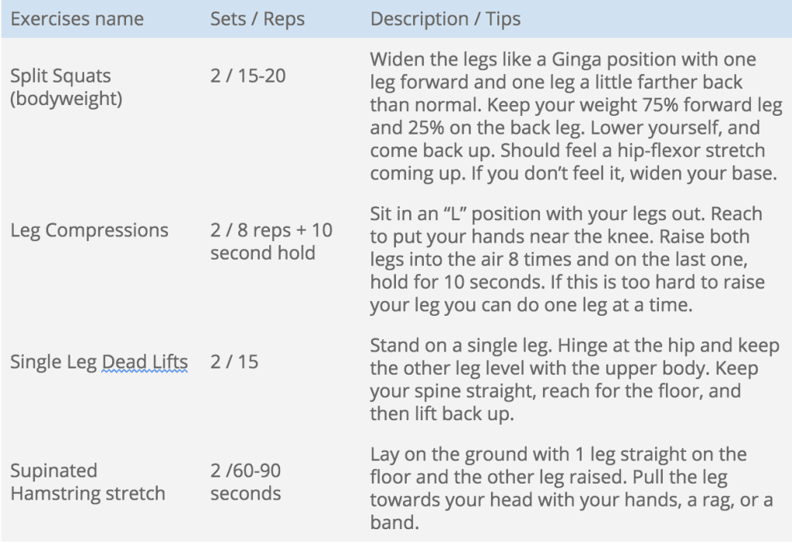

One of the most common injuries for someone training Capoeira is knee pain when going into deep flexion(deep bend at the knee), specifically Negativa. This movement is widely used to displace yourself around the Roda, and is great for transitioning into various ground movements.  The knee is a complex joint, but it is possible to get an idea of what the dysfunction is, how to avoid it, how to modify your capoeira, and how to go about the healing process. 

If you have pain while doing negativa, it’s likely that you have some sort of tendinopathy in the meniscus. Tendinopathy refers to any tendon disorder that involve pain, swelling, or impaired function. If you’re unfamiliar with the meniscus, it’s a pad of cartilage that provides cushion between the shin bone and thigh bone bone. Tendonitis commonly makes people think of inflammation, but that’s not always the case. It may also refer to a tear in the meniscus, which may or may not include inflammation of the tissue. If you do have an injury in the meniscus, you will need to go to a physical therapist, modify your movements while training, and possibly buy a knee brace. Depends what your physician recommends!

## Why do meniscus injuries occur in Capoeira

In general, meniscus tears happen for two reasons. The first reason is that the knee is twisted enough to cause a tear. It is unlikely that negativa is the cause of this kind of injury as there is little rotation in the movement. It is possible that another Capoeira movement can cause tears from excessive rotation, but it’s not necessarily the case. The second reason deals more directly with the physical demands of doing a negativa. **Negativa does put a lot of pressure on the knee in full flexion (flexion = bent), and if the pressure exceeds the individual’s capacity, it can lead to a meniscus related injury.** This makes a lot of sense because we are the weakest and feel fatigue fastest at our end ranges of motion. 

Negativa puts us into a mechanically disadvantageous position. In a negativa,  you sit on your heel with you knee facing forwards and the other leg straight in front of you. The bent leg holds the weight of the body and at the same time it pushes you upwards and forwards. Although this might not be THE reason we have a meniscus related injury, negativa can definitely aggravate an existing injury with its explosive pushing off of the bent leg. 

## Negativa is not a “bad” position for our knees

**Negativa is not by definition, a bad movement for your knees, and anyone who tells you this knows very little about the body.** It can be very tempting from what I laid out in the previous paragraph to believe that negativa is a movement that should be avoided. _If I’m never in negativa, then I can never be injured in this way, correct!_? Unfortunately the logic doesn’t work. Low gait movements like negativa and many others make your joints strong by training you in positions your rarely go to. The point is to train your body incrementally so that you can build strength where you need it without destroying connective tissue faster than it can heal. 

Training a joint is just like training a muscle. You can break down the tissue and during the healing process, the tissue will grow back stronger. However soft tissue like the meniscus and the smaller muscles surrounding it have a poor blood supply as compared to muscle groups like your quads with a larger concentration of capillaries. That’s why your muscles can heal at a faster rate than your joints. Treat your joints with special care! Push them, but not too hard. As you do so, the joints will become stronger to the point that you can do more advanced movements pain free. However this does not happen over night and will require a steady diet of training.

## Using a Knee Sleeve to Prevent Injury

Nobody knows your body as well as you do. **If you feel any instability or a feeling of insecurity in a position like negativa, then it might be worth it to get a knee sleeve.** These soft braces are used as a preventative measure against injury. They work by providing compression and a degree of support to the knee. Please don’t think that just because you have a knee brace that you’re invincible. However a knee sleeve will allow you to push you knee a little further and train in positions that you would not be able to otherwise. The advantage of this is that you can slowly train your body to take loads that it would not be able to do without the sleeve. The goal of a sleeve is of course to transition out of it - something that few people do. If you’re one of those people who has been using a sleeve for a year or more, then it is likely that you need to strengthen the knee so you no longer need the sleeve. **At the end of this article I give some exercises that physical therapists provide that will help bullet-proof your knee!** 

If you are looking to buy a brace I did a review of a few braces and the ones I am most fond of. You can find my knee sleeve of choice [here](https://dendearts.com/resources/training-rehab-equipment/).

## How to modify your Capoeira to avoid further injury

One of the most common ways to modify your negativa so you don’t feel pain is to do your negativa with a flat foot. The flat foot will provide a greater degree of stability and lessen the pressure on your knee. You can also do your negativa with your knee less flexed (bent less), keeping your butt a little higher off the ground. This will engage stronger muscle groups and provide superior support to the knee. If these modified negativas still aggravate your injury, then avoid negativa altogether. 

In cases like this  it would be better to seek professional advice and avoid negative until your knee is strong enough. I advise the same thing if your injury has been lingering for more than a few months. This tells me that the injury is either too severe to repair on its own, or you’re doing something that is not allowing the knee joint to heal. In general modifications work best if you feel like you hit your limit during a training session. This might be after doing negativa 50 times or 5 times. It depends on your own personal abilities, but it is also incumbent on your to swallow your pride and modify your movements to something that is less taxing on your knee. 

## How to train with a damaged knee

The beautiful thing about Capoeira is that there is so much material to cover. If you do have an injury in your knee, it can be a great opportunity to train music, instruments or your upper body. I have been injured in my knee before and I used it as a time to work on my ponte(bridge), my upper body strength, and music. These are all options for someone who has issues with their knee. Be resourceful and think about other areas that you may have been neglecting. If you think your singing can be stronger, then work on that. If you think you need stronger arms, then work on getting stronger arms. Capoeira is so vast in it’s practice that you won’t run out of things to do by the time you recover. 

Don’t stop going to class either. If you think you can not do a sequence because of your knee, then do your therapy exercises in class. I’ve seen some people do this and have always had a deep respect for people who show their resilience and intelligence. They’re resilient because they keep coming back to class, but they’re intelligent because they know what they can or can’t do and work to get back to full strength. On top of that, they let other people know that getting an injury isn’t the doom of a Capoeirista. Injuries are very normal and happen to everyone. 

## Exercises to heal your knee

If you have pain while doing negativa, then here are some exercises recommended by my students physical therapist for his meniscus tear. I thought the exercises were very good and wanted to make sure other could benefit from that knowledge. Make sure to do these 3 times a week and don’t let up. If the movements are painful then you might need to do further modifications to take additional pressure away from the knee. Again, consult a professional before doing anything on the list. 

