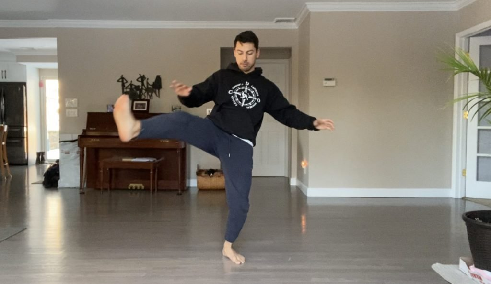
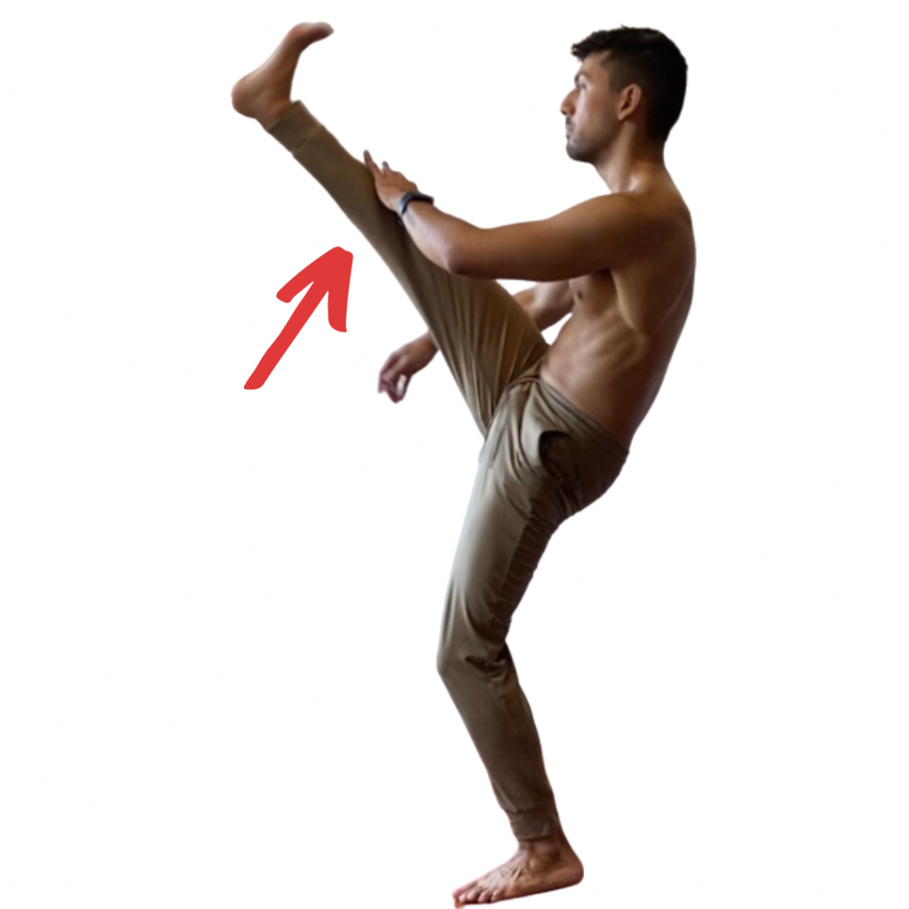
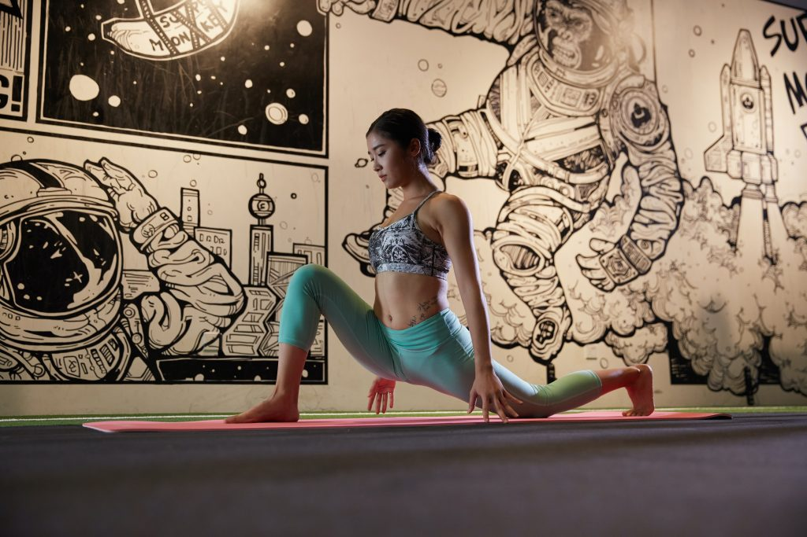
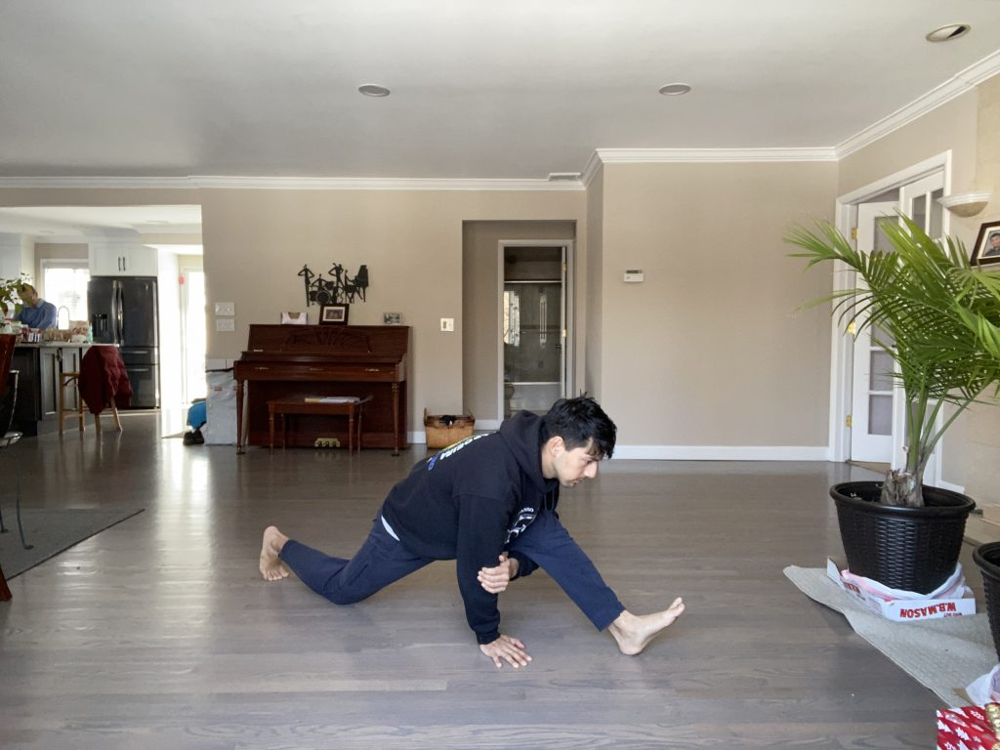
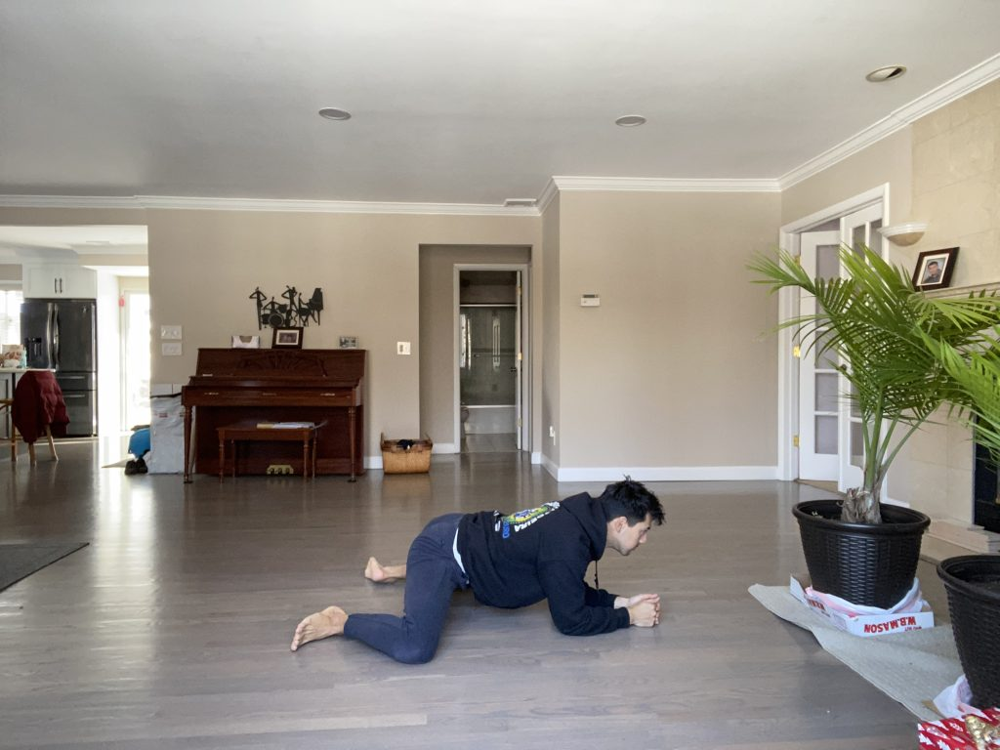

The best warm up for someone about to train kicks is a combination of mobility work and dynamic flexibility. These two protocols improve stability, work on dynamic range, and improve power via a stronger kinetic chain.

## Kicking is harder than punching

As any martial artist and they'll tell you that kicking is mechanically more demanding to learn. Maybe not to master, but definitely to get the basics down. With our modern lifestyles requiring so much sitting time, our ability to kick is further limited. Many people develop tight hip-flexors, hamstrings, and poor postural habits because of this.

These exercises below are meant to prepare the body for the explosive movements kicks by doing the following...

- Improving stability throughout the kinetic chain
- Increasing dynamic range of motion
- and improving general flexibility (for the end of the workout)

## Hip rotations

Single leg hip rotations are a fantastic way to build stability along the base leg and into the hips. One leg will sweep from the outside to the inside, like a crescent kick. This "kick" will be slow, with a straight leg, and you need to control it through the entire range of motion. Next we reverse the kick, moving from the inside to the outside. Do not let the foot touch the floor.

Might look and sound easy, this is a deceptively difficult and effective protocol to prepare the legs and hips. As the base leg engages to provide stability, it slowly wakes up the muscles in the lower body. These are all the same muscles you would use as you stabilize for a normal kick, meaning that our approach to warming up is very similar to what we want to do. And that is very good.

## Dynamic stretches

**There is a debate regarding the kind of stretching you should do before any physical activity. There is pretty good research on this, and the science says that dynamic is preferred before a workout.** Passive stretching is better for after a workout.

There are four kinds of dynamic stretches we want to do before our workout.

- Straight Kicks - up and down in front of the body
- Crescent Kicks - Upwards going from outside to inside
- Reverse Crescent Kicks - Upwards going from inside to outside
- Side Kicks - Swinging leg to the side

The crescent kicks are similar to the warmup in the previous section. So what is the difference? In the first section we want 100% control through the whole range of motion. These kicks are meant for you to use your range of motion dynamically. It is possible to pull a muscle doing dynamic stretches so you want to be conservative with the intensity of these kicks. As long as you start slow you'll quickly warmed up as you go - meaning you can also rev up the intensity.

These are tried and true martial arts exercises that you see in many schools including Capoeira or Taekwondo. They are very effective at teaching the body to control powerful and dynamic kicks.

Hint: While doing the side kick swings, make sure your heel is pointing towards the direction you are kicking.

### Common mistakes - Compensation for poor range of motion

It is very common to see people throwing their heads forwards and rounding their backs as a method to increase the height of the kick they throw. This is where you need to check your ego and kick without these extra movements. The head should stay relatively in line with the rest of the body and the back should stay relatively straight. Some bending is normal.

### How to plant the base leg

We covered the fact that during the side kick, the heel of the base leg should face the direction of the kick. During the other kicks, such as the crescent kicks, the base foot faces forwards with a slight external rotation. Our base foot should not be completely straight nor externally rotated too much. This provides a bit more stability, and avoids excessive torquing at the knee.

### Slowly ramp up intensity

If you are feeling very stiff and throw these dynamic stretch kicks with too much force, you risk hurting yourself. Take it easy and feel out how the first few kicks feel. Once you start feeling more comfortable, then you can apply more strength and power to these kicks. The only person who can gauge this is you, so make sure to pay attention to your body.

At this point I begin kicking drills. The last section provides several stretches meant to improve flexibility. Ending our training with stretches aids in the recovery process and reinforces gains made to improve our range of motion.

## Hip flexor, hamstring, and groin stretches

Stretches ideally take place at the end of your workout. These three stretches target the three areas where the majority of people have the most problems.

- Hip-flexors - Lunge (Chest up with knee off the floor)
- Hamstrings - Lunge (chest down. knee on the floor)
- Groin - Frog pose

### Hip-flexors Stretch

There are two ways to do this stretch. The first is with the knee on the ground and the chest up. Placing the knee on the ground helps remove weight from your knee, which can be uncomfortable. Keeping the knee on the ground also decreases the intensity of the stretch. Another way to regress this hip-flexor stretch is to lower the chest a few degrees. By bringing up the chest, you will creating a lot more tension on the hip-flexor. Hold this position for 30 seconds to a two minutes.

The second method is to hold your lunge with you knee off the ground. This variation is more intense in part because of the extra weight you will need to support. If you feel you need an even deeper stretch, you can bring the legs further apart and push the knee of the forward leg further forward. Another tip to making this stretch more intense is to tuck the tailbone in. Think about a scared dog. This will rotate the pelvis in a way that will increase the stretch at the hip-flexor area.

### Hamstrings Stretch

There is a reason you don't want to stretch your hamstrings the traditional way of reaching down to the floor, touching your toes. In most cases people worry more about touching their toes, than actually stretching. This breeds terrible habits, and a false sense of progress let on by compensations that make it look like you're flexibility is better than it is. By contrast, stretching the hamstring from the lung position avoids compensations, activates the antagonistic muscle groups, and allows the hamstring to relax in the stretch.

The key to this stretch is to start from a lunge position with the knee on the floor as shown in the photo. There are three steps to this stretch...

- From the lunge we want to push the front leg forward until you can't go any further (hold for 20-30 seconds)
- Next push the heel of the front foot down in the floor. (hold for 20-30 seconds)
- Last, retract the hip of the front foot thereby further stretching the hamstring of your front leg. (hold for 20-30 seconds)

### Groin Stretch

The last area critical to stretch is the frog stretch. Many people complain that holding this position hurts the inside part of their knees so it's advisable to hold a cushion or something soft under your weakling knees.

Holding this stretch is the simplest way to do the stretch, and if you're just starting out, then it's a perfectly good way to get started. However if you want to get the most our of this position, the best way is to follow the following steps...

way to do so is to contract the groin muscles and push your knees into the ground. Hold this position and then try to lift your knees into the floor. Doing so will pull your knees further apart, deepening the stretch. Hold each positions for 20-40 seconds each.

- Start by holding the stretch for 30-60 seconds
- Push your knees into the ground, activating the groin muscles for 20-30 seconds
- Last, try to lift your knees off the floor (this won't happen of course), activating the glutes for 20-30 seconds.
