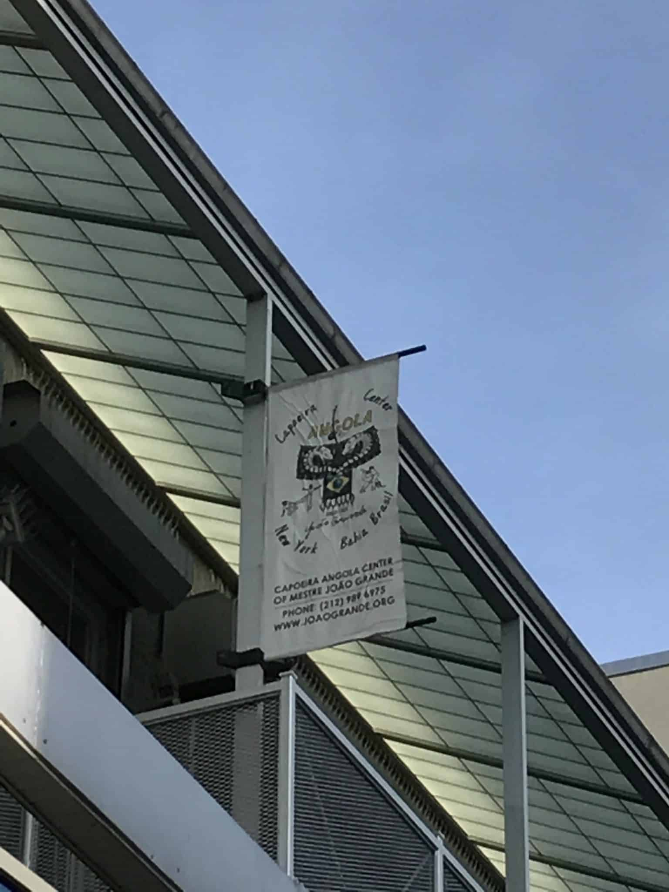
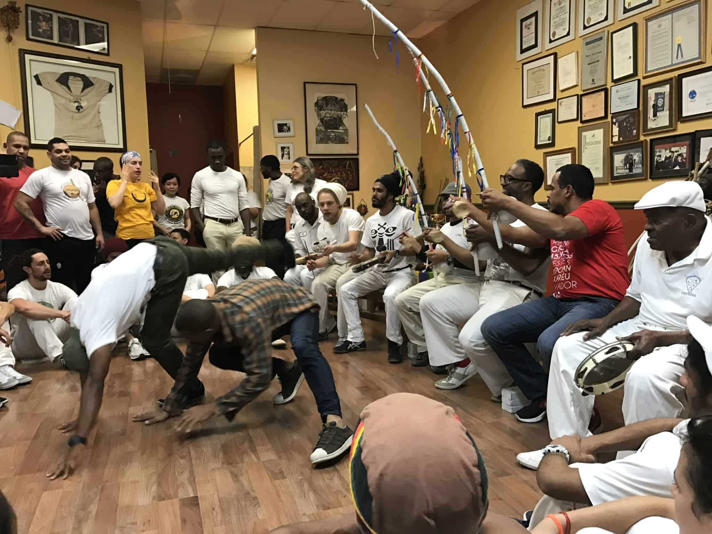
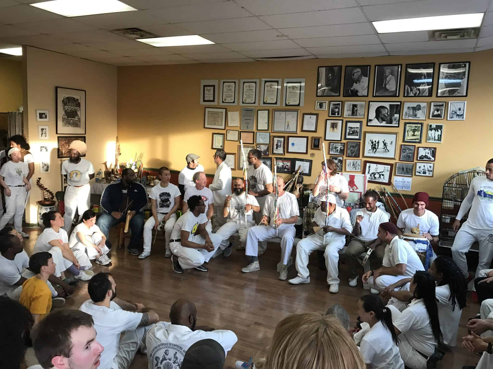

## A LIFE OF CAPOEIRA

Mestre João Grande is a living legend, a living legend that lives in New York City. If you don't know who Mestre João Grande is, he is one of the two most important students of Mestre Pastinha, the creator of our modern Capoeira Angola - a style of Capoeira tha tries to connect with the roots of Capoeira. Mestre João Grande(MJG) was a huge proponent of Capoeira Angola in New York and two weeks ago was his 85th birthday.

I won't be going over the history on this legend, that's for another time, but you can check out this [video](https://www.youtube.com/watch?v=EHCAzxsB8LY) of him from back in the day (in the blue jeans).

## VISITORS

I wasn't sure what to expect, but everyone in the area came to pay their respects. Many capoeiristas live in and around New York and many of them came to say happy birthday. A lot of times we can get bogged down with life that we don’t take the time out to go visit some of the legendary figures we have in Capoeira. It’s kinda like visiting your grandparents. Do it! Because you won’t be able to one day. In case you were curious, here is the information for Mestre João Grande’s [academy](http://www.joaogrande.org/).

## MESTRE JOÃO GRANDE

I don't really know what it's like to be so connected to a single purpose. MJG is singularly focused on Capoeira. He plays in the bateria, he watches the games, and he lives and breathes the art. Every day he goes to his academy, up 3 stories and sticks around all day until he goes home at night. Check below for photos of the event and the 3 flights MJG walks up to get to his academy.

## BIRTHDAY PARTY

Like any good birthday party, there was cake, food, and partying. By partying I mean capoeira of course. Even MJG got down, playing a game with one of the teachers. That was nuts to see. A man in his mid 80’s moving and grooving.

## VISIT AGAIN

I had a great time visiting MJG academy and I hope to do so more in the future. To tighten up my Angola game and to learn from one of the oldest and well respected Mestres alive today.

HAPPY BIRTHDAY MESTRE JOÃO GRANDE!!!

    #mc\_embed\_signup{background:#fff; clear:left; font:14px Helvetica,Arial,sans-serif; } /\* Add your own MailChimp form style overrides in your site stylesheet or in this style block. We recommend moving this block and the preceding CSS link to the HEAD of your HTML file. \*/

## Join us in the Roda!

\* indicates required Email Address \* First Name \* Last Name \* (function($) {window.fnames = new Array(); window.ftypes = new Array();fnames\[0\]='EMAIL';ftypes\[0\]='email';fnames\[1\]='FNAME';ftypes\[1\]='text';fnames\[2\]='LNAME';ftypes\[2\]='text';}(jQuery));var $mcj = jQuery.noConflict(true);
