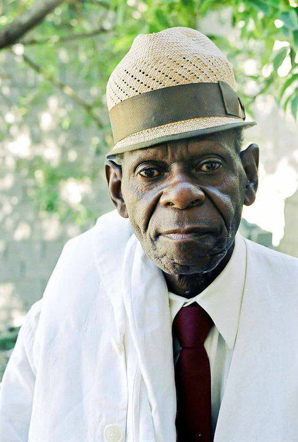

Here's the formatted markdown document according to the specifications:

---
title: "How Capoeira classes have changed (1900-2020)"
date: "2020-12-17"
categories: 
  - "capoeira101"
  - "history-culture-travel"
coverImage: "M.-Leopoldina.jpg"
layout: "blog-post-layout.njk"
---

<table class="capoeira-table">
    <tr class="header-row">
        <th>Portuguese</th>
        <th>English</th>
    </tr>
    <tr>
        <td>Sinta a música. Sinta a música. Sinta a ginga</td>
        <td>Feel the music. Feel the music. Feel the ginga</td>
    </tr>
</table>

After reading half a dozen books on Capoeira and listening to some of the older teachers talk about the glory days, it's become clear that **the way** **Capoeira is taught has changed dramatically over the years.**

[Rest of the document remains unchanged]

<figure>

<figcaption>

Mestre Leopoldinha 1933 - 2007

</figcaption>

</figure>

[Remaining content stays exactly the same]