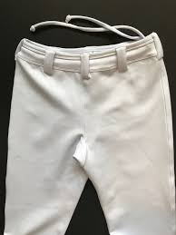
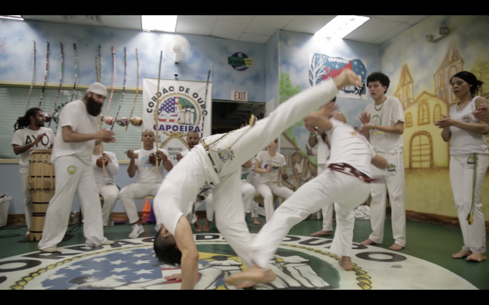
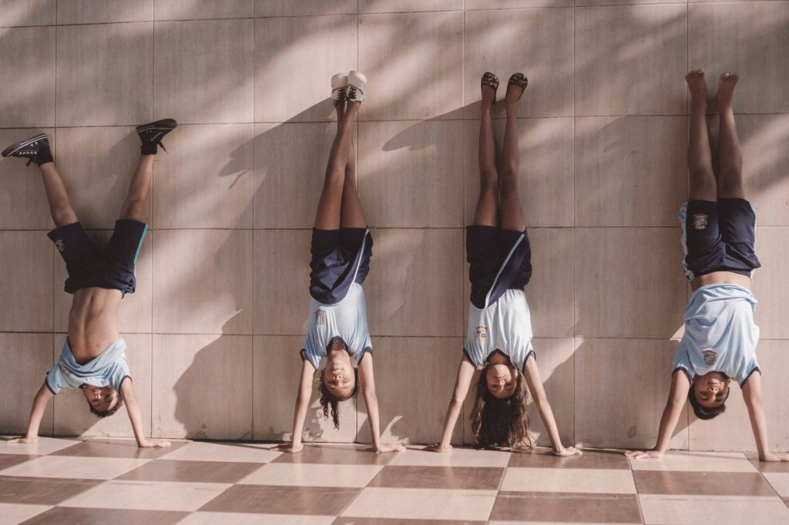

In general, **Capoeira classes for adults cost anywhere from $80 - $175 per month. For children, cost per month is approximately $60 - $125. The price per class will depend on how often you go to class, your location, and the price set by the owner.**

When the monthly membership is higher, make sure to go to as many classes as possible to get the most for your money. You might be paying more in total, but per class you might actually be paying the same as the lower priced memberships!

For example:

Going to class twice a week with a monthly membership of $100 is $12.5 per class.

Going to class three times a week with a monthly membership of $150 is also $12.5.

Just like any activity, memberships are not the only cost. There are other things like events, clothing, and equipment to consider.

## Does more expensive mean better quality classes?

Expensive does not mean better quality. The most important thing to look into is if the teacher's instruction is clear, the class is safe, and you enjoy what you are learning. Teaching is a skill and cost is not always associated with being a better teacher.

### Look for good teachers not just the best of the bunch

A common mistake people make is believing that the best or highest ranking Capoeirista is also the best teacher. There are many reasons why this might not be true. Reasons an amazing (or any) Capoeirista may not be a good teacher include:

- An inability to relate to new students
- Spending more time on personal development as a competitor and not as a teacher
- They do not break down the intricacies of movements/scenarios/etc.
- Inflated sense of other people's abilities

If you are someone who learns quickly by watching, then this may not be an issue for you. However most people will benefit from instructors who have developed their skills as educators as well as Capoeiristas.

## How much does a Capoeira uniform cost?

- $50 - $100: Uniform pants (Abadas)
- $60 - $100: non-uniform Capoeira pants
- $20 - 35: Uniform shirt
- $60 - $75 : Full uniform for kids
- $0 - Chords can not be bought, but they are given during the Batizado (graduation ceremony)

A Capoeira uniform consists of a pair of pants, a shirt, and a chord. Schools differ on when wearing your uniform is required. Some schools require you wear your uniform at every practice. Others only require uniforms during only during special events. Others still do not require a uniform at all.

## Where to buy a Capoeira uniform

Your school will sell their uniforms, so you will need to purchase your uniform from them. In most cases where uniforms are required, you will not be able to purchase any abadas (uniform pants) online and pass them off as the uniform pants of your school. This is because schools display their logos near the pockets of their pants. Abadas bought online will not include this logo.

There are however some stores that do sell Capoeira clothing. Here a couple:

[Capoeira shop](https://www.capoeirashop.fr/en/11-capoeira-clothing): based out of France

[Zumzum Capoeir](https://zumzumcapoeirashop.com/?v=88588bacf0da)a: Base of operations not given

## How much does Capoeira gear cost?

Capoeira is a martial art that requires minimal equipment. Training gear is not required, however it is highly recommended. There are plenty of small pieces of equipment that will improve your training and help you improve faster than you could alone.

### A list of optional training gear

The reason I recommend this gear is because of it has the potential to improve your Capoeira in almost every regard.

[Check out our list of the best Capoeira gear, here!](https://dendearts.com/resources/)

- pullup bar - Balance pulling strength against pushing strength
- yoga block - Regression many different stretches
- leg bands - Great for glute activation
- accuracy pads - Train eye-foot coordination
- Heavy bag - Train kicking power
- Kettlebell (5-10% bodyweight) - Short range exercises for legs

### Should you weight lift for Capoeira

Lifting weights is a useful for Capoeira, however the way you lift makes a big different.

Lifting will benefit your Capoeira by giving you more general strength. However, after a certain amount of training, you will see diminishing returns on your Capoeira related improvement. Being able to squat 3x your body weight will not directly result in better Capoeira skills. Therefore it's important to lift an amount that is beneficial and lift in a way that most benefits you.

### Best weight lifting exercises for Capoeira

Lifts that see the most benefit for Capoeiristas are the split squat, weighted standing knee raise, Incline back squat, tibialis raises (weighted), and weighted dips. A pattern you can see from these lifts is that they prioritize function and range of motion. Meaning that if you do not have the range of motion, you have no business doing these lifts.

There are regressions to these lifts such as the Peterson step up and bodyweight split squat. Yes, weight lifting is beneficial for Capoeira, however working on your range of motion is going to come before loading up with added weight.

## Cost of events

There are two kinds of events in Capoeira. 1. Batizados. and 2. Rodas. The latter is the smaller of the two and usually takes place within a few hours. Batizados are often multi-day graduation ceremonies for the hosting group.

### Rodas and their cost

A roda is a gathering where people play Capoeira. **A more expensive roda of $25 or$30 may have a workshop beforehand held by a teacher. The average cost of a roda is between $10 and $20.** The money gathered from the event goes to pay for the space rented and the rest is gathered by the hosting teacher(s).

### Cost of a Batizado

A batizado is a graduation ceremony, also referred to a ["troca de cordoes" where students graduate to the next cord.](https://dendearts.com/the-capoeira-belt-system-explained-by-a-capoeira-teacher/) **The cost of a batizado can vary wildly from $60 - $250. Single day events often cost under $100. Other teachers host multi-day events with many activities throughout the week and these can reach upwards of $200 for the full week.** If you are not able to attend a full week of events, the price is often scaled so you only pay for the activities you attend.

A Batizados often have several invited teachers who are sometimes flown in from other countries and give workshops. The vast majority of funds collected go towards these expenses.

Batizados can be expensive to attend as you may also need to make accommodations, pay for transportation, and for food. This is especially true for multi-day events. Take this into account when planning a batizado trip.

## How can I save money on Capoeira classes?

There are several ways to save money if you're interested in Capoeira classes.

### Family discount

The most common method is to train Capoeira with 1 or more family members. There are many teachers who teach siblings and give some sort of discount for having a family member in the class. This usually does not extend to cousins, and is most common for kids taking classes. But this is something you can ask the head instructor about.

### Student discounts

Students may also get a discount on classes. If you are a university or high school student paying for your classes, some schools will offer discounts to make it easier for you to afford classes. Monthly dues might not be a lot for an adult with good salary, but it can be a lot for students. If you're a student interested in classes, then make sure to reach out to the head instructor about student discounts.

### Labor in exchange for classes

The last way you can save on Capoeira classes is to trade your time for classes. Ask your teacher if you can trade your time for classes. Martial arts spaces are normally short handed and run by a single person. Getting a helping hand can go a long way, especially if you have any technical skills

Website building, social media, video editing, photography, even writing, etc. are all highly in demand. But if you don't know these things, martial arts academies can always use help being kept clean!

## Are Capoeira classes worth the money?

In person martial arts classes are not cheap. The cost of instruction can be expensive, but if you have a good instructor who knows how to develop you into a high performance machine, **then they are worth the cost**. That cost might be $100 per month or more, but quality instruction can potentially save you years of time wasted and much more money spent on low quality instruction.

This alone makes paying for their time worth the money.

## How do I know if a Capoeira class is good quality?

A good class should be safe, instructive, and fun.

your safety is the teacher's primary responsibility. If everyone in class comes wearing knee sleeves and wrist braces you might have an idea of what to be in for. In any martial art there is a risk of injury, however a primary responsibility of teachers is to keep their students training. If students are injured, then it will be harder to train.

### Look at the longest training students

knowing whether a class is instructive is not always easy to see. The best way to know if a teacher provides quality instruction is to look at the students who have been there the longest. Quality instruction often (not always) breeds quality students. There are exceptions! Some students will reach the highest levels of ability no matter the instruction. But if you see that students who have trained with their teacher for 4-6 years have a high level of proficiency, then you can safely assume the teacher has a method to get their students to that high level.

### Are you even having fun?!

The last is fun. and this is pretty self explanatory. If you feel like you're being engaged and are having fun, then it's gong to be easier to stick with your training. Some people don't care about fun and just want the instruction. Others really need fun to stay interested.
