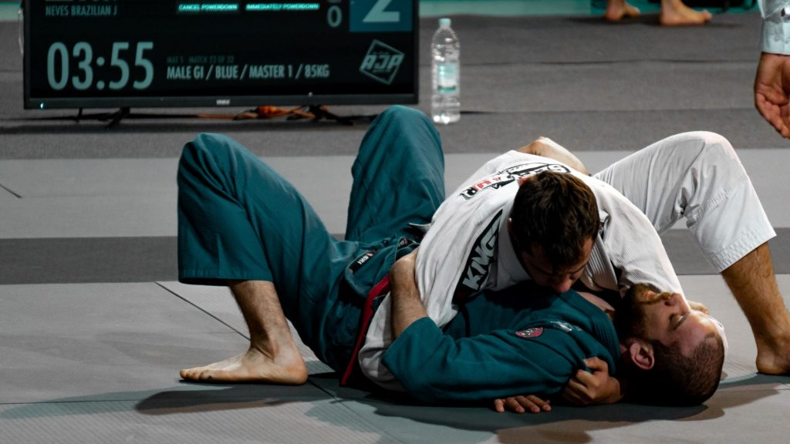

For someone starting a martial art, it might not be clear how much practice is required to achieve their goals. Amateurs and people training as a hobby will train differently from others looking to compete. Here is a rough guide to how much practice you will need, depending on your goals.

**For amateurs who practice martial arts as a hobby, you should practice at least 2-3 times a week. For people looking to learn their martial art in depth (maybe looking to teaching), you should start training about 3 times a week and work your way up to 4 or 5 times a week. Practice sessions should be at least 20 minutes, but can go for much longer. 80% of this training should mostly be specific to the martial art you are doing. The last 20% includes mobility work, conditioning, and other ancillary activities. Martial artists looking to compete should practice 5-6 times a week and may need to workout multiple time a day. These training will likely include some form of strength and conditioning, along with competition specific practice.**

## Start slow and ramp up as you go

**One of the biggest misconceptions is that you need to train 6 hours a day every single day.** This is NOT true for beginners! Everyone who starts training martial arts should start slow. Start with two to three classes per week spread out across the week. Over the course of a few weeks or months, you can increase that amount to 4 or even 6 times a week.

### Starting slow gives you time to heal

Why start slow? Starting slow gives your body the time it needs to recover from the soreness of doing something completely new. For people with little to no martial arts experience, you'll be challenging your nervous system in a way that is completely different from what you are used to. This leads to lots of fatigue in the muscles, nervous system, and joints!

### Starting slow keeps you consistent

Another reason to start small is because it will be easier to stay consistent. Intensity does not make you better, consistency does! A 5 to 15 minute workout every day is great for beginners because it builds the habit. Once you have the habit, then you can increase it to whatever duration and intensity you're feeling that day. Some days, a 10 minutes practice session will be all you can do. Other times you'll feel inspired to do an hour and a half. Building a habit is POWERFUL and consistency is how you do it.

## Working on your cardio

One of the biggest concerns people have is gassing out as they practice their martial art. It doesn't matter how good you are, if you quickly gas out during a sparring session.

There are three ways to improve your cardio. They are ranked from the best way to improve cardio, to the worst. This information is sourced from Trainer Firas Zahabi, trainer of MMA legend, George St. Pierre.

<iframe width="560" height="315" src="https://www.youtube.com/embed/LJ17RCPFeRo" title="YouTube video player" frameborder="0" allow="accelerometer; autoplay; clipboard-write; encrypted-media; gyroscope; picture-in-picture" allowfullscreen></iframe>

### Improve your technique

**The efficiency of your technique is the most important factor when trying to increase your cardio for a martial art.** Even if you have incredible cardio, being inefficient in your technique means that you could be spending 2 or 3 times more energy as someone who has mediocre cardio, but incredible technique.

As you drill movements specific to your martial art, the movements will become easier to perform. As you continue to drill, the techniques will eventually become second nature and the energy you expend doing them becomes minimal.

Ask yourself what techniques tire you out. Is it the kicks? Some movement? etc. Find out and drill that technique until it becomes easier to do.

### Running and other Aerobic activities

After improving the efficiency of your movement, you should improve your cardio vascular system. **The cardio vascular system feeds all other systems, so increasing your gas tank is going to make it easier to continue without getting tired.**

This can be done by running, but if you're not a fan of running, there are plenty of alternatives. Jump rope, swimming, biking, and interval training are all way to improve cardio vascular health.

### Get strong, but not too strong

Getting strong is the last ingredient we need. **Increasing your strength means you will not need to go 100% against an opponent. The less of your max output you use, the less fatigue you will feel during sparring or during a match.**

You need some baseline strength to do your martial art effectively. Grappling against someone who is 40lbs lighter than you is undeniably harder than with someone 40lbs lighter than you.

Firas does mention that there is a level of strength that is no longer beneficial to your sport. If you spend too much time getting strong in your squat, that's time you're not training your martial art.

https://www.bjjee.com/articles/firas-zahabi-on-how-to-drastically-improve-your-cardio-for-bjj/

## Getting "in shape" before training

A common excuse or insecurity people have is that they are not currently in shape enough to do a particular activity. The truth is that only by doing tat activity will you get in shape for that activity. If you want to train martial arts, don't go to the gym and start lifting weights. Instead, start going consistently to a martial arts academy.

## Training for more advanced practitioners

If you are a more experienced martial artist, then you need to ask yourself two things.

1. Have I built a habit of training consistently throughout the week? If not, set up a time where you will train consistently, and stick to it.
2. What ancillary training can I do? If you have injuries, then it's time to address them with training that will make you durable and even more technical than before. Increasing your range of motion is one of the best things you can do to decrease your risk of injury and increase your technical abilities.

Once you've addressed these two questions the next step is to figure out the duration of your training and what that training will look like. In the beginning, you just train your martial art. Once you're more advanced, you'll need to dedicate about 20% of your time to addressing weaknesses and building your strengths. What these are will depend on you. Everyone is different. If you don't have a good understanding on what you need to improve, then try asking your instructor for advice.

## Find a school with the same goals as you

**Some martial arts schools are interested in competition, others are interested in fun, and other in self defense**. Every school is a mix of these three components and you as a student need to decide which one you want to focus more on. As the teacher if they participate in competitions and how you can get involved. If you're not in it for the competition then no need to worry about this. No teacher can force you to compete, though they may want to encourage you to try.

### Talk with your instructor

Tell your martial arts instructor if you're worried about self defense. If you have an immediate need to defend yourself, then TELL YOUR TEACHER.

Transparency and honesty go a long way not only for your learning, but to develop a relationship with your teacher. Ask them what you should focus on and if they have an extra advice. Most teachers are trying give their students as much information as they can, and when they see someone has a real need, most will jump in to give whatever information they can.

### Commit to training consistently for a few months

You don't have to go to a McDojo or "Booty Blast HIIT Muay Thai" class to have fun or motivating experience.

Fun is relative to what you enjoy, so go to any martial arts class in your area and see if you enjoy the instruction of the teacher. Once you tried a few places it's time to dive in. Commit to at least 6-12 months of hard work and dedication to your new craft before even considering to call it quits. Making this agreement with yourself will help when you lack motivation and start getting lazy. It happens to everyone, but if you can push past these initial feeling, you'll be unstoppable.

## Get ready to eat Humble Pie, and like it

Everyone who trains martial arts will eat a full serving of humble pie every time they come to class. Sparring will likely feel frustrating and wildly humbling. I would go as far as to say that, if you don't feel this way from sparring with someone with a year or two of experience, then you may need to question the instruction of the school.

### Model yourself after more advanced students

Your goal as a new person should be to aspire to your classmates, not necessarily to beat that at the beginning as that might be out of your reach for a few months.

Liking humble pie means enjoying the journey. As cliché as this advice is, it is genuine. Enjoying the ride, and not worrying too much about the "end goal" whatever that is, is how you improve.

### Enjoy the journey and don't let your ego get in the way

Enjoying humble pie also means letting your ego go. Your ego will make you feel embarrassed, self-conscious, or humiliated for not living up to what you believe yourself capable of. These are normal feelings, but letting them go is part of enjoying humble pie.
