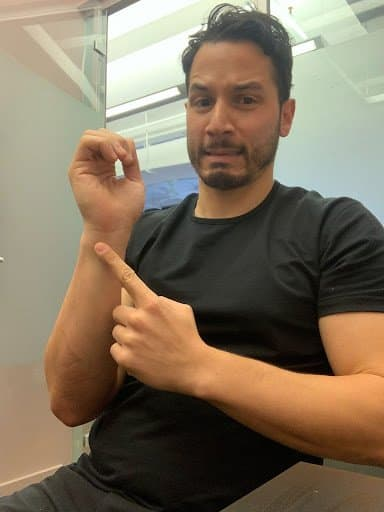

Playing capoeira with wrist pain might take the enjoyment out of it. As a capoeirista for almost 4 years and physical therapist for 8, I appreciate how important our wrists are to executing Capoeira movements. As a capoeirista, we use our wrists in many different ways, such as pushing off the ground, interacting with your opponent, and supporting your body weight in inverted positions. Over time, these repetitive movements can lead to wrist pain, inflammation, and injury. We might be advised or read on the internet to wear a brace when this happens. This can certainly help decrease pain, but without restoring the wrist’s ability to accept body weight, a brace alone is not enough to restore our wrist’s weight bearing capacity. 

## Common Causes of Wrist Pain in Capoeira

Most often, capoeiristas experience pain on the inner part of the wrist (ulnar side, if we’re being anatomical).

Some of the most common causes of wrist pain in capoeira include:

- **Incorrect technique or body mechanics:** Poor form or alignment can put excessive stress on the wrist joint and cause pain or injury over time.

- **Overuse or repetitive stress:** Frequent and repetitive use of the wrist joint can cause inflammation and strain on the muscles, tendons, and ligaments in the wrist.

- **Trauma or injury:** A fall or impact on the wrist can cause a fracture, sprain, or strain, which can lead to pain and limited range of motion.

- Weakness or imbalance: Weakness in the muscles surrounding the wrist joint or imbalances in muscle strength can put undue stress on the joint and lead to pain or injury.

## When to seek medical attention

If you fell on your wrist or experienced trauma to the joint, get an X-ray to rule out a fracture. If you end up having a wrist fracture, DO NOT put weight on it unless cleared by a medical provider!

If you're experiencing persistent pain or limited range of motion, it may be time to seek the help of a physical therapist or another healthcare provider who specializes in treating musculoskeletal injuries (like me!). It’s even better when your physical therapists have experience in martial arts.

## Tips for Training with Wrist Pain

1. **Gradually put more weight through it.**
    1. To start, go on your hands and knees. Shift your weight forward so that your chest moves over your hands. See how that feels. If that feels fine, try to do the same with just the injured hand on the floor. Move back and forth while being mindful that you DO NOT want to increase pain after you’re finished, but that mild pain (between 1-4/10) while you’re performing the exercise is acceptable. 

3. **Slowly reintegrate the most sensitive movements outside of class.**
    1. If inverted positions (e.g. ‘au’, ‘ponte’, etc.) bother you, start with modified versions of those movements to control for body weight being placed through the wrist. For example, to restore ‘au’, place your feet on an elevated object like a box and your hands out in front of you. Then, try to kick one leg up at a time. After that, you can progress to doing a full handstand against a wall. Apply this method as you see fit for your wrist’s capacity to accept weight.
    
    3. If you are having difficulty determining the best next steps for you, refer to a physical therapist or other movement specialist to help. 

5. **Get back to training the movements in class.**
    1. The best way to restore a movement is simply to do it! I will say that you know your body. If you’re not mentally prepared, then take some more time. If you’re feeling great, go for it! Nonetheless, you may want to monitor how often you perform a movement in class during your first attempt back at it. If you’re having trouble with ‘au’, set a limit to do–let’s say–no more than 3. Then, increase that during your next class if doing 3 went well–and so on. 

Do not avoid movement in general. If your wrist pain persists, continue coming to class and , when playing Capoeira, modify your game so that you avoid placing excessive weight on your injured wrist. Be conservative, but don't think that just because you have a small injury, you cannot do any sort of exercise or have fun. 

You can find more content and information about Jordan on his instagram and his website.

https://www.theabstractphysio.com/

https://www.instagram.com/dr.jordanseda/