There are three levels to doing the back bend or bridge. the first is to post up on your feet and shoulders pushing your hips as high as they can (glute bridge). The second is to do the bridge while elevating your feet. And the last is to do the bridge on the ground. These versions go from easy to hard, and most of your time in the beginning will be about getting comfortable with the first two variations.

A big misconception about doing back bridges is that you need to be a kid, or take gymnastics to learn. **The process takes time, but it's relatively simple, even for stiff adults.** If you've never done a bridge before, there are a few progressions that anyone can do and will teach you the skills you need. As you follow this guide, be careful because you should not feel pain during any of these progressions. **Learning a bridge is challenging, fun, and great for your health.**

## Breakdown of the bridge

If you're struggling with the bridge, its very likely that you lack flexibility in one or even all of 3 places. The shoulders, thoracic spine, and hips are the places. In the picture you can see an example of someone who has very poor range of motion in all three areas, while in the other photo is an example of much better range of motion.

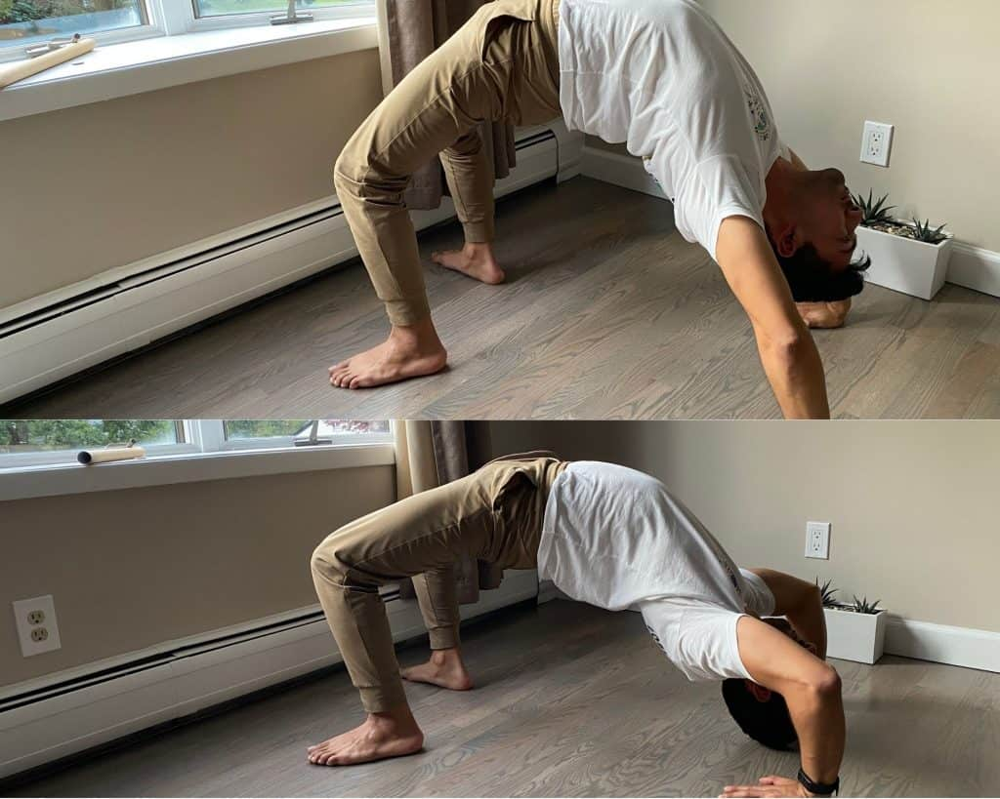

### The "good bridge" checklist

The best way to use this checklist is to take photos or record yourself entering into a bridge. **Go through this checklist and see what elements you can focus on as you begin your training.** If you need more instruction on these elements, I have some tips in the "common corrections" section of this article.

- Shoulders under wrist
- Feet pushing to get shoulders above wrist
- Head down looking forwards
- Bending at the thoracic spine
- Minimal bending at lumbar spine
- Engaged glutes
- Engaged thoracic spine
- knees in line with hips

### You don't need to be an anatomy expert

**There is a reason I provide only 1 anatomical diagrams in this post.** You don't need to know much anatomy to do the bridge. I would go far as to say that **thinking about all the muscles and their flexibility will get you lost in the weeds**. It's not just about having flexible muscles. Many people have flexible muscles, but have poor spinal segmentation, for example. Some people have the required range of motion, but lack strength in those ranges. The best thing to do is to be regular with your training so your body adjusts over time.

## Glute Bridge

From a supine position (chest up), bring the feet in and push the hips up as high as they can go. Using the shoulders as support, try to bring the chest off the floor as much as possible. **Do not let the knees go further than hips width!** This is a very common compensation for people with stiff hips. You can do this for about 20 seconds each rep, making sure to squeeze the glutes as hard as you can before coming back down.

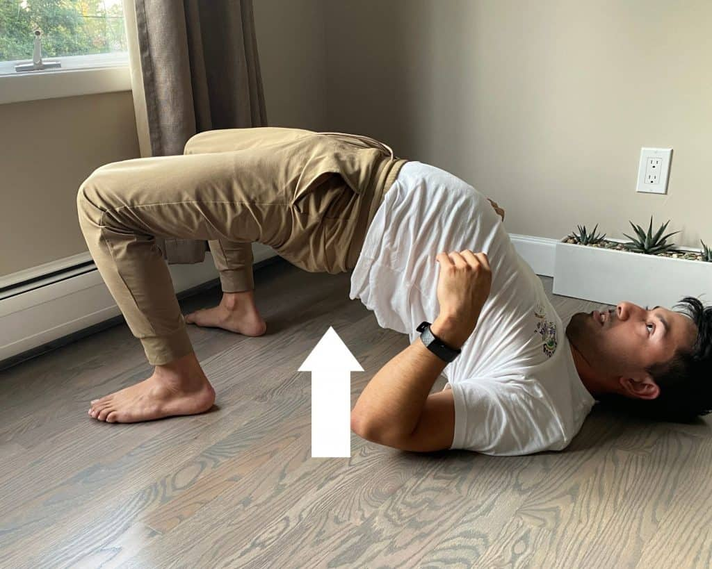

## Elevated foot bridge

**The intermediate level bridge variation is to elevate the feet as high as needed to direct "pressure" onto the thoracic spine and shoulders, and not the lumbar**. Many beginners will do a bridge on the floor and feel a lot of discomfort on the lower back. This is very bad for your back health. The two ways to avoid this is to elevate the feet and squeeze the glutes. We want to put the tension of the movement onto our thoracic spine and shoulders to preserve the health and integrity of our backs.

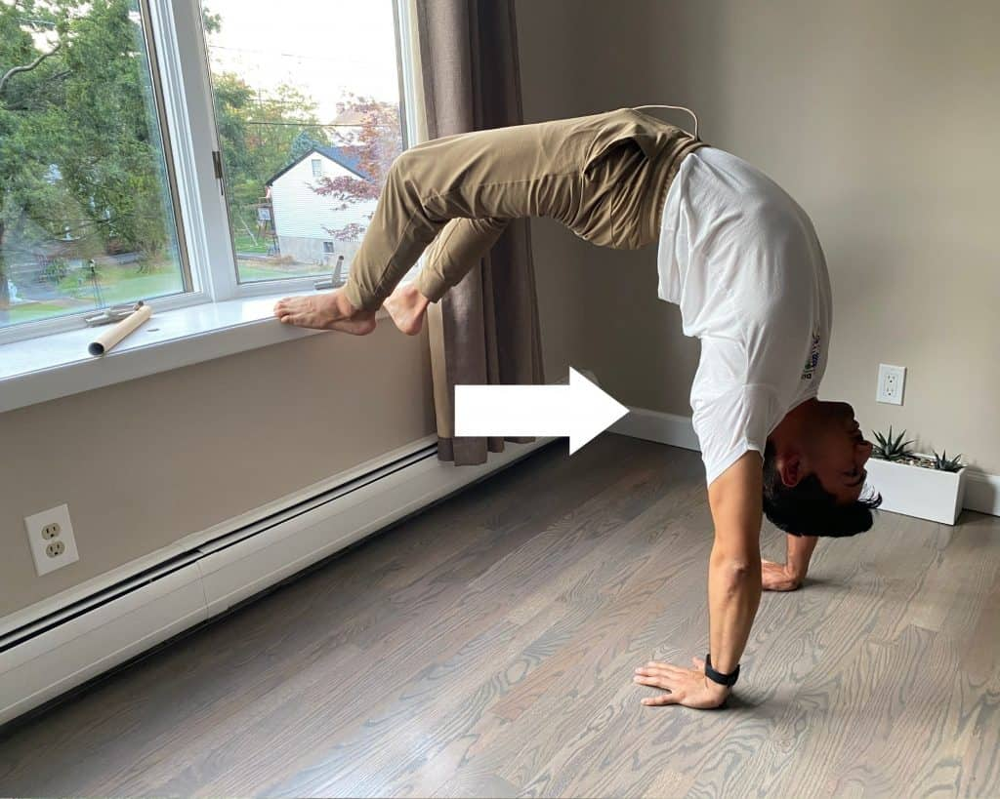

If you can't push up into a bridge with elevated feet (which is admittedly pretty hard), you can lay on top of your bed and walk yourself back so that your feet are on the bed.

Most people will want to stay at this level for a while before moving onto a bridge on the floor. If your wrists begin to hurt, that is a sign you need to train your wrists to improve their range of motion and improve their durability. **Check out my wrist routine for wrist conditioning (below).** If your wrists are blocking you from training, do your bridge on a chair, or alternatively, you can grab a partner's ankles. This will reduce the pressure on your wrists, making it much easier to stay in a bridge for longer.

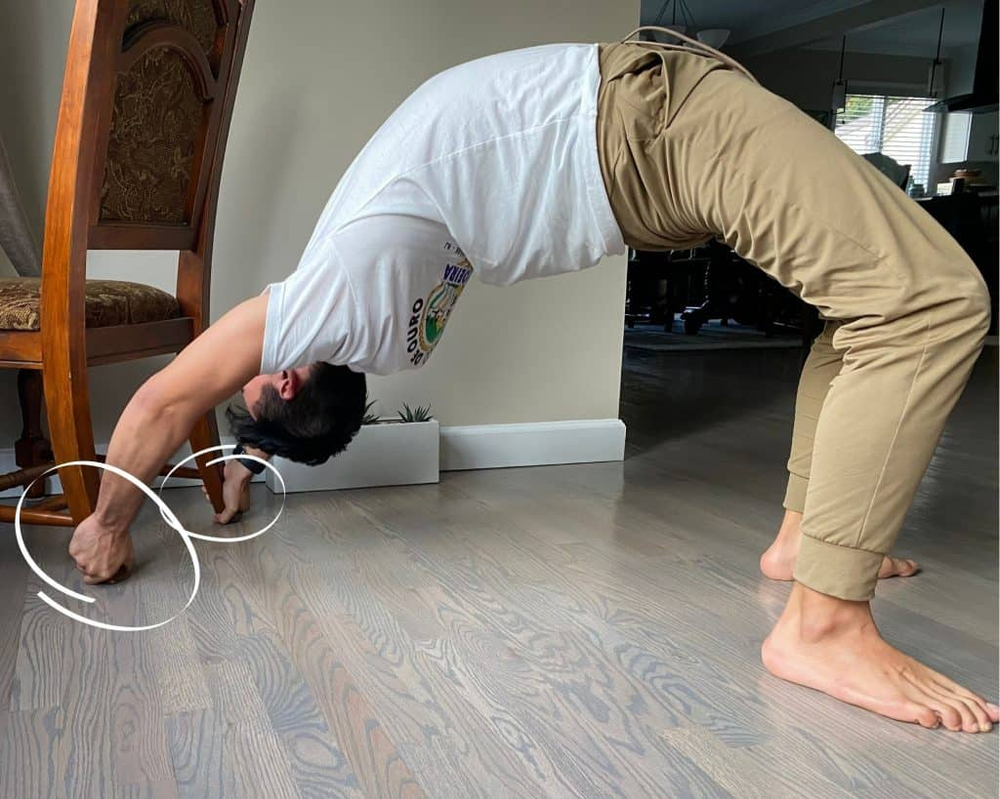

https://dendearts.com/fix-wrist-pain-wrist-stretches-for-prevention-and-healing/

## Bridge on the floor

Lay down in the supine position. Bring your heel to your butt, and hands over your head (fingers pointing towards shoulders). Now push to bring yourself into a bridge. The pushing part can be difficult for some people, even if you have all the flexibility required. If you struggle with this, you'll need to work on your pushing strength. Some people I see online recommend pushups, but to target the muscles in the range of motion we want, we'll do negativa de angola (about 10 each side). This is a great way Capoeira exercise that targets the muscles needed for the bridge in a range of motion that more closely resembles the bridge on the ground.

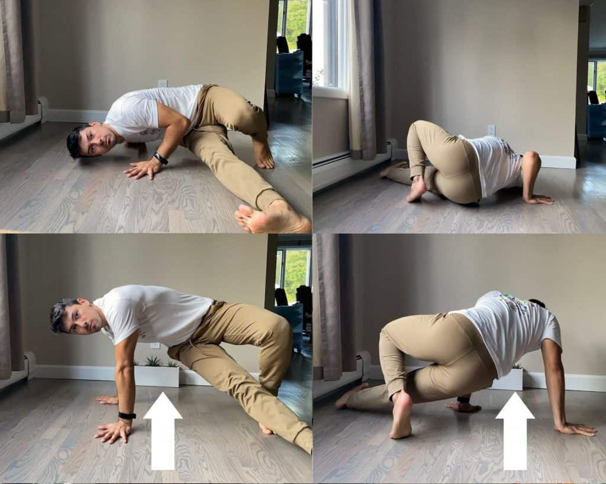

**A bridge is an advanced bodyweight movement.** You're will not look perfect the first time you do it or the next time. Think about the journey and not the goal, because it will take time to improve your back, hip and shoulder flexibility. **Once you can get into a bridge from the floor without feeling excessive pain in your lower back, celebrate, because that's a massive victory**.

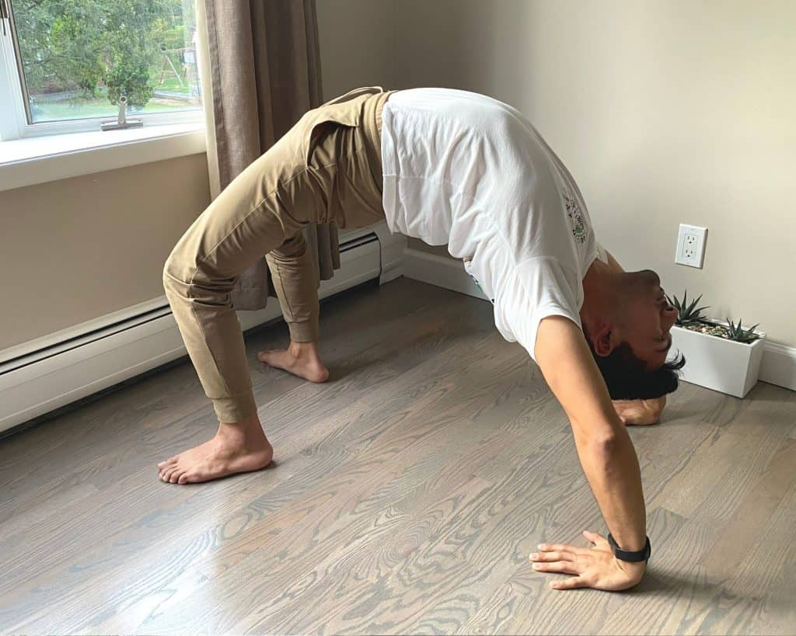

## Common corrections doing bridges

Make sure to record yourself doing bridges. Watch how you do your bridges and refer to the "good bridge" checklist to see if you suffer from any of the many problems people do when practicing their bridge. Take inspiration that I am naturally as flexible as a plank of wood and had to work way too hard for the bridge I have.

### Keep knees in line with hips

A very common problem with people with tight hips. In order to push the hips higher, people tend to bring the knees away laterally, moving them out of alignment with the hips. Although there is nothing inherently "wrong" with this, it does demonstrate a lack of range of motion in the hips. Make sure to do your lunges or couch stretch if you have this issue.

### Point fingers towards heels

When getting ready to lift off the ground to do a bridge, you should place your hands above your shoulder with the fingers facing the shoulders. If you can't put your palm all the way down, you might have a limited range of motion in your wrist or shoulders. When you lift off, you will notice the fingers pointing towards the heel and not out, away from your body. If you are unable to do this I recommend looking back at the butcher's block and my wrist routing.

### squeeze glutes

Pretend there is a piece of gold between your butt cheeks that if you stop squeezing, it will be lost forever. Squeezing the glutes is an essential part of doing your bridge. The glutes are a major support system that protects your lower back and allows you to bring your hips up higher. If you can't bring your hips higher, you can try to squeeze harder at the glutes. This is called reciprocal inhabitation.

### Avoid excessive bending in lumbar

Speaking of the lower back. Do not bend excessively at the lower back! **How do you know when you've bent too much at the lower back? The answer is you will experience discomfort or pain in the lower back.** Some people who are very flexible will not have this problem, however most who experience this pain do so because they've moved past their lumbar's range of motion. The best recommendation is to squeeze the glutes and raise the legs.

**Raising your legs improves your ability to place your shoulders directly above your hands. Doing so shifts pressure from the lumbar to the thoracic spine and the shoulders.** The muscles that support these areas are much stronger and able to handle the weight of your body.

I mentioned earlier about how you don't need to know anatomy to do a bridge, however **the difference between bending at the thoracic and lumbar spine is huge in terms of your long-term spinal health and overall bridge technique**. It's very common for beginners to bend at the lumbar spine because it provides fast results, but this comes at a trade-off of bad technique and damage to the spine.

Squeezing the glutes does a great job of supporting the lumbar spine, however the best way to remove pressure from our lower back is to raise our legs. **Our goal with the raised leg bridge is to bend at the thoracic spine and shoulders, which facilitates the position we are trying to reach.**

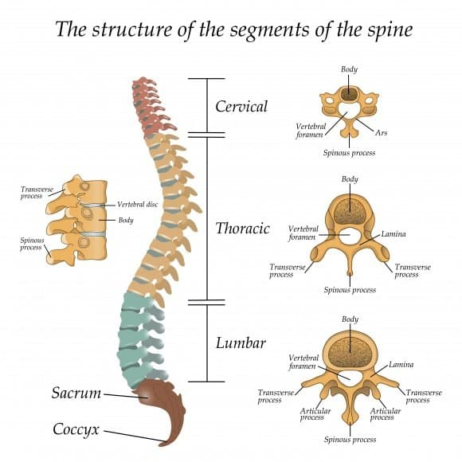

### Keep head between shoulders

I have this problem a lot! I often raise my head to look at my chest as if to look and see how much I am bending. Instead, **lower the head and keep it in line with the shoulders**. This will not only improve your bridge, but it will feel much more comfortable. In the picture below you see how I'm doing this a little bit. I did not intend to photograph this error, but you can see a bit of that here.

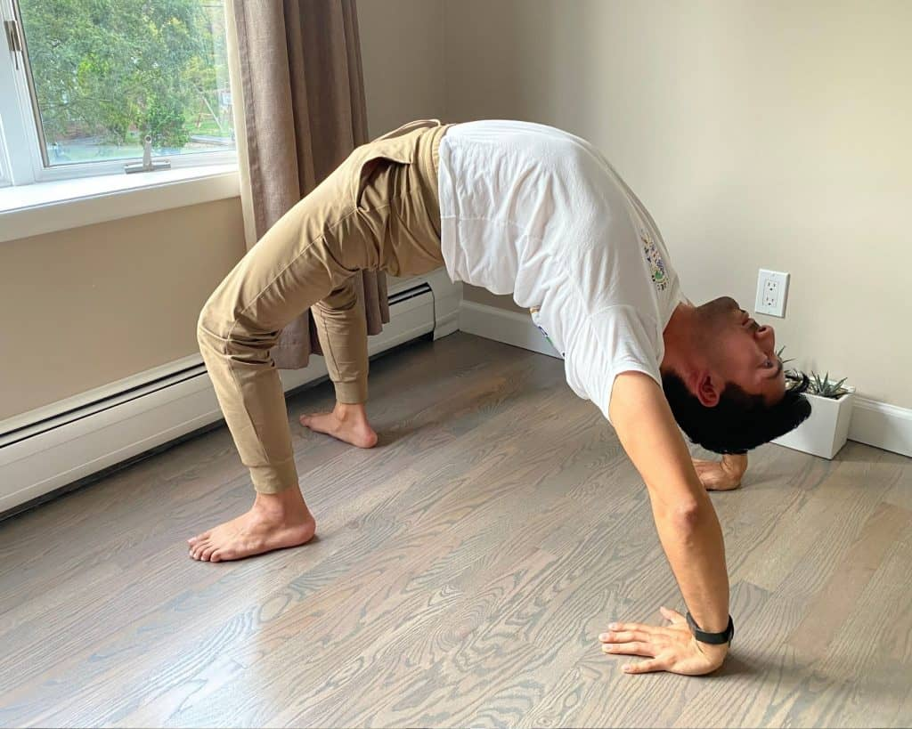

### Engage the back muscles and shoulders

**Bridges are NOT a passive stretch, they are very active**. Staying loose and passive, will put pressure on your lumbar and will not teach your muscles to support you in the range of motion. Sometimes people get get advice, telling them to "relax" into the position. Staying engaged is better in terms of supporting your anatomical structure and improving your mobility.

## Exercises to perfect the bridge (most bang for your buck)

There are many exercises to do a bridge. For absolute beginners I don't believe it's completely necessary to do a massive workout session dedicated to back bending. For people starting from or near zero, it's sufficient to work on the three most fundamental exercises highlighted below. Chances are that if you do these three exercises and follow it up with a few bridges at one of the progressions I mentioned earlier.

### Cat cow and spinal segmentation

**Cat/cow is a great starting point for people unfamiliar with back bending.** The movement if very simple. From the quadruped position, push you spine upwards as much as you can and then depress the spine as much as your able. Repeating this movement 20-30 times is an excellent way to get ready for the day. **I enjoy doing cat/cow as a morning routine, which keeps my back from getting stiff throughout the day.** Even if you don't plan on training back bending, you should consider including this movement into your everyday life.

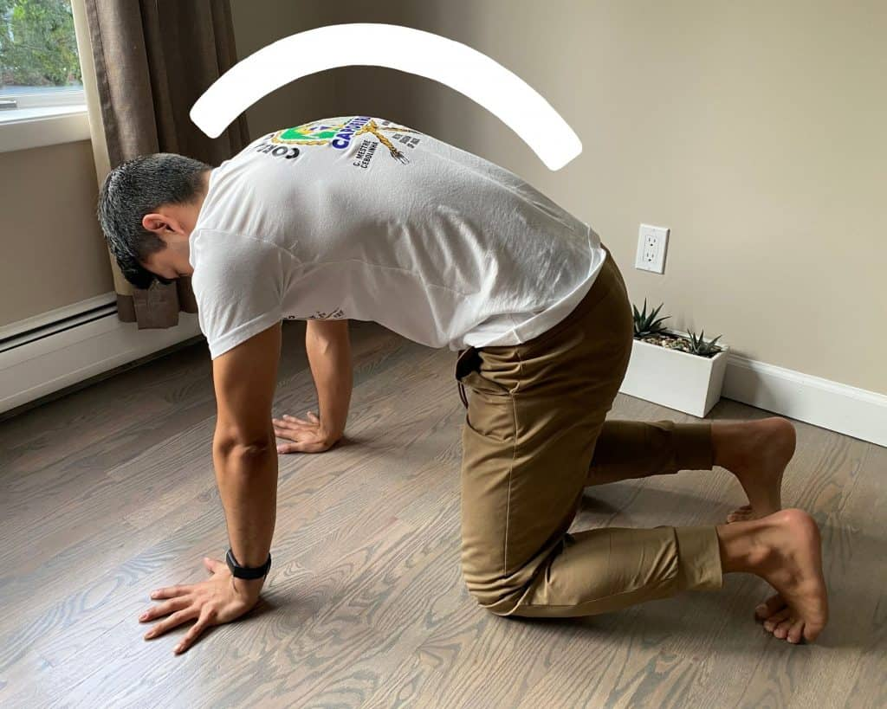

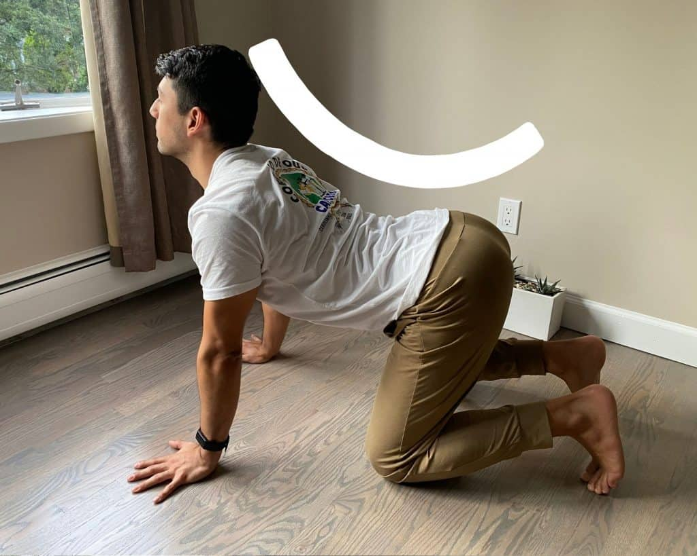

### Couch stretch or forward lunge

**For absolute beginners doing a forward lunge with the knee off the ground is of the best ways to train the hip flexors and keep the glutes active.** For this stretch make sure to keep the upper body upright. It's common to see people lean forward as a way to compensate for poor hip-flexor mobility. Maintain the stretch for 1 minute. Make sure to squeeze the glute of the same leg where the hip-flexor is being stretched to improve the effectiveness of the stretch.

**For you more adventurous folks, try the couch stretch (image below).** The stretch gets it's name from the back leg, which is normally placed on top of a chair, couch, or even a wall. The stretch is very similar to a lung with the difference being that the back leg's foot is raised. This increases the stretch around the hip-flexors and the quad. Push forward and squeeze at the glutes to get the most out of this stretch. Pro-tip. Don't be afraid to bring your knee past your foot to increase the intensity of the stretch.

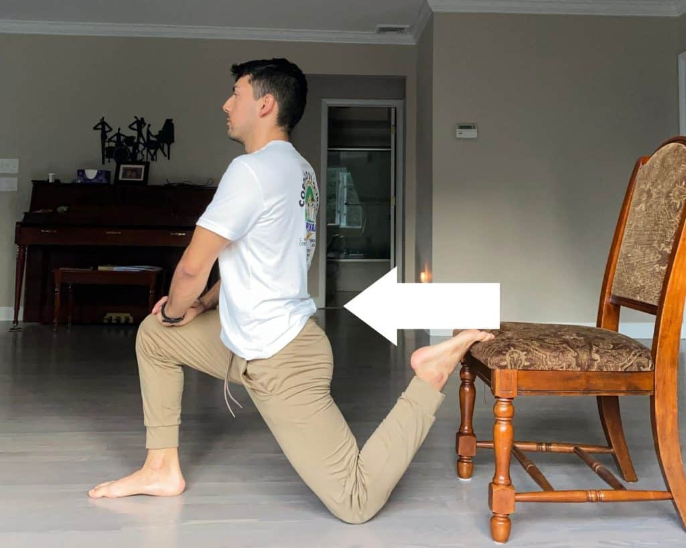

### Butchers Block

One of the hardest things to improve is our overhead range of motion. This is something that a lot of people, particularly men (in my experience) struggle with. Here is a great exercise that works to improve that range of motion in a very active way. **the butchers block targets the lats, a group of muscles that can be very tight and is one cause of limited overhead mobility**. Make sure that while doing this stretch, that you keep your elbows at shoulder's width and you hands at slightly past shoulder's width.

As you start the stretch, try to push your shoulders down towards the ground while keeping the back completely straight. As you bring your hands up, do not let your hands draw closer to each other. As you do this stretch you should feel a lot of engagement and shaking in the lats.

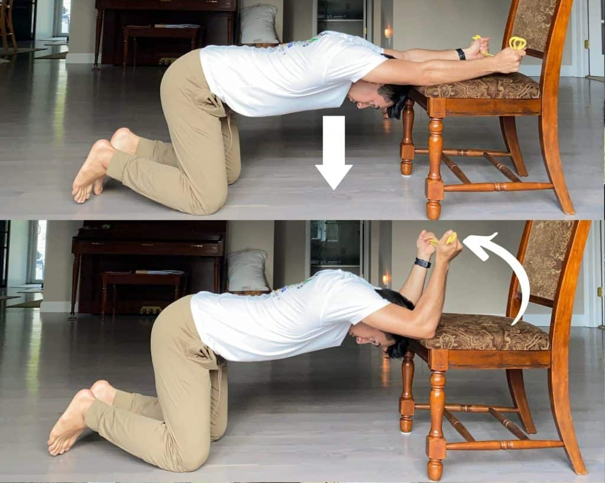