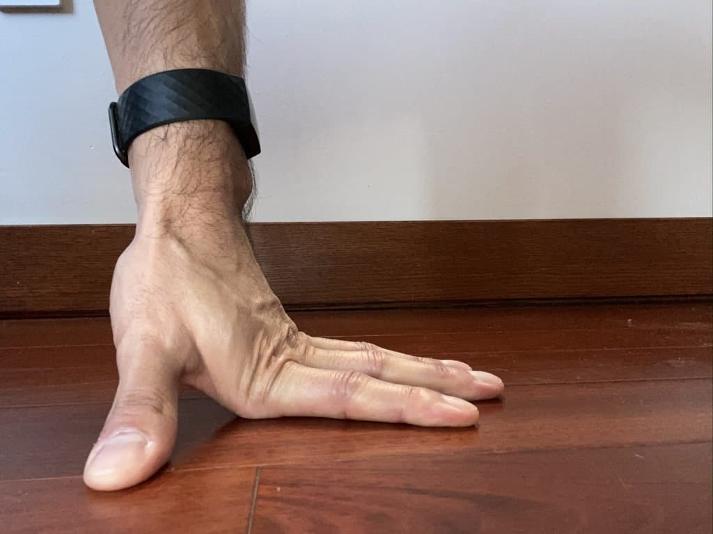
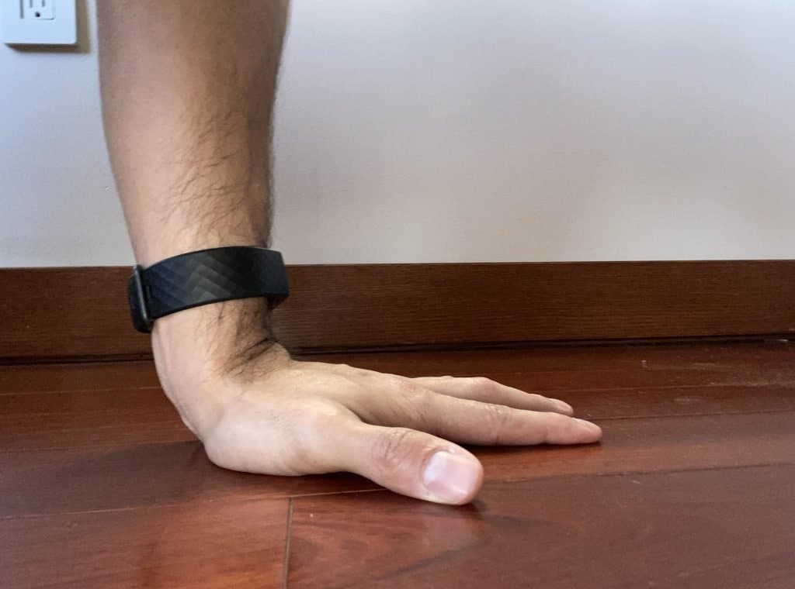
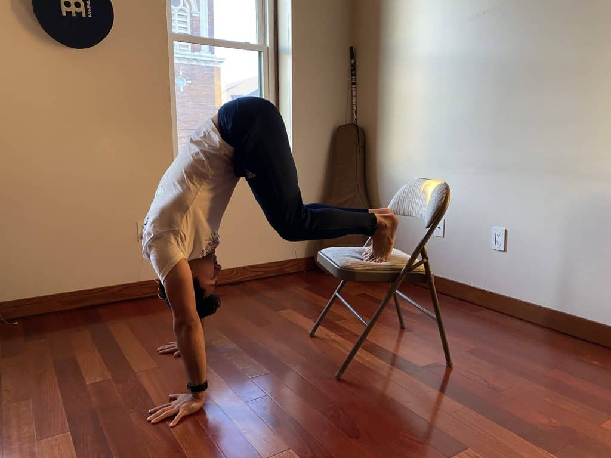
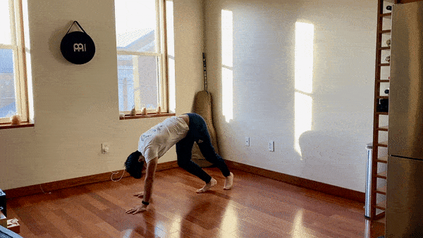
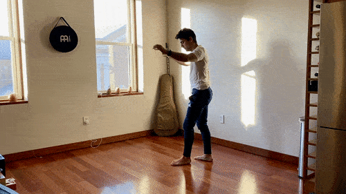
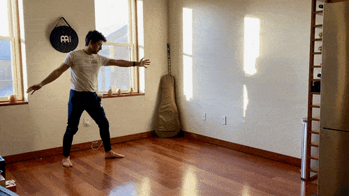
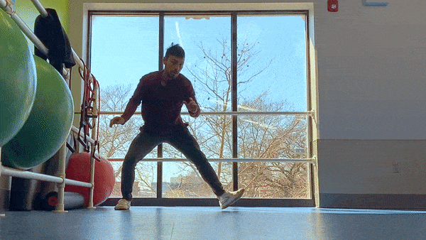

If you're scared to do a cartwheel, I recommend you first build comfort supporting your weight on your hands. And two, practice jumping in a position where your hands are supporting your weight. The biggest reason people feel scared doing a cartwheel is that they feel like their hands won't support them, and they'll fall on their faces. The truth is that 99% of people are strong enough so this doesn't happen, but getting past the mental block can be hard.

## **Feel comfortable with your hands on the floor**

This is something that comes very naturally to us as kids, however, as we grow up we start losing our connection with the ground. Most adults never even touch the floor with their whole palm on the floor. You can tell who these people are because when you tell them to sit on the floor and then stand up, they will only place the upper part of their palm on the floor instead of the entire palm. See the images below. This is actually very common, and a sign that the person feels uncomfortable touching the floor.

## **Feel comfortable with your hands on the floor**

This is something that comes very naturally to us as kids, however, as we grow up we start losing our connection with the ground. Most adults never even touch the floor with their whole palm on the floor. You can tell who these people are because when you tell them to sit on the floor and then stand up, they will only place the upper part of their palm on the floor instead of the entire palm. See the images below. This is actually very common, and a sign that the person feels uncomfortable touching the floor.

- 
- 

Fear is something you can learn to overcome with enough practice. To build our confidence with cartwheels we want to first place our hands on the floor as much as can, and bare weight on them as much as we can. We can do this in a couple different ways.

Make sure that as you do these exercises, your arms are stiff and shoulders high. This will give you maximum strength and stability to work with.

1. Lift your legs onto a chair and place your hands on the ground. Only your hands (with the whole palm on the floor) should be touching the ground. If this feels to intense, you can keep one leg on the floor.
2. Level 0 Cartwheel. This is actually one of my favorite cartwheel versions to train. I do it myself regularly. There are many variations to the cartwheel, which form the fundamentals of more advanced cartwheel variations.

<figure>

<figcaption>

Building comfort bearing weight on the hands

</figcaption>

</figure>

<figure>

<figcaption>

Level 0 cartwheel

</figcaption>

</figure>

<figure>

<figcaption>

Level 0 cartwheel second variation

</figcaption>

</figure>

## **Do lots of Level 0 Cartwheels for fundamentals**

Level 0 cartwheels have you placing both hands on the floor and jumping off of one leg and onto the other. Simple as that. There is no requirement to jump super high, just land on the other leg. If we're comfortable, then the next step is to jump harder, bringing the legs higher. At level 0 we're taking it slow.

Our next goal is to play in this position a bit. Place a small object between your legs and practice jumping over it and landing with the opposite leg. Think of this as a game. See how many successful jumps you can make out of 10 or 20.

### **Progressions for Level 0 cartwheel**

If this starts to feel comfortable, the next step is to start the cartwheel from standing. One difference between this cartwheel variation and a normal cartwheel you see in Capoeira is that the cartwheel is done with the chest facing forwards. You do not move to the side while doing this cartwheel.

Stand with a slight bend at the knees. Bring one hand forwards towards the floor, and then let the second hand follow it in front of you towards the floor. At this point, we still don't care about lifting our legs up in the air. At this point, we still want to build our comfort putting weight on our arms as we do cartwheels.

Once again, let's get something to help us out. We can use something to jump over as a way to help guide our legs up. At this point, you should feel like the cartwheel is starting to come together. The movement isn't quite right of course, but the structure is there.

## **"V" Cartwheels for improved lateral movement**

For some people, if you feel scared to do a cartwheel, this cartwheel regression might be right for you. When I started doing cartwheel I had no idea you could make a movement easier or harder. I just saw the cartwheel and attempted it until I stopped falling.

The "V" cartwheel is a simple regression. You can start from a normal cartwheel starting position and instead of a lateral moving cartwheel, you will making a "V" shape. This seems pretty simple and in theory, builds off of the previous cartwheel variation we worked on. Hopefully, by now you're feeling a little more confident with putting your hands on the ground and jumping off the floor. If not go back to the Level 0 cartwheel.

### **The mistake most people make doing cartwheels!**

Although the starting position is the same, not much changes for our cartwheel here. The main difference is that we want to move laterally as much as we can without falling on our butts. The main mistake people who start practicing cartwheels is that they don't know how to land. The landing is made difficult by the momentum of your body.

As you make a more narrow "V" shape to your cartwheel this momentum is nullified more and more. This makes the "V" cartwheel easier. As you get better and more confident, you want to make a wider "V" shaped cartwheel. The wider your "V" cartwheel, the more you should be dominating the takeoff, the lateral movement, and the landing.

## **Attempt a cartwheel**

The next step from here is to make your "V" cartwheel so wide, that it is a straight line. A good way to keep track of your progress is to put a piece of painters tape on the floor and see how close to a "straight line" your cartwheel is. Your goal is not only to move on a straight line but to have all your hands and feet touch the tape as you do your cartwheel.

### **No excuses**

I saw an old youtube video of a kid called No Excuses. He was a trickster and did things I could never do. He was also VERY heavy. Not anything like the super athletic tricksters you see on social media. Watching him fly was inspiring and should be a reminder to not make excuses. If that kid could do backflips, you can do cartwheels. We both know I'm right here...

<iframe width="560" height="315" src="https://www.youtube.com/embed/vXv8Dk78r0k" title="YouTube video player" frameborder="0" allow="accelerometer; autoplay; clipboard-write; encrypted-media; gyroscope; picture-in-picture" allowfullscreen></iframe>
