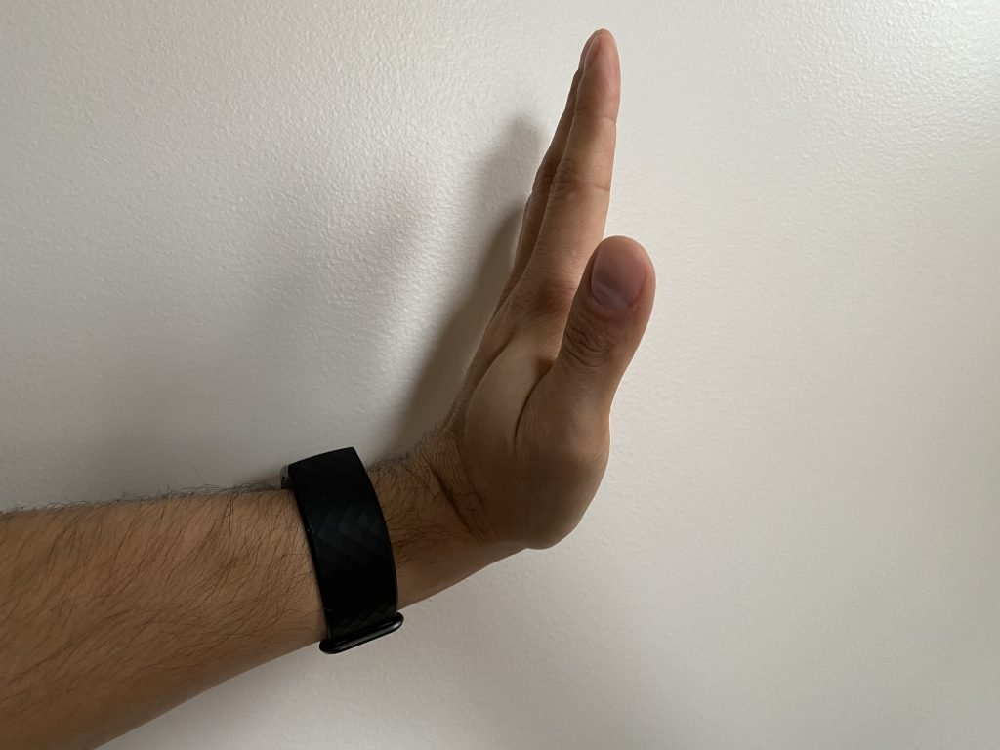
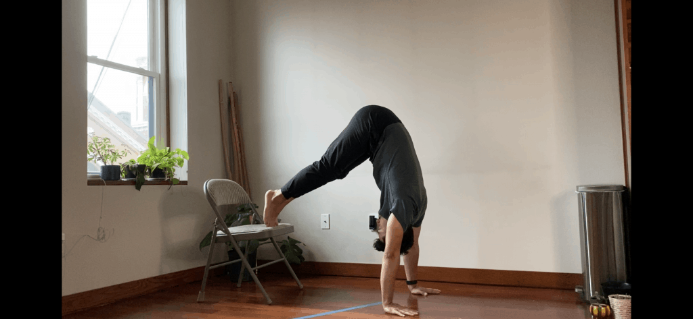
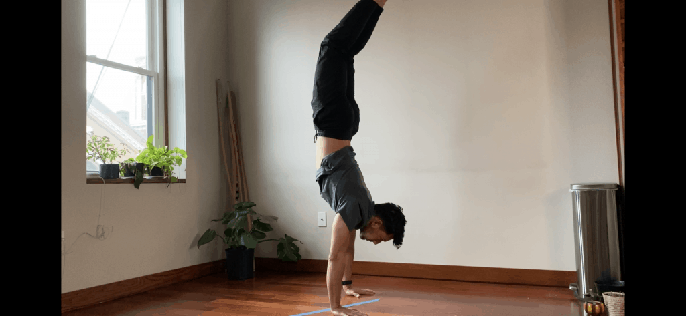
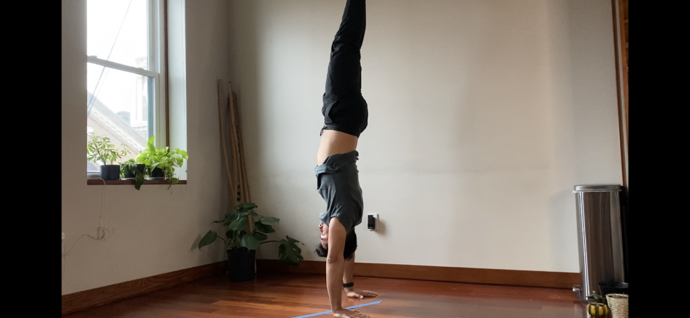
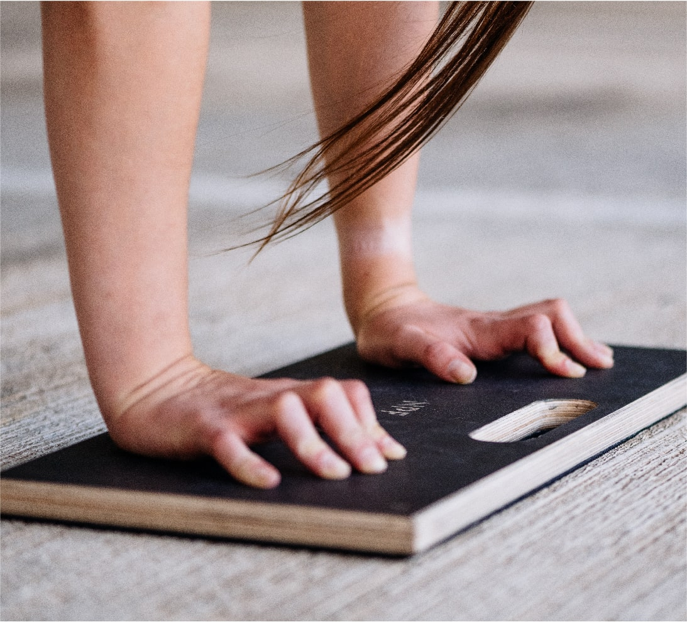
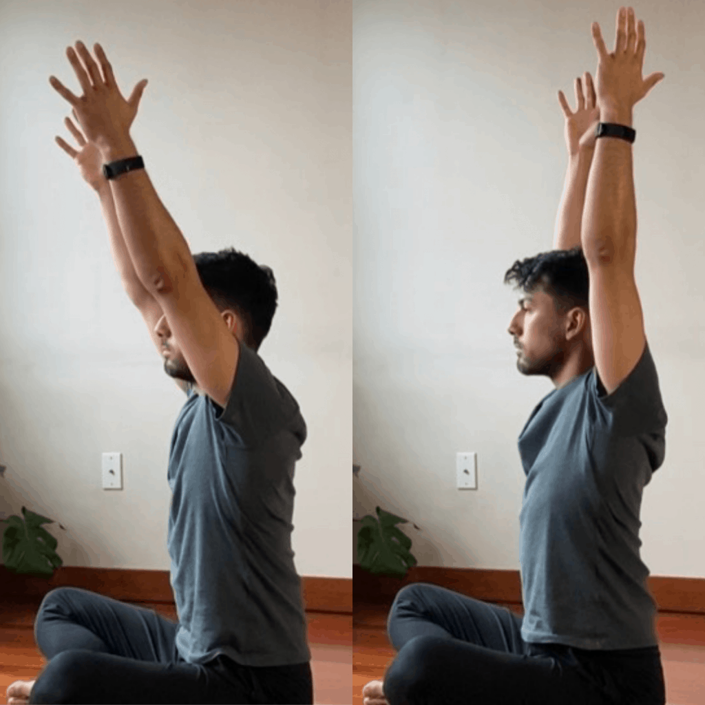
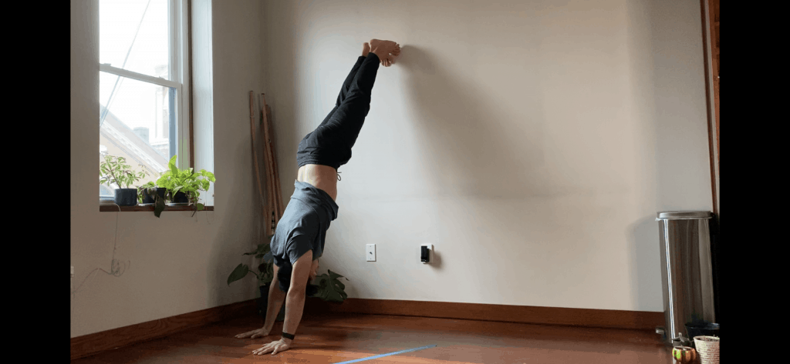

Wrist pain or discomfort during a handstand is very common. In general, if you feel wrist pain during handstands it is for three reasons. The first is that you have poor range of motion. The second is that your wrists have a smaller carrying capacity that you are loading them with. And third is that you did not warm up. You may feel pain in the wrist for one or all three of these reasons. If you do feel wrist pain during handstands, you should make sure follow a protocol for your wrists (shown below) that increases range of motion and carrying capacity. You should not feel pain every time you practice handstands!

## Reasons for wrist pain: Overexertion & ROM

The first reason you feel pain in your wrists is that you're loading the wrists with more than they wrists can handle. This could be over-training the wrist until it's too fatigued to work without pain. Or you are working in a range of motion that you are weak in, causing inflammation and pain.

### Excessive amount of pressure on the wrists

The main way to avoid overexertion is to set a limit on the amount of practice you will do. don't work until failure! Failing muscles have poor technique and put excess pressure on the joints.

Avoid overexerting your wrists by doing handstands in a way that limits the load on your wrists. You can do that by doing handstands against the wall with your chest to the wall. Another great alternative for beginners is to do handstands with your feet on a chair (or other elevated surface). This dramatically reduces the weight you are putting on your wrist, allowing you to comfortably train. The lower your place your feet, the less weight you put onto your wrists.

### Poor Range of motion

Handstands requires at least 90 degrees in wrist extension and near 180 degrees of shoulder flexion.

If you have poor shoulder mobility, the wrists will in most cases go beyond 90 degrees to compensate for the stiff shoulders. This commonly creates the "banana handstand", where the spine extends to compensate for the poor shoulder range of motion.

Examples of banana handstand position, and correct handstand position.

Placing pressure beyond 90 degrees when your wrists do not have the prerequisite range of motion steeply increases the chances of injury. We can decrease our chance of injury by increasing our wrists range of motion. We do this with our wrist warmup-up shown below. This warmup can be done before training days and on off days. Besides being a warm up, this protocol increases range of motion and durability in the wrists.

### Not warming up

You need to do a warm up routine. It doesn't matter if you're new to hand balancing or have more experience. Warming up before any exercises is key to performance and longevity.

Your warmup should consist of three phases...

1. Muscle activation
2. Movement through full range of motion
3. Light tension at end ranges

<iframe width="560" height="315" src="https://www.youtube.com/embed/U916zmI9IyI" title="YouTube video player" frameborder="0" allow="accelerometer; autoplay; clipboard-write; encrypted-media; gyroscope; picture-in-picture" allowfullscreen></iframe>

At the beginning of the warmup we do finger pushups getting the wrist off the floor. This activates the muscles in the forearms. This first step is extremely important and is the reason we do about 30 repetitions. This is important because the high repetitions is what brings blood flow and warmth into the wrist joint. We are literally warming up and greasing the grooves of the joint.

The remainder of the warmup consists of moving the wrists through different positions and placing some of your bodyweight on them. Doing so adds weight to the wrist at different end ranges of motion. At first this is very uncomfortable. However after doing this for many months, the load becomes easier to deal with.

This is your wrist adapting to the load, which better prepares you to do things like handstands.

### Avoid handstands on soft surfaces

Beginners often make the mistake of doing their handstands on soft surfaces. The reason if often that they are afraid of doing handstands on hard surfaces, and so will opt for softer surfaces like mats or carpets. This may feel safer, but soft surfaces exacerbate range of motion deficiencies.

Doing handstands on mats for example will cause the heel of your wrists to sink into the mat because this is where 90% of your bodyweight is placed. As your wrist sinks into the mat, it forces your wrist into deeper extension. If you have poor range of motion, then this will put you in a position you might not be ready for.

Although it might be scarier to handstand on a hard surface, it is safer for your wrists. A compromise would be to include the use of a surface board. This way you can hand balance on a hard surface to protect your wrists, while practicing on mats or a carpeted floor.

## Improve overhead shoulder flexion

Handstands depend so much on having near 180 degrees of shoulder flexion! Like we mentioned, if you have poor shoulder flexion, then the handstand will not be straight, and your wrists will compensate by extending into more extreme extension. The more we extend at the wrists, the higher the chance of injury. this is why it's so important to improve our shoulder overhead flexion.

### Butchers block to stretch the lats

The lats are the main muscle group that keep you from bringing your hands overhead at 180 degrees. In order to combat this we can do a few exercises that improve our range of motion.

<iframe width="560" height="315" src="https://www.youtube.com/embed/oDnP3sPkdO0" title="YouTube video player" frameborder="0" allow="accelerometer; autoplay; clipboard-write; encrypted-media; gyroscope; picture-in-picture" allowfullscreen></iframe>

Some notes while doing the butchers block

- Keep the spine flat (neutral)
- Keep the core tight
- Keep hands more than shoulder width apart! (this is very important)
- Sink the shoulders down towards the ground
- Use a stick (can be a broomstick). Elastic bands are an acceptable substitute.
- Highly recommend moving in the stretch as shown at [minute 4:00](https://youtu.be/oDnP3sPkdO0?t=239)

I recommend holding the stretched position with the hands over the shoulders for about 1 minute before moving in the stretch. Do about 2-3 sets of 6-10 reps. How much you do will depend on your current abilities and any other activity you'll be doing that day. This is intense so be prepared!

### End range liftoffs

One of the best ways to improve your range of motion is to produce force in a way that is safe at your end range of motion. We do this by lying prone on the floor and placing our hand on a slightly elevated surface. **(Read the rest of the section before following the video!)**

<iframe width="560" height="315" src="https://www.youtube.com/embed/aGpVyWwPaUI" title="YouTube video player" frameborder="0" allow="accelerometer; autoplay; clipboard-write; encrypted-media; gyroscope; picture-in-picture" allowfullscreen></iframe>

To get the most out of this exercise we should hold this position with the hand on top of the elevated surface for about 1 minute. This is a static stretch where you want you muscles to relax.

In the next part we'll push into the weight. Maintain a tight core and glutes as you do this. We want to apply about 40-60% of our max effort into the elevated surface. This type of exercise is known as an isometric because there are no moving parts as you contract the muscles.

Lastly we follow the video and try to pull our hand off of the elevated surface for a series of reps and sets. I recommend 2-3 sets of 8-12 reps. This will depend on your current abilities and any other activity you'll be doing that day. This exercise is very intense.

### In most cases, your pecs are not tight

A quick note on this because it's very common for beginners to assume their pec muscles are too big or too tight to lift their arms overhead. This simply the wrong way to look at it. You have poor range of motion because you don't work on your range of motion. It's that simple. Most people who lift for example work on very small ranges of motion, which explains their general lack of flexibility.

### How often and when should you work on shoulder flexion?

You should train your overhead shoulder flexion 2-3 times a week. If you're doing handstands that same day, then keep your shoulder work light. If you're not working on handstands that day, then you can make the exercises much more intense. You can increase intensity by adding an extra set, which will go a long way in your improvement.

Don't do an intense shoulder workout and then handstands. Fatiguing your shoulders before handstands is prime way to injure yourself from either poor form or overuse.

## Train with wrist pain by lowering intensity (regress to progress)

You should not train if you have severe wrist pain. However in some cases, you will only have wrist pain after doing handstands. If this is you, then you might want to consider a few handstand regressions that will allow you to practice, while maintaining the integrity of your wrists.

Ideally you'll be doing these exercises while working on your wrists and shoulders. Doing these exercises alone will not improve your range of motion in any significant way.

### Increase time doing handstands!

The variations below are meant to accomplish one main goal. Increase the amount of time you spend inverted and on your hands. Your body needs time to adapt and these variations do just that. The more time you spend on your wrists supporting your bodyweight, the more you will begin to adapt and strengthen in that position.

### Handstands on the chair

One of the most beginner friendly handstand regressions is to elevate the feet on a surface. This variation decreases the amount of weight on your wrists. Sometimes we can have sufficient flexibility in the wrists to get into 90 degree, but the weight of our bodies is more than our wrists can handle. This can causes pain.

By lowering the weight on our wrists we can make it easier to do our handstands comfortably. If you feel more than 1 or 2 (on a pain scale of 1 - 10), then this position might still be too advanced for you. Instead, lower your feet down onto a lower surface. The lower the surface, the less pressure you will be placing on your wrists. As your wrists get stronger, place your feet up on higher surfaces.

### Modified Handstands on the wall

Sometimes I joke with my students by calling this the hypotenous. This is because of your position relative to the wall. You will be doing a handstand on the wall, with a minor change. You want to be 1 or 2 feet away from the wall. This will do two things.

The first is that you will decrease the amount of extension in your wrists. For some people this is enough to eliminate all pain in their wrists. The next reason is that we can practice our handstand posture and maintain a straight posture while leaning on the wall. This will be difficult to see so grab a friend to help you or record yourself. You can check out the recording and see if your body is not straight.

### If you still feel wrist pain, then go to a physiotherapist

If these regression still cause you a significant amount of wrist pain, then you might have some other underlying issues. The best thing you can do in this case is to go to a physiotherapist and follow their instructions to rehab you back to health. You will still be able to work on your shoulder mobility during your rehab, but you will have to be careful doing your wrist routine.

Asking a physiotherapist their professional opinion is never a bad idea!

## Unable to train handstands with hands flat on the floor?

Parallettes are great to continue training handstands if your wrists are injured or if you feel fatigue in your wrists, but want to continue training. The hand position for parallettes includes minimal wrist extension, reducing the pressure placed on the wrist.

Parallettes are not a replacement for training handstands on the floor. The technique is not the same, however there are many elements that are shared between both handstand variations. Parallettes are their own skill so it will take time to learn this as well, but they're fun to try!
