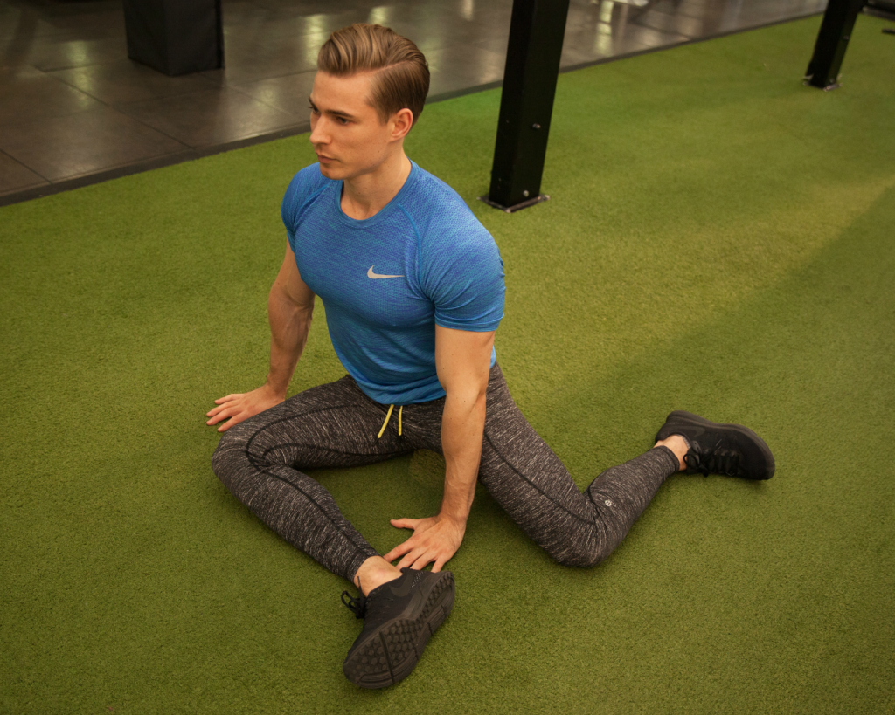

Capoeira is an incredible martial art to learn in part because of the wide range of elements that you can learn. [A great way to gets started is to check out this overview of Capoeira.](https://dendearts.com/what-is-capoeira-the-best-damn-online-explanation/)

If going to a Capoeira academy is not an option for you, there are several online instruction options available to you. Although they can not replace the lessons you receive from in person instruction, they are a great way to learn many Capoeira movements and can supplement any training you are already doing at an academy.

**The best way to practice Capoeira at home is to create a schedule that you can easily fit into your schedule. For the best results you should also try to attend online provided by a teacher. In addition to online classes, there are many elements covered below, including strength training and how to improve your range of motion.**

In Capoeira, there are three main styles: Regional, Angola, and Contemporânea. If you're not sure about which style to train, [check out our in depth explanation of each style here.](https://dendearts.com/the-different-styles-of-capoeira-full-explaination/)

## What are the basic Capoeira movements

For someone completely new, it's useful to begin learning Capoeira by getting familiar with 10 basic movements. These movements are...

- [Ginga](https://www.youtube.com/watch?v=fY7HjL7GWCc)
- [Meia lua de Frente](https://www.youtube.com/watch?v=s9WZDY3PCIc)
- [Armada](https://www.youtube.com/watch?v=AXlS9uQ2QFM)
- [Queixada](https://www.youtube.com/watch?v=jssZQfRHufI)
- [Meia lua de Compasso](https://www.youtube.com/watch?v=o_AbTs-M5Zk)
- Esquiva ([lateral](https://www.youtube.com/watch?v=vZRHFWFKlKI), [baixa](https://www.youtube.com/watch?v=zfeBEi03LCo), and [atrás](https://www.youtube.com/watch?v=Jg5RLZb-l04))
- [Cocorinha](https://www.youtube.com/watch?v=kGgzDVqrHlc)
- [Rolê](https://www.youtube.com/watch?v=shnRdvI3bGA)
- [Negativa](https://www.youtube.com/watch?v=zFp1NtaYCfo)
- [Au](https://www.youtube.com/watch?v=KFpGbWHE6OE)

<iframe width="560" height="315" src="https://www.youtube.com/embed/8Nofh0u2l3Q" title="YouTube video player" frameborder="0" allow="accelerometer; autoplay; clipboard-write; encrypted-media; gyroscope; picture-in-picture" allowfullscreen></iframe>

For a beginner, these are the first movements you want to become proficient in. For more in depth instruction on how to do each movement, check out our in depth guide on all 10 of these movements.

https://dendearts.com/10-basic-capoeira-movements-for-beginners/

### How to train the basics

Let's say you do a quick jog to warm up. Now what?

The best way to train your Capoeira basics at home is to set an interval timer of 1 minute with no rest and 20 sets. Each set you will complete 5-6 repetitions for each each movement on the list above on both sides.

It's really that simple. After you finish. Do a stretch of whatever you feel like you need the most. The entire training will take about 25 minutes. In those 25 minutes, you'll get a complete workout including the upper and lower body. You'll also be training the basics of Capoeira, which will make class more enjoyable, as you will not struggle to do the most basic movements.

## Learning Floreios

Floreios, although not necessary, are a big part of what attracts people to Capoeira. Floreios make the game of Capoeira beautiful and fun to do.

Floreios is defined as a "beautiful movement". This includes things like cartwheels, hand spins, acrobatics, and many other impressive movements.

### Beginner Floreios

If you're a beginner, you want to start with the following floreios. They require a minimum amount of strength, flexibility and coordination to perform. This makes them a great starting point and stepping stone to more difficult movements. They are ordered in terms of difficulty, however depending on your abilities, some movements may be easier than others.

- [Rolê](https://www.youtube.com/watch?v=shnRdvI3bGA)
- [Au](https://www.youtube.com/watch?v=KFpGbWHE6OE)
- [Au fechado](https://www.youtube.com/watch?v=yMbs_yPTNVg)
- [Martelo rodado/parafuso](https://www.youtube.com/watch?v=l4oliRhn66c)
- [Queda de rins](https://www.youtube.com/watch?v=6r4ywlGOtbA)
- [Ponte](https://www.youtube.com/watch?v=rAR_vfgD4BE)

### How to train floreios

There are two ways to train floreios. In isolation and in conjunction with other movements. For example. You can train Macaco starting from a squat position or directly after another movement like Armada or Rolê. Both methods have their merits, but generally you want to start by isolating the movement first.

Once you have a strong understanding of the movement, you should switch your training to focus on doing it after or before other movements. Doing this will help your flow and ability to use the movement within a Capoeira game.

### Treat your floreios like a heavy weight

For people familiar with a basic gym routine, you will know that exercises are divided into splits, sets, and reps. A **split** is a way of dividing your training day between different exercises. Mondays and Wednesdays I will work on Macaco, while Tuesdays and Thursdays I work on Au (for example).

And a **set** is a grouping of **reps** (repetitions) of a single exercise.

Treat your floreios like you would train a bench press with a heavy weight. The reps will be low per set, but you want to do about 5 sets per day you train the movement. Here is an example.

Split - Macacos: Mondays and Wednesdays

Sets - 5

Reps 5 per side

Setting up a schedule like this will go a long way into structuring your workouts and developing your movement.

For a large list of Capoeira floreios and how to do the movements, [check out our in depth review](https://dendearts.com/the-complete-list-of-capoeira-ground-movements-floreios/).

## Develop mobility through Capoeira

There is a difference between flexibility and mobility. Mobility = flexibility + strength. If you can get into a split, however, cannot raise their leg up above their head from standing, then you are only flexible. In Capoeira we prioritize mobility to realize your potential.

Improving your mobility means movements will be easier for you to perform and they will look a lot nicer.

### get started building hip mobility

Probably the most important place you want to build a range of motion for a Capoeira is in the hips. We do this by getting into a 90/90 position. From this position we can improve on our internal hip range of motion, external hip range of motion, and piriformis muscle mobility.

Here is a video of some exercises that are amazing for improving the function of your hips.

Exercises

1. Get into the 90/90 position and sit upright
2. Lean into the forward shin 12-16 times (do twice)
3. Raise the back foot 12-16 times (do twice)

## Bulletproofing the body (wrists and knees first)

The first two body parts that you want to focus on bulletproofing are the wrists and the knees. These are the two body parts that take the most punishment and if you train them properly you won’t have any issues with them.

some people believe that their knees wrists and other joints have expiration dates, but this is not the case. If you look at some of the best athletes and the sports of powerlifting and other athletic endeavors, you’ll see that it’s very possible to and even regain function in your joints. Enough so that you can do a sport like a Capoeira comfortably.

### Bulletproof the wrists

Before doing any sort of handstand work or any other kind of work out that involves putting your hands on the floor, I strongly suggest doing a wrist warm up to prepare your wrists for the training. The work as shown below is extremely effective takes only a few minutes to do and has helped many students recover function in their wrists.

<iframe width="560" height="315" src="https://www.youtube.com/embed/U916zmI9IyI" title="YouTube video player" frameborder="0" allow="accelerometer; autoplay; clipboard-write; encrypted-media; gyroscope; picture-in-picture" allowfullscreen></iframe>

### Bulletproof if the knees, the tibialis raise

The two biggest exercises for bulletproofing the wrists are the ATG split squat, and tibialis raises. Both of these exercises focus on working out the lower body in ways that we rarely do. EnterThe two biggest exercises for bulletproofing the wrists are the ATG split squat, and tibialis raises. Both of these exercises focus on working out the lower body in ways that we rarely do.

For example let’s be honest Mari’s strength is the tibialis muscle, which is very often neglected. The tibialis is a major shock absorber of the lower body. And when this muscle this week the shark normally absorbed by the tibialis is moved up to the knees. I noted to protect our knees I need to strengthen her tibialis.

<iframe width="560" height="315" src="https://www.youtube.com/embed/gNS_QjGAs_k" title="YouTube video player" frameborder="0" allow="accelerometer; autoplay; clipboard-write; encrypted-media; gyroscope; picture-in-picture" allowfullscreen></iframe>

### The ATG split squat develops strong knees

The next exercise is a bit more difficult, and this is the ATG split squat. Normally when we do a split spot we do not put our knees past our toes, but in this case this is exactly what we want. The more we can drive our knees past our toes comfortably, without any pain, the more bulletproof our knees are.

The best way to start this exercise is the first do it with bodyweight Home. You can even elevate the front leg onto a higher surface energy to take pressure off of the knees. The goal is to eventually do the split spot on the flat ground and if this becomes comfortable for you, you can even add weight. Doing the ATG splits what is an absolute game changer for your knees, but you do need to approach it carefully to not injure yourself.

<iframe width="560" height="315" src="https://www.youtube.com/embed/CoKXyTracSM" title="YouTube video player" frameborder="0" allow="accelerometer; autoplay; clipboard-write; encrypted-media; gyroscope; picture-in-picture" allowfullscreen></iframe>

## How to train at home

Training at home is not the same as training in an academy setting. In an academy, the teacher provides the structure for hte class. When you're training on your own, you have to do this. To ensure you stay motivated, keep it simple! Simplicity is your friend. A simple at home training structure goes as follows...

1. Warm up
2. Repetitions
3. Improvisation

The whole thing should be able to be done in anywhere from 20 - 60 minutes. This ensures that even when you really don't feel like training, you can still train at least 20 minutes. And when you feel motivated, you can go all out!

### Warm up

The first step is to raise your core body temperature. This can be done by jogging, jumping jacks, etc. It doesn't really matter what the exercise is, so long as you start a small sweat by the time you're done. In the previous section I covered warming up the knees and wrists. You can also choose to warm up your wrists if you think you need it.

### Repetitions (get an interval timer)

Repetition is the mother of skill.

You need reps in order to improve. There are many ways to do this. As mentioned earlier in this article, set an interval timer for 20 sets of 1 minute. Every minute the timer will ring, starting another round of kicks, esquivas, or whatever movement you're working on. This gives you 10 minutes to work on a couple movements before moving onto another set of 10, 1 minute rounds.

How many reps you do in these 1 minute sessions is up to you, but anywhere from 5-6 kicks or esquivas per side is a good place to start.

### Keep it fun

The repetitions can be made fun by doing your movements fast, slow, or from different positions. Don't be afraid to change things up. This generally makes things more fun and less boring!

## How to apply what you learn in the Roda

> Everyone has a plan until they get punched in he face. - Mike Tyson

Knowing how to apply your knowledge to the roda is a just as important as learning the movements in the first place. The best way to apply what you learn in Capoeira is to first learn the movement in isolation.

Then try to integrate what you know in a limited way. For example, have you partner only use a small set of movements, while you practice a certain technique. This gets us close to a real Capoeira game, but takes away some of the complexity. This simplification allows us to train more effectively.

Last would be to attempt the movement at least once in every game you play. The repetition in a real life scenario will dramatically help your ability to apply a technique when the moment calls for it.

### Examples of how to apply what you learn

Let's say you're learning how to do a Macaco.

<iframe width="560" height="315" src="https://www.youtube.com/embed/90qjkHH3BBQ" title="YouTube video player" frameborder="0" allow="accelerometer; autoplay; clipboard-write; encrypted-media; gyroscope; picture-in-picture" allowfullscreen></iframe>

First, drill Macaco as many times as you can from different positions. The more uncomfortable the better!

Next, play a game of Capoeira with a friend where the other person only uses 1 kind of kick. This simplifies the game enough so you can focus more on doing Macaco. Over time, you should feel more comfortable improvising the movement during different times in the game.

The last thing to do is to do the movement as much as you can in the roda. This means, doing the movement even when it doesn't make sense. The goal here is to gain as much experience as you can doing macaco in a practical setting. Some times it will work perfectly, other times it won't.

## How can you learn Capoeira on your own

Can you learn Capoeira on your own? Yes, you can learn Capoeira MOVEMENTS on your own. However, it is not possible to play the game of Capoeira on your own. For this you need a partner.

If you live in a place where there is no Capoeira, then you still have the option of learning Capoeira movements through online instruction, youtube videos, and other forms of social media. If your goal is to learn Capoeira movement, then there are some good teachers who teach their classes online, and do a fantastic job.

Knowing what to train on your own is one of the most challenging things about Capoeira. Progress is often ambiguous and you can easily get overwhelmed with all the movements. The key is to hone in on a single aspect of Capoeira and work on that for a month or two at a time.

## Can anyone do Capoeira

> Capoeira e pra homem, menino, e mulher. So não treina quem não quiser - Mestre Pastinha.

This is a an old quote from Mestre Pastinha. The phrase means that Capoeira is for everyone independent of their situation. The only thing that matters is the desire to learn.

There are many examples of people with many kinds of disabilities doing Capoeira. At the same time, there are many high level MMA fighters who have trained Capoeira, because they were interested in learning some movements.

As a teacher, I have taught many people at many different fitness levels. Across the board, everyone has improved according to the effort they have put in. Everyone really do Capoeira, broad range of physical fitness.

https://dendearts.com/can-anyone-do-capoeira-answered-how-fit-do-you-need-to-be/

## How often should you train Capoeira

Someone starting to practice Capoeira should try to practice in an academy at least twice a week. You should also train at home 3 to 4 times a week for anywhere between 15 to 45 minutes a day. These practice sessions do not need to be intense, but the extra volume in training will go a long way in your development.

Most people take for granted how important training at home is. And it doesn't matter if you decide to stretch, lift weights, or do Capoeira movements. Movement alone will do your body tremendous good and keep you from feeling stiff.

Interested in [what training looks like for amateurs, intermediates, and pros? Click here.](https://dendearts.com/how-often-you-should-train-martial-arts-for-amateurs-and-professionals/)
