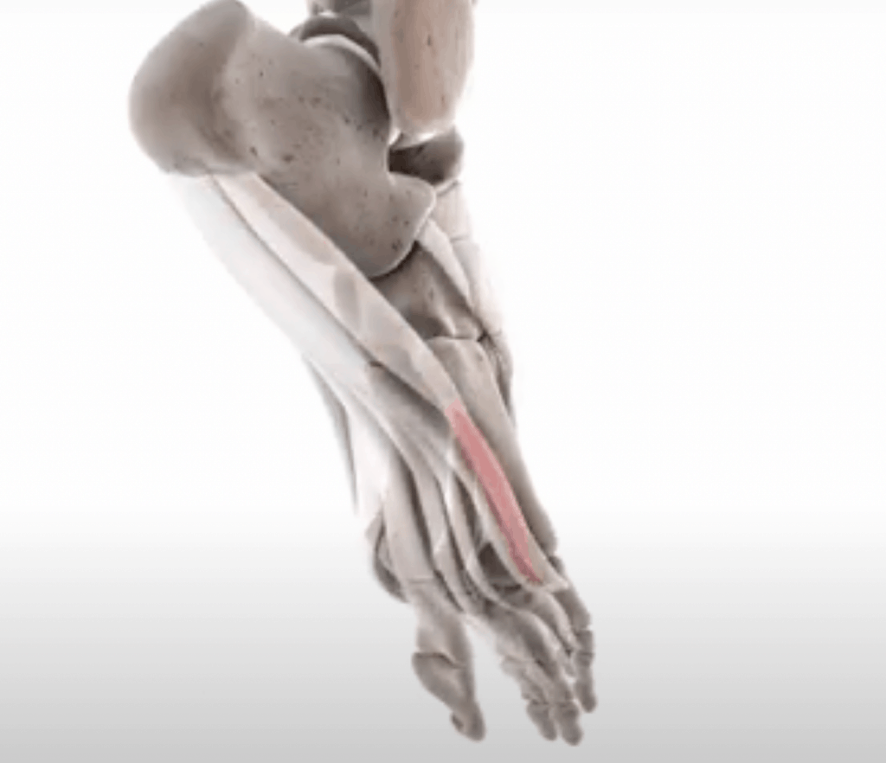
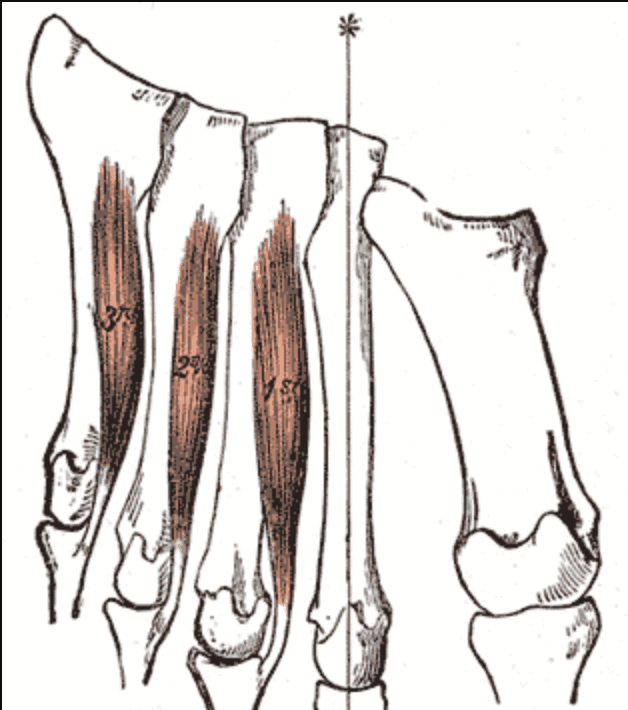
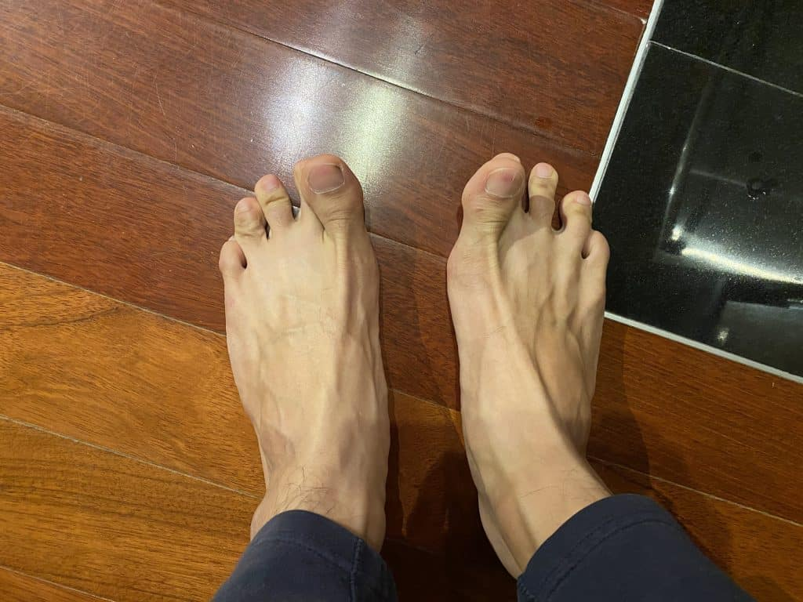
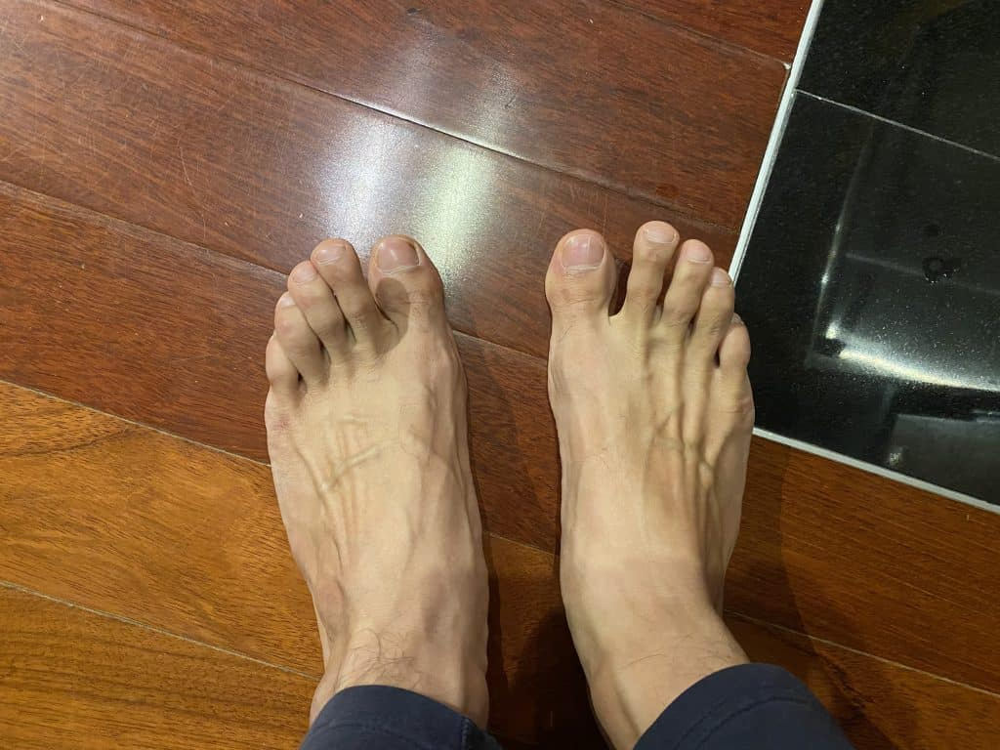
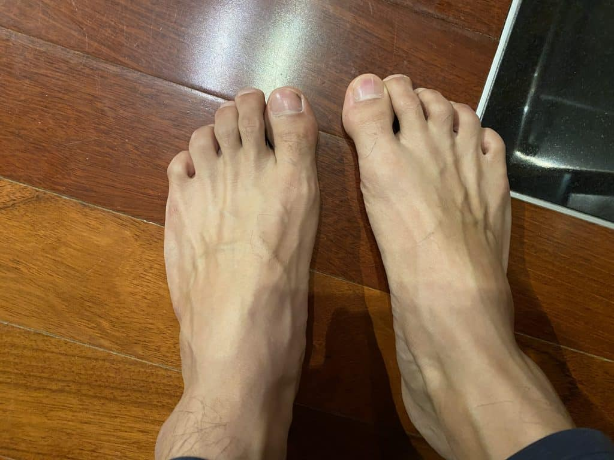
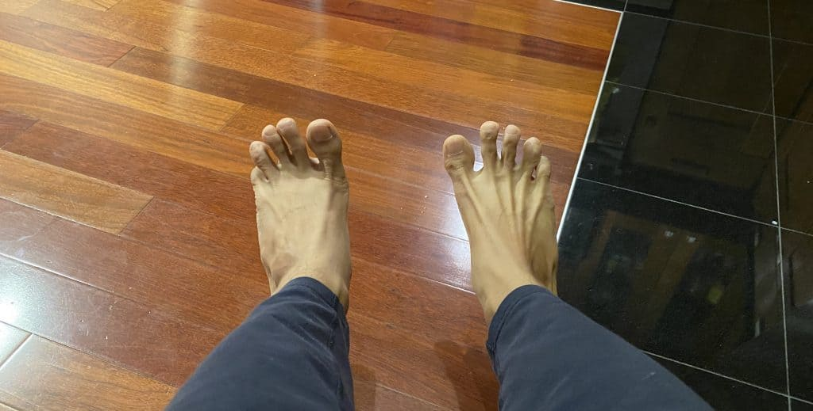
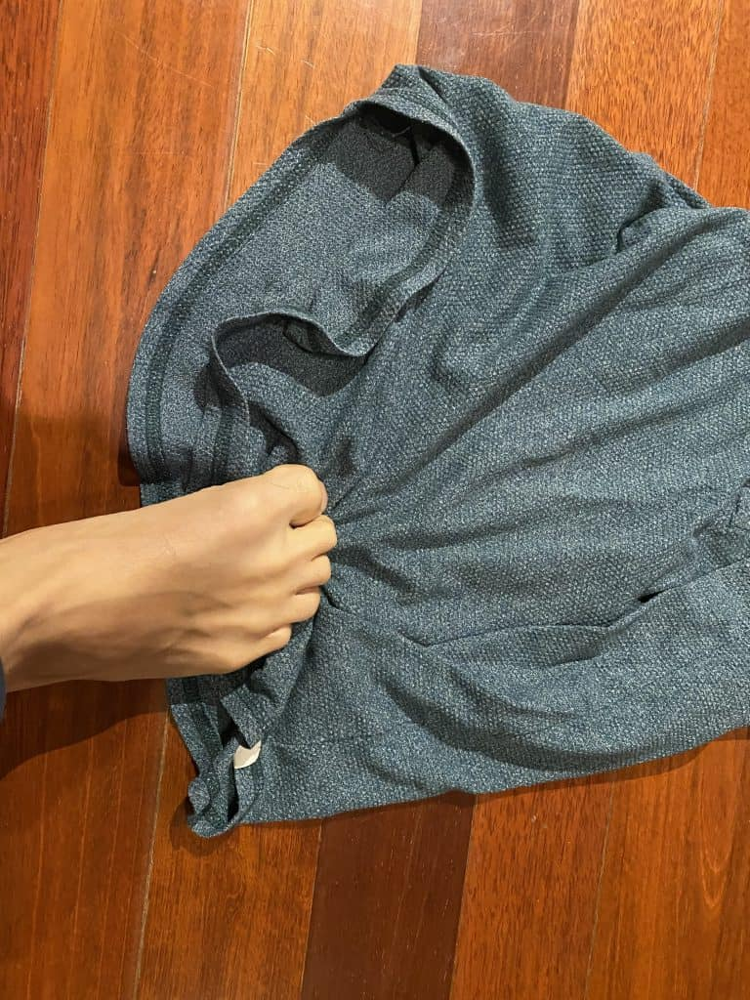

The reason you can not move your pinky toe is due to a poor neurological connection between your brain and your pinky toe. Not only does your pinky toe fail to correctly register signals from the brain, but the brain also has difficulty sending the correct signals that will cause the pinky toe to move. This is caused in part because the muscles in the foot have atrophied to the point where the information they provide to the brain is very poor. And they are weakened to the point that they are unable to fully comply with the signals sent from the brain. This is why you might get some jerky movements from your toe, but nothing that looks like the subtle movement of your hands.

If you don't use it, you'll lose it...

If you've recently taken off your socks to see if you could move your pinky toe, only to be disappointed, then you were in the same position as I was a few months ago. As it turns out, you can train your toes to move independently. There is no bio-mechanical reason why you would not be able to. **The main reason people are unable to move their pinky toe independently is because they do not use the finer muscles in our foot, leading to atrophy and poor motor control.**

## Setting a baseline in pinky toe control

When I first started this little experiment, my left pinky toe looked like it was conjoined with the next toe over. I had literally no ability to separate them. It's likely that the majority of people have a similar lack of control of their toes.

<iframe width="560" height="315" src="https://www.youtube.com/embed/beZNQyZLO1s" title="YouTube video player" frameborder="0" allow="accelerometer; autoplay; clipboard-write; encrypted-media; gyroscope; picture-in-picture" allowfullscreen></iframe>

## The four ways we can move our toes

There are four directions you can move your toes in.

- Flexion - Bring the toe down or curling it up
- Extension - Bring the toe up towards your head
- Adduction - Bring the toes closer together
- Abduction - Bring the toes further away

Feel free to take off your socks and see if you can move your pinky toe (or even your big toe for that matter) in any of these directions

### Why the pinky toe moves when you move the other toes

Your pinky toe moves with other toes (even when you don't want it to) because the muscles that govern more precise movements are underdeveloped.

These larger muscles pick up the slack and start moving the pinky toe around, even when that's not necessarily what you want to do. **Because your pinky toe muscles are so weak, the toes are not able to put into action a delicate message like, "move the middle three toes, and keep the pinky toe still".**

## Understanding the muscles behind the movement

Here is a quick overview of the muscles involved in moving our pinky toes. Each one of these muscles governs a specific movement direction for the pinky toe: extension, flexion, adduction, and abduction.

### Abductor Digiti Minimi

Movement = flexion and abduction

This is a long and thin muscle located on the lateral border of the plantar aspect of the foot. So basically, this small muscle runs along the bottom outside part of your foot. This muscle starts from the heel and attaches to your pinky toes. Attaching to your pinky toe means that this muscle does in fact govern at least some movement in your pinky toe. The Abductor Digiti Mimimi serves two roles. This small muscle governs abduction as well as flexion of the pinky toe.

### Flexor Digiti Minimi Brevis

Movement = Flexion

This much smaller muscle is also found at the plantar aspect of the foot. The proximal attachment is at the 5th Metatarsal bone and attaches distally to the pinky toe, similar to the other muscle we looked at. The Flexor Digiti Minimi acts is the muscles that allows for extension of the pinky toe.

As you can see from the diagrams, the Flexor Digiti Minimi is a very small muscle, and building enough strength in that muscle to flex your pinky toe will not be easy. The same goes for the Abductor muscle.

## Plantar Interossei Muscles

Movement = Adduction

The Plantar Interossei Muscles are actually a group of muscles between the metatarsal bones of the pinky, ring, and middle toe. These muscles all govern adduction for the toes (bringing them together). The muscle that governs adduction for the pinky toe is called Plantar Interossei Muscle III.

## Go barefoot whenever possible

The soles of your feet have an incredible amount of sensors in them. When you wear shoes, you starve those sensors and weaken them.

If someone held your arms in place with a cast for 20 years and then took them off and asked you to do a pushup, you would hurt yourself. This is what we're doing with shoes. Your feet are your best shoes, and if you treat them right, you'll have them in great condition for your entire life. The more you challenge the foot to move in different ways, the more it will adapt and function better.

You might think, "what about socks?". Boohoo. I know the floor is cold, but socks dampen the sensory feedback information from your feet. Similar to wearing shoes, this will also weaken the sensors in your feet.

## Strengthen Intrinsic Foot muscles

These exercises aim at strengthening the muscles we have neglected by wearing shoes. Doing these exercises will improve strength, coordination, and control amongst our toes.

The video below shows a list of exercises that you can use to strengthen the intrinsic foot muscles as well as some of the reasons for why this is so important.

<iframe width="560" height="315" src="https://www.youtube.com/embed/2OOJ9AQ1AEg" title="YouTube video player" frameborder="0" allow="accelerometer; autoplay; clipboard-write; encrypted-media; gyroscope; picture-in-picture" allowfullscreen></iframe>

### **Exercise 1 (Extension/Flexion) - Press down your toes into the ground and pull up only your big toe**

- It's likely that you will feel cramping in the foot. If you do, try to breathe and eat the cramp. The pain does go down after some time.
- You can make this easier by pushing your four toes down and let your big to rise up.

### **Exercise 2 (Extension/Flexion) - Push down only the big toe and raise up the other four toes**

- You'll also probably feel cramping in your feet as you do this drill. You can feel the cramp on any part of the foot, but most likely, it will be on lateral (oustisde) and medial (inside) part of your foot.
- When I did this, I noticed my left foot cramps, while my right foot does not. This implies I have more control with my right foot than my left.

### **Exercise 3 (Adduction) - Bring your toes together**

- Squeeze the toes together without curling the toes (flexion).
- If you're unable to this, you can place a finger or a pencil between the toes and then try to squeeze the pencil. For the pinky toe, place the pencil between the pinky toe and the ring finger toe, then squeeze.

### **Exercise 3 (Abduction) - Separate your toes apart**

- Bring your feet up, and then splay (spread apart) them one at a time. Once your feet are spread apart, plant them down on the floor one at a time starting with the pinky toe.
- This is probably the most difficult exercise to do, so make sure to take your time with this. Gaining some control will likely take a few weeks to see results.

### **Exercise 4 (Flexion + Strengthening) - Towel pulls**

- Step onto a towel on the floor. Step 1 is to drag the towel towards you with your four smaller toes, next drag the towel with all five toes. Repeat.
- You can add a weight onto the towel 5lb or 15lb to increase the difficulty. This last exercise is recommended once you have some control over your big toe and smaller toes.
- Doing this will increase strength of the muscles that govern your pinky toe movement.

If you do cramp during any of these exercises, understatnd that cramping doesn't necessarily mean you need potasium and water. In these cases, it means you do not have a lot of control in your foot.

## Takeaway from learning to move my pinky toe independently

### Moving your pinky toe takes a long time

**One of the biggest takeaways from learning to move my pinky toe over the course of a few months is that it is hard to do.** You essentially need to undo years of limiting the use of your pinky toe by the use of shoes and socks. Even someone like me who has an active lifestyle and practices a martial art (and therefore is barefoot a lot) had a hard time with this exercise.

### There can be a big difference between your two sides

You'll probably surprised at the difference between the abilities of your right foot vs. your left foot. As I mentioned before, my left foot looks much more bunched together than my right. It's not clear why, but it's not uncommon to have a side that needs more work.

### The cramping sucks, but it's a part of the process

**Any time you're working at your end ranges of motion, you can expect cramping.** The toes are no different. For most people, moving their big toe independently is a massive undertaking. Now multiply that challenge by God knows how much more. **The muscles that governm movement of the pinky toe are much smaller than those for the big toe. So expect to cramp and my advice is to breathe through it.**

### Moving your Pinky toe is fun

It's someting that I got used to doing at home when I was bored. Doing these exercises did actually make a difference. And moving my toes whenever I had my shoes off whas a fun challenge to try.

### Your feet are your foundation

I finally got to the end where I want to share how practicing moving your pinky toe (and all your toes for that matter) is very benefitial. I probably don't need to tell you that **your feet are the foundation for your body.** You are literally balanced by the muscles that move your foot. S**trengthening these muscles means having a stronger base. And thats a huge leg up in any physical activity you do!**

Doing these small exercises to train our feet goes a long way in providing us balance, coordination, and improved proprioception. So next time you have the chance, go barefoot. And if you havea . few minutes to yourself, try out some of these exercises. Their benefits are far reaching, and go beyond a weird party trick... which I have done.

Sources:

[https://med.libretexts.org/Bookshelves/Anatomy\_and\_Physiology/Book%3A\_Anatomy\_and\_Physiology\_(Boundless)/9%3A\_Muscular\_System/9.10%3A\_Muscles\_of\_the\_Lower\_Limb/9.10C%3A\_Muscles\_that\_Cause\_Movement\_at\_the\_Foot#Key\_Points](https://med.libretexts.org/Bookshelves/Anatomy_and_Physiology/Book%3A_Anatomy_and_Physiology_\(Boundless\)/9%3A_Muscular_System/9.10%3A_Muscles_of_the_Lower_Limb/9.10C%3A_Muscles_that_Cause_Movement_at_the_Foot#Key_Points)

[https://www.physio-pedia.com/Abductor\_Digiti\_Minimi\_(Foot)](https://www.physio-pedia.com/Abductor_Digiti_Minimi_\(Foot\))

https://functionalanatomyblog.com/2012/11/06/developing-intrinsic-foot-strength-with-frc-methods/
