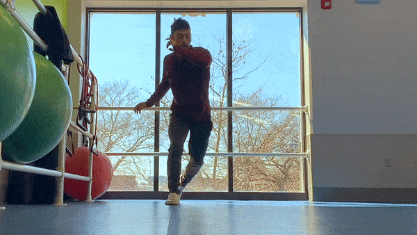
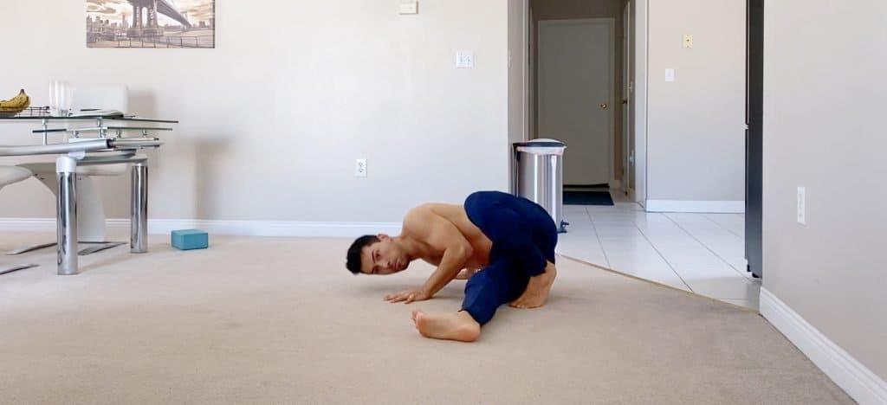

<table class="capoeira-table">
    <tr class="header-row">
        <th>Portuguese</th>
        <th>English</th>
    </tr>
    <tr>
        <td>Just like the game of chess or poker, there are certain rules that exist in the world of Capoeira. For example, there is very little grappling in a Capoeira roda. Another rule is that the instruments dictate the character of the Capoeira game played in the roda. At the same time, there is no official rule book and it is said that everything is allowed in the Capoeira roda. This might seem confusing, but this mix of custom and freedom is one of the things that makes Capoeira so unique. It can also make Capoeira a confusing thing to figure out!</td>
        <td>Just like the game of chess or poker, there are certain rules that exist in the world of Capoeira. For example, there is very little grappling in a Capoeira roda. Another rule is that the instruments dictate the character of the Capoeira game played in the roda. At the same time, there is no official rule book and it is said that everything is allowed in the Capoeira roda. This might seem confusing, but this mix of custom and freedom is one of the things that makes Capoeira so unique. It can also make Capoeira a confusing thing to figure out!</td>
    </tr>
    <tr>
        <td>When you’re brand new, you most likely start learning fundamental Capoeira movements. If you don’t know them, here is a list of [the most fundamental Capeoira movements](https://dendearts.com/list-of-fundamental-capoeira-movements/) that everyone should know.</td>
        <td>When you’re brand new, you most likely start learning fundamental Capoeira movements. If you don’t know them, here is a list of [the most fundamental Capeoira movements](https://dendearts.com/list-of-fundamental-capoeira-movements/) that everyone should know.</td>
    </tr>
    <tr>
        <td>
            <figure>
                
                <figcaption>click gif to go to fundamental capoeira moves post</figcaption>
            </figure>
        </td>
        <td>
            <figure>
                
                <figcaption>click gif to go to fundamental capoeira moves post</figcaption>
            </figure>
        </td>
    </tr>
    <tr>
        <td>
            ## Tips to play the game of Capoeira as a Beginner

            ### **Comfort with the ginga:**

            The most important thing in your Capoeira game is the ginga. Ginga translates to swing from Portuguese and is the foundation for all Capoeira techniques. The subtlety of this point is often lost on beginners because sweeps and acrobatics are more obvious to see. But the masters appreciate a ginga that is self assured and expressive. If you feel comfort and confidence, it will show in the way you ginga. Likewise, if you’re timid and shy, it will show in your ginga. A Capoeiristas can ginga in the roda, not do anything else, and still have a beautiful game.

            There are many ways to practice the ginga. A great exercise is to imitate the people who’s game you like. If you like the way they play, then try to copy the way they ginga. Look at what they do with their hands, their head, their hips, and their feet. Notice the subtle movements that express or hide their intentions. Every Capoeirista has a unique ginga, like a thumbprint. Discovering how they move their body’s a method for you to learn how to move yours. This isn’t to say that you want to be a carbon copy of this other person. It also doesn’t mean this is the way you will ginga for the rest of your life, however it’s a great place to start.

            Another method that was very fascinating to me was to imitate animals while you ginga. Kids in particular take very well to this. Adults who are more afraid to express themselves can sometimes struggle. But thinking about how a snake or a monkey would ginga is a great way to get creative. It doesn’t even have to be an animal that moves smoothly. Think about any animal. A frog or a cow works as well. The trick here is to try everything and see what sticks. The spontaneity of ideas is what creates a beautiful ginga, and when it flows naturally in the game of Capoeira, everyone takes notice.
        </td>
        <td>
            ## Tips to play the game of Capoeira as a Beginner

            ### **Comfort with the ginga:**

            The most important thing in your Capoeira game is the ginga. Ginga translates to swing from Portuguese and is the foundation for all Capoeira techniques. The subtlety of this point is often lost on beginners because sweeps and acrobatics are more obvious to see. But the masters appreciate a ginga that is self assured and expressive. If you feel comfort and confidence, it will show in the way you ginga. Likewise, if you’re timid and shy, it will show in your ginga. A Capoeiristas can ginga in the roda, not do anything else, and still have a beautiful game.

            There are many ways to practice the ginga. A great exercise is to imitate the people who’s game you like. If you like the way they play, then try to copy the way they ginga. Look at what they do with their hands, their head, their hips, and their feet. Notice the subtle movements that express or hide their intentions. Every Capoeirista has a unique ginga, like a thumbprint. Discovering how they move their body’s a method for you to learn how to move yours. This isn’t to say that you want to be a carbon copy of this other person. It also doesn’t mean this is the way you will ginga for the rest of your life, however it’s a great place to start.

            Another method that was very fascinating to me was to imitate animals while you ginga. Kids in particular take very well to this. Adults who are more afraid to express themselves can sometimes struggle. But thinking about how a snake or a monkey would ginga is a great way to get creative. It doesn’t even have to be an animal that moves smoothly. Think about any animal. A frog or a cow works as well. The trick here is to try everything and see what sticks. The spontaneity of ideas is what creates a beautiful ginga, and when it flows naturally in the game of Capoeira, everyone takes notice.
        </td>
    </tr>
    <tr>
        <td>
            ### **Don’t take your eyes off your opponent**

            It’s very common for beginners to be completely concerned with the movements they themselves are doing. And there is nothing inherently wrong with this. Capoeira movements can be difficult to do. At the same time, a roda is an organism with many moving parts. This includes the person whom you are playing with, the bateria (the band playing music), the crowd, the music. Etc. There are tons of things going on in the roda at the same time and it's difficult to pay attention to everything all at once.

            Your goal as a beginner is to think as little as possible on the movements you are doing. This way, you can give more attention to other things going on in the roda. For example, someone coming in to buy the game. This might seem like a herculean task at first, but there is a trick to this. Repetition. Repetition is your friend here. You want to repeat the movements you know as many times as you can until the movement becomes automatic. If you can do macaco blindfolded, then when the time comes that you need to do macaco, you won’t have to stand there analyzing if it’s a good time or not - you will just feel it. This is much easier said than done, so make sure to set aside time in your training to repeat the basics over and over again.
        </td>
        <td>
            ### **Don’t take your eyes off your opponent**

            It’s very common for beginners to be completely concerned with the movements they themselves are doing. And there is nothing inherently wrong with this. Capoeira movements can be difficult to do. At the same time, a roda is an organism with many moving parts. This includes the person whom you are playing with, the bateria (the band playing music), the crowd, the music. Etc. There are tons of things going on in the roda at the same time and it's difficult to pay attention to everything all at once.

            Your goal as a beginner is to think as little as possible on the movements you are doing. This way, you can give more attention to other things going on in the roda. For example, someone coming in to buy the game. This might seem like a herculean task at first, but there is a trick to this. Repetition. Repetition is your friend here. You want to repeat the movements you know as many times as you can until the movement becomes automatic. If you can do macaco blindfolded, then when the time comes that you need to do macaco, you won’t have to stand there analyzing if it’s a good time or not - you will just feel it. This is much easier said than done, so make sure to set aside time in your training to repeat the basics over and over again.
        </td>
    </tr>
    <tr>
        <td>
            ### **Lose your fear**

            A common problem beginners have is that they are afraid of getting into the roda. To be more accurate, most people are afraid of getting kicked in the head. You might be afraid to get in because the games are very fast or because the people playing seem like they want to take your head off. To a degree, your fear is actually a good thing. Your fear is what drives you to act fast. It’s a natural defensive response that helps keep you safe. At the same time, we don’t want our fear to dominate us, so here are some very easy ways to deal with this.

            - Play early on in the roda. Rodas are usually fast at the end, so make sure to play before things get too crazy. Enjoy the slow and medium paced games. Just don’t forget to train like you’ll be going in the fast rodas.
            - Use the basic esquivas. Believe it or not, esquivas like cocorinha are your best defense in most cases. If you feel unsure of what to do, you can default to this. As you gain more experience, you’ll start to understand what other esquivas you can try.
            - Use your ginga to move around the roda. It’s easier to kick you if you’re standing still. Move with role, ginga, and au around the roda. If you see a pocket of open space, moving towards it is a good rule of thumb.
            - Don’t try to win. Try to learn. Don’t think that you’re going to come into a Capoeira roda and kick everyone’s but in the first roda. That’s for anime nerds. Be humble and play the game, knowing full well that the first 100 times will be a complete struggle.
            - Play often, because the more you play, the more comfort you’ll have playing in the roda.
        </td>
        <td>
            ### **Lose your fear**

            A common problem beginners have is that they are afraid of getting into the roda. To be more accurate, most people are afraid of getting kicked in the head. You might be afraid to get in because the games are very fast or because the people playing seem like they want to take your head off. To a degree, your fear is actually a good thing. Your fear is what drives you to act fast. It’s a natural defensive response that helps keep you safe. At the same time, we don’t want our fear to dominate us, so here are some very easy ways to deal with this.

            - Play early on in the roda. Rodas are usually fast at the end, so make sure to play before things get too crazy. Enjoy the slow and medium paced games. Just don’t forget to train like you’ll be going in the fast rodas.
            - Use the basic esquivas. Believe it or not, esquivas like cocorinha are your best defense in most cases. If you feel unsure of what to do, you can default to this. As you gain more experience, you’ll start to understand what other esquivas you can try.
            - Use your ginga to move around the roda. It’s easier to kick you if you’re standing still. Move with role, ginga, and au around the roda. If you see a pocket of open space, moving towards it is a good rule of thumb.
            - Don’t try to win. Try to learn. Don’t think that you’re going to come into a Capoeira roda and kick everyone’s but in the first roda. That’s for anime nerds. Be humble and play the game, knowing full well that the first 100 times will be a complete struggle.
            - Play often, because the more you play, the more comfort you’ll have playing in the roda.
        </td>
    </tr>
    <tr>
        <td>
            ### **How to enter the Capoeira roda**

            When you are at the edge of the roda you have a decision in front of you. “Can I buy the game?” This is a prime example in Capoeira of the rules are not explicit. As easy as that would make our lives, Capoeira is simply not that rigid. To help, I created a quick graphic to help you understand if you should buy the game or not.

            

            There are many exceptions to this flow chart. For example, in some rodas, capoeiristas will go in two by two instead of one at a time. Another example of exceptions is a roda where only teachers are permitted to play. If there is a roda only for mestres, then anyone under the rank of mestre should not play. Another example is if a game is heating up, many teachers will stop anyone from buying the game so the game can continue. Although there are many cases where these rules might not apply, it's a good rule of thumb that you can use at the next roda you visit.
        </td>
        <td>
            ### **How to enter the Capoeira roda**

            When you are at the edge of the roda you have a decision in front of you. “Can I buy the game?” This is a prime example in Capoeira of the rules are not explicit. As easy as that would make our lives, Capoeira is simply not that rigid. To help, I created a quick graphic to help you understand if you should buy the game or not.

            

            There are many exceptions to this flow chart. For example, in some rodas, capoeiristas will go in two by two instead of one at a time. Another example of exceptions is a roda where only teachers are permitted to play. If there is a roda only for mestres, then anyone under the rank of mestre should not play. Another example is if a game is heating up, many teachers will stop anyone from buying the game so the game can continue. Although there are many cases where these rules might not apply, it's a good rule of thumb that you can use at the next roda you visit.
        </td>
    </tr>
    <tr>
        <td>
            ### **Practice Falling:**

            If you play Capoeira, you will fall. It’s not a question of if, but a question of when. That’s why it's important that you practice falling. If you don’t know how to fall, ask your teacher about training this. There is a saying, “Capoeira doesn’t fall, but when he falls, he falls well”.

            There are three main ways that a Capoeirista will fall, queda de quatro, queda de tres, and negativa de bimba. Queda de quatro is sitting back on your feet and hands while keeping your butt off the floor. Queda de tres is the same thing, but with one of your legs up in the air. Negativa de bimba looks like a pushup where one knee is by your chest, and the other is slipped between your opposite hand and foot. These three positions are used to absorb the impact of a fall and allow you to gently fall to the floor and quickly move. Although I won’t go over everything about how to fall in this post, there is a great exercise that you can use to practice falling.

            <figure>
                
                <figcaption>Negativa de Bimba</figcaption>
            </figure>

            To practice falling, you ideally want to have a partner. You’ll be asking your partner to sweep one of your legs while you stand. Start by spreading your legs apart so that it’s not easy to keep your balance. Staying very wide means we will be closer to the floor and the impact will be significantly less. Your partner will pick a foot and pull you forward