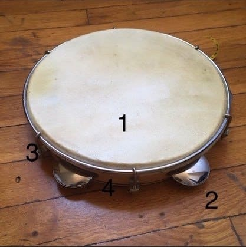

The Brazilian pandeiro, is a percussion instrument that belongs to the frame drum family. Earlier versions of it, originally emerged from Arabia and Northern Africa. It was later developed in Portugal and Galicia, and brought to Brazil by Portuguese colonists.  
In Brazil, a country blessed with very rich and diverse musical traditions, the pandeiro is one of the most prominent instruments across almost every style of Brazilian music. Some of Brazil and the world’s most renowned pandeiro players, are featured extensively in samba music, as well as all of its sub genres and associated styles.  
In capoeira, a Brazilian art form with similar cultural relevance as Samba music. The pandeiro is an integral part of the batería (the ensemble of music al instruments playing the rhythms that capoeira practitioners move to), being the second instrument in importance after the berimbau, the musical bow that dictates the atmosphere of capoeira games.

The pandeiro consists of a wooden (or plastic) circular frame, with a drumhead made of goatskin, cowhide, or plastic.

1. Goatskin drum head.
2. Jingles (or platinelas). In this instrument: 5 pairs.
3. Adjustable tuning hooks. In this instrument: 6 hooks.
4. Wood frame.

Depending on how the head is attached to the frame, the pandeiro tuning can be adjustable (if attached with tuning hooks), or fixed (if tacked in place).  
Additionally, the pandeiro displays several metal jingles, or platinelas arranged in pairs, which produce a crisp, metallic sound that complements that of the head when hit by one hand, while being held by the other.

## **Technique:**

Proper technique varies according to the instructor, the musical style, or the school. In samba as well as in other forms of contemporary music, the pandeiro is perceived as a portable drum kit, with plenty of room for advanced playing techniques. In capoeira tradition, however, the pandeiro is an accompanying instrument, second to the berimbau, and therefore any playing technique should be applied to hold down the rhythm, while controlling its volume and dynamic output, so as to not undermine the berimbau.  
With this in mind, let’s review a few basic approaches to each hand:

## **The holding hand:**

Depending on how many pairs of platinelas the instrument has, the pandeiro frame is divided in sections, with one pair per section. There’s one section that has no jingles, which is where the pandeiro is held from.

Hold the pandeiro by the frame, securing it at the area where your fingers join the palm of your holding hand. Leave a small gap between the palm and the frame, and lightly place the  thumb at the edge of the drum head for balance. Avoid holding the rim with a tight grip, which will cause you to place the thumb over the drumhead. This dampens the resonance when hitting the low notes with the thumb on the opposite hand.

Holding the pandeiro as described above, try to draw an imaginary line from the inside of your forearm, through your palm, all the way to the rim on the opposite side of the drum head. This line divides the head in two sections, and serves as an axis for the rotary motion made by your wrist and forearm to engage the jingles.

It is important to keep the forearm and your wrist relaxed, but also straight and aligned when shaking the pandeiro with the holding hand. A tight grip while bending the wrist, will cause fatigue due to lack of proper blood flow, and make the jingles sound unevenly.

## **The striking hand:**

Using the thumb, fingers, heel, and palm of the striking hand in different combinations will allow access to a wide array of rhythmic patterns. In capoeira music, however, the thumb and the palm are used predominantly, alternating with a rotating shake on the holding hand. The heel and the fingertips can be used to add color, but without overpowering the sound of the berimbau  
Hold the pandeiro as discussed above. Draw an imaginary straight line from your forearm to the edge of the pandeiro. The point where this line ends is our 12 o’clock position.  
On a basic pattern, the thumb on the striking hand will hit the head close to the rim, at the 3 o’clock position, and the flat palm will hit the center of the drum head.  
The thumb strike will generate a low-pitched, sustained type of sound, which can be cut short by the dry, high pitched sound of the palm strike.

## **Basic patterns:**

### **Pattern 1:**

Thumb-palm-thumb-jingle shake

### **Pattern 2:**

Thumb-Thumb-palm-thumb-jingle shake

### **Pattern 3:**

Thumb-palm-thumb-jingle shake-palm  
Capoeira music has strong links with samba, where the pandeiro plays a more prominent role. In this style, it is common to use the heel  and fingertips of the striking hand to add rhythmic variety.

## **Basic samba pattern:**

Lightly place the pinky side of your striking hand over the drum head, with the edge of your hand closely matching the round edge of the instrument.

As seen on the image, the fingertips will hit the 12 o’clock region, whereas the thumb and the heel will be roughly at 3-4 o’clock. Slowly at first (and with the help of a metronome set at 44 bpm), play the following pattern:  
Thumb-fingertips-heel-fingertips-thumb.

As you gain confidence playing the pattern clearly and keeping proper time, you can add a left hand shake, exactly at the moment where your fingertips on the striking hand hit the drum head, approximately at the 11 o’clock position.

## **Playing with other instruments in a Capoeira batería:**

When playing any type of music as a group, a successful performance depends on the close interaction among the musicians. In capoeira, all instruments (berimbau, pandeiro and atabaque, plus reco-reco and agogô, depending on the group), follow a three-note pattern, followed by a pause, in most cases. Playing the pandeiro requires, not only matching  that three-note pattern, but closely listening to the berimbau, the instrument leading the spirit of the game.  
Pandeiro and berimbau, 76 bpm

Pandeiro and atabaque, 76 bpm

Pandeiro and agogô, 76 bpm

Remember: it is very important to start slow, and then work your way up to speed (where speed is required). The use of a metronome, or any other time-keeping device, is strongly recommended. Some of these patterns are played faster for certain games, such as Miudinho and São Bento Grande de Bimba, especially as the energy rises and the players and musicians get carried away in the moment. The opposite is also true. In extremely slow games like capoeira Angola, the instruments and the singing create an atmosphere that calls for slow-paced, close to the ground, closer games; still, most novices have a tendency to speed up when they shouldn’t.  
Without proper practice to develop a technique that will allow you to be in control of the tempo and volume of the instrument, you will find yourself worrying too much about how well you are playing, instead of having fun. And if you’re not having fun, chances are, it’s neither samba, nor capoeira.

## **Basics of batería etiquette in Capoeira:**

The person playing the pandeiro must be able to maintain consistent time (never faster or slower than the rest of the instruments) and volume (never louder than the berimbau), and quickly adapt to changes in the speed or style of the music as dictated by the berimbau. All the musicians have to, in general, be aware of verbal or non-verbal instructions from the person leading the game, and also, be prepared to pass their instruments to someone else, upon request by another player, and with the approval of the leader.  
In most cases, no instruments can be handed to anybody else in the middle of a game or a song, so as to not disturb the energy of the roda. Every group follows different house rules, and it’s important, for any musician, to carefully observe the bateria before joining in, in order to understand the house rules set by every group.  
It is important to understand that the roda (especially at events), is not the place to practice the instrument. If you are interested in joining in, the leader of the game is assuming you can hold your own when playing. Some Mestres even go as far as only allowing people whom they know for a fact, can play (as well as observe the rules that apply to their group), to join the bateria.  
If you want to take over the pandeiro, always make eye contact with whoever is playing. Maybe they are tired and ready to pass the instrument. Or maybe they are having a great time rocking out on the pandeiro and generating great energy, and would like to stay on it a little bit longer? This is where a lot of non-verbal communication happens. Ultimately, instrument changes can only occur at the discretion of the leader. Similarly, when approached by someone who wants to take over the pandeiro from you, always make visual contact with the person leading the roda. This is generally the person playing the Gunga (the lowest-pitched berimbau). A positive nod should suffice to let you know it’s ok to hand over the instrument. Always observe, ask questions and ask for permission.
