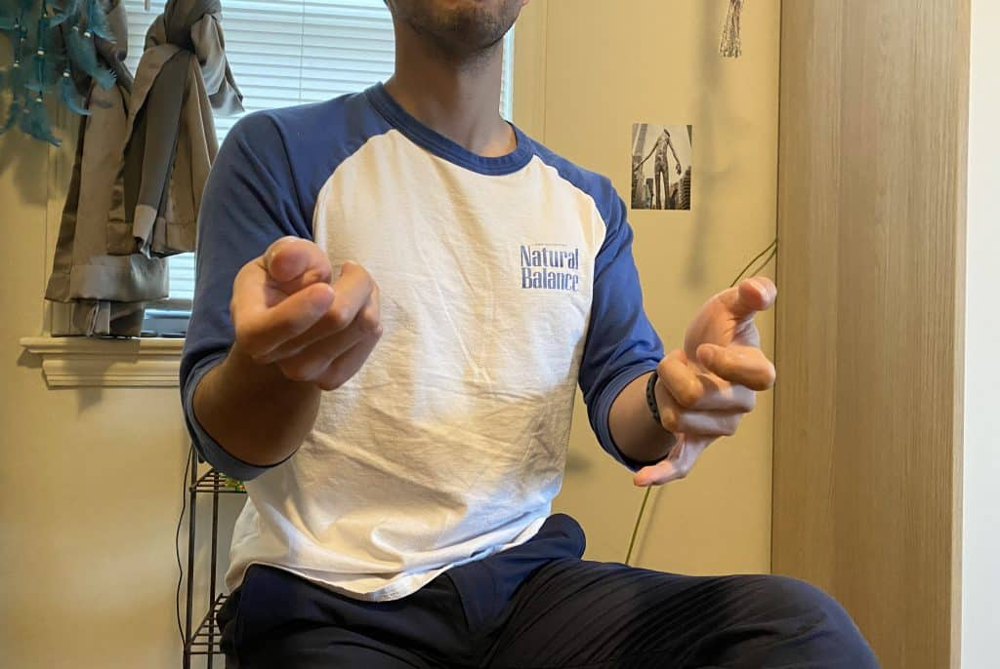
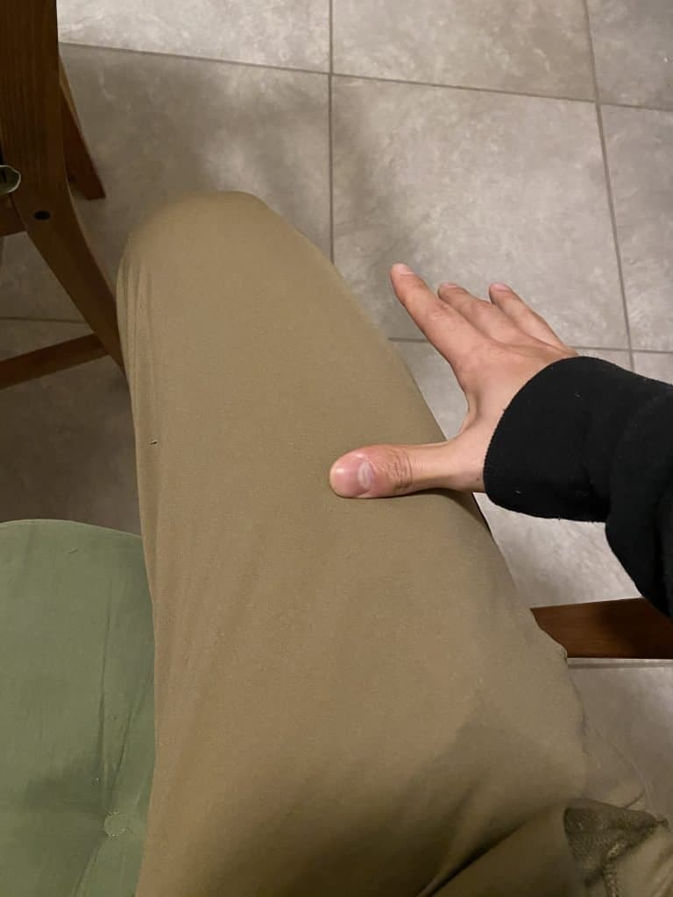
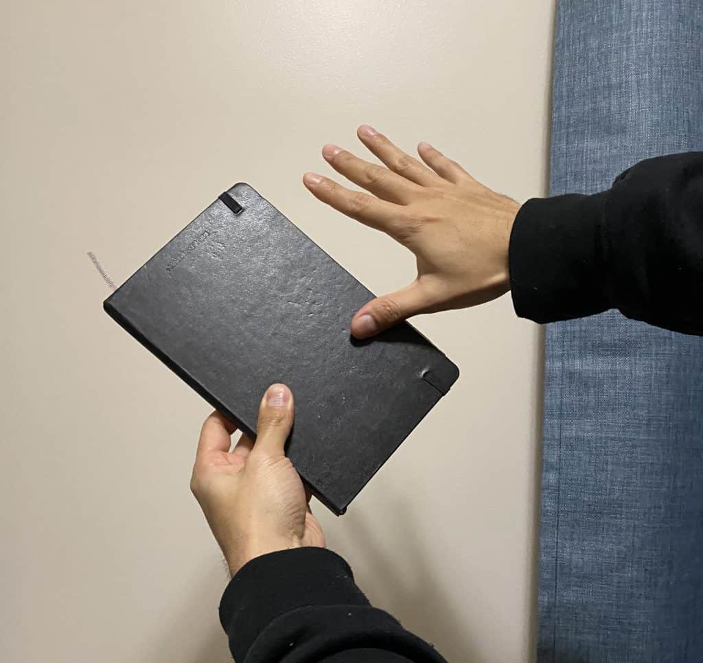
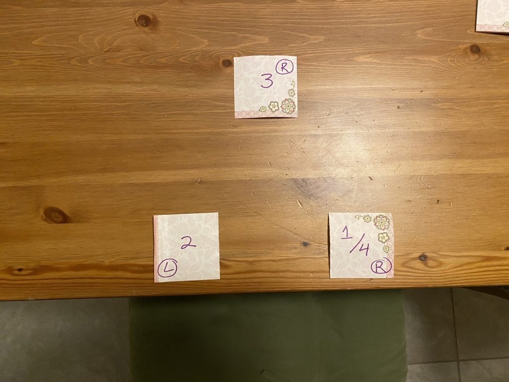
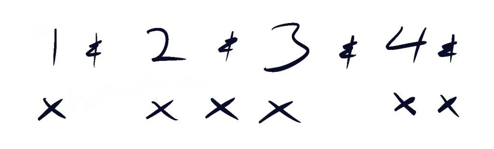
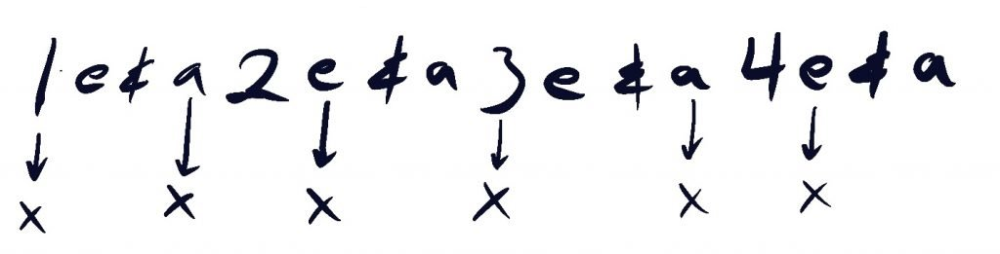
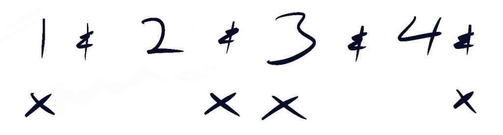

**Not everyone has an atabaque, berimbau, or pandeiro available at home. But everyone does have the mean to practice these percussion instruments with items found around the house.** These instruments are fairly rudimentary and can be improvised using every day items that I will discuss below.

## Berimbau Practice without a Berimbau

The Berimbau is probably the last instrument you think can be improvised. The musical bow has an odd shape, but there are ways to practice it when you don't have one around.

### Carry things with your pinky for improved strength and endurance

**The first way is to focus on the strength of the pinky supporting your Berimbau.** The first thing you'll notice when you start playing the Berimbau is that it is heavy and unwieldy. The instrument is very difficult to balance on your poor pinky.

My favorite exercise to build strength in your pinky is to hold random household things like bags with your pinky. I started doing this holding a gallon of water in college that I would take a swing from throughout the day. Many capoeiristas do this without even thinkinga bout it. But in case you didn't know, this is a great training regiment that will help improve the amount of time you can hold the Berimbau.

### The Air Berimbau for visualization

The second way to practice, is to play the air Berimbau. The brain does not differentiate well between practice that is real and imagined. This is why **visualization is a great tool when you are able to give a lot of attention to your imagined practice. Move your hands in the same way you would a normal Berimbau and think about the sounds it would produce.** Believe it or not, this type of practice is very beneficial.

If you're practicing a new song, you can play the air Berimbau as you sing to see if you can do both at the same time. You can also practice variations, rhythms, or just jam out with your air Berimbau.

This may not be easy for some people as it might be difficult to know when you make a mistake or are rhythmically off beat. Playing with a metronome will help you know when you're on or off beat. Playing the air Berimbau also benefits greatly from having prior experience playing a real Berimbau. Without this prior experience, it may be difficult to accurately visualize.

## Practice Pandeiro Without a pandeiro

**The Pandeiro can easily be substituted by your thigh, a book, or a simple piece of cardboard.** The great thing about using your body as the improvised instrument is that you everything you need with you all the time. You can tap and hit your thigh the same way you would a Pandeiro. And even though the sound will not come out the same way, the mechanics are identical.

One thing I really enjoy about practicing the Pandeiro on my thigh is that it can be done ANYWHERE. This method is free, and is effective at improving your playing ability.

The only thing you can not train in this way is the use of the hand holding the Pandeiro. This is why it can be so useful to get something like a book or piece of cardboard. I recently ordered a notebook online, and used the book as my makeshift Pandeiro. The results are better than you would expect. The sound of course is not the same, but this method of playing identical!

Now you can rotate the hand as you would when playing a Pandeiro. You can also try playing the book (in this case) in different positions as you would with the real thing. This is very useful as you need to practice while moving both hands at the same time.

In case you're curious about playing the Pandeiro, we have a very thorough guide that goes through playing the Pandeiro for Capoeira.

https://dendearts.com/how-to-play-the-pandeiro-for-capoeira

### Making the playing the Pandeiro feels natural

Part of playing a percussion instrument like the atabaque, berimbau, or Pandeiro is that you have to be able to keep a beat and sing at the same time. This can feel as though your brain is being torn in two directions. A good test of your ability to double-task is to play the Pandeiro and talk at the same time. This is a way to train you brain, and make it easier to play and sing at the same time.

Holding a normal conversation will feel very difficult at first, but it does get easier the more you practice. Try this with the normal Capoeira beat and other rhythms like samba. If you can improvise a conversation with someone, you'll be well equipped to play the Pandeiro in a Capoeira roda.

## Practice Atabaque Without an Atabaque

Any time you are sitting at a desk, you can play the Atabaque. It doesn't matter, if you're in school, at home, or at work. A counter or desk work great as an improvised Atabaque. Push back your book or laptop and start banging on the surface in front of you.

If you try this, you'll be surprised to find out that the way you play the atabaque and the sounds it produces correspond fairly well with a counter or a desk. There have been plenty of times that I've taken a break from work and started playing some Capoeira rhythms on my desk. This is a great way to clear your mind at work or at home instead of going on your phone and droning out on social media.

### Speed up your learning

**A hack that I really love for beginners is to put numbers on your desk that indicate where you will hit to create a rhythm.** This simple idea not only helps you remember how to play the rhythm, but it also is a constant reminder to practice. Part of any good practice system is to make it very easy to do. Here is an example of a typical Capoeira beat for São Bento Grande written out on a desk.

Here is a photo of a typical Capoeira rhythm on the table.

You can do the same for Samba, Barravento, Maculêlê,etc.

You can practice the Atabaque in the same way that we practice the Pandeiro. Play while having a conversation to practice your ability to play while singing. This should feel natural for all the rhythms that you play in Capoeira.

The Atabaque is the heartbeat of the roda, which is why it is one of the most difficult instruments to play in the bateria. When the Atabaque is off, the entire roda will feel it. At the same time, a skilled player of the Atabaque is a huge benefit to the roda and will help set the mood for the games.

## Clapping rhythms learned

By far the easiest instrument to practice is clapping. Easiest because you are the instrument. **As simple as this might sound, practicing clapping will help develop your sense of rhythm. Capoeira has three very common clapping patterns that are heard in almost any roda.** They vary in their use depending on the group and rhythm being played.

The three rhythms are...

- Palma de Bimba
- Palma de Terreiro
- Palma de Dois

### Palma de Bimba

**The classic Capoeira song goes, "A plama de bimba e um, dois, tres". Meaning, Bimba's clap is 1,2,3. And this song accurately describes the simplest clapping pattern found in Capoeira.** Mestre Bimba popularized this clapping pattern and integrated it with the music of his style, Capoeira Regional. Here is a diagram to illustrate this clapping pattern.

The numbers 1 to 4 are the beats. The "&" symbols are the spaces between the beets.

One of the reasons this clapping pattern is so ubiquitous is because it is easy to learn. 99% of new students can clap on beat using this pattern after a couple classes. Within the musical structure of Capoeira rhythms, this clap is very easy to learn and use.

This rhythm is militant. Rhythmically it sounds like a march. Palma de Bimba is very simple and contributes to a game that is less flowery and more direct.

### Palma de Terreiro

If you enjoy Samba music, you'll notice that the same clapping pattern is used. It is very difficult to say where Palma de Terreiro originates from, but it is clear that this clapping pattern is very traditional and is used in many cultural manifestations. Candomble, Cocô, and Samba are some examples. This clap is used by many groups and can be heard in many videos of old Capoeira rodas. **Today, Palma de Terreiro is very popular and many groups use it as the go-to clapping pattern for all kinds of games.**

**Of the three claps, Palma de Terreiro is the most rhythmically complicated. At the same times it is also the most rich**; Less militant that Palma de Bimba. This rhythm is more playful and plays into the _malicia_ of the Capoeira roda. Here is diagram to illustrate the rhythm.

Note the need to divide the beats into quarters. For example: "1" represents the 1/4, "e" represents the 2/4, ""&" represents the 3/4, and "a" represents the 4/4 of the beat.

## Palma de Dois

As the name suggests, this is a two clap. Unclear about the origins of this clapping variation. The origins of this clapping pattern are not clear, however it's possible that the clap originates from Candomble or Samba, and was then transferred over to Capoeira over time.

T**his clap is almost identical to the palma de bimba, except the first clap of the triplet is absent. Some groups will use this during certain rhythms such as São Bento Pequeno, Angola, or others.**

Unlike Palma de Terreiro or Palma de Bimba, this is most likely not a rhythm you will here for the entire roda. Most likely a portion of the roda will have this clapping pattern. The pattern will either change or stop all together depending on the leader of the roda.

Palma de dois has a little more swing than Palma de Bimba, but is equally easy for beginners to grasp. Here is an illustration of the clapping pattern.

### Is there clapping during Capoeira Angola rodas?

**Yes, some Angola schools use clapping during the roda.** Those that do clap usually do so, do not clap 100% of the time. They clap when the music, the players, or the leader of the roda call for it. This is a very organic approach to clapping, as opposed to contemporary rodas where clapping is supposed to happen 100% of the time. However, some Angola groups are against any clapping during the roda.
