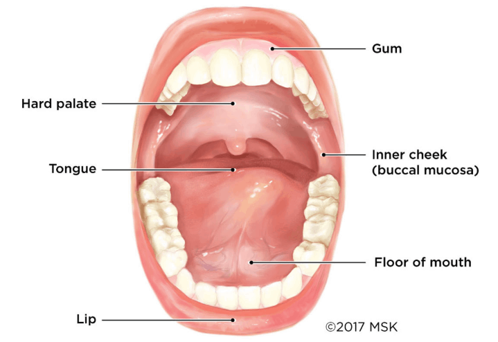

If you want to train Capoeira, it might be a good idea to know how to say the name of the martial art. There’s nothing wrong with mispronouncing Capoeira, it’s not the easiest word for English speakers. But this guide can help you figure out how to say the word and hopefully a few other words that you’ll encounter in the Capoeira world. Capoeira is a Brazilian word by origin, and spoken in Portuguese.

Capoeira is pronounced like this, \[ka-po-wei-ra\]. The brackets dissect the words into digestible parts that we can try to wrap our english speaking brains around. The pronunciation is not that simple, so I will go over these four syllables to make it clear how each is produced and how we as english speakers can say the word, without feeling any sort of embarrassment.

## **How to say Capoeira**

For English speakers, the problem is how to pronounce the vowels. We can take the word piece by piece and try to rework it so it sounds more like how a Brazilian would say it. The first syllable of Capoeira is \[ka\] and already here we have a problem because the American is going to want to say the syllable like CAptain America. CApital, etc. The solution here is to think of how an english person would pronounce the world “Can’t” or “Car”. This English (from England) “A” is most similar to how you want to pronounce the “A” in CApoeira.

The second part, \[po\] seems like its easy, but actually this is the second most difficult part of pronouncing the word. “Po” in America english is pronounced like so, “poeh-w”, The vowel is elongated and sometimes has a subtle “wa-“ sound to it at the end. The \[po\] in Capoeira doesn’t have this. Just knowing this might be enough to help you correct your pronunciation, but if it’s still unclear to you how to say the word, then I would suggest thinking of a typical russian accent you would hear in a movie. Now imagine that russian person saying “O.K.”. This “O” is the vowel sound we want. Now all you have to do is add a “P” before the word and voila!

The third part, \[wei\] is one of the harder parts for english speakers. again, this has to do with how we pronounce our vowels as compared to a typical Brazilian. This part of the word usually sounds like saying “wear” when said by Americans. How can we improve this? Think about the word “when”, now take away the “n”, but pronounce everything the same. “Whe”. You should have something that sounds very close to a Brazilian pronunciation of the word.

Lastly, the \[ra\]. In American english we have the tendency to make our “R” sounds by gritting our teeth and it almost sounds like we’re growling. To show you what I mean, say “car” and just hold the “R” sound for a little bit. The Brazilian “R” is a lot more subtle than this. The “R” sound in Portuguese is manufactured a little different from the way we do it, and this is how it’s done. Take your tongue and smack it against the front part of your palate. It might sound like a “d” sound weirdly enough, but if you hear this, it will let you know that you’re on the right path.

Obviously this will take some practice. If you’re not already fluent in Portuguese, then this will no doubt be a little difficult. But learning a new language is a great way to connect with people and make new friends. Here are a few other common words thats seen in Capoeira and I’ll provide a brief synopsis of the word along with their pronunciation.

Roda \[hoh-da\] - Where the game of capoeira is played by two capoeiristas.

Berimbau \[be-reem-baw\] - The main instrument in the Capoeira bateria. Different rodas will have a different number of berimbaus. These instruments lead the other instruments are usually played by the most senior group members.

Pandeiro \[pan-deh-ro\] - A percussion instrument that helps add a variety to the rhythm being played. The “R” in the “ro” of pandeiro is pronounced in the same way as the “R” in the world Capoeira.

Atabaque \[ah-tah-bah-kee\] - The rhythmic base of the bateria. This instrument is usually the only “drum” in the bateria and provides the foundation for the beat that is played.

Agogô \[ah-goh-goh\] - Similar to a cow bell. Instrument that is sometimes used in the Capoeira bateria.

Meia-Lua de Compasso \[meya-luwa gee com-pah-soo\] - That’s a mouthful! A foundational kick in Capoeira. Also called Rabo de Raia in other schools of Capoeira.

Rasteira \[has-tey-ra\] - A fundamental take down move. Your foot hooks the foot of the opponent and sweeps them.

Esquiva \[es-kee-va\] - Esquivas are the dodges in Capoeira. There are many esquivas. Esquiva lateral, esquiva baixa, esquiva atrais, etc. These esquivas have many different names depending on the group.

Jogo \[jo-goo\] - directly translates to game and refers to the game of Capoeira.

Floreio \[floor-eyo\] - refers to acrobatic movements in capoeira. Loosely translates to flowery movements, they are not seen as necessary to the game of Capoeira but help make it more interesting and fun.

## **How to improve your accent**

When I first started learning Portuguese, the thing that helped me the most was learning Capoeira songs. I would go over the lyrics, figure out what they mean and then start practicing on my own. Looking at the lyrics and hearing how other people sing the songs is a great way to learn how to pronounce certain words. Using this method I was able to figure out little things about portuguese. For example, the “r” at the front of any word almost always makes a “h” sound.

There are many Capoeira songs, so finding one that you want to earn can feel like looking for a needle in a haystack, but actually you can look for any song and start going through the lyrics. A popular song that you can use is the one below. Paranuê is a popular song that every single Capoeira school knows and you can use to start learning simple portuguese words and how they’re said.

<iframe width="560" height="315" src="https://www.youtube.com/embed/RBDERfHbx74" title="YouTube video player" frameborder="0" allow="accelerometer; autoplay; clipboard-write; encrypted-media; gyroscope; picture-in-picture" allowfullscreen></iframe>

I would avoid looking at things like interviews and other things where people are talking Portuguese for now. The reason is that when people speak, they often use a lot of slang and don’t stick to a grammatically “correct” way of talking. When you sing you really need to articulate what you’re saying, which makes it easier for a non-native speaker to pick up on subtle differences in words, and get a feel for the language.

The main thing for helping your accent is exposure! Make sure that you have some exposure to the portuguese language. You don't even have to stick to just Capoeira songs. Look up any Brazilian song that you like and look up the lyrics. Capoeira songs tend to be easier because a lot of times they are sung as chants, but there’s no reason you can’t listen to an album by someone like Seu Jorge and look up the lyrics to his music. Exposure also means listening in on conversations between teachers. You might not understand a single word, but the idea is to train your ear so that it can start picking up on how the Portuguese language works.

<iframe width="560" height="315" src="https://www.youtube.com/embed/mQ78AX99k0Y" title="YouTube video player" frameborder="0" allow="accelerometer; autoplay; clipboard-write; encrypted-media; gyroscope; picture-in-picture" allowfullscreen></iframe>

## **Brazilian Accents**

Even if you learn to say a word in Portuguese, it’s possible that according to one region in Brazil, its correct, while in another it is not. This is because Brazil as many regions, and the regions can different a lot with how they pronounce certain words. Rio de Janeiro has a tendency to make a “shhh” sound with words that end in “s”. People from Campinas have a very american sounding “r” when saying words like “porta”, which means door. On the other hand, people from the sound of Brazil have a tendency to use “tu” instead of the more widely used “você” to say “you”.  There are many differences, but don’t get too bogged down by them. If you’re on the path to learning Portuguese, then make sure to keep practicing. Messing up and getting corrected by native speakers is often the best way to improve your language skills and eventually become fluent!
