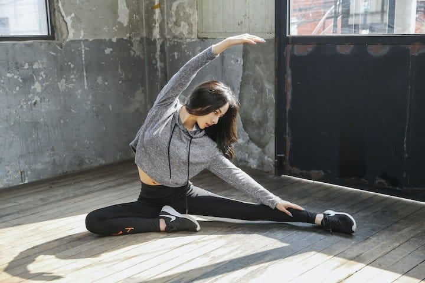

The trend of working out at home is something growing in the past years and today has reached a fever-pitch. There are more (free!) workout programs and systems available now than ever before. **Tons of companies are pushing for people to workout at home, which presents a huge challenge of motivation!** Motivation is overrated and isn't what gets people out of bed to do their workout. **The most vital thing to consistently working out at home is to have a system. This system has four components: Cue, Craving, Response, and Reward.**

This is an example of a virtuous loop, that reinforces itself and helps promote good habits.

Many productivity books have been written on how to stay consistent with a habit, but few have talked directly about it in terms of your workout. **The hard part about working out is staying consistent.** There is no great secret to it, and it does not involve "motivation". I personally DO NOT ENJOY WORKING OUT, and most people I know who are absolute studs and religious about their workouts are not either. But they do it because they have generated strong habits that carry them through those tough days.

## Step 1: Cue your workout

For you to have a good habit, you need something to cue the behavior. **Just like Pavlov's dog, you need a signal that your brain understands as "it's time to workout"**.

### Example list of Cues

- Auditory cue: Playing "workout" music
- Tactile cue: Changing to workout clothes
- Verbal cue: Say something your yourself (like an affirmation)
- Spatial cue: Move to another room meant for working out

The traditional way of beginning your workout is to by sheer force of will out of your bed, put on your clothes, and start doing pushups. This is terrible. We want to ween ourselves off of "Sheer willpower" as much as possible. A habit is much stronger than willpower. Cueing your brain will mold your behavior over time, but this cue needs to be followed up with a strong enough promise of reward to make it attractive. This is discussed in the next section.

### Workout Applications: Get your gym clothes on after work

Imagine it's the end of the work day. You arrive home and the first thing you see are your workout clothes. **Your first step and first major victory is going to be to put on your workout clothes.** If you can get yourself to do a very little thing, then it's going to be a lot easier when you ask it to do something bigger, like 20 squat jumps.

Traditional Thinking:

- I'm feeling motivated today, I'll do an 8 mile run. (motivation dependent. Good motivation, poor system)
- My phone is dead and I can't run without my playlist; I'll run tomorrow. (no cue to promote habit)
- I'll go to the gym when it's a little warmer outside (externally dependent cues like weather can fail)

Habit Forming Thinking:

- When I get home, I'll put on my gym clothes (cue is putting on gym clothes)
- This playlist is for working out only. Every I come home from work I'll put it on (cue is music)
- As soon as I get up, I'll move to the living room (cue is getting to livingroom)

👆🏼 the second list of tasks are easier to do, and much more likely to get done.

**As a rule, this initial cue or habit should take no more than 2 minutes to do.** We want to build a strong connection between getting changed after work and putting on your workout clothes. This connection might work a little differently depending on when you have time to workout. This might be in the morning, afternoon as mentioned, or prior to going to bed.

The time doesn't matter. **What matters is the consistency of the cue.** This means prepping clothing the night before so you don't have to rummage through your clothing and "figure out" what you will wear for your workout.

Our willpower is not something you want to use in a situation like this. It's WAAAAAAAAYYYY too easy to start bickering with yourself about what you will wear, and then avoid working out all together. Don't give yourself a chance to make excuses. **The best thing you can do is to make it SOOOOOoooooo easy, that you almost feel compelled to comply with the cue.**

## Step 2: Feed the positive craving

Motivation is in part creating a craving for something positive. **It is the expectation of a reward that motivates us, not necessarily the reward itself**. If we know that doing a task will reward us with a lot of money, that task becomes way more attractive to us. This is how gambling works. The brain gets a rush of dopamine when I gamble, not so much when receiving the reward.

The same thing happens to people who watch "just one more" YouTube video or "one more" episode of their favorite Netflix show. The rush comes as you give in to the idea of watching another show, not when you're actually watching the show, thinking, "How did I end up laying on my couch for another 45 minutes!?".

**Linking rewards to your habits make the habits you are building more enticing.**

List of rewards

- Social: Praise from peers
- Personal: Reward is the action itself
- Satisfy craving: Satisfy a craving like checking social media, Youtube, Netflix, etc.

We can use these sources of reward as the positive feedback loop we need to build the habit.

### Workout Applications: Join a community online

There are literally hundreds of apps and online communities that track their progress and encourage each other. **What you want in a community are the following:**

- The ability for people can track their progress in some way.
- The behavior you want is widely accepted or expected by the community.

Many writing groups do this. They say "We are going to write 50,000 words in 6 months", for example. This is a way to hold each other accountable. And it set a standard for an amount of work that everyone is encouraged to meet. This doesn't mean you have to do it, but the friendly competition might push you to do more than you would do otherwise.

Posting on social media is another tool, but this is most effective when it's directed towards a community that you can interact with. For example, the feedback I get from my Capoeira training partners is more beneficial than that of my friends who don't do Capoeira.

## Step 3: Make it Simple & EASY

**The "Best" workout is not the one that meets your goal the fastest, it's the workout that you can commit to the best.** A workout is useless if you don't do it on a consistent basis. Going on countless YouTube fitness binges do not result in getting you a 6 pack or reaching "black belt" in a martial art.

The truth is you already know how to get 80% of the way there. You know what to do, but you're letting the "Best" be an excuse for not working out. Don't put yourself into paralysis thinking about what the best thing you could be doing is. **Instead, keep it simple.**

**An easy habit that you can improve 1% every day is the one that will get the most results.** One of the biggest mistakes people do when forming habits is to put the bar way too high. When creating a habit, you want to aim as low as possible. Why? Big lifestyle changes are scary, and they are the leading reason why habits fail.

Traditional Thinking:

- I'll go on youtube to see if I should run 5Km daily or 3Km. (not simple)
- I'm going to start running for 5 miles every day as my warm up, then I'll do circuit training for 45 minutes, doing X, Y, and Z. (not simple)
- I'm going to the gym every day. (not easy)
- I'm not eating sugar or bread ever again. (not easy)

1% improvement every day thinking:

- I'll run for 5 minutes every day, then end my workout. Anything else will be a "bonus". (Easy)
- I'll go the gym for 15 minutes and do as 2 exercises. (simple)
- Soda on the weekends only. (simple)

**You want to make the habit so easy to do, that it would seem insane not to do it. The wins early on need to be easy.** Just like lifting weights, you don't start out heavy. You work your way up. 1% over time compounds to incredible gains in the future. Lower the bar, and improve 1% at a time.

### Workout Applications: Start with a single pushup

There are countless days that I don't want to workout. I flail in bed telling myself off. I tell myself it would be so much easier to sit at my desk and start playing video games. Before I cave into temptation, I make a deal with myself. I'll do just one single pushup.

Set your bar LOW and reduce your "workout" to something you can do in under 5 minutes. If you prove to yourself that you can do a 5 or even 1 minute workout every day, congratulations, you've built a habit. Now, let's improve that habit 1% over the course of several months. Anyone who knows how compound interest works will tell you that 1% every day is a winning strategy.

This might not be a habit that will get your abs tomorrow, but the point is to strengthen the habit, and then increase the intensity over a period of time. The traditional way of binging your diet and workout routine quickly sputters into the ground (The blue line).

Don't fall into the trap of creating a monster workout that you do on day one. That's a common mistake beginners make, and leads to disillusionment.

## Step 4: Set up the reward

**What is awarded is repeated, and what is punished is avoided.**

The more you reward a habit, the more likely that habit will stick. We might understand this, but how do we hack this biological response to improve our habits?

There are two sides to hacking the reward system.

- Make the good habit rewarding to do
- Make the bad habits difficult and unsatisfying

The way to make a habit rewarding depends on the person, however **a tried and proven method is to track your habit.** How many days in a row are you doing your workouts? Just being able to check off the box at the end of the day is a victory and should be treated as such, no matter how small.

The second side of this is to identify what keeps you from doing the good habits you want to do. Do you default to looking at your phone? Do you watch TV? etc. **Minimize the effects of bad habits by making them harder to do.** Leaving your phone in another room overnight is an effective way to keep you off the phone first thing in the morning. Disconnecting the TV after using it, makes watching TV inconvenient.

### Workout Application: Track habits and minimize distractions

A great way to kill two birds with one stone is to change your environment. **Keep your weights easily accessible and in plain sight. Keep the remote, laptop, and/or phone in a drawer where you can't see it.** Need room to do your exercises? Keep your furniture in a configuration that it takes 1 or 2 minutes to get your "workout room" ready.

**After your Easy and Simple workout, make sure to track your progress**. Every workout you do is a mighty victory and that is how you need to see it, no matter how small that victory is.

Going back to the importance of community, when you don't do your workouts there need to be repercussions. **Having a community is in part there to keep you accountable**. This is all the more important when you have zero motivation. These are the days your workout are the most important. Reinforcing habits when it's hardest is the way we pressurize our habit from a piece of coal to, a diamond.
