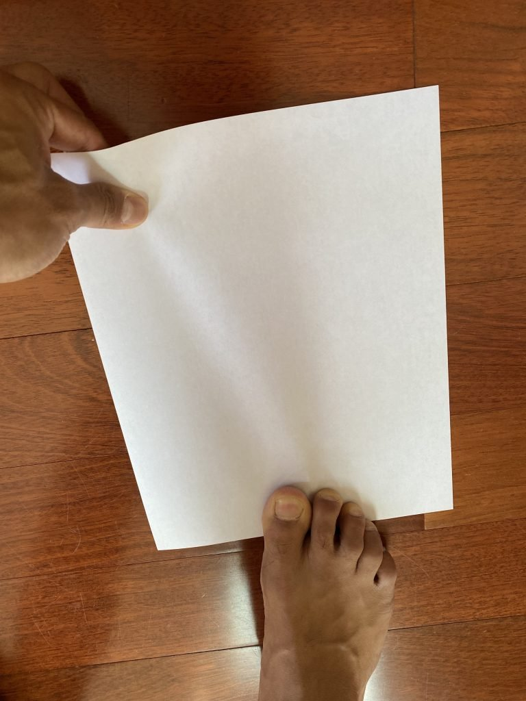
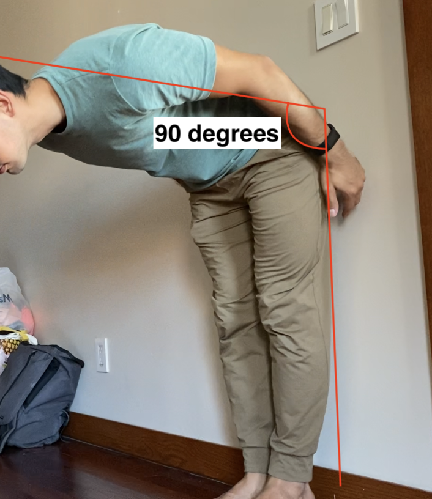
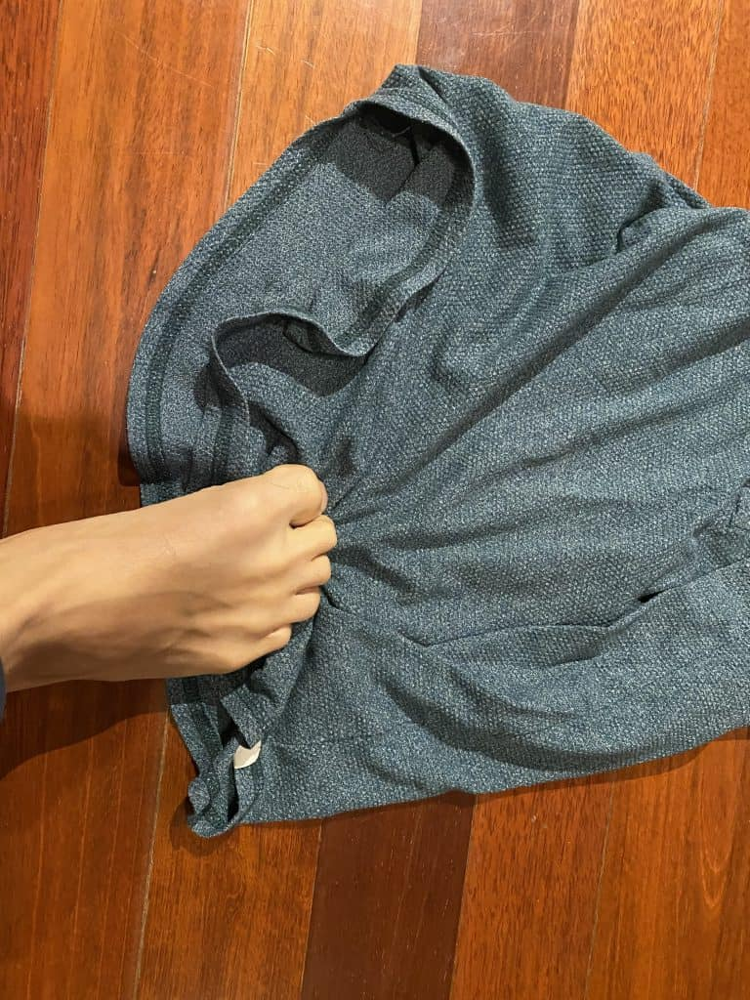
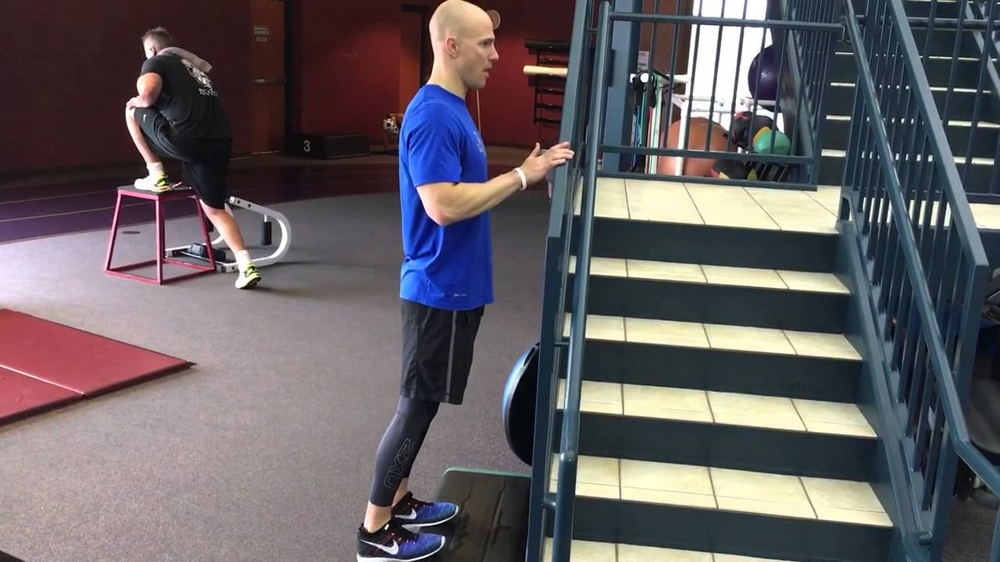
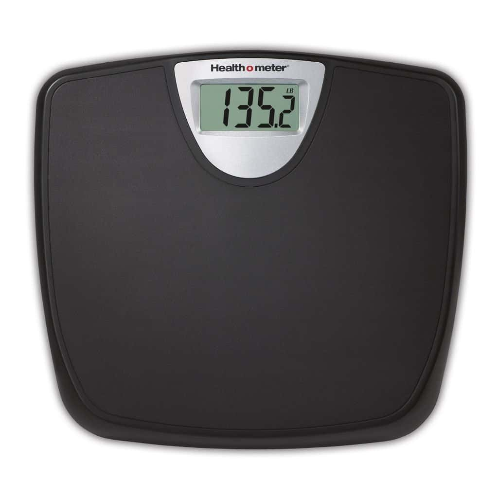

There are two tests that we can use to measure the strength of our intrinsic foot muscles and big toe. For people who are less active, but interested in improving the function of their lower body, the first test will be the most relevant. This test is often used at physical therapy clinics and have some scientific backing.

For athletes interested in improving performance in their respective sport, it is still advisable to do the first test, but not necessary. The second test is much more difficult and are meant to challenge your athletic ability.

## 1\. The paper grip test

The most common assessment to test for a baseline level of intrinsic foot and toe muscle strength is the "paper grip test".

The test follows these steps:

1. Take off your shoes and socks
2. Place a piece of paper or thin cardboard under your toes. (the paper should not be touching the ball of your feet).
3. Ask a partner to pull the paper away from your toes while you press down on it.
4. If they can, it is an indication that you need to strengthen your toes and intrinsic foot muscles

**Failing to keep the piece of paper under your toes is an indication that your toes and intrinsic foot muscles are not able to fire up and generate enough force to push down on the piece of paper.** If this is the case for you, then you absolutely want to begin strengthening your toes and strengthening your intrinsic foot muscles.

## 2\. Testing foot muscles for athletes

It is very unlikely that an athlete would fail the "paper grip test". Instead, athletes should focus on a standard of toe and intrinsic foot ability that will allow them to excel at their sport.

For athletes looking to test their foot and toe strength, do the following:

1. Stand with your back to a wall and stand with your feet a normal width apart.
2. Hinge at the hips with the goal of bending to 90 degrees at the hips

This test is very simple, but very difficult. If you can not reach 90 degree hip hinge without falling forwards, this does not mean you have "deficient" toe and foot strength, like in the previous test. Instead, it means you have room to grow, which will translate into athletic performance.

The following exercises are meant to improve your big toe and overall foot strength regardless of your current level. These exercises are scalable and easily done with equipment around the house. So they are accessible!

### Alternative methods of measuring foot and toe strength

There are several methods to measure the health and strength of your foot. Some of these tests require specialized equipment, but are not necessary to assess the health of your feet. Doing the tests above will give you a good idea of the health of your feet and toes. However, for those who may wish to go more in-depth, some of these tests can be requested by your physician or physical therapist.

- **MRI and USI** (ultrasound imaging) of muscle thickness - Use of MRIs and USI to assess muscle thickness
- **Toe-dynamometer** to measure toe flexor strength - a tool to measure toe grip strength. Works similar to ones used for the hands.
- **Index of arch rigidity** - A measurement of sitting arch height measured against standing arch height.
- **The navicular drop** - A popular evaluation of longitudinal arch stability. A measurement of sitting arch height measured against how much the arch drops while standing on a single leg.
- and **Foot mobility measurement** - A measurement of the arch when bearing weight and not bearing weight.

## What if I can't move my big toe? Hallux Rigidus

The big toe is the last part of the body that makes contact with the floor as we walk, jump, and run. A healthy big toe is able to push down into the floor while running or jumping.

Having limited ability to move the big toe is common in adults and some teens. Total inability to move the big toe is called Hallux Rigidus. Hallux is the medical term for the big toe. And Rigidus, refers to the immobility of the toe.

There are several causes for poor big toe movement that include:

- Footwear that deters toe usage (usually the most cushioned shoes are to blame for this)
- Excessive foot pronation that causes poor biomechanics
- Trauma such as stubbing your toe or surgeries

Any one of these can cause you to underutilize the big toe. This can cause the muscles in the big toe not firing when they are needed, such as in walking or running. This is something that can be corrected with a regiment of toe strengthening exercises.

## How to build big toe strength

The following are exercises that have been tested in the fields of sports science, physical therapy, ballet, and other movement arts. Many of them may look simple or childish, but they are by no means trivial.

### Towel scrunching

Start by standing with your toes on a towel on the floor. Start pulling the towel closer towards you by extending and flexing the toes.

It's very common to feel some cramping in the inner foot. In some cases, the cramp is light and will go away in a few seconds. However, in some cases, the cramp will be intense enough that you will need to take a break. Cramping is normal, and a sign your foot muscles are unfamiliar with the activity you're asking it to do. This is not harmful in any way. Wait until the cramp subsides and continue with the exercise.

One way to increase the difficulty of the exercise is to put a weight or something heavy on the other end of the towel. This is one way you can scale the exercise to your needs and abilities. Although we are building strength, working smaller muscles in our toes requires us to work with higher repetitions, rather than heavy weight. Regardless of the weight you add, you should be able to perform 15 reps per foot, per set.

### Calf raises (toe emphasis)

The easiest way to begin strengthening the big toe is to do a simple calf raise. Start barefoot, with your feet hips-width apart, and push up with as much emphasis as you can on the big toe. Hold the top position for 1 or 2 seconds. You can do the calf raise with a hand on the wall for support.

If your big toe is very weak or the neural connection is very poor, it may be difficult to know if you are doing the exercise correctly. Holding the top position will emphasize the use of the toes. And if you still don't feel anything in the big toe, you can lean forward, which will make it necessary to activate the big toe. Experiment and see what works.

Repetition count here should also be higher, and reach about 15 repetitions per side, per set.

<figure>

<figcaption>

Credit: Men's Health

</figcaption>

</figure>

### Calf raises on stairs

Another variation of the calf raise is to do calf raises with only your toes on the stair. This exercise may be too difficult for some people. The idea is to balance on your toes alone. From here, you can choose to do calf raises, but pushing with your toes.

This is much more difficult than a normal calf raises so make sure you have something nearby to support yourself with.

<figure>

<figcaption>

Credit: Men's health

</figcaption>

</figure>

### Toe push downs

Start by placing your big (toe or toes) on a scale. From here, simply push down with the toe(s) to see how hard you can push into the scale. The reading on the scale is the amount of force you can create with one or both of your big toes. To take your body weight out of the equation, read your weight while your big toe rests on the scale. Then push down without moving. Subtract the two numbers to get your toe pushing strength.

This exercise is great because Toe push downs are a good entry-level exercise. The exercise is isometric, meaning there is an extremely low risk of injury when going full power. This is good for people with very stiff or weak big toes.

For those with strong feet and strong toes, this exercise will be less useful. That being said, this is a great way to measure your toe strength!

## Why building big toe strength is important

The big toe is a major contributor when it comes to walking, running, balancing, jumping, and changing direction. A strong big toe is a major contributor that pushes off the ground. Without the big toe, jumping and running would be far weaker. For athletes who run and jump, having a strong big toe is essential for developing high performance.

**References:**

[https://www.frontiersin.org/articles/10.3389/fspor.2019.00046/full#h5](https://www.frontiersin.org/articles/10.3389/fspor.2019.00046/full#h5)

[https://www.activeseniors.net.au/try-this-simple-test-to-see-if-your-toe-strength-could-increase-your-risk-of-falling/](https://www.activeseniors.net.au/try-this-simple-test-to-see-if-your-toe-strength-could-increase-your-risk-of-falling/)

https://barefootstrongblog.com/2021/02/21/great-toe-mobility-the-linchpin-to-movement-longevity-part-2-functional-assessment/
