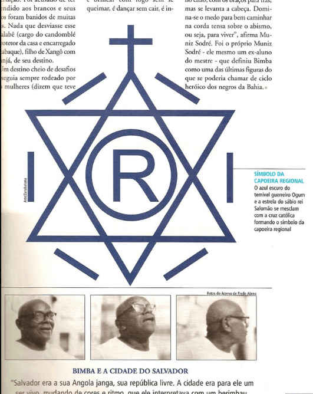
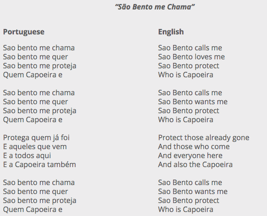

<iframe width="560" height="315" src="https://www.youtube.com/embed/FCWCc0PiwRM" title="YouTube video player" frameborder="0" allow="accelerometer; autoplay; clipboard-write; encrypted-media; gyroscope; picture-in-picture" allowfullscreen></iframe>

Sometimes people wonder if Capoeira has a religious or spiritual aspect to it and you most likely started asking this question because of a song you heard. Many Capoeira songs have Christian or Candomblé (an African religion) references. Not only that, but when you feel the music, the vibrations from the bateria (the band), and hear the clapping of everyone in the roda, you might feel like there is an energy that is taking hold. So you ask yourself! Does Capoeira have a religious or spiritual component?

Yes and No, Capoeira does not affiliate with any religion, but there is a spiritual aspect that has less to do with gods and more to do with how we the practitioners relate to one another. There are some practitioners who are themselves religious. Brazil is a very catholic country, however there is a clear line between anything religious and the practice of Capoeira. 

## Lyrics to the above song

The song above is a classic example of a Capoeira song. This song has a story. Like many Capoeira songs, it ties together the art of Capoeira with the history of the Africans who were enslaved and brought over to the Americas. Many of the slaves brought over by the Atlantic Slave Trade went to Brazil. From the 1750’s to the Early 1800’s Over half a million Africans from the Angola region were brought over to Brazil. Angola therefore is seen by many descendants of slaves, as the homeland they were taken from and is a major influence on Afro-Brazilian culture of which Capoeira is a part of. 

The song is a story of a black person probably in Brazil who goes up a hill to play Capoeira. While he is there he makes sure to go by the see and make an offering to the God Iemanjá, the Goddess of the sea. There, the song goes on to talk about how this person was an African, or a descendant of Africans. The significance of this story is that you have this person is recalling the Africans who were brought over to Brazil and at the same time, keeping alive the traditions of those enslaved Africans.

## Candomblé References in Capoeira

To explain, In the song above, Iemanjá is the god of the sea from the religion of Candomblé. Candomblé is an African religion that can be seen in several places such as Cuba, Colombia, and Brazil. All of these places saw a massive influx of slaves from Africa, and those Africans brought with them their religious beliefs. In the religion of Candomblé, the gods are called Orixás. The orixás are represented by different looking individuals and are remeniscent of the ancient Greek Gods. There are gods of nature, such as the god of thunder, the sea, and the wind. In addition, there are other gods that handle things like metal works, hunting, and war. 

Hold on! The song clearly references a African goddess, so how does this not make capoeira religious or spiritual? Despite this cultural connection to the Orixás, Capoeira itself has no connection to Candomblé or any other african religion. There may be practicioners of the art who also see themselves as practicioners of Candomblé, however these are few, even in Brazil. Mestre Bimba, who is the founder of our modern style of playing Capoeira (Capoeira Regional), was a practitioner of Candomblé, but did not impose his religion on anyone. In fact he chose the symbol below to be his logo of sorts, to show that any religion was welcome at his school. It didn’t matter to him if you were jewish, christian, etc. What mattered to him was that you trained hard. 

Today, Capoeiristas continue singing the songs about Candomblé and the orixa, but they do not hold this as part of a religious practice. The songs do not revere the Orixás, but rather, pay homage to the Africans who were brought over here and their traditions. 

## Christian References in Capoeira

Another religion that seemed to sneak its way into Capoeira songs is christianity. This one you hear a lot in the form of songs like the following one…  

Saint Benedict is a Catholic saint and in this case the person singing is saying that Saint Benedict is calling him, loves him, and protects, because he does Capoeira. Wow, seems like a glowing enforcement for Christianity by Capoeira, but like many things in Capoeira, this is deceiving. 

Catholicism was a religion imposed onto the slaves brought over from Africa. Whatever religion they had was considered paganism by their masters and many were forced to convert to Christianity. In response to this, many Africans decided to hide their religion within Christianity. Catholicism has many saints, which works perfectly for the Africans, who have many gods. St. Benedict and other saints were used as code for some orixá or another god that the African slaves had spiritual beliefs about. 

Again, someone might look at this and think that Capoeira has a strong connection to organized religion. The truth is that my Capoeira practitioners care deeply about the roots of their practice. Remembering the Africans who lowers enslaved by by the Portuguese is very important to the history of the art. On top of that, like many African traditions, Capoeira uses an oral tradition to talk about its roots. this song is meant to pay homage to the enslaved Africans who practiced Capoeira and hoped that one day they would be free. 

## Axé and the spiritual part of Capoeira

If there is a spiritual aspect to Capoeira, it takes place on the Roda. The Roda is where Capoeira is done and it is an awesome experience. In the Roda you can have 50+ people clapping, singing, playing capoeira, and you start to feel like there is an energy. Think about when your favorite sports team is about to score at the last minute to win the game.  There is a feeling of anticipation, heightened energy, and excitement you feel in the roda. Capoeiristas call this axé.

In Capoeira we talk a lot about Axé \[ah-shae\]. Axé is difficult to explain, but you can think about it as the vibes you get when participating in a Roda. Sometimes the energy’s good and sometimes the energy’s poor. This depends a lot on the people playing music, the capoeiristas playing, and how into it the crowd is. The cool this is that you as a participant in the Roda, contributes to the energy of the crowd. Some people might call this experience spiritual but I think the important thing to note is that capoeira is inherently communal. Unlike yoga or other movement practices, you can’t do it alone. So the experiences that you have are the kind that you can only have when people gather together, which I think is the reason people get confused and think Capoeira has a religious element.
