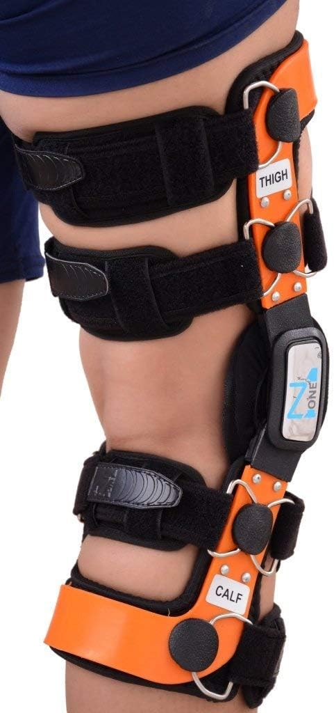

All martial arts require you to be strong and mobile, but everyone gets injured and as capoeiristas, we want to know what can be done. Knee braces often comes up in people’s minds because it’s a tool that allows us to continue to train. But not all knee braces are the same and it’s not always good to go for a heavier-duty the more severe the injury feels. 

When to wear a knee brace:

- Prevent an Injury
- Recovering from an injury

There are two reasons you would want to use a knee brace. The first is that you want to prevent an injury during physical activity. If you’re training hard and fatigue starts to set in, wearing a brace can help prevent you from hurting yourself with sloppy technique. If you’re training hard, wearing a brace can help prevent impact on the knees. The second reason a brace is used is in corrective therapy. People recovering from a knee injury may be directed by their therapist or physician to wear a certain kind of brace. Depending on the injury, the individual is recovering from, the medical provider may ask the patient to wear a brace that provides support to the knee or limits range of motion. 

Types of knee braces - and when to use them:

| Brace Type | Support Level | Injury recovery or prevention? | Additional Information | See Price |
| --- | --- | --- | --- | --- |
| Knee Strap | Low | Prevention / Recovery from minor injury | Adjustable level of compression on the knee. Light support | [Click  
Here](https://www.amazon.com/IPOW-Adjustable-Basketball-Volleyball-Tendonitis/dp/B01MYGDB2L?crid=2A7V848BHH4CI&dchild=1&keywords=patella%2Btendon%2Bknee%2Bstrap&qid=1619109083&sprefix=patella%2B%2Caps%2C167&sr=8-6&th=1&linkCode=ll1&tag=dendearts-20&linkId=b2f850d557bf0e28c9dc2929faecc93e&language=en_US&ref_=as_li_ss_tl) |
| Knee Sleeve | Low | Prevention / Recovery from minor injury | Compression will lessen with use. Biases mobility over support | [Click  
](https://www.amazon.com/CAMBIVO-Compression-Arthritis-Meniscus-Recovery/dp/B07G1XMQVN?dchild=1&keywords=knee%2Bsleeve&qid=1619109317&sr=8-5&th=1&linkCode=ll1&tag=dendearts-20&linkId=795c303c5cfe7115e08d0c483df425ba&language=en_US&ref_=as_li_ss_tl)[Here](https://www.amazon.com/CAMBIVO-Compression-Arthritis-Meniscus-Recovery/dp/B07G1XMQVN?dchild=1&keywords=knee%2Bsleeve&qid=1619109317&sr=8-5&th=1&linkCode=ll1&tag=dendearts-20&linkId=795c303c5cfe7115e08d0c483df425ba&language=en_US&ref_=as_li_ss_tl) |
| Wrap around: Unloader knee brace | High | Recovery | Specifically for arthritis related injuries | [Click  
](https://www.amazon.com/Osteoarthritis-Adjustable-Stabilizing-Brace-Degeneration/dp/B08KGT6NF4?dchild=1&keywords=unloader+knee+brace&qid=1619109436&sr=8-5&linkCode=ll1&tag=dendearts-20&linkId=c7514d9c351cb72a83115cbd27d074de&language=en_US&ref_=as_li_ss_tl)[Here](https://www.amazon.com/Osteoarthritis-Adjustable-Stabilizing-Brace-Degeneration/dp/B08KGT6NF4?dchild=1&keywords=unloader+knee+brace&qid=1619109436&sr=8-5&linkCode=ll1&tag=dendearts-20&linkId=c7514d9c351cb72a83115cbd27d074de&language=en_US&ref_=as_li_ss_tl) |
| Wrap around: Prophylactic knee bracd | Medium | Prevention | Mostly for those at risk of MCL and ML injuries | [Click  
Here](https://www.amazon.com/TechWare-Pro-Knee-Brace-Support/dp/B07B6859V4?dchild=1&keywords=Prophylactic+Knee+Brace&qid=1619109640&sr=8-5&linkCode=ll1&tag=dendearts-20&linkId=1fd054c1bcfda43bc30e08782ec5c84b&language=en_US&ref_=as_li_ss_tl) |
| Wrap around: Functional knee brace | High | Recovery | Provides extreme support at the cost of mobility. For injured knees, ie. ACL or MCL injuries | [Click  
Here](https://www.amazon.com/ComfortLine-Osteoarthritis-preventive-protection-Degeneration/dp/B00KRB5O1W?dchild=1&keywords=functional+Knee+Brace&qid=1619109913&sr=8-6&linkCode=ll1&tag=dendearts-20&linkId=9960fadad33f498ce039a9d4f38308c5&language=en_US&ref_=as_li_ss_tl) |
| Wrap around: Rehab knee bracd | High | Recovery | Specifically for people recovery from injuries or surgeries | N/A |

## Knee strap (Patellofemoral Brace)

[Check Price](https://www.amazon.com/IPOW-Adjustable-Basketball-Volleyball-Tendonitis/dp/B01MYGDB2L?crid=2A7V848BHH4CI&dchild=1&keywords=patella%2Btendon%2Bknee%2Bstrap&qid=1619109083&sprefix=patella%2B%2Caps%2C167&sr=8-6&th=1&linkCode=ll1&tag=dendearts-20&linkId=b2f850d557bf0e28c9dc2929faecc93e&language=en_US&ref_=as_li_ss_tl)

According to the medical literature, patellofemoral pain accounts for 33% of all knee injuries in female athletes and 18% in all male athletes. Reasons for patellofemoral pain include traumatic injury,  overuse/repetitive microtraumas, and abnormal patellar tracking. Traumatic injury can involve being bit in the knee. Repetitive microtrauma usually refers to runners who constantly bang their knees on the floor. From a martial arts perspective, these two are the most common ways to get patellofemoral pain. The last reason is abnormal patellar tracking, which is a disorder that sees the patella (kneecap) move out of place.

### **Patellofemoral Pain in Capoeira**

This kind of knee pain is pretty common in Capoeira and often is a sign of a minor injury. In most cases, this kind of injury can correct itself with patience. Ways to prevent aggravating this injury include keeping your knees from moving past your feet and staying away from aggravating injuries. Your teacher will understand if you need to modify an exercise or simply can’t do something for the moment. 

### **The benefits of using a Patellofemoral Brace: Mixed results**

The patellofemoral brace is commonly seen to be a way to relieve pain in the knee cap. If during your training, you begin to feel this pain, it’s likely that one of your running buddies has told you about this kind of brace, and how it can help alleviate pain. This kind of brace has been used to relieve patellofemoral pain, however this should be taken with a grain of salt. A review of the current medical literature shows that these kinds of knee braces do not do any better than knee sleeves. In another scientific study, knee straps were shown to have no significant different in the recovery of military subjects who underwent physical therapy and ainti-inflamatories over the course of 6-8 weeks. 

### **Why use a Patllofemoral Brace**

First off, everyone is different and in some cases a knee strap may be useful. If you feel the knee strap helps manage pain, then there is no reason not to get it. Here are some of the proposed reasons for why the Patellofemoral Brace may help alleviate pain in the knee. These are theories based on scientific literature, however and should not be taken as scientific truth.

1. Improved patellar tracking
2. Dissipate Lateral patellar forces
3. Increased patellofemoral contact areas
4. Change patella positioning
5. Unloads the extensor mechanism
6. Increased temperature, neurosensory feedback, and circulation
7. Psychological: improved confidence. 

I will also say that this is the preferred knee brace of Steven Low, author of Overcoming Gravity and Overcoming Tendonitis. Reading his books has been eye opening and when recommending a knee brace, I defer to his expertise. 

## Sleeve Brace (soft brace)

[Check Price](https://www.amazon.com/CAMBIVO-Compression-Arthritis-Meniscus-Recovery/dp/B07G1XMQVN?dchild=1&keywords=knee%2Bsleeve&qid=1619109317&sr=8-5&th=1&linkCode=ll1&tag=dendearts-20&linkId=795c303c5cfe7115e08d0c483df425ba&language=en_US&ref_=as_li_ss_tl)

A sleeve brace is commonly seen in athletics. Soft braces provide the least support out of any of the other options on this list. These braces sacrifice some support to allow maximum range of motion. This brace is most often used during a mild case of tendonitis in the knee. If you feel a nagging sensation in the knee, this kind of brace works well to alleviate pain, provides added knee stability, and confidence in the strength/ability. This is They are also a tool to stave off injury. In the case of a capoeirsita, who is doing lots of explosive movement, a brace might be worth the investment if you’re trying to avoid injury in a part of the body where you that it is likely to happen. 

### **The benefits of a Sleeve Brace: Minimal support with maximal range of motion**

The sleeve brace is meant for people who are trying to avoid an injury or are trying to recover from a very small injury. If you have a lot pain in your knee or restricted range of motion, the sleeve will most likely not cut it. You can judge this for yourself. Try one on and if you feel pain, instability, or are still not confident that your knee won’t explode, then you might want something more heavy duty. That being said, the sleeve has been shown to reduce pain, increase stability, and reassure its user in the constitution of their knee. Improvements however, were shown to be small and should not taken to be a “cure” of any kind. 

### **How tight should the Sleeve brace be**

Make sure that your sleeve brace is snug and is not too loose. A looser brace will give you greater range of motion, but will provide less support. This doesn't mean that you should go for the tightest brace to give yourself more support. Find a brace that is snug, provides you with support, and still allows you the range of motion you need for the activity you’re doing. If you still do not feel that this brace is providing enough support, then opt for another brace on this list that provides more support to the knee. 

## Wrap Around Braces

The wrap around brace has many names and comes in a wide variety of designs. These braces are heavier duty than the sleeves or the patellofemoral braces and that’s because they’re designed to provide stability to the connective tissue in the knee. In the knee, you have the ACL, the MCL, LCL, and the Meniscus. Without going into too much detail, these soft tissues stabilize your knee joint and provide some cushion from any bone to bone contact. Wrap around knee braces provide stability to one or more of these soft tissues as a way to prevent inflammation and additional injury. 

### **Wrap Around Brace Options and why use them**

The following braces are the bigger brothers of the last two braces. Their heavier duty design provides a lot more support and specialized support for different soft tissue in the knee. Please make sure to see a doctor before picking up one of these braces. Self diagnosis is not a great idea with a body part as complex as the knee. 

### **The Unloader Knee Brace**

[Check Price](https://www.amazon.com/Osteoarthritis-Adjustable-Stabilizing-Brace-Degeneration/dp/B08KGT6NF4?dchild=1&keywords=unloader+knee+brace&qid=1619109436&sr=8-5&linkCode=ll1&tag=dendearts-20&linkId=c7514d9c351cb72a83115cbd27d074de&language=en_US&ref_=as_li_ss_tl)

The unloader knee brace focuses on providing relief for those who are suffering from arthritis in the knee. Osteoarthritis, is caused by a breaking down of the cartilage in the knee, leading to bone on bone contact. This can cause severe pain, inflammation, and other issues as a result. This brace provides relief by transferring pressure normally received by the knee to other, stronger parts of the body.

### **Prophylactic Knee Brace**

[Check Price](https://www.amazon.com/TechWare-Pro-Knee-Brace-Support/dp/B07B6859V4?dchild=1&keywords=Prophylactic+Knee+Brace&qid=1619109640&sr=8-5&linkCode=ll1&tag=dendearts-20&linkId=1fd054c1bcfda43bc30e08782ec5c84b&language=en_US&ref_=as_li_ss_tl)

This particular brace is generally used to protect the MCL again valgus knee stress. This brace is used a lot by athletes who’ve had prior injuries to the ML, or are at risk of receiving this kind of injury. If you are at risk for one of these injuries, then this brace could be a good option. 

### **Functional Knee Brace**

[Check Price](https://www.amazon.com/ComfortLine-Osteoarthritis-preventive-protection-Degeneration/dp/B00KRB5O1W?dchild=1&keywords=functional+Knee+Brace&qid=1619109913&sr=8-6&linkCode=ll1&tag=dendearts-20&linkId=9960fadad33f498ce039a9d4f38308c5&language=en_US&ref_=as_li_ss_tl)

As with the unloader, this brace is meant to provide support for a knee that is already injured. If you’re a martial artist that absolutely needs the use of their knee, then this brace is likely what you will be prescribed. It should be noted that it is very dangerous to continue  training at a high level while injured, but professional athletes do use this kind of brace. As you can see from the brace’s design, rotation is severely limited, which is why it is prescribed often for those with an ACL injury.

The extreme restriction of rotation by this brace flyes in the face of everything Capoeiristas need to play, however severe injury may require this kind of brace. If you’re feeling sad because you can’t train the same as before, go to the “How to Train with a Knee Injury” section to see how you can continue developing your Capoeira while injured. 

### **Rehab Knee Brace**

\*These kinds of post-op braces should be provided by your doctor\*

It is extremely unlikely that a knee injury will prompt you to buy this kind of brace from your local drug store. The rehabilitative knee brace is meant to dramatically limit range of motion and is primarily used after surgery. This brace is meant to prevent any harmful movements and keep the knee absolutely stable. This is the complete opposite of the sleeve brace, which sacrifices stability for mobility. The rehab brace severely sacrifices mobility for stability. It is unlikely you will be doing any Capoeira with this brace on because your focus will be on talking with your doctor about the healing process.

## When not to use a brace

Knee braces are not a cure-all. If you have a very minor bit of pain in the knee, it’s likely that this will resolve itself with a few days or a week of rest. If the pain persists, you’ll need physical therapy. If you’re not doing the physical therapy needed to heal you injury, then don’t bother putting on a knee brace. The knee brace is not an excuse to continue abusing your body. Knee pain should be an alarm that tells you, the things you were doing were hurting you and you need to change something. For example, if you didn’t warm up before doing physical activity, then you should probably start doing that. 

If you know that a movement is negatively affecting the health of your knee, then look for modifications. You can also modify your movements so they don’t aggravate your injury. For example, if there is a movement that creates pain in your knees, then avoid that movement and opt for a regression that challenges you, but does not feel painful. This might also mean decreasing your workload before fatigue sets in. Fatigue and bad technique is another way people get injured. In general, modifications are your best friend when you’re injured. Just because the teacher tells you to do something, doesn’t mean you always can. You should let them know you’re a movement is difficult for you and ask after class what else you can do to train while avoiding movements that cause pain.

## How to train with a knee injury

If you’re knee is injured, the best thing you can do is go to your physical therapists. Treat the injury with psychical therapy exercises. Be diligent and focus on your recovery so that in a few weeks you will be better instead of a few years. Many people avoid treating their injuries and prolong their recover for many more months than necessary. At the same time, train what is not hurting! If your knee hurts, then train your arms, or your back, or you abs. Capoeira is a full body workout and an injury should not be a reason to stop practicing and stop getting better.  

references

[https://www.verywellhealth.com/do-i-need-a-knee-brace-2696279](https://www.verywellhealth.com/do-i-need-a-knee-brace-2696279)

[https://www.researchgate.net/publication/6172450\_Current\_Evidence\_and\_Clinical\_Applications\_of\_Therapeutic\_Knee\_Braces](https://www.researchgate.net/publication/6172450_Current_Evidence_and_Clinical_Applications_of_Therapeutic_Knee_Braces)

[https://www.ncbi.nlm.nih.gov/pmc/articles/PMC5709997/](https://www.ncbi.nlm.nih.gov/pmc/articles/PMC5709997/)
