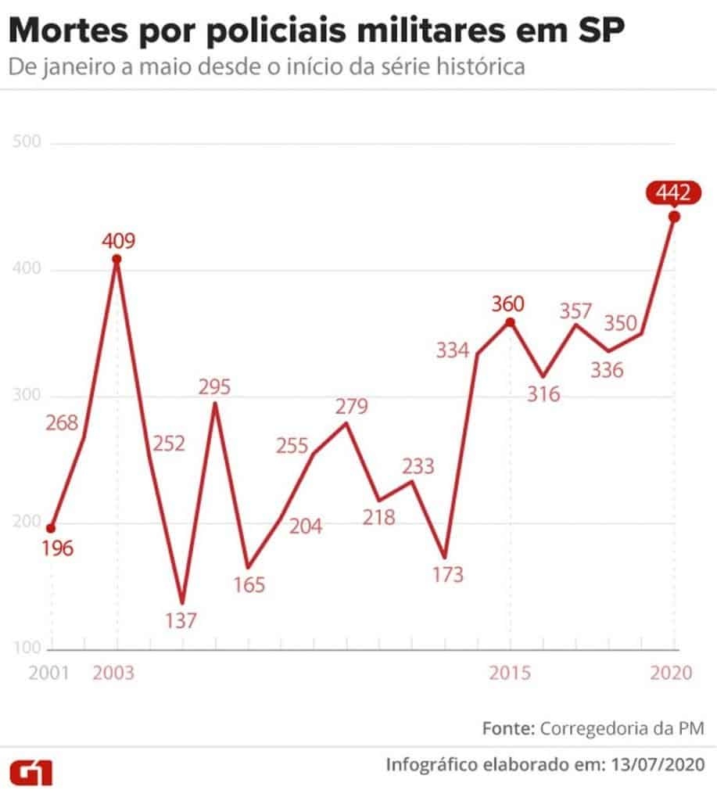
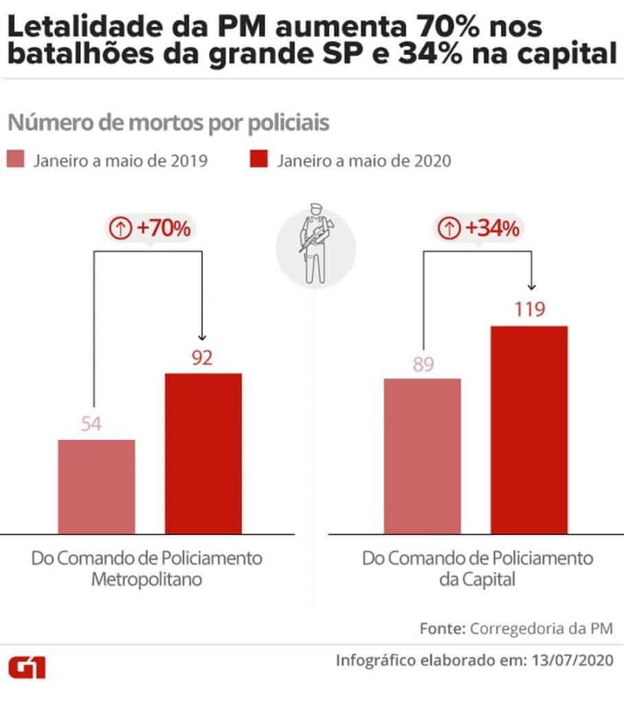

It's no secret that the military police in Sao Paulo, Brazil kill a horrifying amount of people every year. **In April 2020, the military police killed 102 residents of the state of Sao Paulo.** The highest number of police murders that had been recorded in a single month since 2006. There are countless stories of police attacking residents of various neighborhoods without cause, invading homes without warrant, and killing people without any repercussions.

## Murders by military police in the state of Sao Paulo

There have always been tensions between the local population and the military police. Within the state of Sao Paulo, murders by the police have been on a sharp climb in recent years.

The spike in 2003 is astonishing, with over 400 murders by the police. What is more astonishing is that **THIS GRAPH ONLY COMPARES DEATHS BY MILITARY POLICE ONLY FROM JANUARY TO MAY**. For reference, in Germany, all security forces killed a total of 11 people in 2018. In all of Brazil, the number of deaths by security forces in the same year was 6,160 for the entire country.

### Murders by Military Police increases 70% in the state of Sao Paulo and 34% in the City of Sao Paulo.

These numbers compare deaths by the military police during the month of January in the year 2019 and 2020. The increase in deaths in the state of Sao Paulo can be seen in the left two bars. Deaths by military police in the city of Sao Paulo can be seen in the left two bars.

## The Corona Pandemic and Police Deaths

With so many people needing to stay home, you might think that the number of deaths by the police would go down. In Brazil, the pandemic has proven to have the exact opposite effect. 2020 is not yet over, and there has been a 26% increase in the deaths by military police in the state of Sao Paulo from 2019.

In Rio de Janeiro, this increase in violence is just as evident evident. In 2019, 54 people were killed in the first 5 months of 2019, compared to 92 in the first 5 months of 2020. Although comparatively a smaller number, Rio de Janeiro is one of the most visited places in Brazil, and is a major attraction for tourists coming from all over the world.

### Mestre Nene Assaulted by Police: Assault can happen to anyone

In the world of Capoeira Mestre Nene is a big figure, featured most prominently in the rodas of the Praca da Republica, in the downtown of Sao Paulo. At the end of this video you can see a video of him singing in the roda.

During a robbery in Vila Magdalena (a rich neighborhood in Sao Paulo), the military police began looking for the suspect in various parts of the city. Upon seeing the police, Mestre Nene, who was with his son, decided it would be safe to go home.

As Mestre Nene went home, the military police stopped in front of his house, presuming that he fit the description of the person they were looking for. The scene turned violent when **the police took Mestre Nene by force to their police vehicle, leaving his 5 year old son alone outside.** Mestre can be heard in the video below screaming for his son. The person taking the video is asking the police what is happening.

After 4 hours of waiting in the police vehicle Mestre Nene was allowed to go. His friends found him with lacerations on his face, head, and legs. During this time, Mestre Nene's 5 year old son was separated from him and Mestre Nene was never told what he was being held for.

<iframe width="560" height="315" src="https://www.youtube.com/embed/Tez13128m-Y" title="YouTube video player" frameborder="0" allow="accelerometer; autoplay; clipboard-write; encrypted-media; gyroscope; picture-in-picture" allowfullscreen></iframe>

The person who appears in the video 00:32 is Caniero who promotes racial justice in Brazil. The capoeira community asking for a public apology by the secretary of public defense of Sao Paulo, the governor of Sao Paulo, and investigation of the police who mistreated Mestre Nene. This group is also using the following hashtags to help spread the word about the injustices by the military police in Sao Paulo. **#JusticaMestreNene, #RetratacaoJoaoDoriaMestreNene, #RetratacaoBrunoCovasMestreNene**

Please share the above video to people who know in and outside of the Capoeira community so they too can put pressure on the Sao Paulo government and hopefully put a stop to the widespread violence of security forces in Brazil.

### Mestre Nene speaks on the Assault

<iframe width="560" height="315" src="https://www.youtube.com/embed/2mgo3_oCilY" title="YouTube video player" frameborder="0" allow="accelerometer; autoplay; clipboard-write; encrypted-media; gyroscope; picture-in-picture" allowfullscreen></iframe>

Here Mestre Nene speaks about the attack by the police. One of the scariest parts of the story is that when Mestre Nene was taken by the police in a police vehicle, his friends and students came looking for him. The police stated that he had been taken to the hospital, when in fact, he was still in the police vehicle in police custody. The student hear Mestre Nene screaming for help and after some time, were finally given him back. That's when Mestre Nene was found, after clearly having been assaulted during his detainment.

The video of the scene is chilling, but it is something that happens every day in Sao Paulo. Countless people have been killed by the police, however many more are assaulted and mistreated by the police on a regular basis. Police disproportionately target black Brazilians, and people of low income.

The need for racial justice in Brazil resembles many of the same issues facing Black Americans in the United States. My biggest hope is that some level of justice is served for Mestre Nene and that police will start being held accountable for their actions.

References:

[https://www.brasildefato.com.br/2020/08/21/confundido-com-ladrao-capoeirista-e-cercado-por-pms-e-agredido-com-o-filho-no-colo](https://www.brasildefato.com.br/2020/08/21/confundido-com-ladrao-capoeirista-e-cercado-por-pms-e-agredido-com-o-filho-no-colo)

[https://www.brasildefato.com.br/2020/07/22/organizacoes-de-direitos-humanos-denunciam-intimidacao-e-perseguicao-policial-em-sp](https://www.brasildefato.com.br/2020/07/22/organizacoes-de-direitos-humanos-denunciam-intimidacao-e-perseguicao-policial-em-sp)

[https://www.brasildefato.com.br/2020/07/11/na-quarentena-pm-de-sp-mata-102-em-abril-e-bate-recorde-dos-ultimos-14-anos](https://www.brasildefato.com.br/2020/07/11/na-quarentena-pm-de-sp-mata-102-em-abril-e-bate-recorde-dos-ultimos-14-anos)

[https://g1.globo.com/sp/sao-paulo/noticia/2020/07/14/numero-de-mortos-pela-pm-em-2020-e-recorde-em-sp-policiais-dos-batalhoes-da-regiao-metropolitana-mataram-70percent-mais.ghtml](https://g1.globo.com/sp/sao-paulo/noticia/2020/07/14/numero-de-mortos-pela-pm-em-2020-e-recorde-em-sp-policiais-dos-batalhoes-da-regiao-metropolitana-mataram-70percent-mais.ghtml)

[https://en.wikipedia.org/wiki/List\_of\_killings\_by\_law\_enforcement\_officers\_by\_country](https://en.wikipedia.org/wiki/List_of_killings_by_law_enforcement_officers_by_country)
