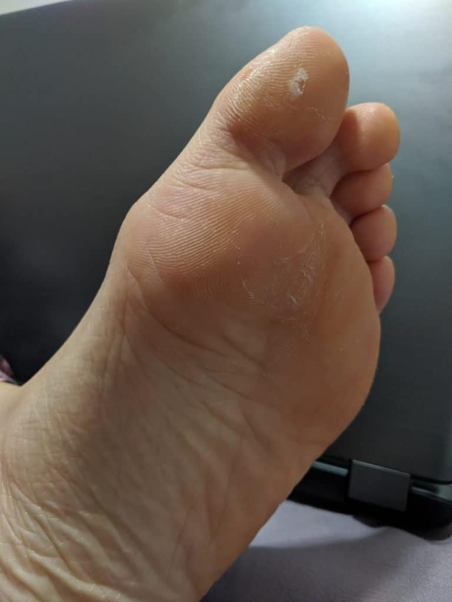

One of the most common problems when starting Capoeira, dance, or other movement arts where you are barefoot, is getting blisters. Lets face it, we don’t spend time without shoes, and the soles of our feet are very soft as a result. Below we will talk about how you can identify a blister, how to prevent blisters, how long it you're blister-proof, and what you can do to heal them.

## What Causes the toe and ball-of-the-foot to blister

For dancers, capoeiristas, or other movement arts, it can be pretty common to get some sort of blistering on your feet. If you’re wearing shoes here are some common reasons you’re getting blisters.

1. Wearing an overly narrow shoe
2. Excessive weight on the ball of your foot or the toe
3. Clammy feet
4. Lots of spinning or pivoting
5. Friction from your footwear…
    1. The sole material
    2. Moist socks
    3. The interior lining of the shoe

Something that you can look into is getting a pair of shoes that fit you better or fit your needs better. If you’re doing a lot of pivoting and your shoe is creating a lot of friction, it might be worth it to buy a new pair of shoes. However, if you’re barefoot, then some reasons to get blisters include the following.

1. Excessive weight on the ball of your foot or the toe
2. Lots of spinning or pivoting
3. The material your moving on
4. The “Tough it out” Mentality

Some of these things are difficult to control for, such as the excessive spinning or pivoting. A lot of times, this will be part of the training and leads a lot of people to the “tough it out” attitude. Meaning, your feet are weak and you just need to bare the annoyance of blisters until your feet toughen up. This isn’t necessarily wrong. After a while your feet will get stronger and resistance to blisters. Until then, here are a few tips on how to deal with those annoying blisters.

### **Identifying a Water Blisters**

The most common blister that people receive are water blisters. This occurs when a portion of skin is irritated by friction. The area will start to turn red, and then swell up with liquid. The most common places to see blisters on your foot are the big toe and the ball of your foot. These two spots see the most weight bearing during pivots and rotations. Blisters might look bad, but if the skin remains intact, they’re really not a big deal and will heal on their own after a few days.

### **Identifying a Blood Blisters**

Blood blisters look horrible, but they are not much more severe than a normal blister. Blood blister occur where there is some damage to dermis tissue in the foot. The dermis is host to blood vessels, which is where the blood comes from. There is very little risk to having a blood blister unless the skin has been removed. In this case, a blood blister has a higher chance of infection than a normal blister. Blood blisters typically take a few weeks to heal with discoloration disappearing after about a month.

## What to do if the blister skin is intact

1. Reduce/remove pressure on the blister
2. If not severe → wrap with island dressing
3. If severe → consider stopping activity

<figure>

<figcaption>

Closed blister

</figcaption>

</figure>

First you want to remove the pressure and causes of friction.  If the blister is not too severe, you might be able to wrap the blister and continue doing what you were doing. On the other hand, if the blister is very severe, it might make sense to stop altogether. Whatever you decide to do, keep the skin in tact! The skin helps keep away infection. The exposed skin underneath is a lot more likely to become infected, so whatever you do, do not remove the skin.

If you do decide to wrap the blister, do not put tape directly on top of it. When you remove the tape, it could remove the skin, which would make the blister more prone to infection. Instead, apply an island dressing that can be put under the medical tape. The island dressing will absorb any liquid that leaks from the blister, prevent friction, and protect the skin when you remove the tape. This is a good idea if it reduces swelling discomfort. However if you put on the medical tape and it’s still very difficult to walk, then you might need to change your strategy to manage the blister.

If the blister is severe then you should first focus on removing any movements that add pressure and friction to the blister. This might mean stopping all activity, but you will need to use your judgement. If the blister is very large, this is advisable. If you continue activity, remember that additional friction and pressure will increase the size and severity of the blister.

### **When should you drain a blister**

First off, the main reason you want to drain your blister is to remove the liquid that is causing you pain or discomfort. This occurs most often when the blister is really large or the skin looks like it’s going to peel off. In this case, it makes sense to drain the blister. Draining your blister is NOT something you have to do. You can easily deal with a blister for a few days and go about your life. It might be uncomfortable for a little while, but the fluid will slowly go away and you will be back to normal in a few days.

### **How to drain a blister without causing infection**

The most important part of draining a blister without causing infection is making sure that the tools you use are sterile. Below, I’ll list the steps you need to go through to drain your blister in a way that is safe and helps avoid infection. This method works for both regular blisters and blood blisters.

1. Clean the area surrounding the blister
2. Sterilize the needle that you will be using. You can do this with rubbing alcohol.
3. Make a small hole at the edge of the blister. Gently press out the fluid.
4. Wash the blister again and dry it off. Avoid removing the skin.
5. Apply antibiotic ointment.
6. Cover the area loosely with a bandage.
7. Is it safe to drain blood blisters?

Draining a blood blister is done the same way as a normal blister. The major difference is that blood blisters can be more painful than regular blisters and have a higher risk of infection. After you drain the blister make sure to regularly check on the status of your blister. If you see that signs of infection, seek medical attention.

<iframe style="width:120px;height:240px;" marginwidth="0" marginheight="0" scrolling="no" frameborder="0" src="//ws-na.amazon-adsystem.com/widgets/q?ServiceVersion=20070822&amp;OneJS=1&amp;Operation=GetAdHtml&amp;MarketPlace=US&amp;source=ss&amp;ref=as_ss_li_til&amp;ad_type=product_link&amp;tracking_id=dendearts-20&amp;language=en_US&amp;marketplace=amazon&amp;region=US&amp;placement=B07C9TPM5Q&amp;asins=B07C9TPM5Q&amp;linkId=d56ef2c6d7fb9f85b76d71908d49cfc9&amp;show_border=true&amp;link_opens_in_new_window=true"></iframe>

## Tools to cure a blister

In Capoeira, we tend to deal with blisters a lot. There are plenty of methods for dealing with blisters and this blister pack to me is the most comprehensive toolbox I’ve seen on the market. This pack will cover all the basics of cleaning and disinfecting a blister. They do not have needles to drain blisters, however I am not personally a fan of this method. You can also check out our resource page where we have all kinds of tools that can help improve your Capoeira, dance, or movement practice.

## What to do if the blister skin has already torn off

<figure>

<figcaption>

Open Blister

</figcaption>

</figure>

The following applies to normal and blood blisters. As I said before, the skin is they key to staving off infection. Once the skin is torn off, this becomes a much bigger threat. If your’re in a situation where the skin is torn off of your blister you will have two options. If the blister is small, you might consider wrapping the blister up like I explained above and continuing with your activity. However, if the blister is large and painful, then its probably best that you stop all doing what you’re doing and follow these steps

1. Clean the blister with soap and water.
2. Apply an antiseptic ointment to prevent infection
3. Wrap the blister until you can get home

Disinfect it and keep track of infection. Do not let it get infected. These are more painful and take longer to heal.

### **Follow up with blisters**

Blister can take a few days to go down. In the meantime, your job will be to keep the area clean, avoid making the blister bigger, avoid ripping the skin until it has totally healed.

1. Avoid activities or footwear that aggravate the blister.
2. Continue to let the blister breathe by taking it off of the bandage for as much time as possible.
3. If you’re wearing a bandage, make sure to change it daily.
4. See a doctor if you see any signs of infection
5. Signs of infection and how to treat it

Infections are the worst! They last much longer than normal blisters, are more painful, and can lead to more serious conditions. Let’s start by saying what an infection is NOT. A normal blister carries white or very light yellow fluid inside. The blister may also turn pink or a deep red in the case of a blood blister. Having a blood blisters do not mean that the blister is infected. Here are a few ways you can tell if a blister is infected.

1. Pus is the most obvious sign that there is an infection. Pus is different from blister fluid because it is usually much thicker and has a deep yellow or greenish color.
2. Redness around the blister. This is not the same redness that you will see from a blood blister, which is only red directly on the blister. The redness from an infection will slowly grow over time.
3. Swelling in the area directly next to the blister is another sign. This swelling may grow over time as the infection worsens.
4. If you have a foot blister, it will be painful to step on it, however a blister with an infection will hurt more over time.

Infected blisters can change into more serious conditions like lymphangitis and cellulitis. That is why, if you suspect you have an infection, you should seek medical assistance. Going to your doctor and seeking medical treatment is the most effective way to eliminate any infection you might have.

## How to prevent foot blisters and identifying “Hot Spots”

Preventing blisters means being able to identify them before they come up. The first hint you will get is a feeling of discomfort called a hot spot. Hot spots are the stage right before a blister begins to form. You might feel like your skin is warm like a rug burn, or stretched. The feeling can be very subtle and when you’re moving you might not notice.

This stage is very brief. Meaning, if you wait too long, there won’t be anything you can do to prevent the blister that will form. As soon as you feel the first stinging feeling, you’re already too late.

If you can identify this stage quickly, the first thing you should do is take a break. Stop for a second and evaluate to make sure a blister has not already formed. If there is no liquid pooling into the area, you can take steps to prevent a large blister from forming. If you’re barefoot while doing Capoeira, dance, or other movement art, take the time to do the following.

1. Get medical tape and wrap the area. This should reduce friction to the area and allow you to continue.
2. You can combine the first step with putting on sock sand shoes. Although it’s still possible to get a blister this way, it will greatly reduce the rubbing that causes blisters.

If you have shoes on and you start feeling a hot spot coming on, take off your shoes and inspect the area first to make sure a blister has not already formed. After that…

1. Adjust your socks to make sure they have not bunched up.
2. Tighten up your shoe. Extra space will cause more rubbing in the area.
3. If this does not help, then you might want to consider taping the area before continuing any activity.

### **Should I always wear shoes and avoid blisters all together?**

There are actually two reasons why you should not wear your shoes all the time. The first reason is that you will not develop calluses on your feet, the way you would by training without shoes. You probably saw that coming.  The other reason is that training with shoes is like always having gloves on your hands when you workout. The effect is that your brain loses connection to your soles and the musculature in your feet will never develop. This is a huge detriment to fundamental elements of movement like balance, strength, and coordination. Sorry to say, but if you enjoy movement arts like Capoeira, then blisters are par for the course.

### **How long do I have to train to no longer get blisters**

<figure>

<figcaption>

Near immunity to blisters

</figcaption>

</figure>

This will depend greatly on your body. For the first few years, it’s totally normal to get blisters on your feet. Just like it will be normal to be really sore after a day of training, it will also be normal to once in a while get blisters. Some people are more affected by this issue and a lot of the reason is the differences in people’s bodies. Some will easily get blisters, while others will not. The kind of training will also affect this. If you do a lot of spinning kicks, blisters will be more likely. Even if you have very strong calluses, that does not mean you are immune to blisters. Training that involves a lot of spinning kicks, or training on a surface that grips can cause a blister to form.

### **Which floors give the worst foot blisters**

The floors that give the worst blisters are the blister that grip your feet the most. Most people have this problem with some wood floors, however this will depend on the type of wood being used and the finish of the wood. Some finishes will make wood more slippery and less likely to produce blisters. Others will add lots of grip to the floor and can really tear up your feet. Different people’s feet will react to the same floors differently so there is no official list of what floors are better or worse for certain feet. the best thing you can do is to identify when a blister is coming on and take steps to prevent them with the tips highlighted above.