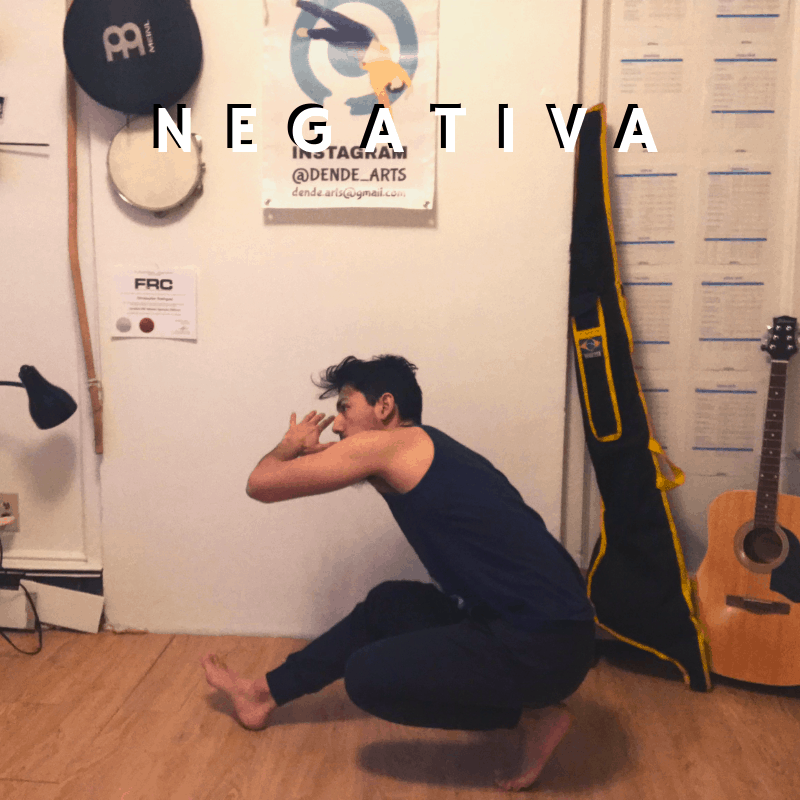

Capoeira such a cool martial art to learn. There are incredible moves, you make a ton of friends through travel, and you get an amazing workout. It seems like there’s no downside, but for people over 40, the question often looms, “Am I too old to start training Capoeira?”

So, is 40 too old to start training Capoeira? No. You can start learning Capoeira at 40+ years old.  And older. What you learn, how you learn, and your mentality as a student will be different from someone in their 20’s or 30’s, but there is plenty t hat you can learn in a way that is safe and will serve to strengthen your body as opposed to breaking it down. Your training will need to be at a slower pace, the progressions you start at may be lower than some other students, and your mentality should not work around comparing yourself to others in the class. If you’re ok with that, then you can not only practice Capoeira, but you can thrive. 

## Where is your body now? 

Many people by the time they’re in their 40’s have some injury that they need to deal with. For some people it can be their knees, for others it’s the back. With any physical activity, it's important to understand these injuries and what aggravates them. If you have knee pain when you squat down, remember that as you go through you practices and avoid movements that will aggravate the injury. This is half the battle because almost everyone who does physical activity has an injury that they will need to deal with. Having an injury should not dissuade you, most adults have some joint that bugs them. Even some of the best Capoeiristas in the world have injuries of some kind. And even though you can’t always notice or it can be hard to tell while they’re flipping everywhere, believe me that you’re not alone. 

Make sure that the teacher knows about any injuries you might have so they can give you different exercises that do not aggravate them any further. Negativa is a good example. This movement can aggravate your knees, but there are regressions that you can do to reduce the impact to your knees. Doing the movement with a flat foot is one example, doing the movement higher up is another. The regression will depend on the kind of injury you have and how to avoid making it worse. 

<figure>

<figcaption>

Capoeira Movement: Negativa

</figcaption>

</figure>

## Playing at your very best

I won’t lie to you. There are kids who are doing Capoeira right now, and can do things the best capoeirista in the world will never be able to do. That statement is true for every single Capoeira practitioner alive today regardless of age. Just because you have a high belt or have been training since you were a teenager doesn’t mean that there isn’t some new talent doing some amazing things that you may never be able to do. Training Capoeira doesn’t mean you need to do all the movements you see on instagram, Facebook, or youtube. Firstly, if you can’t do the movement now doesn’t mean you never will. It may take time, but hard work and a passion for improvement can take you far. At the same time, be humble with you abilities and congratulate those who are able to improve. Doing so puts you in a positive mindset and mentally prepared you for the next challenge. 

So, if you think you’re going to be doing Backflips starting from zero, you are probably expecting too much. However, if you think that you need to be doing backflips to do Capoeira, you’re also very wrong. The fundamentals of Capoeira are the Ginga, basic kicks like Meia Lua de Frente, and esquivas like Esquiva Lateral. Working with progressions is one of the most important parts of learning Capoeira later in life. Kill the ego and ask for a simplified version of what you are doing in class. If a movement is too difficult for you, let the teacher know so they can give you an alternative, or a regression that you can try. Try asking the teacher something like, “this movement is a little difficult, is there another that I can do which will help me build up to that movement?”.

Here, the ego is our number one enemy, It’s hard to swallow our ego and do something “easier” than what everyone else is doing. In some cases you may not be sure if you can do a movement. If you try and the teacher comes by to tell you to do something easier, don’t feel disappointed. The challenge presented to you is to do the movement recommended to you and slowly work your way up to the next movement. This is the stage where people get frustrated. They think they’re not good enough, they make excuses, etc. It’s not everyone who has the self assurance to deal with this, but If you can get over this feeling, you have the chance to feel free and enjoy yourself.

## Changing your lifestyle

Unlike those kids eating pizza after every class, being 40+ means taking care of yourself. Eat your share of fruits, vegetables, and high quality protein. Stay away from junk food, soda, fast food, or anything else processed. You’re body will thank you and keep working hard for you. Diet makes a huge difference in a person’s ability to develop their physical abilities. If you have a garbage diet, you’ll get garbage results. I don’t recommend any kind of diet because diets depend greatly on the inner workings of each person. I do however believe in eliminating junk as much as humanly possible. For many people this can take a lot of willpower, but if you can make it a routine, then you’ll reap the reweards. 

The other thing to do right away to maximize your results is to train at home. Start by doing something small, but be consistent, and train every day. As we grow older, our body needs a lot more work before it can change in the way we want it to. At the same time, healing takes a longer time. Having a diligent work ethic is the most important aspect of improving. Instead of waiting for the next capoeira class, take some time at home to stretch, or do a light workout that incorporates the movements you’ve learned. You can start with 15-20 minutes a day and slowly work yourself up to a full workout. Again, the key is to be consistent and build those habits and you’ll have no problems taking class with people half your age. 

## Have fun!

Ages in a Capoeira class vary greatly, but even if you’re double the age of the youngest student, that doesn’t mean you should have half as much fun. Capoeira is a martial art practiced with a smile, and unlike other martial arts where the plan is to destroy your opponent, Capoeira allows you to challenge the people you play with as well as make friends with them. So, train hard, but don’t forget to have a good time. People ask why I do Capoeira and the reason is always the same. I have fun doing it. The fitness, the friends, the music, and challenges are great, but if you’re not having fun it wouldn’t be worth it.

## Dealing with Injuries

I’ll leave you with one last bit of advice regarding injuries. Most people over 40 have the same concern - getting injured. There’s a lot of ways to recover from injuries depending on what your injury is. Many teachers are not educated about how to deal with injuries. Some might not have insurance to go to a physical therapist and so resort to oils and all kinds of alternative medicine to treat whatever’s hurting them. 

So, how should you deal with your injuries? Go to a physical therapist! Don’t let injuries wait. If you have the chance to nip something in the bud, go ahead and do it. Many times, we have injuries because we’re weak in certain positions, we don’t have control over our bodies, there is an overuse injury, or there is a compensation that creates its own complications. When it comes to injuries, physical therapists are your best friends. Let them know that  you’re physically active and they will hopefully be able to help you. I don’t personally recommend practices that border on voodoo I’m no doctor. If something helps you deal with pain, then good luck to you. Whatever you use to deal with pain, make sure that it deals with the root cause of the issue. This is something that might be difficult to identify without the help of a professional.
