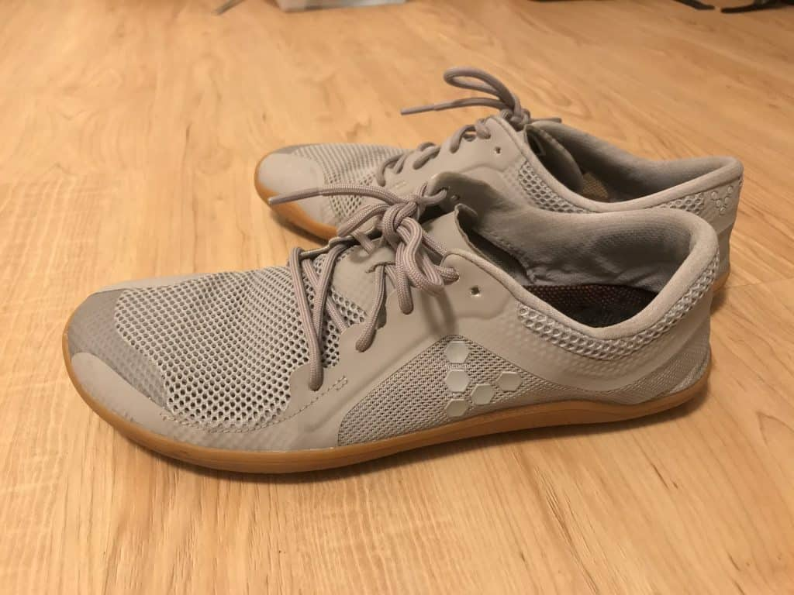
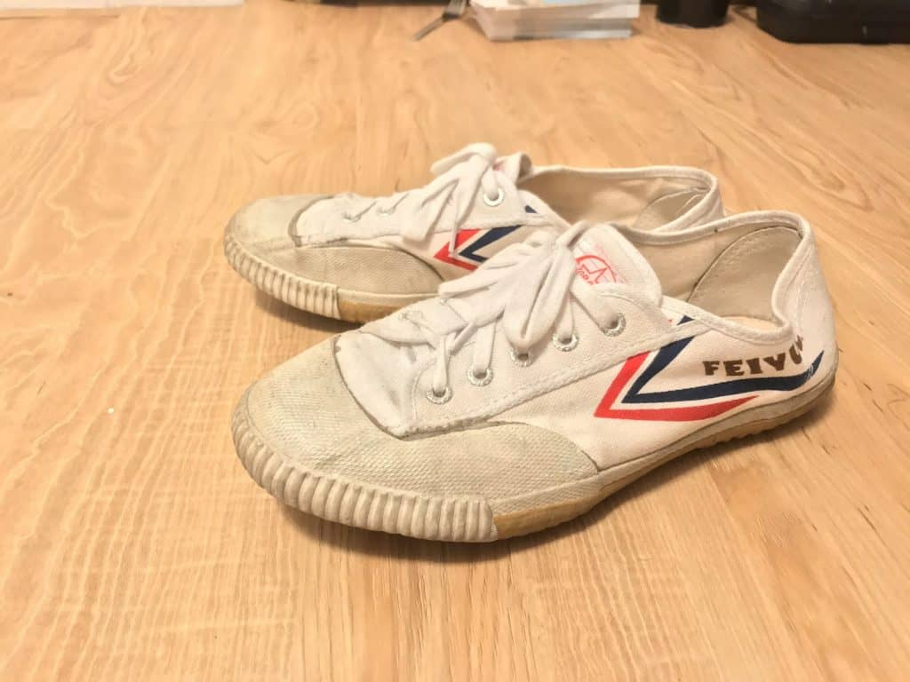
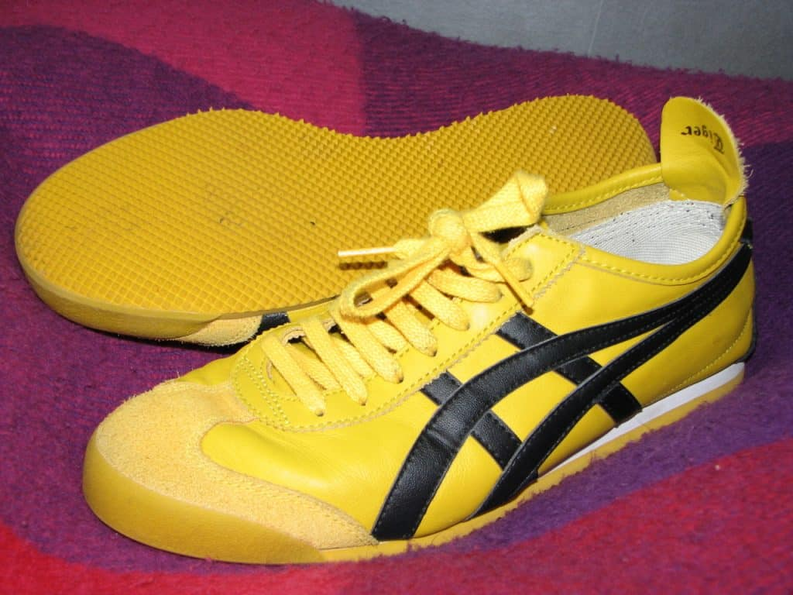
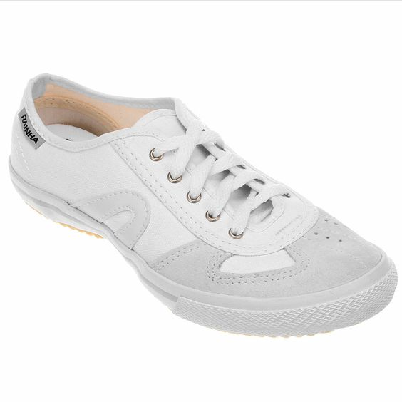
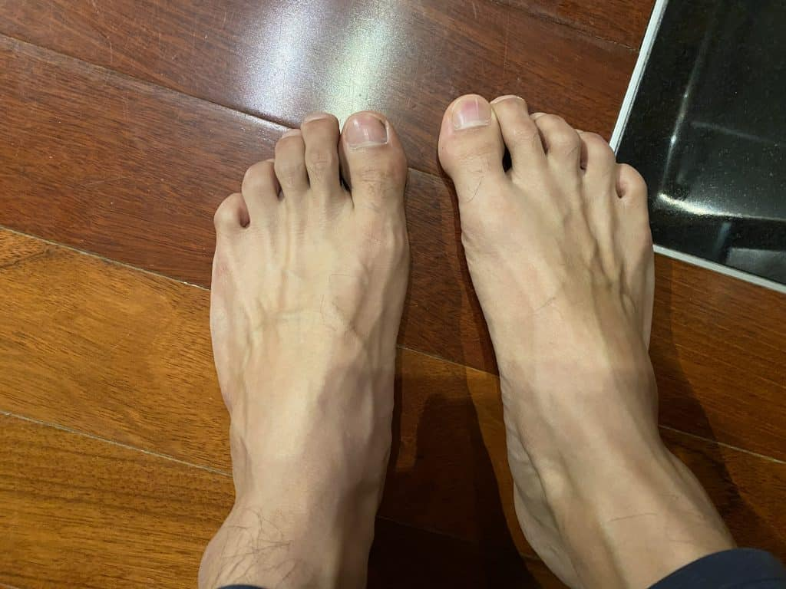

Capoeira is a martial art that is primarily done with bare feet. However, there are times when using shoes can be appropriate. Maybe you have a blister on your foot or maybe you're doing Capoeira in the concrete. **Whatever the reason it’s important to be prepared and have a good pair of capoeira shoes with you that lets you move**. Here is a list of a few of those shoes and with summaries of what makes them great and what things they lack.

S**o which shoe has the best value and which is best overall? The shoe with the best value is the Feiyue and the best overall shoe to use for Capoeira is the Vivo Barefoot**. Both these shoes have their downsides, however, the rainha gives amazing value for a price that can’t be beaten. This shoe gives you just about everything you could ask for, for a price that anyone can afford. On the other end of the spectrum is the Vivo Barefoot, which is more pricey but gives you exactly what you want in a shoe for capoeira. The feeling you get while wearing these is unbelievable and explained in depth below.

## BEST: Vivo Barefoot

[See Vivo Barefoot Price](https://tidd.ly/3TX65NZ)

## Value Pick: Feiyues

See Feiyue Price

## **How shoes are judged**

Shoes are judged on five factors.

1. Cost – Cost of shoe online at Amazon or it
2. Durability – How long a pair of shoes last with moderate to heavy use.
3. Mobility – Ability to move freely. As close to being barefoot as possible.
4. Comfort – How well the shoe fits and if it can stay on during movement.
5. Value – Value for your money

## **FEIYUES**

The “kung-fu” shoe. Cheap, easy to replace, and very comfortable. An awesome value pick.

[Buy Feiyues on Amazon](https://amzn.to/3kmxnus)

### **FEIYUES: Cost ~$20-60**

You can’t beat the cost of this shoe. These shoes can be found for dirt cheap online and at some kung fu stores. I found mine in china town and they cost me $20. That’s almost free guys! If you want to buy them online, you can. They’re a little more expensive, but not by much. Be careful because there are a lot of knock offs!

### **FEIYUES: Durability = Low**

If this shoe has a weakness, it is the durability. These shoes unfortunately do not last. With moderate to heavy use, you can expect about 6 months to a year out of these shoes before they get dingy and the glue starts to peel off. The stitching isn’t the best either and tends to fall apart as well. Again, you get what you pay for, in this case, it’s the fast fashion of minimalist shoes.

### **FEIYUES: Mobility = High**

This shoe is flat, and I love that. You can feel the earth and it gives you a feeling of control and connectedness to the ground that you don’t get with other shoes. It sounds like a small feature, but it actually makes a huge difference when doing some movements. Also, you can easily supinate and pronate your feet without losing grip or rolling your ankles. Almost anything you can do with your feet, you can do with these shoes, which is a big plus.

### **FEIYUES: Comfort = High**

One thing I really like about Feiyues is that they’re comfortable right out of the box. As soon as you put them on, you’ll know what I mean. The problem is that as comfortable as these shoes are, they have two main weak points with regards to comfort. First of all, the shoe gets super hot. The glued plastic insulates heat like you wouldn’t believe. If that doesn’t bother you too much, then good for you. Unfortunately, I find it very uncomfortable. The other issue is that the ankle opening is very wide. Maybe my ankles are thin, but they are VERY roomy and I’ve heard other people complain about the same problem. The issue here is that the shoe can fly off of your foot, which has happened to me.

### **FEIYUES: Value = Excellent**

This shoes is the winner of “Best Value” and it’s for a good reason. This shoe is the preferred shoes of many movement artists and the reasons are clear. The price is something you can’t beat and the mobility it provides is almost unmatched. All these for a pretty low price tag

## **ASICS**

[Buy Asics on Amazon](https://amzn.to/3kmh14T)

Another popular brand that a lot of people use to play Capoeira. A solid choice if you like the style and if it works for you. There are a lot of different Asic sneakers. I personally recommend the Mexico 66. For the price, they are the best value and are solid Capoeira shoes.

### **ASICS: Cost ~$80**

The price of these shoes is pretty middle of the road. Not too cheap and not too expensive. You can find these shoes on sale, but you’ll have to check the ASICS website every now and again.

### **ASICS: Durability**

These shoes can probably last you about double the amount of time as Feiyues. The soles are a little thicker and for that reason, the wear and tear is less noticeable.

### **ASICS: Mobility**

Asics don’t provide the same level of mobility as other shoes in this group. A large reason for this is the shoe drop. The shoe drop is the difference between the height of the heel and the height of the toe. It’s very slight negative, but this makes a difference when moving laterally and Capoeiristas heavily value mobility.

### **ASICS: Comfort**

Asics are very comfortable with a snug fit around the foot. I like Asics mostly because I think they’re very stylish, but believe me, they are light and fit well on your feet.

### **ASICS: Value**

Depending if you buy these on sale or not Asics can be a bit expensive. That being said, these shoes have a solid build and last a good amount of time. They fit well and are very comfortable on your feet. They don’t provide the same level of mobility as some of the other shoes out there, but they’re a solid option if you want something that is stylish and comfortable.

## **RAINHAS** VL2500

[Buy Rainhas](https://zumzumcapoeirashop.com/product-category/rainha-capoeira-shoes/?affiliates=eccbc87e4b5ce2fe28308fd9f2a7baf3)

Rainha is a Brazilian brand that until recently was difficult to purchase outside of Brazil. This shoe is the unofficial shoe of Capoeira. Most Capoerisitas have a pair.

After years of using Rainhas VL2500 in many different ways, I wrote an in-depth review that will help Capoeira practitioners decide if this is the right shoe for them.

👟 [A review of Rainha VL2500: The Capoeira shoe, and where to buy them](https://dendearts.com/a-review-of-rainha-vl2500-the-capoeira-shoe-and-where-to-buy-them/)

### **RAINHAS: Cost ~30-90**

Finding Rainhas in Brazil is no easy task, and is easiest done online through online Brazilian merchants. [Mercado libre is one example](https://lista.mercadolivre.com.br/tenis-rainha-vl-2500). You can buy shoes here and have them delivered to an address in Brazil for about $30 USD. Today you can find these shoes (along with other Capoeira accessories) by going to [Zum Zum Capoeira shop](https://zumzumcapoeirashop.com/product-category/rainha-capoeira-shoes/?affiliates=eccbc87e4b5ce2fe28308fd9f2a7baf3). Buying shoes here is more expensive but much more convenient than traveling to Brazil to buy shoes!

### **RAINHAS: Durability**

Rainhas reliably last about two years. Like all the shoes on this list, the shoe's durability will depend on how much you use it. I bought two pairs in Brazil about 2.5 years ago. One is starting to see the end of its lifespan and the other is still in good condition because I don’t use it to train.

### **RAINHAS: Mobility**

You’ll have no problems moving around in these shoes. There is a lot of rubber on the soles and it provides a good grip. This shoe is not quite on the level of Feiyues in terms of mobility, but they are still really good, and that’s the reason so many capoeiristas use this shoe in Brazil. Almost every capoeirista has a pair of these shoes and the freedom to move is a big reason why.

### **RAINHAS: Comfort**

You need to break these shoes in before you start training in them. For whatever reason, they feel like cardboard the first couple days. I suggest wearing them around just to adjust the shoe to your foot. Once that phase is over you’ll be very happy with how comfortable these shoes can be.

### **RAINHAS: Value**

In Brazil, these shoes go for about 100 Brazilian reals. With the current exchange rate, (September 2019), that works out to about $35 USD. So if you’re in Brazil and get a chance to buy these shoes, it’s a steal. For those interested in buying shoes from Zum Zum, the cost may seem high, but you should consider the fact that these shoes are difficult to come across outside of Brazil. If you want a premium shoe for the near $100+ price tag, the next shoe, Vivo Barefoot is a better option in terms of performance. Rainha VL2500, is still the king of shoes for Capoeira. They are widely used, stylish, and perform great while practicing Capoeira.

## **VIVO BAREFOOT**

[Buy Vivo Barefoot Prius Lite](https://tidd.ly/3TX65NZ)

This is the high end version of Capoeira training shoes. A strictly minimalist shoe that appeals to people who train bodyweight calisthenics and other movement arts.

## **VIVO: Cost ~$150**

The Vivo Barefoot is a UK company that provides some awesome shoes, but for the quality you’ll be stepping into a slightly higher price bracket. You can find these shoes on sale, but they’re usually over $100. If that’s within your price range, then frankly I think you should get a pair.

### **VIVO: Durability**

These things are built to last. I’ve had my Vivo Barefoots for about a year and they look great. I think I can get at the very least another year and a half from these babies. I haven’t pushed them as hard as the other shoes on this list (they’re my newest shoe buy), but the build quality is really good. The materials include woven mesh on the top and a harder plastic on the bottom. The bottom gives you protection from rocks and stuff while still providing a great tactile feeling.

### **VIVO: Mobility**

There is no shoe drop on these shoes. The shoe is flat and if you’re the kind of person that likes being barefoot, then this is a great alternative. You really feel the ground, which makes it easier to move around as if you were barefoot. The other thing I like is the lightweight. You feel like you’re not wearing shoes! All other shoes on this list weigh enough that it might hinder you. Not these. You pay top dollar for a reason!

### **VIVO: Comfort**

The comfort level is amazing. The shoe itself fits superbly and is very adjustable. There is some added room by the toes, which I originally thought would be a problem but it actually makes me feel even more free to move. The snugness around the middle part of the foot also provides security that the shoe won’t fall off. It hasn’t happened and I can’t imagine it happening. Overall, amazing fit. Again, if you’re new to walking barefoot, it might feel a little uncomfortable. But once you start getting used to being barefoot, you’ll fall in love with the feel of these shoes.

### **VIVO: Value**

The value here is lower of course because we’re talking about a shoe over $100, but I have to say that even with the steeper price, this shoe is really amazing and worth it. If you’re looking to make an investment into a shoe that will last and you can train in on a consistent basis, then I highly recommend this shoe. If Vivo Barefoot is outside of your budget, then I might not recommend it as it’s more of something that’s nice to have, but not necessary.

## **SNEAKERS**

By “sneakers” I mean the sneakers you wear to go out or to go to the gym. There are tons of different types of sneakers but a lot of them look like brightly colored high heels. I don’t recommend these, but in a pinch it might be ok to use.

## **SNEAKERS: Cost ~$40-$??**

Hopefully you’re not buying any kind of high top or running sneaker for Capoeira. I added the price in here, but honestly, I wouldn’t choose to wear sneakers to Capoeira unless I absolutely needed to.

### **SNEAKERS: Durability**

Some sneakers have a pretty good shelf life and will last you a good year and a half to two years. Depending on what you use them for, they can last you for a good number of training sessions.

### **SNEAKERS: Mobility**

Here is where my gripe is with sneakers. Most sneakers today have a massive base (shaped like a trapezoid) and a very large shoe drop. Both of these factors scream “sprained ankle” to me. These shoes ARE NOT designed to be used with any lateral motion or much spinning. Both the shoe drop and the large base mean that if you lean too much to the side, you put yourself at great risk of toppling over with little chance to recover. The result is either going to be your butt on the ground, or a sprained ankle.

### **SNEAKERS: Comfort**

A lot of sneakers price themselves on the cushion they provide their users. Adding cushion is widely seen positively by most consumers, but if your goal is to move freely, then this is a huge detriment to your training. The added cushion acts like a glove on your hand. The thicker the glove, the less dexterity and sensitivity you’ll have. Shoes work the same way and the really cushioned shoes provide little connection to the ground. few capoeiristas would be ok with this as we receive a lot of information through our feet regarding balance and proprioception.

### **SNEAKERS: Value**

Although you might think to bring any old pair of sneakers to class, I would say to do this only in a last case scenario! If there is absolutely nothing else you can do, then bring your sneakers to class.

## **BAREFOOT**

If I had a baseline to compare the shoes I wear to Capoeira, it would be my bare feet!

## **Barefoot: Cost – FREE!**

How can you beat this?! Mother nature gave you two feet for a reason.

### **Barefoot: Durability**

The one downside to playing Capoeira with your feet is that they can get torn up by the floor. When you start training Capoeira, it’s common to get a blister or to feel very sore in your foot muscles. For most people, this is a hurdle that they have to cross. Over time, your feet will develop calluses and become tough enough to handle hard training. Until then, you might leave classes feeling like your feet have been burned by coals.

### **Barefoot: Mobility**

Nothing’s better! The reason your feet are so much better at providing quick and agile movement, is because there is a lot of feedback between your feet and your brain. Your brain receives signals from the sole of your foot and with that information, you can move easily. The weight of shoes also tends to change the way you move. If might be subtle, but if someone’s kicking at your, you want to be as light on your feet as possible.

### **Barefoot: Comfort**

This will depend a lot on you. If you’ve developed some toughness on your feet, then you’ll feel perfectly comfortable being barefoot. Some people don’t feel comfortable being barefoot… which is unfortunate. One big downside to being barefoot, and an excellent reason for wearing shoes, is the lack of protection from glass, or small rocks that might cut your foot. Maybe you have feet made of leather, but it’s more likely that you will want to wear shoes when you play Capoeira outside.

### **Barefoot: Value**

Your feet are like an investment that improves in value the more you use it. After so many years of doing Capoeira, you will actually be able to do Capoeira on the concrete for a good while before it starts to hurt. That being said, it’s not a bad idea to find some shoes that help you train while you’re recovering from blisters or other foot related issues.

So that’s it! These are some of the best shoes out there in my humble opinion. If you have any shoes that you enjoy using or think should be on this list, make sure to reach out and let me know.

## **How were shoes selected**

I have personally tried all the shoes on this list. On top of that I know a great deal of people who have tried many of the shoes on this list. After getting their opinions and test driving some of my own shoes, I came up with this list to identify which shoes were the best according to the needs of a capoeirista. All the shoes on this list are viable options to train capoeira, they would not be on the list otherwise. However, some have benefits that might suit your fancy and that’s what this review is about. Finding a shoe for YOU!

## **How are shoes tested**

As I mentioned, I’ve tried all these shoes. I personally tested these shoes in practice and in the Roda. I tried to be as unbiased and documented what I liked and disliked about each shoe.

## **How much does cushion matter? Minimal vs Structured shoes**

If you come from a runner's background, you might worry about your knees and how to keep them injury free. Generally the shoes on this list fall into the minimalist category and there is a good reason for this. Shoes that are overly squishy tend to make you weak as a mover. Absorbing impact is something your body naturally does, however if you use your shoes as a crutch, you’ll never develop the abilities needed to keep yourself injury free. Minimal shoes force our feet to adapt and build muscle where it’s needed to stay healthy.

## **Sneakers for Capoeira**

Sneakers have a large cult following fashion and for running. Some capoeiristas do train with sneakers that have a high heel. If you did track in high school, or use these kinds of sneakers a lot, I can why you would want to buy a pair for Capoeira. They’re usually affordable and comfortable, but unfortunately they absolutely suck for Capoeira. A large difference between the height of the heel and the toes makes spinning and lateral movement more difficult and increases the risk of twisting your ankle. Sneakers are designed specifically for forward movement, making them terrible Capoeira shoes.

## **Availability**

Unfortunately, not all shoes are equally available. In the case of Rainhas, the availability of the shoe makes it difficult to recommend. I tried to only include shoes that you can find online or at most outlet stores, but Rainhas are an exception. Rainha is a Brazilian brand and can only be found in Brazil. It is also one of the most popular brands of shoes for capoeiristas all around the world, so I had to include it.

What about finger shoes for capoeira?!

Yea… these sound like a great idea but are terrible in practice. I absolutely can’t recommend these kinds of shoes. Firstly there’s no discernible reason for why individual toe compartments would be “better” and if the shoe does not fit perfectly on all of your toes, spinning can get really uncomfortable really fast. I tried to give these shoes a chance more than any other shoe, and they do not cut it.
