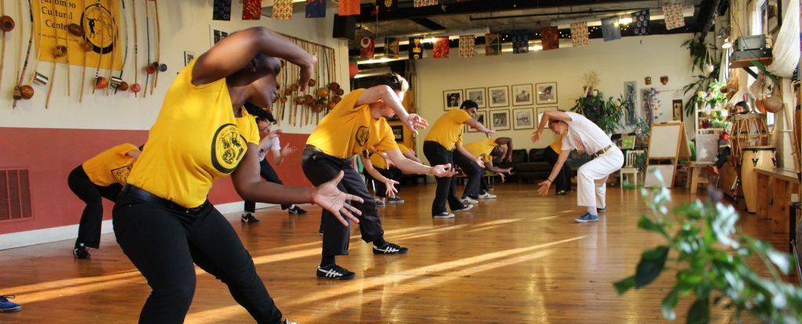
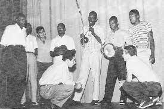
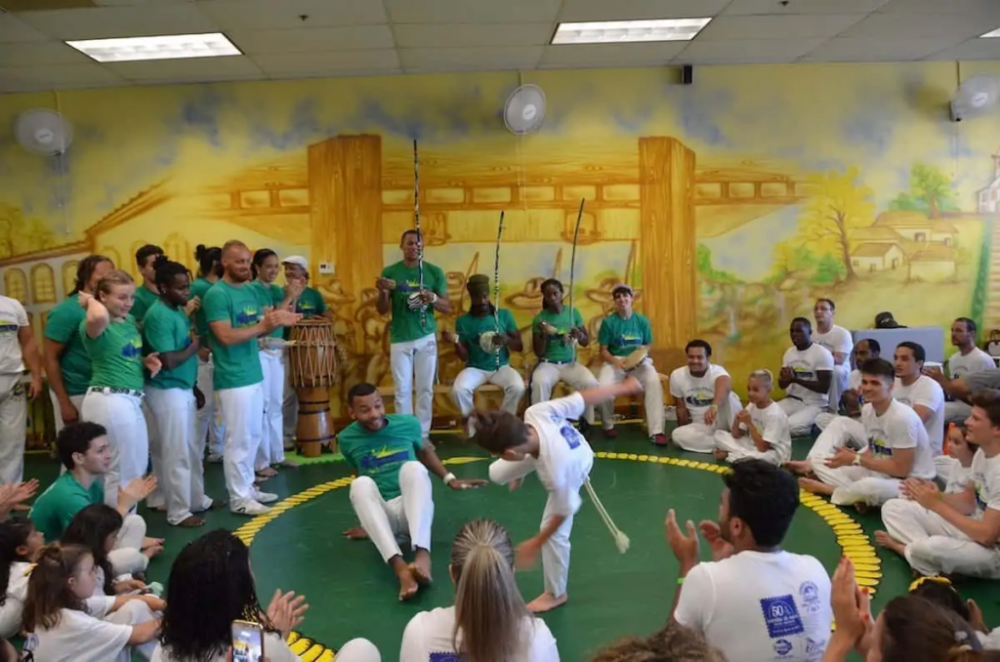
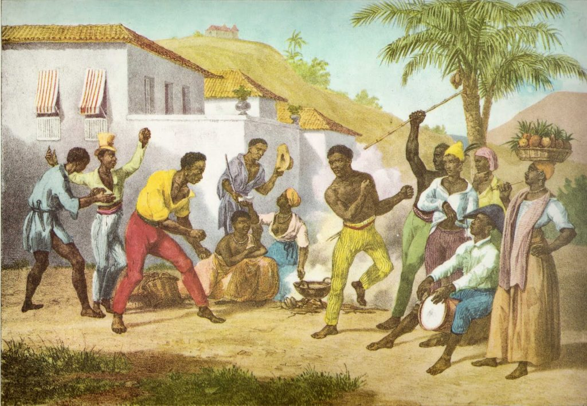
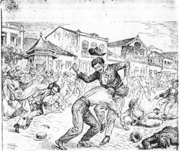

The three main styles of Capoeira that are available today for people to learn are Angola, Regional, and Contemporânea. The largest of three is Contemporânea which borrows elements from Angola and Regional, and is the newest of the three. Regional is the second youngest starting in the 1920's by Mestre Bimba. And Capoeira Angola is an older and more traditional form of Capoeira, most strongly associated with the Capoeira from Salvador, Bahia.

[For a look at the origin of Capoeira pre 1900 all the way to before the African diaspora, check out my post here.](https://dendearts.com/what-is-the-origin-of-capoeira/)

### Capoeira Angola - Codified in the early 1900's

Capoeira Angola is played low to the ground. The movements are generally more theatrical and players rely on their wit and trickery to outdo their opponents. Angola emphasizes tradition, African heritage, and music far more than the other two styles. Most Angoleiros attempt to maintain the traditions of Capoeira and take pride in preserving the Afro-Brazilian art.

According to Muniz Sodre (a journalist), a man named Santugri gives an account of Capoeira in Acupe, Bahia in the early 1920's.

> "Normally the game took place in front of the churches during the festivities of Saint Benedict or Sant Anthony. It was a slow sort of game. So slow that some people found it boring.. .This sort of Capoeira was done to the sound of a small guitar, there was no berimbau. The singing was always the repetition of "Ê Camaradinha, camara... ê, cmaradinha, cmara". (Nestor, 2002)

In those times, it was very common to see Capoeira on Sundays. Men would play in the streets and the women would sing. The players would wear their nice Sunday clothes, taking pride in not getting it dirty as they played.

<iframe width="560" height="315" src="https://www.youtube.com/embed/QrLNIwZ1x50" title="YouTube video player" frameborder="0" allow="accelerometer; autoplay; clipboard-write; encrypted-media; gyroscope; picture-in-picture" allowfullscreen></iframe>

This picture of Capoeira in the early 1900's is a small part of the tradition modern Angoleiros attempt to preserve. They do so with the songs they sing, the movements they perform, and the rituals they partake in. Today, the tradition is famously preserved by practitioners like Mestre Joao Grande (student of Mestre Pastinha), and the members of the Centro Esportivo de Capoeira Angola (Sports Center of Capoeira Angola). Mestre Pastinha is the spiritual god-father of Angola, however he is not it's creator. He simply helped to codify what we now consider to be "Angola".

According to some practitioners, Angola is the original Capoeira style. However this does not seem likely as the repression of the late 1800s into the early 1900s by several accounts made Capoeira into the more docile sport. Mestre Bimba is one account of this critique, and the creator of Capoeira Regional, which he believed would bring the "fight" back into Capoeira. This point is controversial, however many Angoleiros would likely defend their ability to "Fight" with the use of Capoeira Angola.

### Evolution in Angola

The goal of preserving the style of Capoeira does not mean that there is no growth in the style of Angola. There are many Mestres and teachers who have developed their own style, such as Mestre Cobra Mansa. His games are by comparison to the old guard, acrobatic, extremely precise, and agile.

<iframe width="560" height="315" src="https://www.youtube.com/embed/4jfjAkmei78" title="YouTube video player" frameborder="0" allow="accelerometer; autoplay; clipboard-write; encrypted-media; gyroscope; picture-in-picture" allowfullscreen></iframe>

### Capoeira Regional - Created 1920-30's

Regional is the first widespread systemization of Capoeira as a martial art in an academic setting. The game of regional is more powerful, martial, and upright than Angola. There is much less of the theatricality you might see in Angola, and all these differences stem from the system developed by Mestre Bimba.

Capoeira Regional was originally called "Luta Regional Bahiana" and was created by Mestre Bimba. Bimba is a legendary figure in the world of Capoeira because it was his style of Capoeira Regional that spread across Brasil and the rest of the world.

Mestre Bimba looked down on the Angola style of Mestre Pastinha and the other Capoeiristas in Salvador, Bahia. He believed he could create an "effective" form of self defense by transforming Capoeira. Bimba invented new rhythms to play Capoeira like _Banguela_ and _Iuna_. In addition, he standardized many elements in Capoeira, which had never had any set "rules". The idea of a belt system in Capoeira was unheard of in the 1930's, and Mestre Bimba created one of the first graduation systems for Capoeira.

Here is a video of Mestre Nenel demonstrating the 8 sequences of Mestre Bimba. This is another standardization of Capoeira created by Mestre Bimba to quickly teach the art of Capoeira to new students.

<iframe width="560" height="315" src="https://www.youtube.com/embed/mo-QsntFmqU" title="YouTube video player" frameborder="0" allow="accelerometer; autoplay; clipboard-write; encrypted-media; gyroscope; picture-in-picture" allowfullscreen></iframe>

A testament of Mestre Bimba's ability to teach Capoeira as a martial art is evident in his partnership with the Brazilian military. Mestre Bimba taught the military his system of Capoeira Regional. They were particularly interested in his "ambush training". This specialization was reserved for his advanced students looking to specialize in jungle survival skills.

Here is a TV documentary created by a French television station that features Mestre Bimba's academy in Salvador.

<iframe width="560" height="315" src="https://www.youtube.com/embed/PrDD9qutULM" title="YouTube video player" frameborder="0" allow="accelerometer; autoplay; clipboard-write; encrypted-media; gyroscope; picture-in-picture" allowfullscreen></iframe>

Just about every group in the next section "Contemporânea" draws inspiration from Mestre Bimba and Capoeira Angola in one way or another.

Today, Mestre Nenel preserves the legacy of Capoeira Regional. There are few "Regional" schools that strictly follow the teachings of M. Bimba. Many schools that identify as Regional has made several changes that distinguish them from the original style created by Mestre Bimba. This is not to say that those schools are illegitimate, however like any other art, Capoeira as a whole has evolved a great deal over the years. This brings us to the latest manifestation of this art, Contemporânea.

### Capoeira Contemporânea - 1950's to today

Contemporânea schools are defined by their evolution on the art of Capoeira. They take elements of Angola and Regional, and incorporate them into their unique style. Acrobatics, grappling, and advanced floreios are some concepts that have been added by various Contemporânea school. Unlike Judo, where a centralized body controls every school through certifications and curriculum, Capoeira schools operate almost completely independently. This means that most schools have the freedom to experiment and grow in a way that is unique.

Contemporânea was created by the migration of Capoeiristas away from Salvador, Bahia - the cultural hub of Capoeira. This cultural hub connected Capoeiristas with the traditions that made Capoeira what it was for as long as it existed in Salvador, Bahia. This included things like Samba, Candomble, and many other elements that were part of the African tradition brought to Brazil through the slave trade. Although some contemporântea schools do preserve these traditions, this is difficult due to the distance from Salvador, Bahia.

<iframe width="560" height="315" src="https://www.youtube.com/embed/0bS67x6gnUI" title="YouTube video player" frameborder="0" allow="accelerometer; autoplay; clipboard-write; encrypted-media; gyroscope; picture-in-picture" allowfullscreen></iframe>

Some larger contemporânea schools like Capoeira Brasil and Cordão de Ouro maintain some uniformity in their style. However methods of teaching and many nuances are left up to the individual teachers to communicate to their students. This means that even within groups, there can be large differences in instruction, graduation requirements, and style.

### Contemporânea is a contemporary take on Capoeira

[My full explanation of Capoeira provides a broad overview of the art for people interested in learning more.](https://dendearts.com/what-is-capoeira-the-best-damn-online-explanation/)

Contemporânea is exactly what it sounds like; A more contemporary take on the art of Capoeira. It's a wide bucket that encompasses close to all the schools available to train with today. If you search for a Capoeira school today, there is a 90% chance that the first one you see is contemporanea and not Angola or Regional.

<iframe width="560" height="315" src="https://www.youtube.com/embed/rQpri4MZM44" title="YouTube video player" frameborder="0" allow="accelerometer; autoplay; clipboard-write; encrypted-media; gyroscope; picture-in-picture" allowfullscreen></iframe>

## Is Miudinho a style of Capoeira?

No, Miudinho is not a style of Capoeira. Mestre Suassuna (the creator of Miudinho) states that he reclaimed concepts from older Capoeira games that were played close together. According to the autobiography of Mestre Suassuna, Miudinho was originally created a training method. The sequences Suassuna created were only for advanced students. They were a test of the student's ability to play the kind of game that he wanted to see. That is, a dynamic, creative, and cooperative game that was fast and very close together. It's very common to see a Miudinho roda only a few feet in diameter and played an incredible speeds.

Mestre João Grande is said to have been a major inspiration for the game of Miudinho. This is no doubt the case, as many movements developed by Mestre Joao Grande have been further developed by Mestre Suassuna in the game of Miudinho. The modern take on much older movements is very impressive to watch.

Here a pair of instructors play Miudinho on a table of all things in a demonstration.

<iframe width="560" height="315" src="https://www.youtube.com/embed/e7WbjvY0mC0" title="YouTube video player" frameborder="0" allow="accelerometer; autoplay; clipboard-write; encrypted-media; gyroscope; picture-in-picture" allowfullscreen></iframe>

Despite M. Suassuna repeatedly stating that Miudinho is not a style of Capoeira, you can see how much miudinho influence an entire era of Cordão de Ouro. The influence on their games was so pronounced that this group that graduated to professor and Contra Mestres in 2004 were known as the Geracao do Miudinho (the Miudinho Generation).

Here is a video of that generation playing in a roda with M. Suassuna leading the roda.

<iframe width="560" height="315" src="https://www.youtube.com/embed/SR_AsxmibkI" title="YouTube video player" frameborder="0" allow="accelerometer; autoplay; clipboard-write; encrypted-media; gyroscope; picture-in-picture" allowfullscreen></iframe>

## Which Style of Capoeira is Best?

- Angola - If you enjoy the rituals, the tradition, and the African heritage, then it would stand to reason that Angola might be best for you.
- Regional - If you see value in the martial aspects of Capoeira, and the traditions laid down by Mestre Bimba, then Regional might be better for you.
- Contemporânea - And lastly, if you enjoy the flexible and dynamic nature of Contemporânea, then that might be the best style for you. The short answer is that it depends.

If you're looking for a school to join. Don't fall into the trap of thinking a group is better because they are "contemporary" or more "original".

The best thing you can do when looking into Capoeira styles is to search on youtube, go on different group's websites, and take a class to learn about the group. If you think their goals and values align with yours, then they might be the best choice for you.

## Capoeira in Slavery 1500 - 1800's - No Clearly Defined Style

If Capoeira was created by African slaves in Brazil (this is the most common hypothesis on [the origin of Capoeira](https://dendearts.com/what-is-the-origin-of-capoeira/)), then what did it look like?

This is the million dollar question for Capoeira and there are few records on the topic. The Portuguese government burned all documents they could regarding slavery, meaning there is little left to reference. With the references we do have, it seems likely that Capoeira was a type of African N'golo. A ritual battle where two men would settle a dispute (or fight) over marriage rights. For example, in some West African cultures, the winner of an N'golo can choose a bride of his choosing without paying a dowry.

What is clear is that the Capoeira of the 1600's or 1700's would be fairly different. In those days, only drums were used for music, and the inclusion of heads butting against each other is something you do not see anymore. The emphasis on using kicks however is something you still do see. The truth is that unless we have a time machine, it's unlikely we'll ever know what Capoeira looked like when it was "created".

What these old sources do provide is reason to believe that Capoeira was a general term used to name any N'golo that was used for self defense. This would explain the many sources that identify Capoeira in different cities in the North-East of Brazil, as well as Rio de Janeiro.

## Capoeira Extinction Period late 1800's - early 1900's

The Capoeira in Pernambuco, Rio de Janeiro, and other places is today extinct. The crack down of Capoeira along with many other elements of Afro-Brazilian culture was very severe. Although it's not known all the locations where some form of "Capoeira" existed, the mass extinction is a major reason why Capoeira was only able to grow out of Salvador, Bahia. This is where the tradition of Capoeira remained strongest, and where the styles of Angola and Regional grew outwards into the rest of the world.

It is not 100% clear why Capoeira persevered here and not in other area. Similar to Samba, Capoeira during this time may have hid within the African tradition of Candomble.

Mestre Bimba (creator of the Regional style) comments that the Capoeira of this time was very useless having lost much of its "fight". This no doubt was due to repression by the government, which outlawed Capoeira around this time.

## Capoeira used by the Gangs of Rio 1800's - Armed Street Combat

The Capoeira found in Rio de Janeiro was closely connected with the many maltas (gangs) that existed in the late 1800s to the early 1900s. Capoeiristas were people who could be used as armed enforcers, with many of them keeping knives, switchblades, and other weapons on their person. This Capoeira was a martial art for the streets. The violence became so brutal, the Brazilian government decided to crack down on these maltas and extinguished them.

The maltas consisted mainly of men who were veterans of the war with Paraguay. Without a means to support themselves, many of these men found work as enforcers for local politicians. They worked as bodyguards and provided the underworld with muscle.

Many people believe that Capoeira came from Salvador, however this not completely true. There are records of Capoeira existing in Rio de Janeiro before any the reported migration of Capoeira from Salvador to Rio de Janeiro.

This Capoeira was different than the Capoeira we would see in Salvador, Bahia. It had no musical connection and was often seen using weapons, especially razor blades. Besides this, little is known about this "style" of Capoeira.

### Street Capoeira Today

<iframe width="560" height="315" src="https://www.youtube.com/embed/RheE8UbveVU" title="YouTube video player" frameborder="0" allow="accelerometer; autoplay; clipboard-write; encrypted-media; gyroscope; picture-in-picture" allowfullscreen></iframe>

Capoeira de Rua (street Capoeira) is still strong in Brazil. There are many people who learn to play Capoeira in street rodas held at public squares and other public areas just like the old masters over 100 years ago. These people learn by observing and each has their own unique style based on their interpretation of the Capoeira they observe.

The stigma with Capoeira de Rua is that it's less refined and more violent than Capoeira learned in an academy. There is some truth to this as street rodas are largely self regulated, meaning if you get hurt, there is nobody to run to other than the authorities. Street rodas are still prevalent in many parts of Brazil and in fact there are some rodas that are run regularly and are fairly organized. The most famous of these is the Roda of the Plaza da Republica in São Paulo, held ever Sunday of the month.

## The Growth of Academies and Styles

[An invention of Mestre Bimba that changed the Capoeira world, was the Capoeira academy. Up until that pointe were no schools for Capoeira and training was a very informal things. Y](https://dendearts.com/how-capoeira-classes-have-changed-1900-2020/)ou might receive lessons from a teacher, but on a schedule of any kind.

With the creation of academies, teachers from the same group began developing their own unique styles. A good example is Abada and Movimento Novo. Both grew from Senzala, a mostly Regional group. But ABADA and Movimento Novo have completely different styles that any novice can notice. Mestre Bimba and the Angola Mestres of the early 20th century created much of the foundation for these movements, teachings, and rituals, however it was the teacher that came after them that made them into the styles we see today.

Movimento Novo

<iframe width="560" height="315" src="https://www.youtube.com/embed/48P_Rh-K5JU" title="YouTube video player" frameborder="0" allow="accelerometer; autoplay; clipboard-write; encrypted-media; gyroscope; picture-in-picture" allowfullscreen></iframe>

ABADA Capoeira

<iframe width="560" height="315" src="https://www.youtube.com/embed/2JyD95YNuXM" title="YouTube video player" frameborder="0" allow="accelerometer; autoplay; clipboard-write; encrypted-media; gyroscope; picture-in-picture" allowfullscreen></iframe>

### The basic Capoeira movements for beginners

Every school and every styles has for the most part a foundation of similar movements. There will be of course some differences, but if you are new it's very important to know the basics. There are 10 basic movements you should know as a beginner that you should know. For video tutorials and tips on how to do these kicks, check out my in deep dive into [Capoeira movements for beginners](https://dendearts.com/10-basic-capoeira-movements-for-beginners/).

The basic Capoeria movements include:

- The Ginga
- Esquivas
- Meia lua de frente
- Queixada
- Armada
- Meia lua de compasso
- Rol_ê_
- Aú
- Cocorinha
- and Negativa
