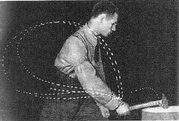

Here's the formatted document according to the specifications:

---
title: "The Myth of Perfect Technique: Invite Variability"
date: "2023-12-24"
categories: 
  - "capoeira101"
  - "movement-guides"
tags: 
  - "technique"
coverImage: "berstein-blacksmith.jpeg"
layout: "blog-post-layout.njk"
---

In 1922, Nicola Bernstein, a Soviet scientist, embarked on a study that would fundamentally challenge our understanding of skill mastery. His subject of study? Expert blacksmiths. The assumption at the time, and indeed a common belief even today, is that perfect technique in any skill is achieved by replicating a precise, unvarying motion every single time. **Bernstein's findings, however, painted a very different picture of what mastery truly looks like.**

## **Discovering the Fluidity of Expertise**

Bernstein observed that these blacksmiths, renowned for their expertise, displayed a significant degree of variability in their movements. Each strike of the hammer, while aimed at the same location, was executed with subtle differences. This led Bernstein to coin the insightful phrase "repetition without repetition." It wasn't about robotic uniformity, but rather about a dynamic, adaptive process.

<figure>

<figcaption>

Bernstein's expert blacksmith

</figcaption>

</figure>

## **Unconscious Adjustment: The Core of True Mastery**

The concept of "repetition without repetition" implies that while the blacksmiths consistently hit the same spot, the path to each strike varied. Their joints and muscles fluidly adjusted the trajectory of the hammer in real-time, accommodating various external factors and internal conditions. This phenomenon is crucial to understanding mastery: it's less about following a rigid, prescribed pattern and more about our body's ability to make unconscious, micro-adjustments to achieve desired outcomes.

## **Applying Bernstein's Insight to Your Training**

This revelation has profound implications for how we approach learning and training. Rather than striving for the illusion of perfect, static technique, our focus should shift to mimic real-world conditions as closely as possible. In martial arts like Capoeira, the idea of drilling a movement in isolation is meant to provide a foundation, but it has limited application in the fluid, unpredictable environment of a roda or combat.

An easy example of this is a class where you drill a technique or sequence of movements and afterward try to apply the concept to a live game. Given the time you spent learning this sequence, you might think the technique is easier to apply, but more often students are left feeling puzzled, without comprehension about how to apply the technique.

## **Embracing Imperfection in Practice**

When training, especially in disciplines like martial arts or dance, it's crucial to move beyond the quest for the perfect angle or movement. Such step-by-step instruction toward perfection is a mirage, particularly when transitioning from practice to application. The dynamic nature of real-world scenarios demands adaptability and responsiveness, traits that rigid replication of techniques cannot foster.

## **Simulating Real-World Scenarios**

For solo practitioners, replicating real-world conditions can be challenging, but it's not impossible. If you don't have a partner, use a stand-in object like a chair to kick over and move around. Imagine that this chair is a partner that changes orientation, distance, level, and attacks you. These small adjustments can significantly enhance the effectiveness of your training. **This approach helps to develop not just the physical aspects of the technique but also the perceptual and adaptive skills necessary for application in varied and unpredictable circumstances**.

## **A New Paradigm of Mastery**

The myth of perfect technique is just that—a myth. Bernstein's work invites us to embrace variability and adaptability as essential components of mastery. In doing so, we not only align our training more closely with the realities of application but also cultivate a more holistic and resilient form of expertise. Whether in Capoeira, other martial arts, or any skill-based endeavor, the journey to mastery is one of continuous adaptation, learning, and growth.