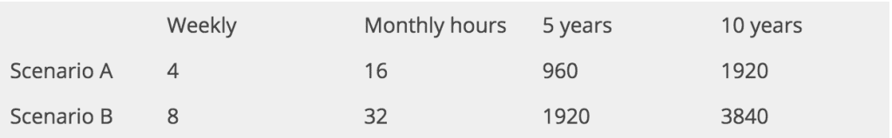
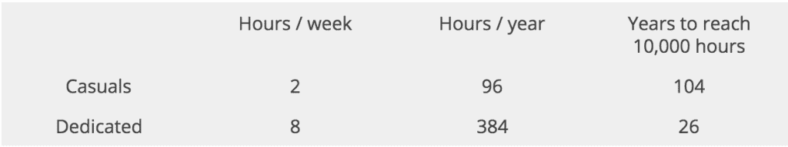

Capoeira is an art form that uses a diverse set of skills. In capoeira there is hand balancing, acrobatics, dance, martial arts, music, in addition to many other things. Given the breadth of knowledge, it might seem unclear how long it takes to get good. There are actually three answers to this question, depending if your goal is to become good, proficient, or master the art of Capoeira. 

## The time it takes to become good at Capoeira

Becoming good at Capoeira for most people can take 4 to 6 years. At this level, you will be a student who is able to perform all fundamental movements in Capoeira. Some will be able to perform some floreios depending on how much they train this aspect. Hopefully, after this much time you will have some knowledge of the instruments and be able to play their most rhythms while singing. At this level of proficiency it’s also common for the teacher to ask you to help during class, be an example to newer students, and maybe help teach.

To get an idea of how much work you will need to put in to become good at Capoeira, lets create an example. Let’s say you’re a student who comes to class and train one hour for three times a week for five years. In that time, you will have trained three hours a week, 12 hours a month, and 144 hours a year. In five years, you will have trained 720 hours. Of course this is the ideal. Almost nobody will get to this number of hours trained during a five year span. Vacations and other things will get in the way, but this can be offset by training on your own and traveling. Doing these two things are crucial for you development and will help you reach the amount of hours needed to reach this goal.

## The time it takes to be great at Capoeira

If your goal is to become an amazing Capoeiristas, you’ll need a lot more time to train. Depending on how much you train, it will take somewhere between 7 and 15 years to be a proficient Capoeirista. At this level, your skill will be determined by the amount of hours you put in. The number of years you have won’t matter as much. For example, if you train four times a week for one hour, in 10 years time you will have trained 1920 hours. Sounds like a lot right? At the same time you could be training for eight hours a week for 5 years and you will have trained the same number of hours.   

Young gymnasts can easily train for 10-12 hours a week and do that for many years on their way to the olympics. The difficult thing about measuring the time it takes to become proficient is that it’s not clear what “proficiency” even means. What kind of things will you be training? How good is your training? And, how long are you training those things? These are questions you will need to ask yourself. If you are someone who loves floreios and you practice flipping all day, then that is what you will be good at. But, if you don't practice kicks or if you get lazy about training music, then you’ll be deficient in those areas. At this level, your training will likely become more focused to accomplishing goals. 

Bruce Lee famously said, “I fear not the man who has practiced 10,000 kicks once, but I fear the man who has practiced one kick 10,000 times”. The famous quote speak to the fact that repetition is the mother of skill. For example, if you want to kick higher, then you might need to work specifically on your hamstrings and hip-flexors for a while. That means drills and repetition. And if you want to become skillful in Capoeira, you will need to throw thousands of kicks and there is no getting around that. This fact is the reason not everyone reaches this level. Talent is not the issue in the majority of cases. Having enough dedication and focus is usually what holds people back. Watching TV/Netflix/ or whatever show is the new cultural fad is much easier than training hard. But, if you’re able to focus your mind and put in the hours you need, you can become an amazing Capoeirista. Here’s some inspiration from Sitio do vovô, Mestre Suassuna’s training ground for young people. They train all day long and you can really see how hard they train. Aspire to have the same dedication as these guys. If you have a job like me and can’t train as many hours as you’d like, just know that not everyone who is on the path to learning Capoeira walks along it at the same pace. Some sprint and some walk, there is no correct answer to how you do it.

<iframe width="560" height="315" src="https://www.youtube.com/embed/yBCHCmLXrHo" title="YouTube video player" frameborder="0" allow="accelerometer; autoplay; clipboard-write; encrypted-media; gyroscope; picture-in-picture" allowfullscreen></iframe>

## How long does it take to master Capoeira

Mastering something is a completely different discussion from becoming good. And it’s a completely different discussion from becoming proficient. The requirements are totally different for these three things. Mastery is something that is reached after a lifetime of dedication to an art. I wrote a longer piece on how long it takes to become a Mestre, [here](https://dendearts.com/becoming-a-mestre-the-highest-rank-in-capoeira/). In general becoming a Mestre is what most people think of when they think of mastering the art of Capoeira. Removing all titles, I think its easier to have a discussion about mastery.

Malcom Gladwell sites famously in “Outliers”, that master take 10,000 hours to reach in any field. I would argue that capoeira take way more hahaha, but let’s use it as a metric. If you train for eight hours a week every week until you reached 10,000 hours, it would take you 26.17 years to reach the 10,000 hour mark. Incidentally, most mestres receive the rank after about 25-30 years of training. Some a little more and some a little less. I don’t think this is a a coincidence. Master takes an incredible amount of time and dedication. Most people who understand this and work towards the goal of becoming a mestre dedicate their whole lives to the art of Capoeira. If did what most people did and train two times a week for an hour every week it would take them 104 years to reach the same number of experience! The math works out in the favor of those who practice hard.   

## Train Depending on your Goals

To answer the question of how long it takes to learn Capoeira. The answer is that it depends on what your goal is. If your goal is to workout and have fun and learn a new skill, then there is no problem with training one, two, or three times a week for a few years. You’ll see improvement in your physique, and you’ll see an improvement in your ability to do Capoeira movements. For some people, this is the goal and they’ll be happy with their results. For those who feel ambitious and want to do really well, yes you’ll hae to train more. 

## Staying motivated to Train

If you’re hoping to get really good at Capoeira and maybe one day be a Mestre, then I suggest doing three things. The first is to hang out with Capoeira people in your area. If you train with a group, then suggest to them to go out to the park to train. Everyone loves doing Capoeira in the park where train is more loose and you can try out different things. You can show each other moves you’ve been working on and motivate each other to get better. A lot of times this is how small competitions form between students and that can be a great motivational factor for a lot of people. 

The second thing to do is to be consistent with going to class. This can be hard for a lot of people. Sometimes your favorite band is playing and you want to go see them. Sometimes your friends are going out and you want to hand out with them. Training hard is not without some sacrifices and you might need to skip out on some events. You might be out of the loop with the last episode of whatever show your friends are watching, but you’ll have a crispy Capoeira game.

The last bit of advice is to dedicate some time to training outside of class and organize it into a training regiment. The regiment doesn’t need to be complicated but think about some goals that you might have and focus on them. For example, if you want to improve your kicks, you’ll need to spend some time kicking a few hundred times. If might seem like a boring task, but you’ll be surprised just how good your kicks will get and how strong your legs will be.