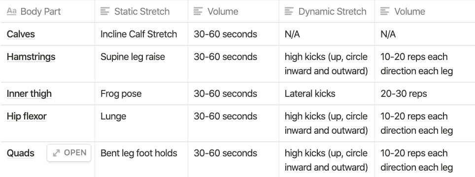
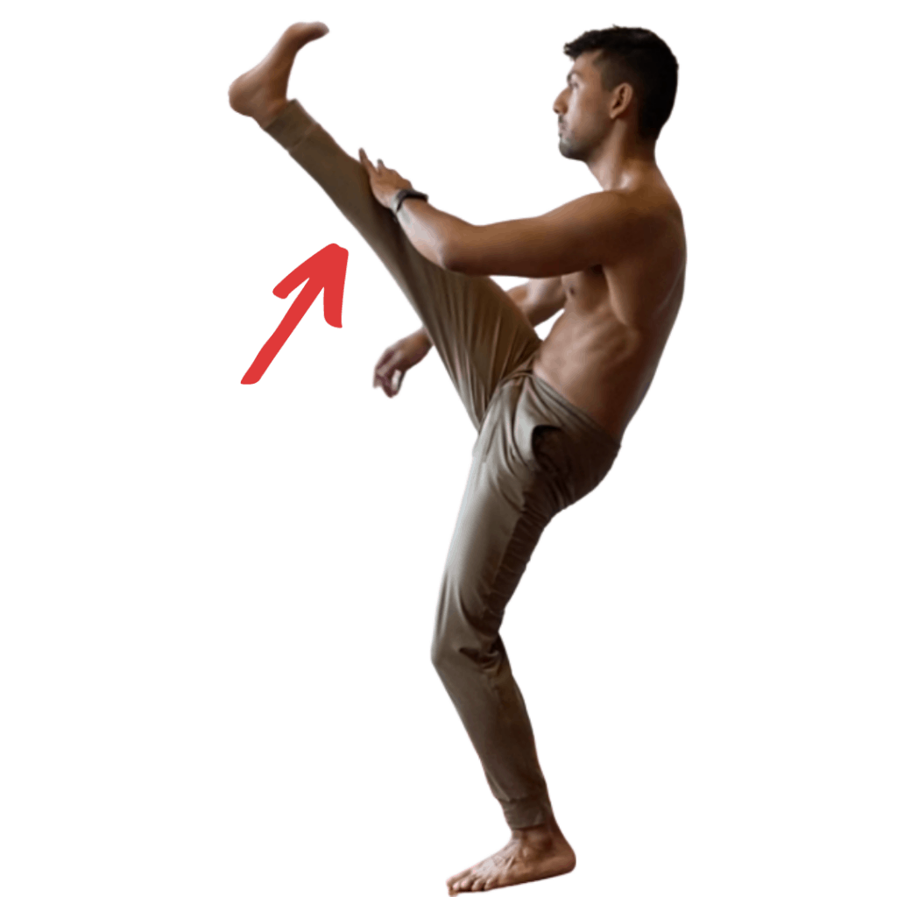
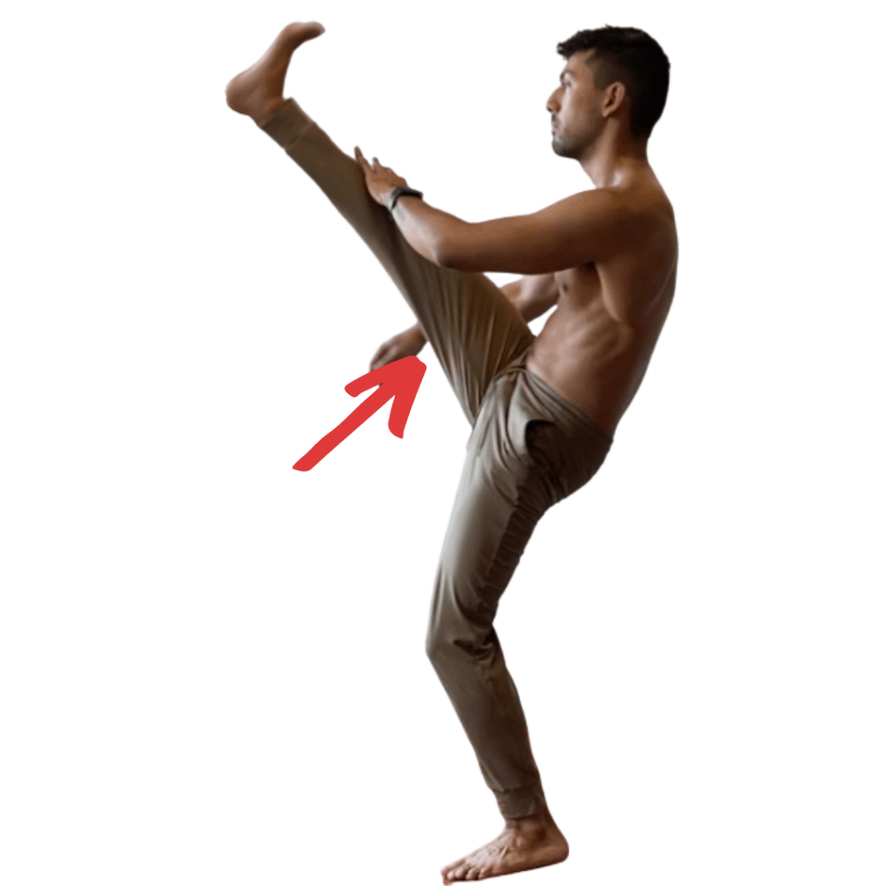
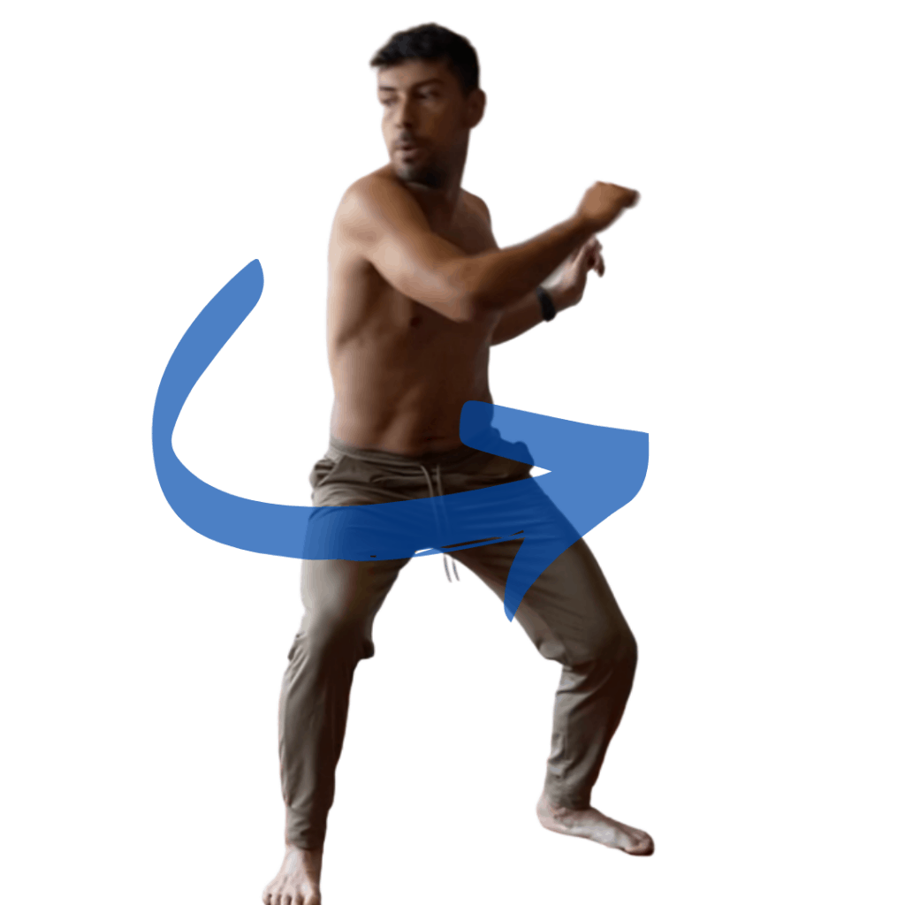
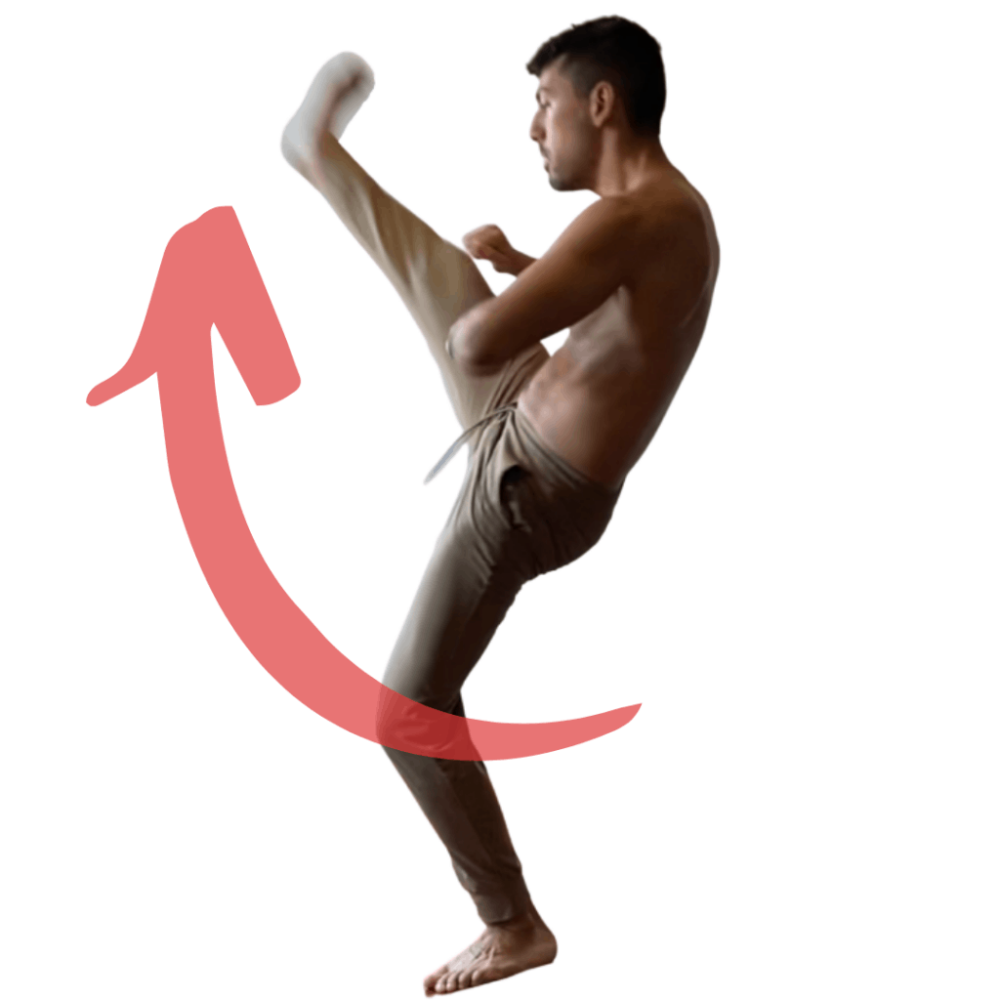
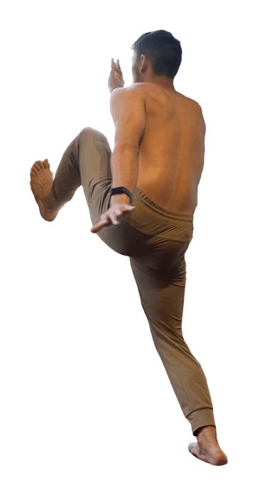

## Kicking harder and higher is not just about static stretching

The science is pretty clear that if you want to kick higher and harder, then the first thing you need to work on is your range of motion. Some of the methods you'll use to increase your kicking range of motion are dynamic stretches, static stretches, and PNF (proprioceptive neuromuscular facilitation). The focus for most people will be on the hip flexors and the hamstrings, as they are the "tight"-est for most people. Once we develop our range of motion we can use the following methods to increase power: Improving kicking technique against a resisting object, increase general strength, and increasing strength in the chamber of our kick. These build strength from the beginning of the kick to the end of the motion.

If you're interested in the articles I used for the research of this article, go to the end of the article.

## Get flexible for kicking high and eliminate tight muscles

**The most important part of "kicking high" is to reach the target.** If we can't reach the target, then there's no point in talking about power. There are four parts of the body that we'll focus on: the calves, hamstrings, hip-flexor, and quads. For the vast majority of people, these parts of the body are the major blocking points to kicking high. Below, we'll take a look at some of the most efficient methods to improve flexibility and control in these four areas. To be clear, it's not enough to just be flexible. You need control as well. This is why the exercises shown below employ methods that stem from PNF (Proprioceptive Neuromuscular Facilitation), FRC (Functional Range Conditioning), and traditional martial arts.

The table below is a quick summary of the following section on stretching. If you're just looking for the exercise you need to get flexible, then look no further than the table below. If you're looking for a better understanding of the exercises and why I recommended, then feel free to continue reading through the section below the table.

## Calves

The calves are part of the posterior chain, a long line of tissue that goes from the base of the neck to the bottom of the heels. This chain of tendons and muscle tissue is all connected, meaning that if there is a weakness or "tightness" in a certain area, it will affect the entire chain's ability to move smoothly. The calf can be thought of as the base of this chain.

To warm up the calves, you can jump rope, do calf raises, or jog. Any of these exercises serve the initial purpose of warming up the body and improving local circulation of blood and other fluids.

### Inclined calf stretch or lunge

Two physical therapist recommended stretches for the cafls are the inclined calf strength and the lunge. These are two very simple stretches that you can do for about 30 seconds to a minute each set you do. Both stretches diminish neurological inhibition and allow for great range of motion in the calf. Although you might not think that the calf has much to do with kicking high, the fact is that it is connected to the posterior chain. and if the calf is tight, then the rest of the chain will be tight.

If you choose to do the inclined calf stretch, one way you can do this stretch is by standing on a stair or on a slanted board. Hold that passive hold for 30 seconds to a minute. After this first set, you can try to include PNF and begin contracting the antagonistic muscle. The antagonistic muscle in this case is the muscle on the outer side of your shin. As you stretch, create tension in this muscle for about 10 to 15 seconds at about 40-60% maximum effort.

Do this for a couple of sets and you'll see a greater range of motion in your calf.

## Hamstrings

The hamstring is one of the two most restrictive part of the body that make it difficult to kick high (the other being the hip flexor). There are many ways to stretch the hamstrings that work as long as they follow a few principles. The first is that you can not round your back as you stretch. This is very common, and the easiest way to avoid rounding the back is to stretch the hamstring while laying down. Lay down flat on the floor and raise the leg with a towel. Pull the leg towards you for a greater stretch.

The other principle we have to keep in mind is that because kicking is a dynamic action, we need to practice dynamic stretches. Static stretching is great, however we want to train in a way that resembles what we do. This is why it's crucial that we do a lot of dynamic stretching that mimics the kicks we do.

### Static Hamstring Stretch

Lay down on a table or on the floor with one leg resting on the floor, and the other raised up as high as it can go. Keep the raised leg straight and wrap the stretched foot with a cloth or band. Pull the leg, trying to bring the knee to your chest. Hold this stretch for about 30 seconds to a minute before letting go and finishing one set. Again, we can apply PNF to contract the quad, which will relax the hamstring and allow us a few extra degrees of motion. Hold this isometric contraction for about 10 to 15 seconds, afterwards relaxing into the static stretch with the towel once again.

Another way of stretching that is a little more advanced is to sit upright on the floor and fold towards your toes. Again, this is more "advanced" because it is very easy to fold at the back instead of keeping upright. Reach towards your toes and hold a static stretch for 30 seconds to a minute. After the first set, try to apply PNF, the same way you would for the previous stretch. Contract the quads and try to pull the knee towards your belly button.

### Dynamic stretches for the hamstrings

You can practice your dynamic flexibility by kicking straight up into the air with a straight leg. We want this to be as practical as possible, so if you start your kicks from a certain base position, then start from there. For example, in Capoeira, we kick often from the "Ginga" base, so in our practice, we'll start and end our kicks in the ginga base.

Two more dynamic stretches you should include in your practice. From your starting position, kick in a crescent moon shape, drawing this crescent moon shape is a great way to train your kicks in different angles and is overall a great way to work on your dynamic range of motion. The legs should go from the outside to the inside; and then from the inside to the outside.

## Hip-flexors

The hip flexors are just as important as the hamstrings when it comes to kicking high. The following exercises focus on extending the hip flexors as much as possible. When the hip flexors don't extend enough, its common to see people throwing their head forwards or bending at the knee to allow the kicking leg to reach higher. These compensations are very common when our range of motion is lacking, so make sure to **take videos of yourself doing your kicks to see what part of your body is lacking in flexibility**.

### **Static Hip Flexor Stretch**

To start with the hip flexors, we'll do a **lunge with one knee resting on the floor.** The simple version of this stretch is to push the hips forward until you feel that discomfort from the stretch in your hip flexor. Hold this position for 30 to 60 seconds for your first set. Again, I encourage you to use the more active PNF stretch after the first set. During the PNF stretch, we'll be contracting the glute opposite the hip we are stretching: the left glute will contract when the left hip flexor is being stretched. Hold this contraction for about 10 seconds, and after the 10 seconds relax into the stretched position until you start the next set. We can do these stretches for 2 to 3 sets on each side.

Another exercise that is more active (not PNF, but very great to do), is to lift the knee off the ground and do "split squats". split squats are like normal squats, but in the lunge position. In this case we won't be using weights, but we will be aiming for high repetitions. Make sure to contract the glutes hard while doing this exercise.

### **Dynamic Hip Flexor Stretch**

You'll be happy to know that we already did the dynamic stretch for the hip flexors. while doing our kicks for our hamstrings you probably noticed that this also does a great job at stretching out the hip flexors.

## Quads

**Compared to other body parts we've looked at, the quads do not require quite as much attention**. the quads are a muscle group that very easily extend as much as they need to throw a kick. However, there are some people who do suffer from a restricted range of motion in the quads and here are some exercises to help improve flexibility.

### **Static Quad Stretch**

Most people are very familiar with this stretch. **Standing on one leg, grab the other with the opposite hand. Pull the foot towards your butt to increase the stretch to the point that feels right for you.** If you're like most people and this stretch doesn't do very much for you, then I encourage you to try the more advanced version. This more advanced PNF stretch for the quads starts from the stretch described above. As you hold your foot in place with your hand, start to contract the hamstrings to hold the leg in place. Slowly release the foot from your hands, so you're holding your foot in place purely by the strength of your hamstrings. Doing this will most likely lead to cramping in the hamstring. That's a natural thing to happen when contracting muscles at end ranges of motion. If you can, eat the camp for the 10 second contraction, then relax the hamstring and hold the foot in place until the next set of PNF contractions.

### Dynamic quad stretch

Once again, you'll be happy to know that the kicks done earlier dynamically stretch the quads. Each time you kick, the quad of the base leg is the one that will be stretched. There's no need to do any extra kicks for the sake of the quads. Everything is dynamically stretched at the same time.

## Three ways to generate more powerful kicks

Kicking isn't just about being flexible, it's also about generating power. There are three ways we can throw a harder kick.

1. **Improve our kinetic chain** - This means building our coordination and technique to the point where we are using our leverage and technique to their maximum efficiency. The difference in kicking strength between someone who has no technique and someone with many years of practice is vast.
2. **Improve raw strength** - Increasing our mass and raw strength with fundamental weight training protocols are another way to increase your power output. Having a more general strength in something like squats and dead lifts will help produce power in more specific tasks like kicking.
3. **Train kicking at chambered position** - This last point might not be as intuitive as the last two. We want to produce maximum power from the start of the kick to when the kick reaches its target. Think the one inch punch by Bruce Lee.

Why is developing flexibility not enough? Flexibility means that you can dynamically or passively reach a position, however developing power is not trained the same way. **If all you needed was flexibility then ballerinas would be some of the strongest kickers in the world.**

## Improve kicking power via technique and efficiency

Technique, technique, technique! Bruce Lee said that he doesn't fear the person who knows 10,000 kicks, but he does fear the person who has trained 1 kick 10,000 times. A great way to improve your technique is to...

1. A**sk for feedback from a trusted source**. This could be a couch or a training partner that you trust. You can also record yourself and critique yourself if no one is around.
2. **Kick accuracy pads**. This is a very common thing in many traditional martial arts dojos. Many will have accuracy pads for you to kick at, which is a great way to improve your coordination and ability to kick accurately.
3. **Kick a heavy bag.** Going back to the law of specificity. It's important to kick at an object that will resist you. Kicking the heavy bag imitates kicking at a person and will provide some idea of what that feels like. Heavy bags are a great way to improve power and harden the body.

## Gain strength to gain power

**The second way to generate power in a kick is to get swole! Yes. Going to the gym and lifting weight** to increase your general strength is a solid way to increase your strength in specific applications. There is nothing fancy here. **You can do very fundamental exercises such as squats, dead lifts, weighted dips, and over head press to increase your overall strength.** Something you might not consider is the need for a strong upper body.

You may have heard boxers talk about a punch starting at the feet and ending at the fist. This is because the feet generate power for the punch. Similaly, the kick starts in the hands. T**he arms generate power for the kick** by moving contra-laterally, like with a benção (push kick) or martelo (roundhouse kick). Having a stronger upper body and ability to torque the body, will increase your ability to generate force for your kicks.

## Power from the chambered position

**Most kicks chamber before they kick and we want to train generating power in these positions.** If you're doing a benção (push kick), then you need to raise the knee as high as you can and push against a wall or heavy bag while in the chambered position. This will feel very clumsy at first. Try to push the object in front of you and return to your base or "stance".

The last topic is one of my favorite things to talk about and one of the biggest reasons why **IT'S NOT ENOUGH TO BE JUST FLEXIBLE**. Flexibility is great for reaching our target, but we want power! A great example of generating power is Bruce Lee's one inch punch. Again, you should have the ability to generate power throughout the entire range of motion of the kick.

<iframe width="560" height="315" src="https://www.youtube.com/embed/kXwOU5HzTZQ" title="YouTube video player" frameborder="0" allow="accelerometer; autoplay; clipboard-write; encrypted-media; gyroscope; picture-in-picture" allowfullscreen></iframe>

### References

[https://pubmed.ncbi.nlm.nih.gov/19486475/](https://pubmed.ncbi.nlm.nih.gov/19486475/)

[https://pubmed.ncbi.nlm.nih.gov/21701282/](https://pubmed.ncbi.nlm.nih.gov/21701282/)

[https://journals.humankinetics.com/view/journals/jsr/27/3/article-p289.xml?content=contentSummary-6973](https://journals.humankinetics.com/view/journals/jsr/27/3/article-p289.xml?content=contentSummary-6973)

<iframe width="560" height="315" src="https://www.youtube.com/embed/waF1TYqx1rE" title="YouTube video player" frameborder="0" allow="accelerometer; autoplay; clipboard-write; encrypted-media; gyroscope; picture-in-picture" allowfullscreen></iframe>
