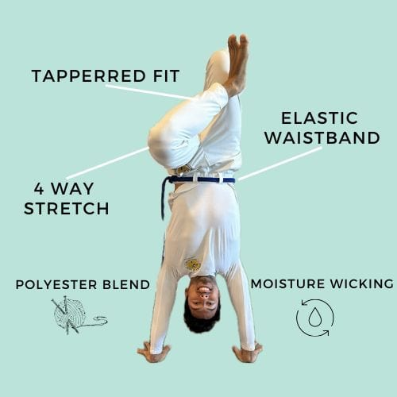

Abadas are the name of the capoeira uniform pants. Abadas are made of helanca (a polymide material) that is sturdy, elastic, and affordable. They also come with belt loops to hold the person's chord. Abadas are commonly worn in Regional and Contemporânea schools. Although some Angola schools also use Abadas and chords. Capoeira that include Abadas are a modern invention of Mestre Senna. Mestre Senna introduced the use of Abadas between between the 1950's and 1960's. Their use spread like wildfire. And Abadas are now ubiquitous with Capoeira schools around the world.

## Do I need to wear Abadas in class?

Most Capoeira Regional schools you visit require you to wear a uniform - including your Abadas. It doesn't matter if you are their student or if you are just visiting. Abadas are required. Other contemporânea schools will be more flexible. Some require uniforms for every class. Other allow any athletic wear for classes, but uniforms for events. Not every school in a groups operates the same way, so it largely depends on your teacher. At your Capoeira school, your teacher will have school abadas with their groups logo mestre's name (or head master of the school). In some larger schools, the local mestre's name will be on the logo.

## Where do Abadas come from?

There is 90% chance that your teacher receives their Abadas from Brazil from a small manufacturer. These small manufacturers may work with a few schools in Brazil or abroad. When orders are made, manufacturer will take existing inventory and add customization like group logos. Or, they may make custom orders depending on the order they receive. Some bigger groups may buy in bulk and distribute to their child schools, but this is rare. Most schools make small orders of Abadas from Brazil. Deliveries are often made by friends who arrive from Brazil. That person will take a check-in bag at the airport and fill their luggage case with Abadas. This is a common practice and helps cut costs for small orders made.

## Abadas are poorly made because...

It's clear that these manufacturers to poorly incentivized to make a better product. The have a captive audience (capoeira teachers) that don't know where else to go. This is why Abadas marketed as unisex, but don't fit anybody well. Abadas are often low-rise, exposing people's underwear, if not their butt cracks! If that weren't enough, abadas are often see-through. Being pure white doesn't help. The list goes on... Abadas rarely have pockets. They often have strange dimensions. Too tight around the hips and too looks around the legs.

I asked a manufacturer to send me a sample and the result was hilariously bad. Poor, thin fabric, combined with all of the problems I mentioned above. Capoeiristas do what they can to get around these issues. It's common to modify uniforms by taking them to a tailor. Often this is to shorten the length of the pants or taper at the legs or ankles. I've personally spent a lot of money doing this many times.

Why?

## Abadas by Capoeiristas, for Capoeiristas

The way we look matters to us. Of course. It's clear everyone is looking for better quality pants. We want quality like Lululemon for Capoeiristas. I started Capoeira in 2007 and everyone gripes about their uniforms. In 2023, I started reaching out to people I knew to give me feedback on how to improve Abadas. What was the feedback? Pockets, a flattering fit, an off-white that doesn't get dirty immediately after the first use, a tappered fit at the bottom, more room at the seat, a mid-rise (to cover your butt of course), and a 4 way stretch fabric.

## Abadas (my shameless pitch)

These are all things anyone who's practiced Capoeira more than a few months will have noticed. This is why I got started producing high quality Capoeira Abadas. The idea was to combine high-end materials with a flattering fit. I want you to love your abadas so much, you wear them proudly in public. I used to hate wearing my abadas in public because they looked so cheap. You DO NOT have to go through what I did. Anyways, I'm rambling now. [so here is the link to my abadas.](https://dendearts.com/product/abada-joggers-unisex/) If you do Capoeira, you'll love them. I hope they're your favorite pair.
