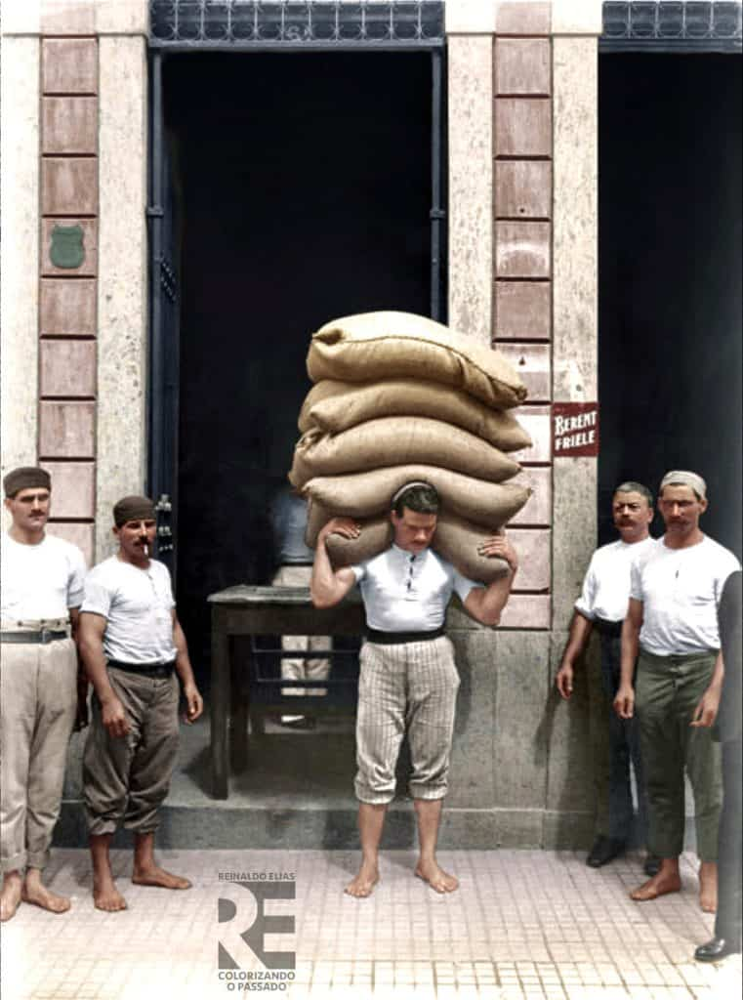

If you never asked, then you might no know what Capoeira uniforms made of. And how did Abadás made of helanca come to be a standard in the Capoeira community?

## Helanca The Fabric of Choice

Capoeira uniforms, specifically the pants, are made of Helanca. Helanca is the type of fabric commonly used in Brazil to produce clothing. Helanca is a patented yarn made of polyamide filaments. Polyamides are a group of synthetic polymers (synthetic fibers) and are widely recognized for their strength and elasticity. Think Nylon, Polyester, or Rayon. Helanca requires a special manufacturing process. This process was first developed in 1931 by Rudolph H. Kägi. After its original development, the [Swiss company Heberlein & Co acquired the rights and patent to Kägi's process](https://www.heberlein.com/en/history/). Helanca has been produced in Switzerland since 1936 and today is a popular fabric in Brazil.

1n 1955, [Time magazine released a story](https://content.time.com/time/subscriber/article/0,33009,893170,00.html) that explains how Helanca became so popular in Brazil. The article explains how Helanca was first produced by a swizz company by accident. Instead of creating a substitute for wool, "ersatz wool", they created a nylon that could stretch. Stretch nylon became incredibly popular. So popular, that the United States and others began producing their own version. In 1955 various licensing disputes were resolved between the competitors. Helanca and "Helanca knock-offs" began to flood the market and meet demand. Although the article doesn't touch on Brazil, it is likely Brazilians call any synthetic stretch fabric, helanca. Why? Because it was the first on the market. Similar to Spanish speakers who call gum "chicle", because chiclets was the first gum on the market.

## Why Helanca is widely used in Brazil

In Brazil, Helanca is a very desirable fabric, especially for items that need to stretch. Some popular examples are school uniforms and athletic wear. [It's frequently chosen by small clothing manufacturers](https://youtu.be/0K2Ihzabe-g?t=21) due to its versatility and affordability. "Helanca" originally referred to a patented type of nylon produced in Switzerland. However, in Brazil, the term has broadened to include [any stretchy synthetic fabric](https://youtu.be/vLQ0m62kHLc?t=11). This includes polyester, nylon (polymide), or blends depending on the manufacturer. Helanca in Brasil an accessible material for small-scale manufacturers. This is likely why the material is used for Capoeira Abadás.

## Why are Capoeira abadás made of Helanca?

Mestre Senna, a student of Mestre Bimba, [pioneered the use of Abadás in Capoeira after founding Capoeira Senovax in 1955](https://www.facebook.com/ftwcap/posts/mestre-carlos-senna-1931-10-28-2002-11-04english-version-followsnasceu-em-28-de-/304125829775835/?locale=pt_BR). The abadá was modeled after the uniforms used by carriage drivers, cargo loaders, and clothes collectors. Mestre Senna may have liked the style and chose to adopt it. As we saw, during this time, synthetic stretch fibers began to gain popularity around the world. Given it's popularity, it is possible Mestre Senna decided to use helanca for his academy's abadás. Below is a photo of estivadores in the early 1900's.

Mestre Senna needed uniforms made from a material that was easy to find and met the needs of Capoeiristas. Helanca is easy to source, affordable, flexible and durable. These synthetic flexible fibers were an innovation at the time! Helanca was a practical decision. One based on the need for an affordable and practical material. Choosing Helanca reflects a balance between flexibility, durability, and cost. Although material science has produced new and better materials, helanca continues to be the main fabric for abadás. This was not always the case. Before Mestre Senna, there was little standardization or rules regarding uniforms.

## Before helanca, there were short-shorts

Before the modern Abada took Capoeira schools by storm, the first first Capoeira academy was founded by Mestre Bimba in the 1930's. Here, there were no uniforms. It was very common to have students come in with shorts and no shirt. Buying athletic clothing was quite a luxury at that time! However, this caused an issue. Short were sometimes too short for Mestre Bimba's liking. Also, the cinturas depressadas were difficult without a shirt. Bimba soon required his students to wear a shirt and long pants. In the video below you can see that Mestre Bimba's academy did not adopt Abadas yet. But, his students are wearing long pants, and shirts in some cases. The shirt may have been an even later inclusion. The shirt requirement is mentioned by Mestre Bimba's son in his book, "Bimba".

<iframe width="560" height="315" src="https://www.youtube.com/embed/PrDD9qutULM" title="YouTube video player" frameborder="0" allow="accelerometer; autoplay; clipboard-write; encrypted-media; gyroscope; picture-in-picture" allowfullscreen></iframe>

Something to note is how clothing is practical decision. In the 1930's shorts were used to offset the heat of tropical northern Brazil. Mestre Bimba requested long pants, but left out shirts during training to help with the heat. Later on, he decided shirts were needed for the cintura depressadas. This is a trend that everyone followed. Today the convention is to use white abadás with a white shirt.

## Abadás without helanca

Some mestres or older teachers today can not imagine abadás without helanca. The fabric is nostalgic. Many brazilian will tell you how difficult it was to dry their abadás in humid Brazil. Some would place their abadás behind the fridge after washing it. Here it could dry much quicker. Hearing these stories, you start to understand.

Helanca, however is not a great material. It can be rough, absorbs moisture, and has difficulty wicking moisture from the body. There are so many high quality materials today. We should take a hint from Mestre Senna and consider innovating a little more. It is worth considering abadás with high quality materials and a modern fit. Doing so would continue the evolution of the Capoeira uniform - from short-shorts, to Abadás, to something even better.

## High quality Abadás

Since I started Capoeira, I wished for an affordable and high quality Abada. Something like Lululemon for Capoeira. It took years, but in 2023 I finally finished [my first model and they are in our website store.](https://dendearts.com/product/abada-joggers-unisex/) So if you're interested in grabbing a pair, I would love it if you tried them.