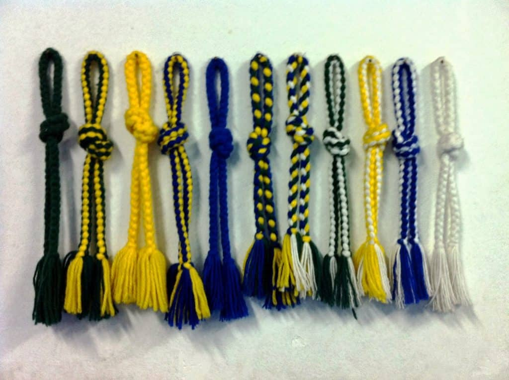

## TRY, LEARN, REPEAT

Why write about belts? or chords as we call them in Capoeira?

Something started happening that I really dislike. Nowadays people make a lot of  “in between” chords. Why? To make you feel good! This isn’t something totally new, but the idea behind it is what bothers me. Consistently getting a new belt makes you feel like you accomplished something without you really understanding what that accomplishment is, and keeps you satiated until the next annual belt ceremony (batizado). My question is, what do you care about more? The belt or learning to do some cool stuff? Kicking high, flipping, doing some cool movement, play an instrument, etc. we know what we want as learners, we look to our teachers and say, “I want to be able to do that”, but we don't always know how to get there. I think if teachers focused on how to raise the level of their students and less on belts, our community would be stronger, healthier, and happier.

I don’t just say that out of nowhere either, I think there’s a lot of wisdom in how Mestre Bimba created his “belt” system.

## BELTS IN CAPOEIRA

The original belts in Capoeira started with [Mestre Bimba](https://en.wikipedia.org/wiki/Manuel_dos_Reis_Machado), the creator of Capoeira Regional,  were scarves were used to demonstrate rank and a level of proficiency in a couple different fields. The scarves go as follows.

1.Blue scarf (martial proficiency);

red scarf (passed specialization course); yellow scarf (weapons proficient); white scarf (Master)

([source](http://www.arteculturacapoeira.com.br/site/index.php?option=com_content&view=article&id=97&Itemid=57)).

The belts all had different meaning that I would love to write about more in depth in another post, but to summarize… Each belt had its own meaning, and that meaning looks like it was pretty clear. Blue meant you were proficient at the physical aspects of the game of capoeira. Red meant you passed a 3 month long course that involved a whole host of training and event an obstacle course were you were attacked/ambushed as you made your way through a trail. Yellow meant that you were proficient with a set of weapons. And lastly, the white scarf symbolize you being a master of Capoeira. The steps were very clear and I appreciate that clarity in a time when belts are given on a whim and are used almost in the same way as a new toy is given to a kid once they got bored of the old one.

My Capoeira family, ultimately as they say, belts just hold up your pants, but I do love that Mestre Bimba made them into something that had some real meaning to them. It’s a way for people to strive towards a goal instead of feeling lost on their journey, which is how a lot of people feel I think, me included.

## Cordão de Ouro Belts

I couldn’t finish this post without doing a little shout out to my group CDO. These are the belts we use. The belts are made of yarn and the colors are fairly consistent amongst CDO groups.

from Green(first chord) to White(last chord).

#mc\_embed\_signup{background:#fff; clear:left; font:14px Helvetica,Arial,sans-serif; } /\* Add your own MailChimp form style overrides in your site stylesheet or in this style block. We recommend moving this block and the preceding CSS link to the HEAD of your HTML file. \*/

## Join us in the Roda!

\* indicates required Email Address \* First Name \* Last Name \* (function($) {window.fnames = new Array(); window.ftypes = new Array();fnames\[0\]='EMAIL';ftypes\[0\]='email';fnames\[1\]='FNAME';ftypes\[1\]='text';fnames\[2\]='LNAME';ftypes\[2\]='text';}(jQuery));var $mcj = jQuery.noConflict(true);