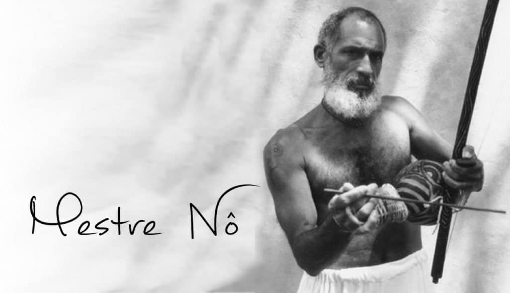

Capoeira Angola is a branch of Capoeira. The style of Angola is highly influenced by the old guard of Capoeiristas from the early 20th century. Their movements are low to the ground and focus on trickery. Angola emphasizes the importance of music and the African roots of Capoeira.

## The History of Capoeira Angola

The history of Capoeira Angola begins in the early 20th century. The rituals, rules, and movements of Capoeira were laid out by mestres like Pastinha, Waldemar de Paixão, Cobrinha Verde, and others in Salvador, Bahia. They did this as a response to Capoeira Regional, which was created a style created by Mestre Bimba in the 1920's, and began to swallow up the Capoeira scene in Salvador.

Over the course of many decades, these mestres passed down their knowledge, ways of teaching, rituals for the roda, and etiquette for the game of Capoeira. Today Capoeira Angola is very conscious of the roots of Capoeira and tries the best it can to preserve the history from which it came.

_**Interested in the origins of Capoeira? Check out a whole telling of the history from Africa to the slums of Rio de Janeiro, here!**_ 🌍. [https://dendearts.com/what-is-the-origin-of-capoeira/](https://dendearts.com/what-is-the-origin-of-capoeira/)

### Prior to Capoeira Angola - Capoeira Antiga

**Prior to Capoeira Angola, Capoeiristas simply played "Capoeira". This Capoeira is sometimes called Capoeira "Antiga"** (Antiga means old or ancient), though this naming convention is by no means universally accepted. Angola derives much from what they saw as the "original" Capoeira (Capoeira Antiga) and the "Brincadeira de Angola", which according to many mestres of the time, preceded Capoeira.

There are no video recordings that date back into the 1800's, so we do not know what Capoeira of this time looks like. Mestre Bimba stated how the Capoeira he saw growing up was a docile and toothless game (to paraphrase). Implying it was once an effective fighting system that lost its power. They may be some truth to this as the severe repression by the Brazilian state that may have forced many Capoeirsitas to showcase Capoeira more as a dance than a fight. This contrasted greatly with the Capoeira from Rio de Janeiro in the 18th and 19th centuries, which was markedly violent!

### Angola as the original Capoeira

Some Angoleiros take the position that Angola IS the Capoeira found in Brazil in the 1800's and that the further you go in history, the more the game of Capoeira will look similar to the African martial arts and dances brought over by enslaved Africans.

**The few sources available do point to a violent Capoeira that likely looked very different from the one we see today.** The most famous account from the 1870's describes two men listening to a drum and colliding with each other head-first. The game sounds extremely violent and very different from the Angola we see from video recordings dating back to the 1940s (some of the earliest source videos).

### Capoeira as a "catch-all phrase"

One thing to consider regarding the origins of Angola and Capoeira is that “Capoeira” may have been used as a catch-all phrase to describe African rituals and martial arts in colonial Brazil. There is some evidence to this from M. Thomas J. Desch-Obi's book "Fighting for Honor". There were several martial arts attributed to the enslaved Africans in Brazil, and it's possible that the Portuguese used "Capoeira" as a general term for many of these activities.

Personally, this makes sense as there are many martial arts seen throughout the African Diaspora into the Americas that resemble Capoeira. Landja is an excellent example, however, there are many others that can be found around the Americas.

<iframe width="560" height="315" src="https://www.youtube.com/embed/Rl4CEEse_fI" title="YouTube video player" frameborder="0" allow="accelerometer; autoplay; clipboard-write; encrypted-media; gyroscope; picture-in-picture" allowfullscreen></iframe>

## Mestre Pastinha

You might ask, "where did this modern style of Capoeira Angola come from?"

Mestre Pastinha is understood to be the father of Capoeira Angola. Mestre Pastinha learned Capoeira as a youth from an "African" (as he puts it), called Benedito. Benedito taught Pastinha enough Capoeira to defend himself from a local bully.

Mestre Pastinha is considered the father of Capoeira Angola in part because of his amazing game, but also because of his leadership in CECA (Centro Esportivo de Capoeira Angola).

The story of Mestre Pastinha is tragic, as he died old, alone, and blind. The sad end of his life is a warning to any Capoeira talent who thinks they can manage on their skills alone.

Here is a video of Mestre Pastinha from the 1950’s

<iframe width="560" height="315" src="https://www.youtube.com/embed/FCtq7C2_7fU" title="YouTube video player" frameborder="0" allow="accelerometer; autoplay; clipboard-write; encrypted-media; gyroscope; picture-in-picture" allowfullscreen></iframe>

## How to play Capoeira Angola

One of the leading authorities on Capoeira Angola, Mestre Cabelo, student of Mestre João Grande mentioned the best advice when it comes to playing Capoeira Angola. When playing Capoeira Angola, your goal is to aim for the head of your opponent - specifically the face.

### Aim for the face

This might sound obvious, but in Angola the game is played close to the ground, so the face is often in reach of your feet. You can directly aim for the face or anticipate the movements of your opponent to target the face when it appears in reach.

Attacks can, and often do, happen with the forehead (a headbutt). The shoehorn of the head is a very hard part of the head that is a great weapon if you aim at someone's face. In Angola, headbutts are very common and very effective.

### No flipping

Unlike in Contemporânea, Angola does not allow for large acrobatic movements like backflips. Although in modern Angola this is changing a bit, with more athletic movements becoming more prevalent in the game of Angola. The biggest "acrobatic" you may see in Angola is a Macaco or other acrobatic that maintains some points of contact with the ground.

### Play close to the bateria

Angola should be played close to the bateria. Advanced players will stay close to the instruments and seldom show the instruments their backs. Showing your back to the bateria is a sign of disrespect.

### Angola is not only played "slow"

Last, is the misconception that Angola is slow. Angola can be played slow or fast. This is determined by the speed the person leading the bateria - and by extension, the roda. Angoleiros will play at the speed of the berimbau, so be prepared to play a game of any speed.

### Bateria set up in Capoeira Angola

Angola is rich with rules and rituals. These rules will depending based on the group you train with. One example is the setup of the bateria. Schools generally have different ways that they set up their bateria. Here are two common examples.

From Left to Right facing the bateria:

1. Pandeiro, Gunga, Medio, Viola, Pandeiro, Reco-reco, Agôgô, Atabaque.
2. Agôgô, Reco-reco, Pandeiro, Medio, Gunga, Viola, Pandeiro, Atabaque.

Although few Capoeriistas would claim that their way of setting up the bateria is the "correct" way, within their house any visitor should respect the way that group sets up their bateria and any other house rules they may have.

### No butts on the floor

An interesting rule you will see if you visit Mestre João Grande's academy is that nobody sits with their butts on the floor. Angoleiros dress in regular pants, wear shoes, and tuck in their shirts. Dirtying your clothing or the clothing of your opponent (with a shoe mark for example) is a sign of disrespect, and shame for the recipient.

Some people contend that the reason for this type of dress is that during the times of slavery, having such nice clothing was considered a privilege. Wearing this more "proper" attire is an homage to those times.

## Capoeira rules by Mestre Pastinha

There are many rules in Capoeira Angola, and the rules differ depending on the group you are training or playing with. Mestre pastinha describes many rules that he believes should be followed when playing Capoeira.

- No hitting with the hands. This is seen as disrespectful
- Do not turn your back to the bateria
- Listen to the commands of the bateria
- Play according to the rhythm of the bateria and specifically the berimbau

## Differences between Angola and Regional, and Contemporanea

Angola is the branch of Capoeira most concerned with maintaining the traditions of the mestres of the early 20th century, excluding Mestre Bimba.

While Capoeira Contemporanea is a force for the continued growth and expansion of Capoeira, Angola is concerned with maintaining tradition and preserving knowledge. Angola still evolves, however, the pace is very moderate as compared to Contemporanea.

For an in-depth look at the differences between different Capoeira schools, you can check out our in-depth guide on the subject.

_**The different styles of Capoeira \[A full explanation\]**_

🤸🏽  [https://dendearts.com/the-different-styles-of-capoeira-full-explaination/](https://dendearts.com/the-different-styles-of-capoeira-full-explaination/)

https://dendearts.com/the-different-styles-of-capoeira-full-explaination/

## What to wear to your Angola class

Within Angola schools, the rules differ. Mestre Nô, a very prolific Capoeira mestre uses a chord system and abadas popularized by Capoeira Regional schools. This style of dress is less common.

Mestre Nô - [credit](http://Mestre Nô - credit: https://www.ufba.br/ufba_em_pauta/t%C3%ADtulo-de-not%C3%B3rio-saber-ser%C3%A1-entregue-mestre-n%C3%B4-nesta-quinta)

The majority of schools require pants, usually khakis. They also require a belt, shoes, and a shirt (usually white) that you can tuck into your pants. Exposed shoulders and shorts are not allowed. Neither are tight-fitting pants.

Mestre Pastinha helped define the rules surrounding what you could wear for Capoeira Angola. The uniform he chose for his school was: A yellow shirt with black pants and shoes. This comes from his favorite soccer team, which at the time had the same color combination.

## Angola classes - very different compared to the early 1900s

After the creation of Capoeira Regional, and its explosive popularity in the 1930s and 40s, the Angola mestres began using some of the methods employed in Regional schools to teach larger groups of students at a time. This often includes: a warm up at the beginning of class, sequences of movements to practice, and repeated kicks to improve technique.

Prior to this, mestres spent little time giving any formal instruction to their students. Lessons were intuitive and most students learned by watching and by doing. Classes were rarely paid for. Instead, students would pay for their teacher's food or drinks in exchange for their time and knowledge.

Here is an example of Mestre João giving a workshop to a group of Capoeirsitas in New York City. This form of instruction is very common today, however this is not how Mestre João Grande learned.

<iframe width="560" height="315" src="https://www.youtube.com/embed/UpEn2F9zuAw" title="YouTube video player" frameborder="0" allow="accelerometer; autoplay; clipboard-write; encrypted-media; gyroscope; picture-in-picture" allowfullscreen></iframe>

For a more in depth look into the methods of Capoeira instruction in the early 1900’s check out the link below.

👨🏿‍🏫  [How Capoeira classes has changed over the years - 1900 - today](https://dendearts.com/how-capoeira-classes-have-changed-1900-2020/)

https://dendearts.com/how-capoeira-classes-have-changed-1900-2020/

## The Angola graduation system

Like any other Capoeira school, graduation systems can differ greatly depending on the teacher and school of that teacher. In Mestre Joao Grande's school, the only graduations given by a mestre are Treinel, Professor, and Contra-Mestre. The title of "Mestre" is not present for good reason. In the old days of Mestre Pastinha, a mestre was only granted the title when the community collectively acknowledged a person as mestre. As with many things during this time, the process was very organic, with more and more people referring to a Capoerista as "Mestre".

Today this method is rare, and most mestres will graduate their students to "Mestre" once they decide the student is ready.

### Student and Treinel

Titles like Treinel often refer to a graduated (or advanced) student, though this may differ a bit depending on the school. Before this, a student is an "aluno", which translates to “student”.

### Professor

A professor is someone who teaches Capoeira classes. A professor usually has many years of experience before they can be considered a Professor.

### Contra-Mestre

A "Contra-Mestre" was traditionally a title given to the "right-hand" of the mestre. Traditionally, they helped the mestre teach class and might help with other things outside of class. Today, Contra-Mestre is a level between professor and mestre.

### Mestre and Grao Mestre

As mentioned, not every group "gives" the title of mestre. To a degree, most Capoeira groups do require that their student be recognized in some way as a mestre before receiving their chord. This may sound strange, but after 20 or 30 years, it is common to see community members refer to a person with so much experience as "mestre", despite officially having a lower.

A Grão Mestre is an honerific. There is no graduation for this rank. There are mestres that have made such significant impacts on the world of Capoeira that they are considered to be "Grao Mestres". Today, Mestre João Grande is one such example.

For more on the Capoeira graduation system, check out our summary on the Regional and Contemporanea graduation systems below.

🥋  [The Capoeira belt system explained by a Capoeira teacher](https://dendearts.com/the-capoeira-belt-system-explained-by-a-capoeira-teacher/)

https://dendearts.com/the-capoeira-belt-system-explained-by-a-capoeira-teacher/
