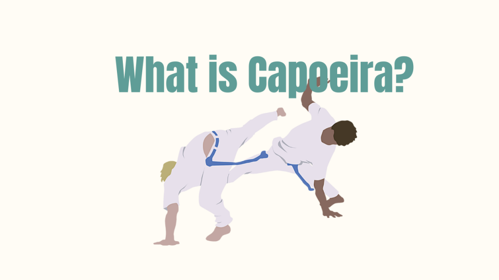
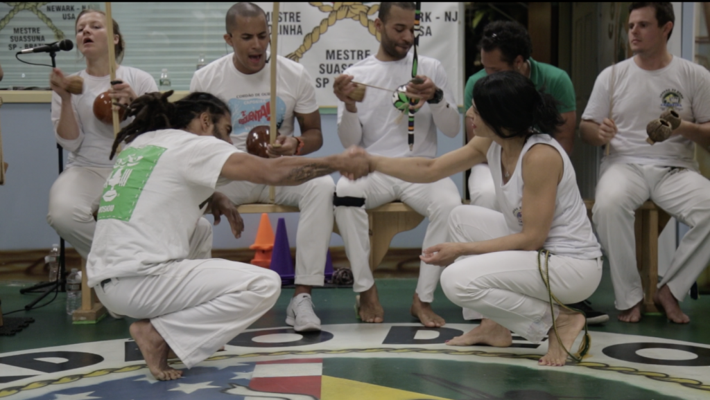
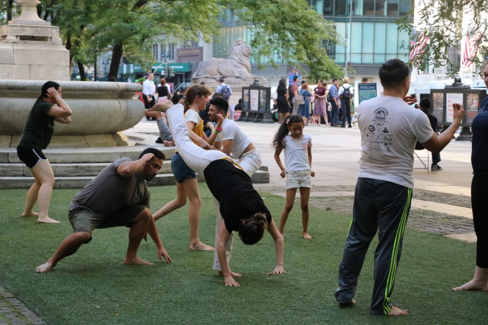

If you're thinking about trying Capoeira, or are just interested in learning more. This article will give you the broad overview you need to understand this Afro-Brazilian martial art.

## What is Capoeira

To someone looking at Capoeira for the first time in a performance or demonstration, the art will look like some sort of choreographed dance. However, this is far from the truth.

**Capoeira is an Afro-Brazilian martial art characterized by powerful kicks, fluid movements, music, and dodges called esquivas. Capoeira strikes involve the use of the shins, feet, knees, elbows, head butts, open-palms, and various sweeps. In 2014, Unesco designated Capoeira as an "intangible cultural heritage", and today the art is practiced all over the world.**

Capoeira was created somewhere between 1500-1700. The date is unclear because the Portuguese burned almost all records of slavery after slavery was declared illegal in 1888. For this reason, there are very few sources that date back to this time.

What we know is that enslaved africans played a major part in the creation of Capoeira. In the early 1900s, Capoeira schools began to sprout in Salvador, Bahia. During this time, Mestre Bimba was the most popular Capoeira teacher in Brazil, and his students traveled around the country to teach the art. Within 100 years the art spread across the globe and can now be seen in every major city in the world.

## Is Capoeira an effective martial art or a dance?

The acrobatics and movements in Capoeira are awesome, but have many questioning whether Capoeira is an effective as a martial art.

**The primary tool for anyone using Capoeira for self-defense are it's powerful kicks. Capoeira has some of the most powerful kicks in all of martial arts. The kicks draw from superior coordination of body-mass to generate power into the strikes. Many strikes, such as meia-lua de compasso have been tried and tested in mixed martial arts competition with many instant KOs. This and other techniques make Capoeira an excellent compliment to any mixed martials arsenal.**

<iframe width="560" height="315" src="https://www.youtube.com/embed/O6hAm0LC7dA" title="YouTube video player" frameborder="0" allow="accelerometer; autoplay; clipboard-write; encrypted-media; gyroscope; picture-in-picture" allowfullscreen></iframe>

Capoeira can be difficult to use as a form of self defense because there is a great deal of kicking involved. Kicks are more difficult to learn and apply than punches because they require much more flexibility and coordination. In addition, the art itself values the continuity and flow, which can be seen in the roda (Capoeira version of sparring). This stares in contrast to other martial arts like Jiujitsu or Muay Thai where the goal is to subdue the opponent. Capoeiristas train to spar and play, as opposed to other martial arts that train for competition, which make the training difficult to apply.

That being said, it's clear that Capoeira has incredible potential to add several techniques to mixed martial arts. Many MMA fighters at the top of the food chain have shared this sentiment including Anderson Silva and Connor McGreggor. It seems like a matter of time before someone does for Capoeira, what Wonderboy did for Karate, and take Capoeira to the highest levels of combat sports.

## How to win in Capoeira

There are several ways to win in Capoeira, with some being less obvious than others to observe.

**The most common way for someone to win in Capoeira, is to dominate the space in the roda, stifling the opponents movement. This can be compared to backing someone into a corner in Boxing. Strikes, takedowns, and executing acrobatics called "floreios" are other ways to score "points". When someone marks a strike or performs a take down, the two Capoeiristas can do a "Volta do munto", circling the roda in acknowledgment of the "point". They then come back to the entrance of the roda to reset the game. Otherwise the game will continue until the two players agree to stop, someone else buys the game from them, or the leader of the berimbau ends the game.**

It should be noted that there are no official "points" to be gained in a Capoeira roda. Games in the roda can be compared to sparring sessions in other martial arts. Practitioners will acknowledge when they've been "gotten" by a well marked strike or take down. Most strikes or takedowns are marked and not fully carried out, which is typical for sparring in many martial arts. The reason for this is to not seriously injure your opponent and continue the game. Although knockouts do happen in Capoeira, they are rare due to this general agreement to pull back kicks that would otherwise land.

<iframe width="560" height="315" src="https://www.youtube.com/embed/wdmQKCzd6cs" title="YouTube video player" frameborder="0" allow="accelerometer; autoplay; clipboard-write; encrypted-media; gyroscope; picture-in-picture" allowfullscreen></iframe>

## How to play in the roda

The roda has several rituals attached to it include respect payed to those playing the instruments and leading the roda.

**Once you get to the foot of the instruments, you can "buy the game" by outstretching a hand between the two people currently playing. This signals that you are "buying the game" from the person who was in there the longest. Traditionally, students can not buy out teachers, and no one buys out _mestres (masters)_ - they end their games on their own accord.**

When playing keep in mind that each person is unique both physically and mentally. You can see this in the way they play. Does this person prefer straight kicks? use head butts? like to maintain distance? etc. You can learn about your opponent by observing them in the roda. When they play with someone else, you should observe their habits. Then you can think about ways to counter their movements with your own techniques.

For example if you know that your opponent likes to go for a particular sweep, then you might be able to bait the sweep, and counter with one of your own. As you do this, your opponent will be trying to do the same. This is where a fast paced game of chess with the body occurs, involving feints, mind-games, and gambles.

## Is Capoeira non-contact

<iframe width="560" height="315" src="https://www.youtube.com/embed/urJStLKpQ1U" title="YouTube video player" frameborder="0" allow="accelerometer; autoplay; clipboard-write; encrypted-media; gyroscope; picture-in-picture" allowfullscreen></iframe>

<iframe width="560" height="315" src="https://www.youtube.com/embed/C-mb1CCw7kM" title="YouTube video player" frameborder="0" allow="accelerometer; autoplay; clipboard-write; encrypted-media; gyroscope; picture-in-picture" allowfullscreen></iframe>

Seeing a demonstration of Capoeira, you could be forgiven for thinking that there is no contact in Capoeira.

**Yes, Capoeira does include contact. Contact is most often made via kicks and sweeps. There is some very light grappling, such as catching a kick or double leg take downs, but these are rare. Most games in the Capoeira involve marking strikes and takedowns, similar to how other striking martial arts spar. If these games get particularly fast or aggressive, it is possible to see a fair bit of contact.**

Mestre Acordeon, one of the first mestres to teach in the United States says that if you hit someone with a kick...

1. It's that person's fault for not defending themselves properly, and
2. It's your fault for not having enough control of your kick to stop

Capoeira games with beginners have very little contact. As you progress in up the chord system (Capoeira belt system) be ready because there is more chance and risk of contact when playing in the roda.

## What kind of music is used in Capoeira

<iframe width="560" height="315" src="https://www.youtube.com/embed/YRe9t2OFaXU" title="YouTube video player" frameborder="0" allow="accelerometer; autoplay; clipboard-write; encrypted-media; gyroscope; picture-in-picture" allowfullscreen></iframe>

Music is a very important aspect to the art of Capoeira.

**The music in Capoeira is heavily influenced by musical traditions that stem from West Africa. This can be seen with the percussion instruments used, such as the Berimbau, Atabaque, Pandeiro, Reco-reco, and Agogô. The use of a call and response is common in many African musical tradition. Capoeira music also shares similarities with other musical traditions like Samba and Candomblé. In the Capoeira Roda, the leader is the person holding the Gunga - this is the deepest sounding of the three berimbaus. The Gunga player dictates the musical rhythms, speed, and songs sung.**

The most important instrument in the bateria (orchestra) of Capoeira is the Berimbau. It is most common to have a trio of berimbaus. The highest pitched Berimbau is the viola or violinha. The middle Berimbau is the medio. And the deepest sounding Berimbau is the Gunga. As mentioned, the leader normally of the bateria plays the gunga.

The second most important instrument in the bateria and one of the easiest to learn is the pandeiro (tambourine). This instrument is very common in Brazil and is often seen in Samba bands. This is a great instrument for beginners to to begin learning about Capoeira music.

https://dendearts.com/how-to-play-the-pandeiro-for-capoeira/

## Is Capoeira hard to learn

Seeing Capoeira for the first time can be intimidating, and trick you into thinking that you can't do it.

**The art of Capoeira can be learned by anyone of any skill or ability. Beginners will start by learning basic movements before anything else. More challenging movements can be regressed to fit your abilities, making the learning processes a steady stream of obstacles to overcome. This is why young children and older adults can still practice Capoeira in a way that is engaging and safe.**

Some of the more difficult movements to learn are the floreios. These include things like ponte (bridge), bananeira (handstands), and Queda de Rins. These are not movements most people can do on their first class of Capoeira. This is why there are several progressions that lead you up to doing these movements.

Bananeira for example can regress to handstands with the feet on a chair, crow pose (taken from yoga), and handstands on the wall. These are some of the protocols used to progress you from zero handstand ability to proficiency. Some skills do take longer to learn than others, so one of the biggest factors to success and improvement will be showing up and practicing often.

## How to learn Capoeira from home

<iframe width="560" height="315" src="https://www.youtube.com/embed/kuJRuqcS_LA" title="YouTube video player" frameborder="0" allow="accelerometer; autoplay; clipboard-write; encrypted-media; gyroscope; picture-in-picture" allowfullscreen></iframe>

Mastering Capoeira movements can be challenging, and this is why practicing at home is so important.

**Generally speaking, you can learn many Capoeira techniques at home, and you should do so if you want to improve quickly. The best way to practice at home for beginners is to warm up and drill your kicks, esquivas, and a few basic movements. Leave some time at the end of your practice for some improvised movements. Set a timer for 2 to 5 minutes and practice stringing together the movements you drilled into different sequences of movements.**

For more clarity, you can follow the table below as a guide. Feel free to change the number of sets and reps to match your needs. The movements included are 10 basic Capoeira movements for beginners.

https://dendearts.com/10-basic-capoeira-movements-for-beginners/

Another tip to practicing at home is to ask your teachers what to work on. Many of them have lots of experience and can provide some feedback regarding what to practice at home.

## Is Capoeira a good workout?

<iframe width="560" height="315" src="https://www.youtube.com/embed/3miio1kz3gc" title="YouTube video player" frameborder="0" allow="accelerometer; autoplay; clipboard-write; encrypted-media; gyroscope; picture-in-picture" allowfullscreen></iframe>

Not everyone who does Capoeira does so because they want to learn all these exciting movements. Some people just want to get a good workout, and this is one area where Capoeira really shines.

**There are several reasons why Capoeira is an excellent way to workout. The constant movement in the class will burn calories and work up a sweat. In general, Capoeira is an excellent way to improve strength, endurance, flexibility, and coordination. The unique movements will challenge your body as well as your mind. And there is always music playing to keep you motivated as you move.**

One of the most underrated aspects of a workout is the community behind it. In this aspect, Capoeira is second to none. The Capoeira community spans the entire globe. There are countless friends I've made by traveling to another country and visiting their Capoeira schools.

Now... some people enjoy their solitary workouts, but the majority of us enjoy learning something new as we bond with new people.

If you've done Capoeira for a few months, I encourage you to visit a school the next time you travel. 100% of the time, I'm sure you'll meet great people who will help you find exciting things to do!

## How a beginner can start training Capoeira

If you're interested in starting Capoeira, then you should follow these steps.

1. Download our beginners Capoeira guide to help you get started.
2. Google search the nearest 3 Capoeira school near you and pay them a visit
3. Decide on who you want to train with and stick with it!

[Free Beginners Capoeira Guide](https://dendearts.com/intropack/)

There's nothing fancy about trying Capoeira. Attend the class and keep an open mind. Even if you're the only beginner in a class, but don't let that get you down. In a few weeks, you'll be moving and grooving along with the rest of the class.

Many people who don't have a fitness background of any kind believe that they need to get fit before they can attend a Capoeira class. This is untrue! The best way to improve in an activity, is to do that activity. It doesn't matter if that activity is weight lifting, running, sports, or Capoeira. Doing other activities to supplement your Capoeira practice like running or rock climbing are great, and you should continue to do them. But don't run into the trap of thinking that you're unable to do Capoeira.
