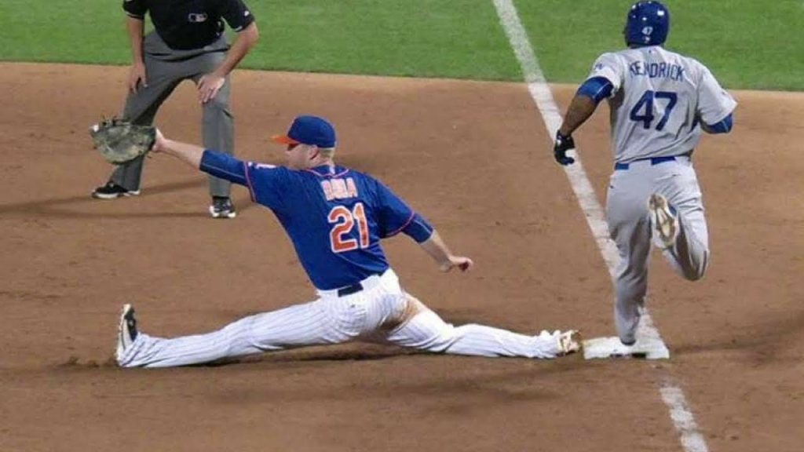

Passive flexibility refers to an external force moving you into a stretch. This can be a tool, a partner, or gravity. Active flexibility refers to your own musculature bringing you into a stretch position. This may also involve the use of tools, a partner, or gravity, however the emphasis is on activating your muscles to pull you into a stretch, rather than relaxing them and letting external forces do the work for you.

For athletes, stretching should never be 100% passive. Athletes like a first baseman will need to work on their front splits actively to ensure they do not injure their hamstrings or hip-flexors as they quickly enter that position. The only people who benefit from 100% passive stretching are those who are trying to be flexible for show. For example, if you want to do a split, but have no intention of using it in any athletic pursuit can use passive stretching to achieve their goals. This does not mean that first baseman do not passively stretch, however the majority of their practice will consist of active exercises to increase flexibility.

## How to make a stretch "Active"

A forward fold is a good example of how to change a stretch from passive, to active. Traditionally a forward fold is done with the butt on the floor and the hands reaching towards the feet. Many inflexible people have difficulty tilting their hips, meaning that when they sit in an "L" shape, they fall backwards. The other problem is that when people reach for their feet, they do so by bending their backs. When we do a forward fold, we want to target the hamstrings, not the back.

**1.** If you can not sit at 90 degrees comfortably, then the first thing we do is place a yoga block or stack of books under the butt so that you can at least sit comfortably in 90 degrees. If you can't do that, then there won't be a way for us to make the stretch active. For some people this may require 1 or even 2 yoga blocks.

**2.** The second step is to place another yoga block or book between our chest and our thighs and squeezing the block with 30-70% effort. While we activate the hip-flexors to compress, our hamstrings react to this exertion of force by releasing neurological inhibition and increasing our range of motion. This allows us to sink deeper into the stretch!

### What you should avoid

This method differs greatly from the method you will see on social media where a hoard of yoga instructors will tell you to get straps and pull yourself into the stretch. If your goal is passive flexibility, then this is a fine method, however if you want active flexibility, then this will not do.

In order to make a stretch active, you need some force to resist against. In the example above, the resisting force is the yoga, which you fight against, but squishing it between your chest and thigh.

## Active stretching = mobility, Passive stretching = flexibility

The difference between mobility and flexibility is the same as the difference between active stretching and passive stretching. **If you are "flexible" that means that you need an external force to bring you into whatever stretch you are trying to do**. For example, if you are very flexible, you can do a leg raise, but pulling your leg into the position with your hand. **Mobility means that you have neurological control over a range of motion. Meaning that you can produce the force needed to enter bring your leg into a leg raise position.**

<figure>

<figcaption>

Flexibility

</figcaption>

</figure>

<figure>

<figcaption>

Mobility

</figcaption>

</figure>

### Advantages of mobility

The advantage of mobility over flexibility is that having control over a range of motion means you are less prone to injury and are able to perform better in that range of motion. This is particularly important for athletes who need to be strong in many different ranges of motion. Many dancers have incredible strength in their quadriceps that they can bring their leg above their head and balance there. This is not just a a feat of mobility, but also shows incredible proprioception and coordination.

## What are the benefits of Active stretching

Active stretching can be used to increase your range of motion and flatten the strength curve (more on this later). The latter is not done by passive stretching, and is the main reason you should choose to stretch actively over passively is you are involved in any athletic pursuits.

### Increase your joint range of motion

Stretching of any kind will increase your range of motion. Let's look at the hip socket while doing our forward fold. By stretching increases our range of motion. And we can do this in more than one way. A forward fold is one way, while a side split is another way. Your hip socket is a fairly complicated joint and can be moved on three different planes.

- Sagittally - Think, seated forward fold
- Coronal - Think, leg raise or side split
- Transverse - Think, internal and external rotation of the femur

By improving the range of motion in our hip, we improve the flexibility of the muscles surrounding it. Increasing the sagittal range of motion in our hip improves the flexibility in our posterior chain. This includes the hamstrings, calf, lower back, etc.

Active stretching not only increases range of motion, but also increases strength at the end ranges of motion.

### What is your end range of motion?

In a movement like a like a bicep curl, you start with the arm straight and the bicep lengthened. As you lift the weight, the bicep shortens until you reach the top position, where the bicep is at its shortest. Your muscles will always be stronger in the middle area of this range and weakest at the end ranges. The end ranges are when the muscles is at its longest and shortest.

### Flatten the strength curve

Flattening the strength curve means getting stronger at your end ranges, so there is less of a disparity between where you are strongest and where you are weakest. This means we can exert more force and absorb more impact at our end ranges with less fear of injury.

A good example is Jujitsu, where you submit opponents by cranking their joints. If you have greater range of motion, and more strength within that range, then it means more more work for your opponents to tap you. Not only that but increased mobility will mean you can operate your limbs with greater dexterity and control.

Here is a cheesy early 2000's video of Jujitsu monster Ryan Hall explaining how "flexibility" plays a role in Jujitsu.

<iframe width="560" height="315" src="https://www.youtube.com/embed/qeA9Z76deDo" title="YouTube video player" frameborder="0" allow="accelerometer; autoplay; clipboard-write; encrypted-media; gyroscope; picture-in-picture" allowfullscreen></iframe>

## Tools for active stretching

The most common tools for active stretching are...

- Yoga blocks
- Resistance bands
- A tennis or lacrosse ball
- Ankle weight 1-5lb

### How to use yoga blocks when stretching

Yoga blocks have three uses.

The first is to elevate our hips and other body parts as explained with the seated forward fold example. Some people are so restricted, that they can not properly perform the exercise unless their hips are elevated. Other exercises are enhanced by the use of yoga blocks.

The second way to use yoga blocks is to use it as something to resist against. In the case of a seated forward fold, we place a yoga block between the chest and thigh and squeeze it. The yoga block provides resistance and makes it easier for us to make our stretches as active as possible.

The last use of yoga blocks is to orient the direction of our stretches. In the case of a pancake, we can place a yoga block in front of us, promoting a forward moving stretch. Most people when they stretch, they aim for the floor or their feet, but this might not be the best way to direct your stretches. Having a reference point is very helpful at more advanced stretching levels.

### How to use Resistance bands for stretching

Resistance bands serve two functions at the same time, which makes them useful for certain stretches. The first is resistance, which depending on the exercise and your own flexibility, might be required. The other is orientation - which was explained in the yoga block section. Pulling against the resistance band lets you know in what direction you should orient your stretch. A resistance band used during a seated forward fold orients you to stretch forwards instead of towards the floor.

Make sure to use low resistance bands. When working at your end ranges of motion, you do not need a lot of weight. A couple pounds of resistance at the end of your stretch is all the resistance you need.

### how to use ankle weights for stretching

Those small two pound weights people wear when power walking are excellent for providing resistance at end ranges of motion. Two pounds might not sound like a lot of weight, but remember that at the end ranges, there is much less strength available to exert. An example of an ankle weight being used is while practicing leg raises or side kicks.

Get within 80% of your maximum and from there, pump the leg upwards towards the sky. pushing for the last 20% of your range of motion is going to be much more difficult with a small weight adding resistance. This is a very common exercise in martial arts such as Taekwondo where increasing range of motion and power are critical.

If you're just getting started you probably do not need ankle weight, however they are great to supplement and help produce power while increasing range of motion.

<iframe width="560" height="315" src="https://www.youtube.com/embed/92p0muBPtmA" title="YouTube video player" frameborder="0" allow="accelerometer; autoplay; clipboard-write; encrypted-media; gyroscope; picture-in-picture" allowfullscreen></iframe>

## When to include active stretching in my fitness routine

Active can be included before or after your workout routine. Prior to your workout routine, active stretching should be less intense, while afterwards it can be more intense. This is due to neurological fatigue. Neurological fatigue is when the nervous system is tired from sending messages to your muscles telling them to contract and relax. All exercises place some demand on your nervous system depending on their intensity. This is why when you do your most intense work near the beginning of your workout to make sure your nervous system is not already fatigued.

Another way to include active stretching into your routine is to do more of this work on deloading weeks or on days that you have lighter workout days. Remember that active stretching does produce fatigue so do not follow up an intense leg day with an intense active stretching day. This will only increase your fatigue.

### Active stretching will fatigue you

Similar to any other workout, being active means you are challenging your muscular and nervous system. Doing this is tiring. So don't be surprised when you wake up the next morning after an intense stretching session feeling sore or worn out.

This is important because you don't want to tire out prior to your workout. For example, you don't want to do an intense active stretching session for your glutes prior to doing an intense set of squats. Best would be to do a normal warm up, do your workout, and then after continue with your active stretching routine.
