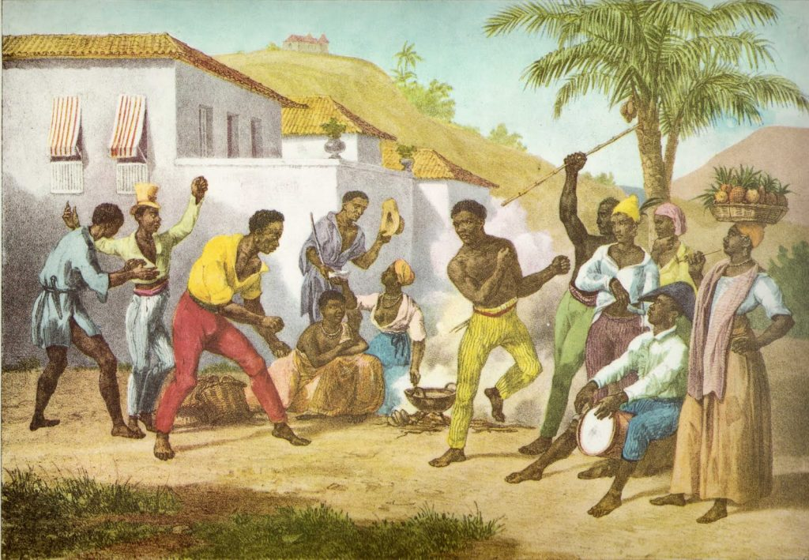
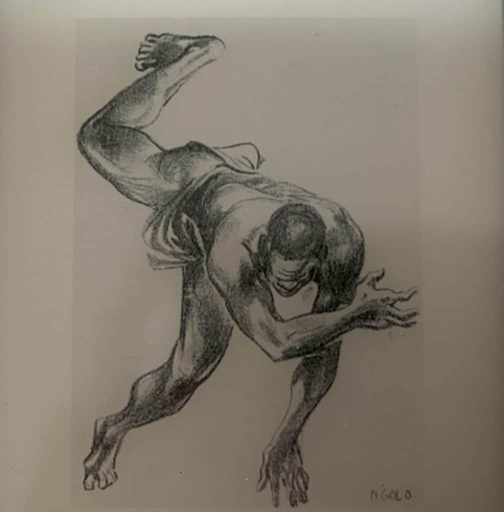
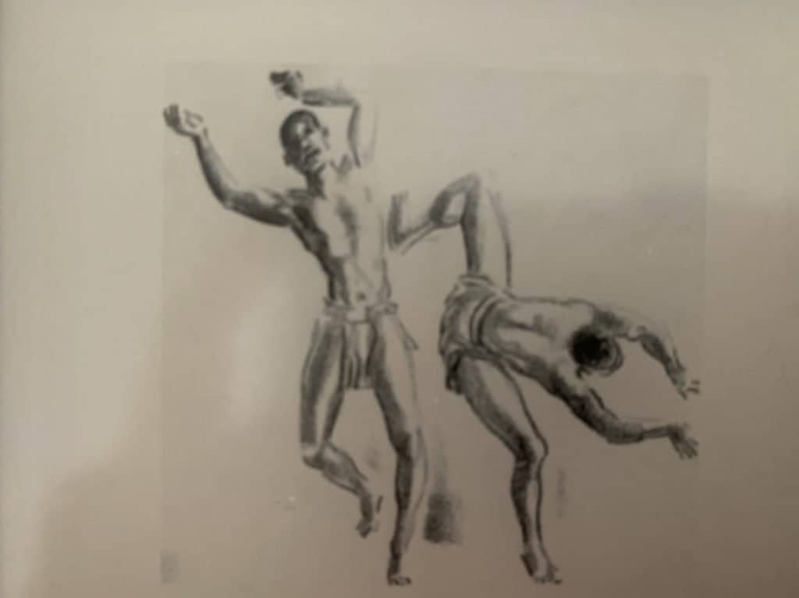
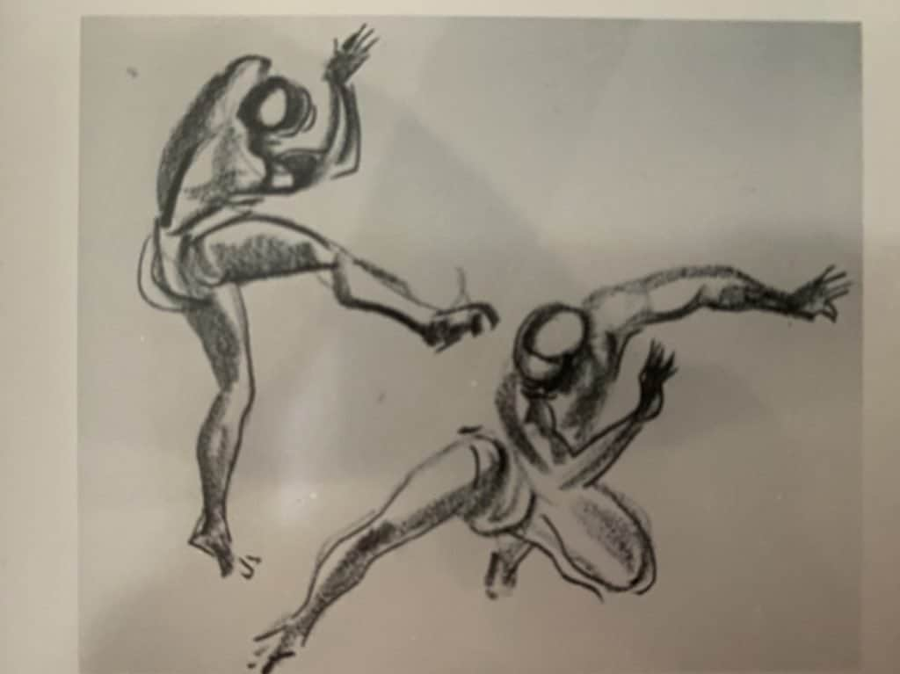
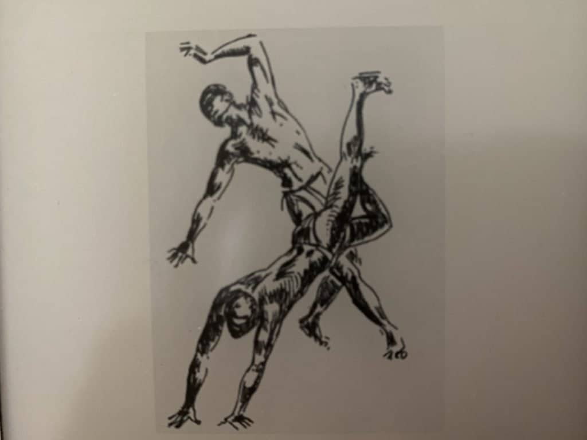
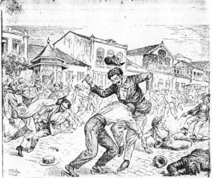
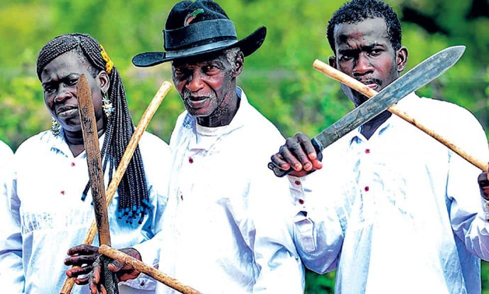

Many people tell the story of how slaves brought over to Brazil from Africa practiced Capoeira in secret as a way to resist their slave masters. There is partial truth to this story. **In colonial Brazil, Capoeira was created through combining _Engolo_ (a warrior dance) with several other arts brought from Africa to Brazil. The African slaves were largely allowed to practice their arts and rituals as a way to reduce overall unrest in the slave populations. In some cases this did backfire, the slaves would revolt, and then escape to hidden slave villages called _Quilombos_.** Capoeira went through a slow evolution as it incorporated new movements, music, and rituals. During Capoeira's near extinction by the Brazilian authorities in the early 1900's, the remaining Capoeiristas survived by camouflaging Capoeira as a harmless dance.

[Check out my article - "what is Capoeira", where I give a broad overview of Capoeira.](https://dendearts.com/what-is-capoeira-the-best-damn-online-explanation/)

## When was Capoeira created

It is not known when Capoeira was created. The modern Capoeira that is practiced today was created in the early 1900's by Mestre Bimba, Mestre Pastinha, and other capoeiristas of that time. It is not known when the Capoeira practiced by the slaves in colonial Brazil was created. **We do know that Capoeira is at least 230 years old based on our first documented case of "Capoeira" by Brazilian authorities**.

### The first documented account of Capoeira

The first documented account of Capoeira in colonial Brazil dates to 1789...

> "According to the document, Manoel Cardoso Fontes purchased an enslaved pardo youth named Adão,23... Manoel resolved to take advantage of him by renting him out to third parties as a laborer for public works, as a porter, or for any other physical labor \[this was a common practice at the time in urban areas\]." - "Fighting for Honor" Desch-Obi

Adão was arrested during an encounter between Capoeiristas where one of them was murdered. **This and other accounts inform us that Capoeira was mostly an urban phenomenon.**

> "According to the law of the kingdom, the gravest of crimes was the practice of capoeiragem, and even more so when it resulted in death. In the course of the proceedings it was established that Adão was innocent regarding the murder charge, but his status as a capoeira was confirmed. As punishment he was to receive five hundred “lashes” and “two years in public works. His senhor, after Adão... petitioned the king, in the name of Christ’s mercy, to wave the rest of the penalty, arguing that he was a poor man and dependent on the income that his slave brought him. He promised to take care that Adão would no longer return to fraternize with capoeiras or become one of them.” - "Fighting for Honor" Desch-Obi

**By this time (the year 1789) Capoeira was already illegal, showing us that Capoeira is much older than 230 years old.** For context, Portugal began bringing slaves from Africa as early as 1530. This document does not inform us about what Capoeira looked like during this period. For that we need to look at another historic document.

## what does traditional Capoeira look like

Unfortunately the Capoeira played in the 1700's and earlier is lost to history. There are a few historical records that describe Capoeira from this period, and it is clear from these records that the Capoeira from that time was very different from what we practice now. Here is a passage from 1824, by a Frenchman in a book entitled, "Capuera ou danse de la guerre".

> The negroes have an even more violent warrior's pastime called Capoeira. Two champions throw themselves, one against the other, trying to hit the chest of the opponent they wish to knock down with their head. They avoid the attack with equally skilled jumps to the side and sudden stops. But in throwing themselves one against the other, more or less like goats, it may happen that they hit each other head against head forcefully, which often makes the game degenerate into fights, whereupon a knife comes into play, bringing on bloodshed. - "Capuera ou danse de la guerre" 1824, Rugendas

**This version of Capoeira sounds very similar to Tupping, a head-butting game played by the Kunene people of Angola. This could indicate an evolution of "Capoeira", or another likely theory is that Capoeira was a general term to encompassed several African martial practices**. Here is a description of Tupping practiced in the Carribean.

> The ring being formed as before, the music again strikes up, and the victorious tupper of the last Sunday’s encounter enters the ring... the opposing combatants dance with careless gaiety, frequently exchanging smiles, and significantly nodding their heads at each other. They then separate, withdrawing a few yards from each other, still dancing, jumping, and nodding the head: now stooping forward, with hands clasped upon their backs, they advance towards each other... When within a yard and a half of each other, the music ceases; the tuppers pause for a moment, and eye each other with the steadfast gaze of scientific pugilists; when, as if by mutual impulse, both dart forward, head against head, like two rams! - Notes from English soldier William Buttersworth

Based on these two fairly similar descriptions, it's not clear if the Frenchman mistook Capoeira for Tupping or if Capoeira took concepts from tupping. Headbutting is still a common strike in Capoeira today, but there is no ramming of the heads together as described above.

## Who created Capoeira

Capoeira was created by the African slaves (and the descendants of slaves) in Brazil. There was no single "creator" of Capoeira. The traditions that form the foundation for Capoeira, were created in Western and Central Africa. Over time, these traditions combined, evolved, and formed into what we now know as Capoeira.

### Capoeira's main African ancestor is the N'golo (or Engolo)

**Capoeira's strongest link to Africa comes from a ritual known as the Engolo. Engolo was used to prepare the bodies of young men and boys to fight with acrobatic kicks and sweeps and evasive movements.**

> Engolo contests could be used as athletic contests, as sacred healing ceremonies, or as a form of dueling between rival champions from distant wards. Engolo matches could be friendly amusements or deadly contests when personal or group rivalries were on the line... Similarly the dance element of the art was key in ludic contests but relegated to peripheral importance during real combat. In its ritual practice the engolo, like most African combat forms, was inseparable from music and dance. - "Fighting for Honor" Desch-Obi

Similar to Capoeira, the Engolo was a martial art that served several purposes. Both Capoeira and Engolo can be a friendly game or a violent fight. There are many examples of brawls breaking out at Capoeira rodas. And there are just as man examples of Capoeiristas playing at their weddings. The latter is surprisingly common and shows how Capoeira is used for combat as well as other communal rituals.

### Similar martial arts to Capoeira

The diaspora of Africans to the Americans via the trans-Atlantic slave trade resulted in many martial arts with the same roots as Capoeira.

**Some of the best evidence to the fact that Capoeira was created by a mixing of several African rituals and martial arts is through the existence of similar martial arts in the Americas. Danmye Ladja is a martial art that shares many elements with Capoeira.** The existence of these martial arts shows how the Engolo of Africa influenced several slave communities and created martial arts like Dnmye Ladja and Capoeira.

<iframe width="560" height="315" src="https://www.youtube.com/embed/Rl4CEEse_fI" title="YouTube video player" frameborder="0" allow="accelerometer; autoplay; clipboard-write; encrypted-media; gyroscope; picture-in-picture" allowfullscreen></iframe>

Here is a description of Danmye Ladja:

> "In these contexts, as with the other combat arts, the ladja took place in a circle of singers/fighters known as the won. The main musical elements were the percussion provided by a drum called tanbou alendjé, musical sticks (tibwa) that played on the backs of the drums, and soloists who led the chorus in call-and-response songs. The ritual began with the kouri lawon, in which the drums called a fighter to enter the circle in a stylized counterclockwise run" - "Fighting for Honor" Desch-Obi"

If there was no video, this description could easily be mistook for Capoeira.

### Capoeira was part of a wider African Martial Arts heritage

Ladja and Capoeira are similar to each other in many ways including the music.

> "This transverse drum style (played horizontally on the ground) has been noted by ethnomusicologists as being of Central African origin, as was the playing of musical sticks on the back of the drum. In Brazil, the visiting Austrian artist Rugendas in the 1820s depicted a similar style of transverse drum being used in the jogo de capoeira." - Desch-Obi

The existence of these cousin martial arts and rituals show us how rich the African culture was in the countries of the diaspora. And also how these cultures mixed to create different art forms - Capoeira one of these art forms.

### Capoeira is a mix of several African Arts

Based on the research by Desch-Obi, it seems clear that Capoeira is a mix of several arts brought over from Africa. These arts include...

- **Engolo** \- Acrobatic martial art
- **Tupping** - Head butting game
- **Kandeka** - Stick fighting
- **Batuque** - Leg striking game
- **Igbo Wrestling** - Wrestling form (to a lesser extent)
- **Candomble** - Religion (includes musical traditions)
- Among others...

Capoeira incorporated things from other arts, such as rhythms from Candomble, and instruments from Batuque. It's not documented how these differences manifested, but it seems intuitive to think that there would be regional differences. These regional differences could manifest in different styles, rituals, and customs, depending on the mixture/influence of the above African arts.

## Where was Capoeira created

The arts that Capoeira drew from come from Africa. Those arts were then later were adapted and mixed together into what eventually became Capoeira in Brazil. Influences from Yoruba, Igba, Kunene, and other African people, are present in Capoeira today.

## Why was Capoeira made illegal

Capoeira was made illegal in 1890. By this time, Rio de Janeiro (the capital of the time) was flush with Capoeiristas and gangs called _maltas_. The maltas served as the muscle for the criminal underworld. Rival maltas would brawl in the streets with knives and razors. The violence was very great and as a way to eliminate the maltas, the Brazilian government made Capoeira illegal across the country. Despite their being no national law prior to this, Capoeira was made prosecutable by law as early as the 1790's. Capoeira was seen as violent, barbaric, and fomented a criminal underworld in many urban areas.

### How Capoeiristas formed gangs

In colonial Rio de Janeiro, many slaves worked as day laborers. During the day, they would work on the docks or in the markets for their masters. During their free time, these slaves would come together to create gangs called "maltas". These maltas would practice Capoeira. These gangs formed communities and even had a ranking system.

The youths were called Mulekes, an african term widely used in Brazil. The next stage was the Caxinguela, the Amador, and last Capoeira. The members of the malta would be trained and over time they would progress until they were sworn in via an oath as a "Capoeira". Many Capoeiristas worked as hired muscle to earn extra money. And not all Capoeiristas were slaves. Many of these Capoeiristas were free men, and some where even from outside of Brazil.

### Capoeira Made officially illegal by the Brazilian government

In 1890 Capoeira was made illegal by the Brazilian government. Although many localities had already placed severe restrictions on the art, the new law made the prosecution of Capoeira much more effective.

The Brazilian government made many efforts to eliminate Capoeira, which it saw as a nuisance. One attempt was to send all the Capoeiristas to the war with Paraguay in 1885. The plan backfired when the Capoeiristas came back winning astounding victories. The victory against the Paraguay army laid to rest much of the oppression faced by the Capoeiras.

### Capoeira persecuted to near extinction

In 1889, the Portuguese monarchy fell and Brazil claimed it's independence from Portugal. This began the strongest repression of Capoeira in Brazil. Within a few years the Capoeira found in Recife, Rio de Janeiro, and other parts of Brazil, was all wiped out. The maltas were destroyed and the only hub of Capoeira left remained in Salvador, Bahia.

Salvador, Bahia is the cultural hub for Afro-descendents in Brazil. Even today in Salvador people practice Candomble and many other rituals brought over from Africa. The continuation of Capoeira in Salvador was due in part to the integration of the berimbau. The berimbau is a musical bow and can be found in many parts of Africa with many different names: Ucungu, Hungu, and madimba lungungu.

If police came to break up a suspected roda, the capoeiristas would flee, the berimbau would play samba and people would begin to dance. If escape was required, it was much easier to run with a berimbau than a drum. Also, a tradition of musicians playing the berimbau for people's entertainment already existed at the time, making the presence of a berimbau not so suspicious.

## Knives and weapons used in Capoeira

The Capoeira present in Rio de Janeiro in the late 1800's is very closely related with the use of machetes, razors, and knives. These were common tools used by people of the time, including the machete which was commonly used by slaves working in the fields. Although the link is not clear, it is likely that the African martial art of Kandeka influenced the use of weapons in Capoeira during this time in Capoeira. Although the use of razors and other weapons is rare in Capoeira today, there are rare occasions where knives and razors are present - such as in Jogo de Navalha (the knife game).

### Kandeka influence on weapons usage

Kandeka is an African martial art that trains the use of sticks. The use of Kandeka was used in conjunction with Engolo as self-defense training. Today, there are many counties throughout the African diaspora with stick/machete fighting styles. These places include Colombia, Haiti, Barbados, among many others. The use of machetes to cut sugar cane and other crops facilitated the continued practiced of this weapons training.

## Who created the modern styles of Capoeira

The modern styles of Capoeira break up into Angola, Regional, and Contemporanea. The first two are two styles that most modern Capoeira schools base their styles from. The rituals, customs, movements, and more take much inspiration from these two styles.

[For a more in depth look at Capoeira styles, check out our article on the various Capoeira styles and what makes them unique.](https://dendearts.com/the-different-styles-of-capoeira-full-explaination/)
