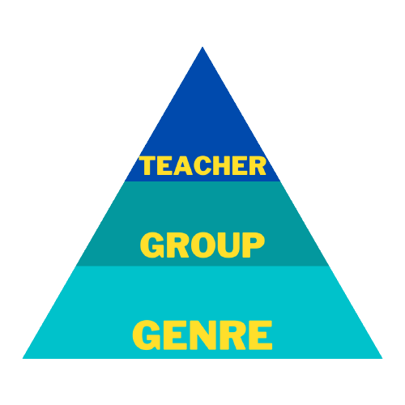

Capoeira classes differ greatly in the clothing required, movements learned, cost, and atmosphere. Although the best way to learn about a Capoeira school is to attend class, here are a few factors that will help you understand what to expect from your first Capoeira class.

## Picking a School will greatly impact your experience

**Capoeira schools vary greatly in terms of what they teach.** This is in large part because there are three main genres or styles of Capoeira to choose from. And within each genre are many groups that are not centrally controlled by a governing body or authority. What this means is that classes in the same group (or franchise) can be wildly different depending on the teacher.

Soooooo....

There is a hierarchy of things to consider when asking what your Capoeira class will look like. First is the genre of Capoeira you're interested in, second groups available in your region, and the last is the teacher.

### Picking a Genre or Style

Generally speaking, there are three major genre's or styles of Capoeira available today. The three are Angola, Regional, and Contemporânea.

Angola generally puts a heavy focus on music and tradition, in addition to the movement aspects of Capoeira. Tradition is the key word here. And this general outlook on the importance of tradition extends to the movements and ways of training.

Regional is a style developed in the 1920s and 30s by Mestre Bimba who wanted Capoeira to be a more combat oriented art. These schools focus heavily on strong and fast movements. There are less flowery moves, and a stronger focus on an objective training methods.

Contemporânea developed around the 1960s and 70s. The pioneers of this style took elements of Regional and Angola and fused them together. Today the label of Contemporânea applies to any style that does not strictly follow the teachings of Angola or Regional. Contemporânea is by far the biggest style by far in terms of the number of students. Despite the differences, there is a lot of acceptance between the different styles and for the most part, everyone comes together during events.

### Picking a Group

Within any style of Capoeira, there many schools that use different styles of teaching, graduation, etc. Each school is slightly different from the other even though they all come from the same "style". A great way of seeing if you want to be part of a Capoeira group, is to go on youtube and look up them up. There might not be videos of the teachers or schools you are looking at, but there are probably videos of other practitioners from that group. This will give you an idea of what to expect.

### Picking a teacher

This goes hand in hand with picking a group. There are many Capoeira teachers who are phenomenal at their jobs. There are great teachers who put their heart and soul into their students. Your goal as a students should be to find a teacher that can guide you as you learn Capoeira. The best way to do this is to talk to them. Don't be shy. Teachers are busy, but if you have questions for them, they'll make time to answer them. Just be patient, because teachers have the difficult task of working with a large number of people, and there is only 1 of them.

## Uniforms in Capoeira

**Like many martial arts, some Capoeira schools require a uniform**. These uniforms consist of a pair of _Abadas_ a kind of flexible white pants, and a white shirt. This is true for the majority of schools that consider themselves to be Regional or Contemporânea. Pants and shirts can all be purchase from the academy/school you attend. You probably won't be able to buy them online as the logo needs to be on your pants and shirt.

**Practitioners of Angola actually wear pants, shoes, and sometimes a group shirt**. These things, you can buy at a department store - minus the shirt. Although this does not apply for 100% of Angola schools, it is true for the vast majority.

Most groups will say on their website if they have a dress code. If you can't find any information about it, don't sweat it. You won't be required to wear anything specific on the first day. Everyone understands that you didn't get the memo yet.

### Shoes vs. Barefoot

Where you do have some flexibility is whether you wear shoes or not. Except in Angola schools. The vast majority do require shoes. In a Contemporânea or Regional school, you are free to go barefoot, or wear some kind of athletic shoes. If you're not sure about what shoe to wear, I did write an article about the best shoes for Capoeira.

https://dendearts.com/the-best-shoes-for-capoeira/

I**n case you're curious, barefoot is best.** Unless you're outside on a very rough surface that will tear up your feet, I recommend going barefoot. If you have sensitive feet, then shoes might be good to start out. Over time, you want to strengthen the muscles in your feet, and an easy way to do this is by walking around the house barefoot. This has tons of benefits, such as improved proprioception and coordination.

### Belts (or as we say, chords)

Capoeira uses chords instead of belts. Chords are made of yarn, but can also be made of cotton and dyed to the intended color. In many schools, beginners do not have a chord. This is different from some martial arts, where beginners start with a white belt. I**n Capoeira, the first belt (which can be different colors depending on the group) is often received at the Batizado**. the Batizado is a belt ceremony where students receive workshops from different teachers and play in the roda. The roda is where capoeiristas play Capoeira.

If you're unfamiliar with the Capoeira graduation system, below is a link to another article that explains the system in full detail.

https://dendearts.com/the-capoeira-belt-system-explained-by-a-capoeira-teacher/

It's not uncommon for graduated students to lead the warmup or teach some classes. Graduated students is a term used for more advanced students. What defines a graduated student will vary from school to school. But in general this means that the teacher trusts the student enough to have a leadership role.

## Time commitment and cost to learning Capoeira

The majority of classes these days run for an hour and cost anywhere from about $15-25 dollars each. This varies greatly across the United States, and will differ if you live in the United Kingdom, Australia, etc. Most groups offer some discount if you pay per month or do some sort of yearly contract.

Schools vary in how many classes per week they give. Some schools do weekly classes, while others have up to 5 classes available throughout the week. **For beginners, going three times a week is advised. Just as important as coming to class is practicing what you learn at home**. If you can sprinkle a few 30 minute practice sessions at home, this will go a LONG way in your development.

More advanced students 6+ years will still train at their teaches academy, but training at home will become a major part of their regiment. visiting other groups more regularly, attending events, rodas, and training at home is how they will continue their development. At the more advanced levels, training 2 or 3 times a week at the academy alone is insufficient to continue improving.

### Perception of time

In Latin America, time does not work the say way it works in places like Germany and the United States. It's common for people to come late to meetings or events, and this (unfortunately) extends to some Capoeira groups. A class starting about 5 minutes late is no big deal, but more than 10 minutes should be a red flag. If you run into this, you should tell the head teacher, as you would be doing them a great favor by being honest.

## Outline of a class

The majority of classes follow a pretty simple format...

- Warm up
- Isolated movements (repeating kicks, moves, sweeps, etc.)
- Sequence
- Roda

**The classes in general build up to a sequence.** The isolated moves you do such as Au, Meia lua de Compasso, etc. All these moves add up into a combination that you do with a partner. The teacher will likely have you do that combination a few times. They might also add or remove certain things depending on your level and ability. **At the end of class, most teachers will do a roda**, where you are free to play and use the movements you learned in class. If you don't know what a roda looks like, here is an example of two teachers playing...

<iframe width="560" height="315" src="https://www.youtube.com/embed/BgOnP03zcwA" title="YouTube video player" frameborder="0" allow="accelerometer; autoplay; clipboard-write; encrypted-media; gyroscope; picture-in-picture" allowfullscreen></iframe>

More advanced students will likely be challenged to do more difficult variations to test their abilities. This might involve faster movements, more realistic take-downs, or more demanding variations. **Beginners on the other end of the spectrum will be given easier variations to do. The speed will be slower, the take-downs more gentle, and the variations more basic.**

Here is an example of a normal cartwheel that a beginner could feasibly practice.

<iframe width="560" height="315" src="https://www.youtube.com/embed/KFpGbWHE6OE" title="YouTube video player" frameborder="0" allow="accelerometer; autoplay; clipboard-write; encrypted-media; gyroscope; picture-in-picture" allowfullscreen></iframe>

Here is a cartwheel you might see at a higher level.

<iframe width="560" height="315" src="https://www.youtube.com/embed/pKFeTsPxVAY" title="YouTube video player" frameborder="0" allow="accelerometer; autoplay; clipboard-write; encrypted-media; gyroscope; picture-in-picture" allowfullscreen></iframe>

### Build your observational skills

**Capoeira traditionally was learned by watching others play and then copying them. This tradition spills into the classes.** If you ask a teacher for help on a movement, they'll happily do so, but correction are limited.

You might think this lack of corrections is a detriment, but there is a lot of research that proves less immediate feedback is much better for long term motor learning. Following the teacher will take a lot of attention, so get ready to be challenged mentally as well as physically.

If you don't believe me, there is some good research on Peter Brown's Book "Make it Stick". Here is a summary with a section on delayed feedback.

[https://medium.com/@jgelnar7/how-to-make-it-stick-learning-that-lasts-part-2-a4267e7a17b5](https://medium.com/@jgelnar7/how-to-make-it-stick-learning-that-lasts-part-2-a4267e7a17b5)

## Do's and Don'ts of Capoeira

Capoeira is a traditional martial art in the sense that there are some rules. Here is a list that you can do make the most of your first Capoeira classes!

### Do's of your first Capoeira class

- Keep an open mind about the movements and techniques, you probably won't be familiar with most of them.
- Greet students and the teacher. Give them a chance to get to know you.
- If the teacher makes a roda, focus on clapping in unison with the rest of the class.
- Be present while the teacher gives instruction to the class.
- Understand that the first time you do a move, it might seem impossible. Your body needs time to build the mind-body connection.
- Play in the roda as much as you can! This is the best place to learn.
- Ask when the next class is and GO!

### Don'ts of your first Capoeira class

- Don't talk during the roda (that ist he circle where two capoeiristas play)
- Don't be shy. Brazilians are less shy than Americans.
- Be humble with your expectations. Don't think you'll be doing splits and high kicks on the first day
- Don't come to class with a superiority complex
- In the roda, don't dish out anything that you can't take yourself.
- Don't worry about backflips. That's not really something Capoeiristas train in class.

## The value of being a beginner

In the beginning the people, the movements, and the instruction are new and exciting. As awesome as this rush feels in the beginning, you want to focus on loving to learn new things. The scope of Capoeira movements is immense. **In the early 1900's many people referred to Capoeira as Brazilian Gymnastics. The misnomer is understandable.** There are a countless number of movements on the ground, on your feet, on your hands, in the air, etc.

Capoeira is by far the most fun martial art to learn. Capoeira attracts people who enjoy using their brains and bodies to solve complicated movement problems at record speed. If a foot is coming towards you, you have to practice enough that your instincts can carry you through safely. Capoeiristas defend themselves with creativity, and that is a really cool muscle that at the higher levels, is developed to a monstrous level.

here are some examples of very high level escapes from what looks like certain doom...

<iframe width="560" height="315" src="https://www.youtube.com/embed/bmgqMLtetbc" title="YouTube video player" frameborder="0" allow="accelerometer; autoplay; clipboard-write; encrypted-media; gyroscope; picture-in-picture" allowfullscreen></iframe>