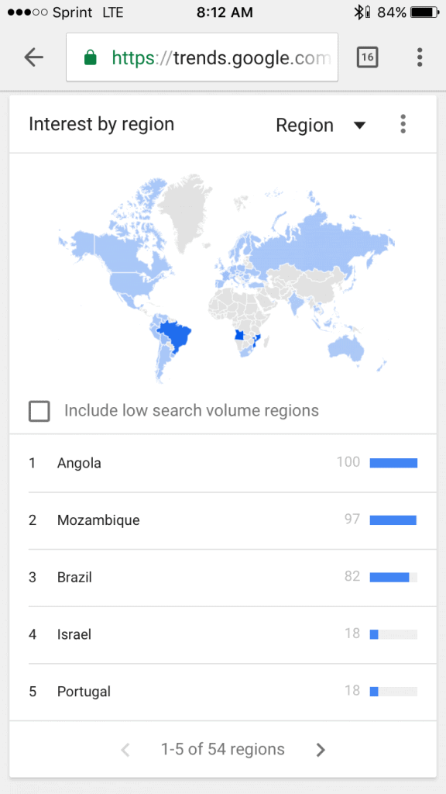
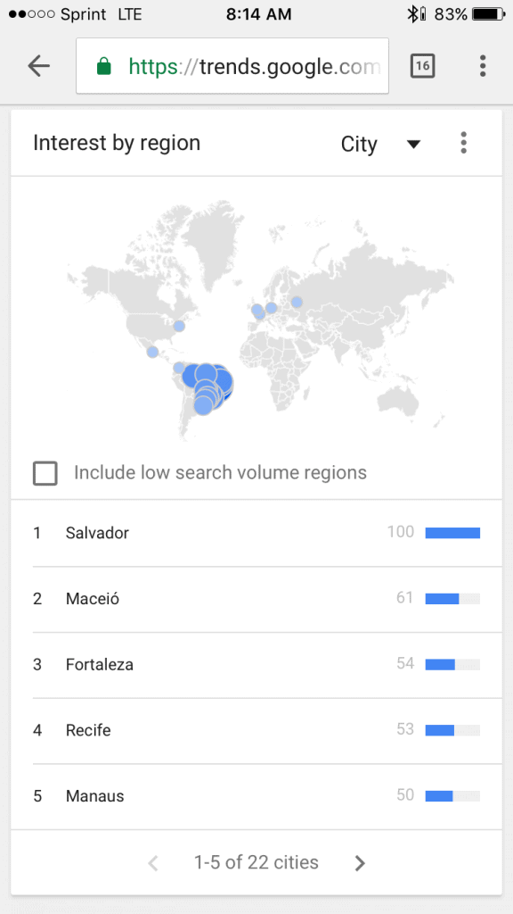
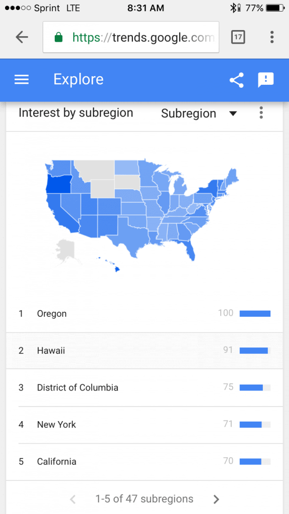

I really love this question because there's a lot of data on it! it is definitely possible to see which countries are most interested in Capoeira. If you go to Google trends you'll find that the topic of Capoeira is most searched in the following countries:

To be clear, that's a map comparing the proportion of all queries about Capoeira in the world over the past 12 months. Of course Brazil is near the top, but look at Mozambique and Angola!? I had no idea Capoeira was so popular in either of those two countries. Both of those countries speak Portuguese and were former colonies of Portugal, so I'm sure that is a big reason for the interest in Capoeira. Israel is the dark horse here. I guess they just love Capoeira. But what about cities? Cities are epicenters of culture and immigration so we can expect certain cities to be disproportionately representative of a country's searches.

This more or less what we expected. The majority of interest in Capoeira comes disproportionately from Brazilian cities. I will add that Google trends is not perfect and I believe they measure interest against the number of people in a region. So if a smaller city has a higher number of searches per person, they will get a higher score than a larger city with more total searches, but less searches per person. Google trends is not perfect but I think it gives us a good snapshot of what's going on.

The list 1 - 42 are all cities from Brazil. After that, we get the following cities.

Tel-Aviv, Paris, and Lisbon. It's interesting to see the France represented here instead Angola, which had a much higher portion of the searches when we looked at interest according to country. What we can gather here is that people's interest for Capoeira is highly concentrated in some cities like Paris, but outside of the cities, interest is much, much lower.

So again, it looks like Capoeira is very popular in Portuguese speaking countries and Israel. And on top of that, major cities like Paris, Lisbon, and Tel-aviv are epicenters of Capoeira outside of Brazil.

I also did so did some research on Capoeira in the USA and it's interesting to look at.

It seems like Capoeira is fairly popular in states like Hawaii, Oregon, New York, etc. but unfortunately, Capoeira is only half as popular as it was 10 years ago. I can say that as a practitioner of Capoeira, this feels true and I think a lot of that is Capoeira's slow adaptation to social media and modern forms of marketing. But the art is beautiful and those lucky enough to find it won't be disappointed! Also, I'm glad to see that Capoeira is doing well in New York, which is where I'm located!I hope that answers your question and if you have any others, try checking out my blog for more info on things going on in the capoeira community and information about Capoeira in general.The Capoeira 101 Blog\*source: Google Trends

#mc\_embed\_signup{background:#fff; clear:left; font:14px Helvetica,Arial,sans-serif; } /\* Add your own MailChimp form style overrides in your site stylesheet or in this style block. We recommend moving this block and the preceding CSS link to the HEAD of your HTML file. \*/

## Join us in the Roda!

\* indicates required Email Address \* First Name \* Last Name \* (function($) {window.fnames = new Array(); window.ftypes = new Array();fnames\[0\]='EMAIL';ftypes\[0\]='email';fnames\[1\]='FNAME';ftypes\[1\]='text';fnames\[2\]='LNAME';ftypes\[2\]='text';}(jQuery));var $mcj = jQuery.noConflict(true);