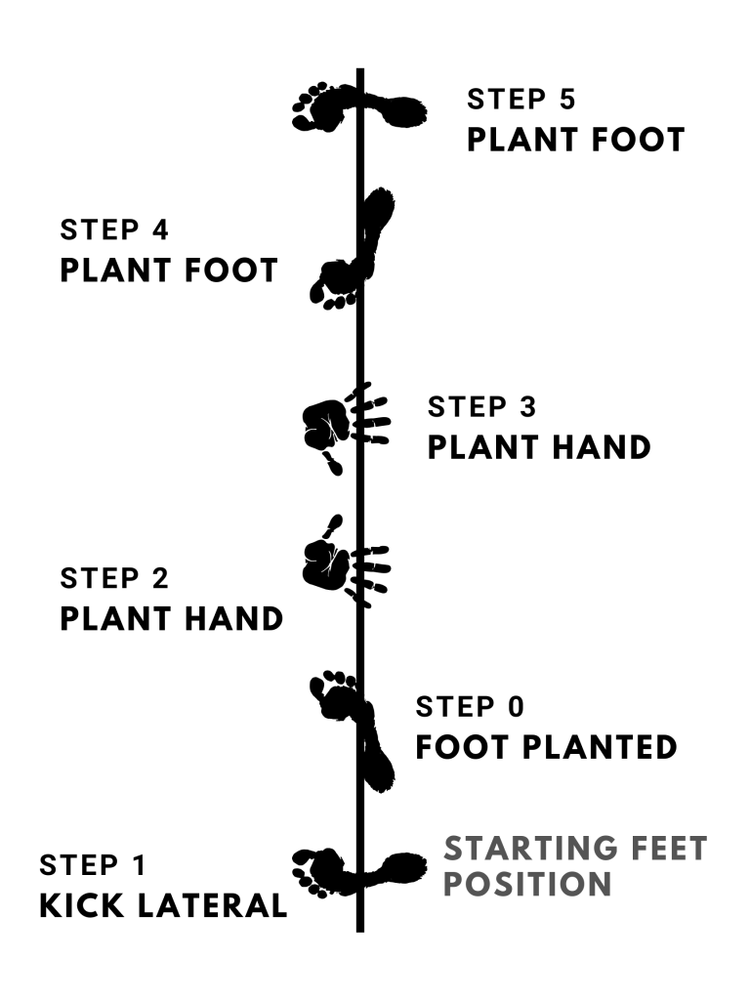

One of the most effective ways to make your cartwheel look better is to improve the range of motion in your shoulders and hips. The two biggest areas to work on include bringing your arms directly over your shoulders, and your ability to do a split. You do not need to be able to do a full split, however greater flexibility will help immensely.

## Shoulder flexibility for cartwheels

The majority of people are unable to bring their arms directly over their shoulders. Improving your overhead flexion can be done in several ways. Here are a few of those exercises.

### Wall slides

Wall slides are a very common exercise often seen in physical therapy clinics. One of the reasons they are so effective is that they are very safe to do, and you can work at your own level. Start with the lumbar, hands, and elbows pressed against the wall. both arms should make a "W" shape.

Perform the wall slide by sliding your arms up until it is as vertical as you can go. It will be very difficult for most people to bring their arms 180° above their shoulders without a very good amount of shoulder flexibility. If you record yourself doing the movement, you will see your arms make a "Y" shape while at the top of the movement. Pause at the top for a second before coming back down.

Try to get your arms as vertical as possible without bringing your hands or your elbows off of the wall. Another tip is to make sure your lower back is in contact with the wall at all times. Repeat this exercise 6 - 8 times.

### Press to handstand (feet on the floor)

<iframe width="560" height="315" src="https://www.youtube.com/embed/NJAPGP9MtAo" title="YouTube video player" frameborder="0" allow="accelerometer; autoplay; clipboard-write; encrypted-media; gyroscope; picture-in-picture" allowfullscreen></iframe>

Imagine this person had their feet on the floor instead. That is what the movement would look like.

Start in a squat and place the hands on the floor in front of you. From you, straighten the legs and align the upper body as best you can into a straight line, imitating a handstand. Stay for a second and come back to a squat. This simple exercise is an awesome warm-up for the shoulder that helps teach proper alignment and shoulder position.

Tip: At the top of the movement, keep the shoulders shrugged as high as possible.

Repeat this movement 8 times.

### PAILS and RAILS for shoulder flexion

PAILS and RAILS is a system developed by Andreo Spina, who founded FRC. This system is used to improve people's mobility.

We start our PAILS and RAILS by laying thrown on the floor. Raise your hand above your body and point your thumb up. How many people this will be already a stretch for them. If not, you can add to the stretch by elevating your hand on a few books or a yoga block. From here, you want to start by pressing down with your fist for about 10 seconds. The second part of this exercise is trying to lift off the fist from the floor for about 10 seconds. This can be very strenuous and you should do this exercise about 3 to 5 times for best results.

## Middle split flexibility for cartwheels

Many people think that in order to learn the middle split they have to sit in the middle split position for hours at a time. Although this is one way to learn the movement, it is not the only or the most effective method.

### Frog pose

<figure>

<figcaption>

image from yogapractice.com

</figcaption>

</figure>

The first exercise is the most simple, and that is the frog pose. And the frog close you simply bring your legs out to 90° can you sit on your knees trying to open up your hips as much as possible. You’re going to feel a very strong stretch in the groin area. This is the area that we are targeting.

You can sit in this position for about 30 seconds. After 30 seconds, squeeze the glute muscles and try to pull the knees up off the floor. Of course, your knees will not move, however, doing so will pull you deeper into the stretch.

### Horse stance to split

<figure>

<figcaption>

step 1

</figcaption>

</figure>

<figure>

<figcaption>

step 2

</figcaption>

</figure>

This active exercise is one of the simplest and most effective for training middle splits. The motion starts from a horse stance in front of a chair. Lean your weight onto the chair. Leaning more weight on the chair more will help regress the movement to a level you feel comfortable with. From here, slide your legs out into a middle split until you are at about 80% of your maximum split. To ensure your feet slide, you have something under your feet that can slide on the surface.

Once at your max, hold the split for a bout 2 seconds before sliding your legs back into a horse stance. Repeat this motion for about 6 - 8 times. If you are able to do much more than this, consider using the chair less for support.

### The peeing dog

There are two variations to the peeing dog. Starting from the quadruped position, I want to raise our leg up as if we were a dog being on a fire hydrant. The first way that we do this is by bending our leg at 90° and lifting it up to the side. The higher we can lift up our leg the more we will be engaging our glutes which will help us during our middle splits. Make sure to keep the hips parallel with the ground as you raise the leg. Hold this position for about 10 seconds before going to the next side.

The second variation is more difficult. We can also do the peeing dog is by keeping our raised leg straight and lifting it up to the side. This is a more difficult variation however it is very effective for training your abductor muscles. Your abductor muscles are very important as they are the primary muscle group that will help pull you into the middle split stretch. The stronger you can get these muscles the easier it will be to enter the middle split.

As with the first variation of the peeing do, hold the position for about 10 seconds before letting the leg down. Repeat for at least 3 sets.

## Why is flexibility important for cartwheels?

People are unable to bring their arms directly above their shoulders. Whether you're doing gymnastics, Capoeira, or any other movement art, doing cartwheels in a straight line is a fundamental part of the technique.

For range of motion in the hips can be seen by cartwheels that are done with the legs are very close together. If you are unable to separate the legs sufficiently the movement starts looking very clunky and uncoordinated.

<figure>

<figcaption>

cartwheel with legs glued together (poor hip mobility)

</figcaption>

</figure>

The best example of high-level cartwheel technique is with gymnasts on a balance beam. Not only do they move in a straight line, however, when they reach the top of their cartwheel, they are nearly in a full split.

<figure>

<figcaption>

Credit: Gymastic HQ - example of very good hip mobility at the top of the cartwheel

</figcaption>

</figure>

## How much stretching should I do prior to doing my cartwheels?

2 to 3 sets of each exercise is the minimum you should do prior to practicing your cartwheels. How much you need depends greatly on the individual. Some people may need a more extensive warm-up than others.

You do not need to do all the exercises on this list, just the ones that you feel work best for your body. Try different exercises and test which ones work best for you. All of the exercises given are very effective, but finding the ones that work best for you is key.

## How should I feel after doing these stretches?

The stretches provided are meant to be done actively. This is in contrast with passive stretches where the goal is to relax into the stretch. Active stretching means tensing the muscles opposite the muscles being stretched. In the frog stretch, we stretch the adductors in part by flexing the glutes. This intensifies the stretch and also trains us to be stronger in this stretched range of motion.

At the end of the exercise, you should feel warm in the joint being stretched and a bit of tiredness in the muscles used. This is how you know you are "warmed up". The fatigue is not bad, so long as you are not completely exhausted from doing the exercise. This is why it is important to regulate how much of each stretch you are doing.
