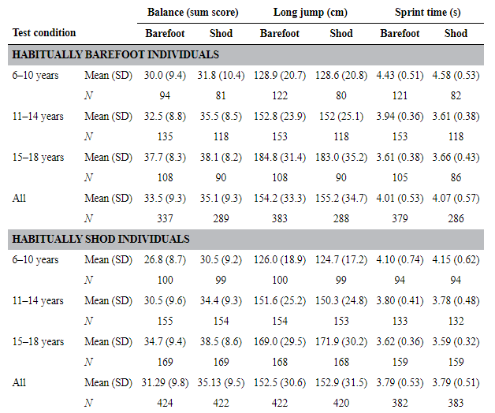

Visit any martial arts academy and you will notice that most or all students are barefoot. Students primarily train barefoot because it helps improve coordination and trains the intrinsic muscles that are often overlooked when we use our shoes.

## Why Traditional martial artists do not wear shoes

In many martial arts from Asia, it is very common to train without shoes. Jiu-jitsu, Karate, Taekwondo are all martial arts that require you to train barefoot. Culturally, in Asia, it is considered rude to use your shoes indoors and this may have contributed to the tradition.

In most parts of the world, athletics is seen as something done without shoes. The Aztecs would play ball without shoes. The ancient Romans and Greeks performed in the Olympics naked. Senegal wrestlers today wear a small cloth little as they compete and practice.

Martial arts that wear shoes are in the minority. This includes Boxing, Sambo, and freestyle wrestling, among others.

## Why are MMA Fighters train barefoot

In 2009, the Association of Boxing Commissions agreed on the Unified Rules of Mixed Martial arts. As part of this new rule set, martial artists were banned from using any type of footwear and attire became standardized. During the first few UFCs, you can see that there were no such rules, and fighters could wear whatever they wanted.

Once the UFC gained more popular appeal, the Association of Boxing Commissions decided they would create a unified rule book.

Explicit reasons are not given for why shoes are not allowed, however it is a rule all competitors must follow if they want to participate. It should be noted that shoes do not provide any particular advantage to kickers. Shoes do help protect the toes, however, they also make it easier to grab and create leg locks.

## Going barefoot develops foot and lower leg strength for better striking

**A key reason why martial artists train barefoot is the development of intrinsic foot muscles, the toes, calf, and tibialis.** The muscles located in the foot and lower leg develop foot dexterity and produce balance. With a firm foundation, striking is much easier. If you want to throw a punch, you need to be able to step quickly. This motion starts at the lower leg and foot, and the momentum travels to whatever part of the body you are striking with.

If you have underdeveloped muscles in the lower leg and feet, then your ability to strike with power, precision, and speed will be compromised.

### The tibialis - the shock absorber of the body

Perhaps the most neglected muscle is the tibialis. [The tibialis is the shock absorber of the lower body](https://pubmed.ncbi.nlm.nih.gov/31064856/). This is something that shoes often try to do with soft cushion heels. If the body does not learn to absorb impact, then it can develop dysfunctions that harm the knees and hips.

Several studies have indicated that barefoot running is actually very beneficial for the longevity of the person running. Part of the reason is because muscularity in the lower leg is necessary to absorb shock and then produce force. When we wear shoes we weaken our ability to learn, which in turn means a weaker lower leg development.

### Going barefoot prevents injuries like sprained ankles

There is a good amount of research that shows the benefits of going barefoot. **A randomized study of 57 runners showed that those who trained with barefoot shoes significantly increased the thickness and strength of their intrinsic foot muscles.** The group that walked barefoot with their barefoot shoes showed better foot muscle growth than the group that explicitly trained their foot muscles!

Stronger foot muscles mean improved stability. **And improved stability is correlated to a reduction in injuries. Ankle instability is highly associated with tendinopathy for example as well as ankle sprains.**

For martial artists, going barefoot is a good idea for strengthening the foot and preventing injury.

https://journals.lww.com/acsm-msse/Fulltext/2019/01000/Walking\_in\_Minimalist\_Shoes\_Is\_Effective\_for.14.aspx

https://www.ncbi.nlm.nih.gov/pmc/articles/PMC5054646/

## Going barefoot makes you more athletic

Another effect of going barefoot is that it can dramatically improve your overall athleticism and mechanics. **People who are stronger and more coordinated learn to kick much faster than those who are weaker and less coordinated. Researchers concluded that being habitually barefoot increases key markers in athleticism and coordination.** It stands to reason that these people will kick with more power, precision, and balance than their less shoe-wearing counterparts.

[A study of over 800 kids](https://www.ncbi.nlm.nih.gov/pmc/articles/PMC5996942/) showed that children who grow up barefoot perform significantly better than their shoe-wearing (shod) counterparts in sprinting, jumping, and balance.

## Should I go barefoot during my first martial arts class?

For new people, you should not feel obligated to wear shoes during the first class as you attend Adam martial arts Academy. **Although it is highly recommended to train without shoes, it is not necessary**. If you are somebody who has never gone barefoot regularly before, then I do suggest you purchase some barefoot-style shoes to practice at home or outside with. Even the best martial artists wear some kind of shoe when training outside on the pavement.

https://dendearts.com/the-best-shoes-for-capoeira/

If you feel very uncomfortable going barefoot, then your first goal should be to slowly acclimate yourself to going barefoot at home and then eventually at class. You can do this by taking off your shoes as soon as you get home. Spend as much time as you can barefoot.

Once this becomes a little bit more comfortable, you can try taking half the class barefoot, and the other half with shoes. If this is new to you, you will likely feel very sore the next day in the feet and lower leg. Don’t worry the soreness is very normal and part of the process of getting stronger.

## Exceptions to the rule of training barefoot

The reason wrestlers and Sambo wrestlers wear shoes are primarily for grip and for health. For wrestlers who are sweating on the mat, it’s very common to receive skin infections. One way to prevent fungal infections on the feet is to wear shoes. Another reason why wrestlers wear shoes is for better traction. This will make the athlete more explosive. lastly, shoes protect the toes. Wrestlers often fall on top of each other and if this were to happen on the toes, those toes could be severely injured.

In ancient Greece and Rome, wrestlers would never use shoes. Shoes are a modern addition to the ruleset of wrestling. However, wearing shoes during grappling practice and matches is not universal. UFC fighters and jujitsu practitioners do not use shoes during training or competition.

<iframe width="560" height="315" src="https://www.youtube.com/embed/XMGdKfdMtTE" title="YouTube video player" frameborder="0" allow="accelerometer; autoplay; clipboard-write; encrypted-media; gyroscope; picture-in-picture" allowfullscreen></iframe>

In this clip, you can see two MMA fighters wrestling on the ground, and both without shoes. The bigger wrestler is wearing socks which again serves to protect against any fungal infections.