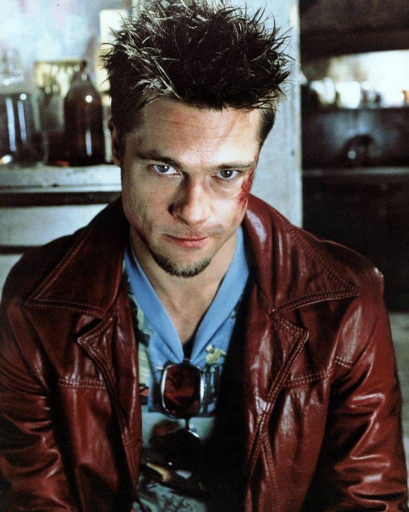

Capoeira is a full contact martial art just like Muay Thai, Karate, and other martial arts. **The difference is that the arena that Capoeiristas practice their full contact sparring, is the same as where they play. Kids and the baddest guys around might all play in the same roda, and even play together!** The roda is a very flexible arena, which is why you see many Capoeira games with no contact at all, and other that can be violent if the conditions met below are met.

### Misconceptions

Many of the misconceptions of Capoeira as a non-contact dance come from performances or staged interactions meant to awe a crowd. This is the difference between watching someone perform a cool looking "Kata" in Karate vs a Kumite match between two strong opponents. See below a performance by two Capoeriistas. It's clear that the take downs were planned and the other stuff they made up along the way.

<iframe width="560" height="315" src="https://www.youtube.com/embed/cnIzInTyS-M" title="YouTube video player" frameborder="0" allow="accelerometer; autoplay; clipboard-write; encrypted-media; gyroscope; picture-in-picture" allowfullscreen></iframe>

### Rules for Contact in Capoeira

Capoeira does maintain some rules that apply to the majority of places you go to. **One main tenant is that the way you play needs to fit within the music that is being played.** If the tempo is fast, you play fast. If the music calls for beautiful movements, that's what you do. Many places also place a lot of importance on the person leading the "roda". This is often a Mestre (master). If you play in a way the mestre does not like, you may be told to leave. If you're beating on a beginner, you will most likely be told to leave.

## Why is Capoeira a contact sport?

_According to a study from the [International Journal of Science and Research](https://pdfs.semanticscholar.org/7935/e9a1739368e93183331ffff51f240371ae78.pdf), a contact sport is “a sport that emphasizes or requires physical contact between players.”_ Capoeira is a martial art first, and this is why at any Capoeira event, you should expect a certain amount of contact. In a capoeira game there are strikes, take downs, and even some limited grappling that can occur. Training Capoeira means knowing how to defend yourself in any of these situations.

## Avoiding fight club

In the 1980s, and 90s there was a large movement towards a more aggressive and "fight" oriented Capoeira. The violence was so crazy that any roda you went to had the potential of braking out into a brawl. It was not uncommon for capoeiristas to knock each other out with hand strikes, knees, kicks, or throws to the ground. Many masters protested over the violence. Over time, the brawling mostly stopped and gave way to a Capoeira concerned with technique and fluid movement.

Today's Capoeira does not have anywhere near the savagery of the Capoeira 40 years ago. Most people who play Capoeira do so for fitness and fun, but that doesn't mean there isn't contact or the potential to hurt yourself. Anyone who practices a striking martial art will tell you that when you spar, you have to be very cautious, because you never know what can happen.

## Making Contact (kicks, takedowns, palm strikes, grappling)

There is a saying that in the roda "Everything is allowed". As long as it fits within the music that is being played, yes, kicks and other ways of making contact are allowed. For this reason, you never want to let your guard down. Even if you are part of the audience, you are fair game! Being part of the roda means you are part of the fun. And if someone lets loose a kick, you need to be aware enough to move out of the way, even if you are not the intended target.

### Capoeira sparring: Marking strikes instead of full power

In most games you play, there is a gentleman (and woman's) agreement to not seriously hurt each other. What does this mean? This does not mean you can't get hurt or that someone won't take you down on the concrete floor. It means people with good manners will generally mark a strike instead of following through. When Capoeiristas mark a strike, it's their way of saying "I got you", while not hurting you. This is very common in Muay Thai, boxing, and MMA, where sparring is done with kicks that mark your target or soft strikes.

Joe Rogan and Firas Zahabi talk about this on one Joe Rogan podcast. The method of light sparring might look strange, but it's actually extremely prevalent in the fighting world. This is how fighters gain tons of experience without receiving excessive damage. It's a very smart choice.

<iframe width="560" height="315" src="https://www.youtube.com/embed/ihhqb26pU5o" title="YouTube video player" frameborder="0" allow="accelerometer; autoplay; clipboard-write; encrypted-media; gyroscope; picture-in-picture" allowfullscreen></iframe>

Like I mentioned, the sparring, fighting, and playing can all be found in a Capoeria roda. So how do you know if the person you're playing with wants to fight or play? YOU DON'T. Meaning that you have to be ready for everything. Though a general rule of thumb is that you start the game at a low or moderate intensity. As it goes on you will each naturally push each other, ramping up the intensity of the game.

### Street rodas vs academies

In the old days, there were no Capoeira academies. This is a fairly new idea created in the 1930's by Mestre Bimba. The academy had much wider appeal and is the main reason Capoeira has spread to almost every country in the world.

In the academies, people the teacher has a higher standard of etiquette. For example, no poking the eyes, don't strike the groin, no striking opponents when they're not looking at you, etc. This make sense because nobody wants to train at a place where you think you'll be knocked out at every sparring session. Teachers maintain a bit of control in their academies to preserve the health of their students as well as the integrity of their schools.

In a street roda there is nobody to cry to. If you get hurt, you have no one to blame but yourself. This is why the style and aggressiveness of a street roda is very different from an academy. The games can get really rough and as long as the person leading the roda is ok with it, the game will continue until the two players agree to end it or someone "buys the game" (entering the roda and taking someone's place).

<iframe width="560" height="315" src="https://www.youtube.com/embed/TzCvB5II6KM" title="YouTube video player" frameborder="0" allow="accelerometer; autoplay; clipboard-write; encrypted-media; gyroscope; picture-in-picture" allowfullscreen></iframe>

### Is grappling allowed in Capoeira?

Light grappling is actually allowed in some cases.

Capoeiristas follow the music being playing by the bateria (percussion band) and the leader of the roda. If the leader of the roda is ok with some light grappling, then the two players might do so before being broken up. In other cases, the leader of the roda will not abide by any grappling, stopping any games where any holds are made.

People leading the roda will usually stop grappling by tapping on the cabaça, which makes a high pitched sound. Alternatively, the leader of the roda will call the two players to the foot of the berimbau to reset or end the game.

## What happens when you get hit or taken down?

Getting taken down is a normal thing in Capoeira, and something that everyone needs to train for. At some point in your Capoeira life, you will land flat on your butt and you should prepare for it. But just like in life, the game doesn't stop when you get knocked down. You're given a chance to get back at the person who put you on the floor. Although nobody keeps score, you might do so between yourself and your partner.

The same thing happens more or less when you are hit with a strike. The highest levels of Capoeira have an element of danger to them. after all, Capoeira wouldn't be interesting if you weren't risking something. And by that I don't mean that you aim to hurt or to be hurt. But just like a football game or a karate match, you challenge yourself to dodge kicks at the last minute and respond to them accordingly. I've been thrown out of the roda with a push kick to the chest. I couldn't breathe, but it taught me to be ready for next time.

Now, a teacher might see you as a total newbie take a hit, stop the roda, and tell everyone how they shouldn't be beating up on new people. This is a very new thing in Capoeira. In the older rodas, there would be no mercy for you. It wouldn't matter if you have 10 years experience or 10 days. Things have changed, and people generally challenge you to the level that you can handle.

Nobody likes being hit o taken down. It hurts the ego and bruises the body... but you do learn from it.

## Has anyone died playing Capoeira?

In 2002 [a young man of 21 died after receiving a kick](https://brasil.estadao.com.br/noticias/geral,rapaz-morre-ao-receber-golpe-em-roda-de-capoeira,20020914p19781) to the neck. This occurred during a Capoeira competition with an opponent. It is very rare for these things to happen even in competition, but Capoeira is still a martial art. There is always some risk. The same can be said of boxing, baseball, football, etc. But again, however very rare and is by no means a normal thing.

Nobody goes into a roda trying to kill... at least not these days. If you do feel a bit afraid, I can understand. Those kicks do look very scary. Our goal as someone playing Capoeira is to train in such a way that you feel confident you won't get hit.

## Can you get injured sparring/playing Capoeira?

Capoeira is a contact sport and you can injure yourself in any contact sport you practice. There are many ways to injure yourself in Capoeira. These include getting taken down, receiving a strike, but the most common injuries are ones you deal to yourself. Most people injure themselves from not warming up properly, and doing movement in a way they are not ready for.

The injures you do to yourselves are the most common, but they're the ones we can avoid best. The two ways to avoid injury are to warm up and train on a consistent basis the thing you want to learn at a level that you can manage. There are people who want to bust out Au de Coluna on day 1, but you have to take things one step at a time. Some people have hurt their backs or shoulders doing this move, and its always because they didn't warm up or they didn't regress the movement to a level that was right for them.

Interested in some cool Capoeira moves? Check out our list of Capoeira floreios!

Check out Capoeira Floreios

## Should I play in an aggressive roda?

When people talk about "aggressive" rodas, they usually refer to rodas that are either faster, or where players are more willing to use kicks and take downs withought holding back. Obviously, if you are a beginner you will be shying away from these games, but you don't have to. If you feel that you have the tools to play in these games, then there is nothing holding you back.

## What is too aggressive?

Here are some examples of what makes games more "aggressive". This list is a bit subjective as different people will be more or less tolerant to different ways of playing the game of Capoeira. Another thing to keep in mind is that certain rhythms such as Sao Bento Grande de Regional DEMAND an aggressive game. Others such as Iuna, demand the opposite. A cooperative game.

Aggressive game criteria.

- Very fast Kicks
- Kicks that do not hold back
- Lots of hand strikes
- Hard take downs
- Contact
- Grappling

### How to survive playing with aggressive players

Playing with someone who is faster, stronger, and has more experience can be very intimidating. Here are some strategies to keep safe playing people with more experience than you.

- Decide if you’re looking for a challenge
- Stick to the basics
- Only throw what you can receive
- Ginga low as you close the distance
- Take space where available
- Cover your face at all times
- Shake hands when you’ve had enough

Playing with someone who is better than you shouldn't automatically be seen as a threat to your personal wellbeing. The vast majority of people who are better than you will choose to play a level or two above what they perceive you are capable of. This is great because playing someone who is better than you is the best way for you to improve. You can't get better by playing people who are a lower level than you.
